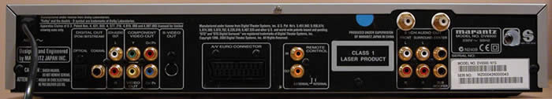
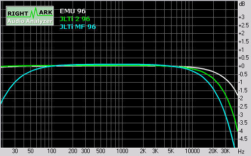
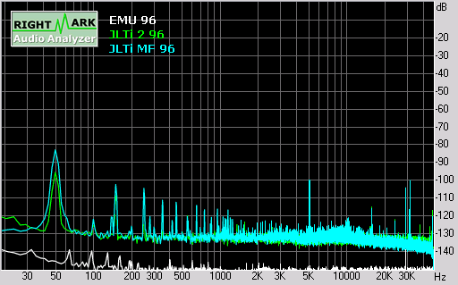
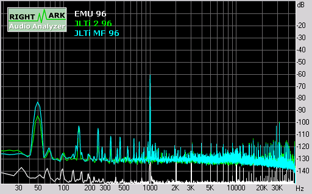
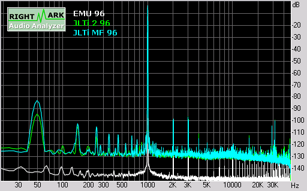
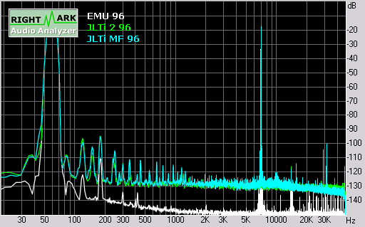
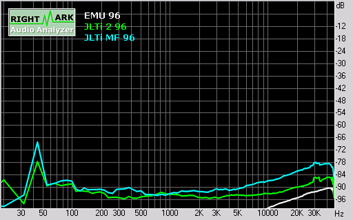
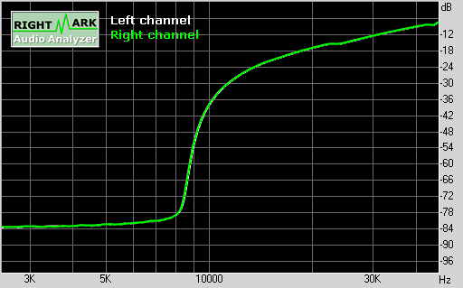
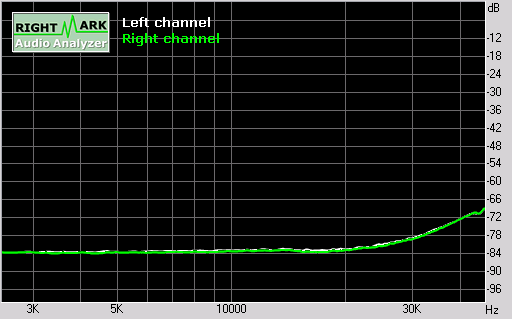

_This article was written by me and **published on Audioholics**, where it remains: **[read it there](https://www.audioholics.com/blu-ray-and-dvd-player-reviews/marantz-dv6500-jlti-mod)**. Audioholics asked permission to run it. It is republished here for information, as part of the record of what I have written._

## Marantz DV6500 Build Quality

Ever wished you could own a truly high end esoteric digital player but your budget is limited to mass market players? Joe Rasmussen from Custom Analogue Audio reckons he has the answer. Using a cheap mass market universal player (the Marantz DV6500, normally retails for A\$799 – US\$649), Joe has upgraded it with technology from Vacuum State Electronics (Joe is the Australian agent) to create a “state of the art” two-channel universal player called the “JLTi SACD Player” that is being sold by Pymble Hi-Fi in Sydney, Australia, for \$2,500 (~US\$1,900).

I tested two versions of the JLTi SACD Player, a prototype/demo version, and a “production” version. Both versions include:

- An ultra low jitter reference clock from Vacuum State (based on a TENT Labs 27.000MHz crystal) that operates at a cycling rate of 0.015 Hz thus eliminating jitter even at subsonic levels.
- Additional toroidal transformer and SuperReg current sourced shunt regulators

The prototype version features a completely new “no negative feedback” 2-channel audio stage (powered by the additional power circuit) with it’s own RCA output jacks (mounted above the multi-channel RCA analogue audio outputs). The “production” model modifies the multi-channel Front Left/Right analogue output and bypasses the op amp for an output that is essentially directly driven by the DAC.

The JLTi SACD player is primarily intended for 2-channel SA-CD listening, but the player can also be used for multi-channel listening as well (although the additional channels are not enhanced apart from the improved clock). Indeed, you can even use it as a DVD Video player (although I wouldn’t recommend it, as I will explain later).

The player supports all the media and formats of the original Marantz DV6500, the player supports all major formats except HDCD and all optical media except DVD+R/RW and DVD-RAM.

## **Unpacking & Build Quality**

The JLTi SACD player comes in a box together with a remote control and a multi-lingual owner’s manual. The power cord is captive, but fairly thick (I suspect Joe has replaced the stock power cord). In addition, Joe has helpfully included two esoteric interconnects for me to try out (one pair from Cryomusic and the other is Joe’s own JLTi silver connect) plus color printouts of the relevant web pages from the [www.customanalogue.com](https://www.customanalogue.com/) web site for the JLTi SACD player and interconnect.

There is an A4 sized warning sheet affixed to the player using sticky tape. Due to the very slow clock, a delay of at least 30 seconds is required after plugging the player into the power supply before it can be switched on. This delay is to allow the clock to become operative, otherwise the player will “stall” or “hang.”

The front panel of the unit is reasonably stylish and uncluttered, with the disc transport located in the middle, the Power On/Standby button and two indicator lights (Standby, and “Audio Ex.”) on the left, and transport control and menu navigation buttons on the right. I particularly liked the inclusion of menu navigation buttons (cursor plus “Enter” and “Menu” keys) as it allows DVD Audio/Video discs to be played without a remote control. In addition, the “Audio Ex.” (Audio Exclusive) button turns off the video output and front panel display supposedly for improved audio quality (hence the purpose of the Audio Ex. indicator light – to let you know the player is not actually turned off!). The JLTi mods make this button somewhat deprecated (since I did not notice any audio quality differences with this feature engaged) but I suppose it is still useful if you are bothered by the front panel display during operation.

The rear of the player features standard connections, including both optical and co-axial digital outs (no Firewire), analogue 2-ch and 5.1-ch outputs, plus composite, S-video, component video and SCART connectors (no HDMI or DVI). There are also Remote In/Out jacks and a switch for selecting between internal/external remote control. Finally, JLTi has installed an additional set of 2ch analogue outputs (prototype unit only) from the new audio stage, using high quality RCA sockets.

I ran a ‘standby mode’ test whereby I shut down the unit with the disc tray open, and the player was clever enough to retract the tray prior to turning “off.” In addition, pressing _Play_ or the _Open/Close_ buttons will wake up the unit from standby mode (in addition to the power button). This is extremely handy for creating a workaround for a lacking discrete power on/off macro command (you can use the _Play_ button to assure the ‘on’ state of the device).

## DV6500 Internals, Set-up, Remote, and Measurements

The build quality the unit is pretty standard for a mass market player, with a main board containing the power supply plus audio/video output stages, and a separate digital processing board containing the MPEG decoder and audio/video DACs, plus a dedicated shielded board for multi-channel audio.

The stock unit is based on a previous generation Panasonic design (probably an OEM version of the DVD-F65). Essentially, almost all processing functions are handled by a single LSIC: Panasonic MN2DS0004AB. Video DACs are based on the MN35202 (10-bit 54MHz) and the player uses a single chip 8 channel Audio DAC: TI/Burr Brown DSD1608 (a multi-format, multi-level delta sigma modulator design rated at 108dB SNR/dynamic range and 0.0012% THD). The 2-channel audio analogue output uses a KIA4558F op amp, and the multi-channel analogue audio stage is based on JRC4580 op amps.

Most of JLTi’s modifications on the prototype/demo player (transformer, additional audio stage and power regulation) are carefully slotted in an otherwise unused corner of the chassis, and the improved clock is affixed onto the digital processing board using a set of short patch wires.

On the newer production player, the modifications are more discreet. The clock is on a mini circuit board of its own, mounted underneath the DSP board and affixed to the rear of the chassis. The transformer is at the same place as on the prototype, but there’s no separate output stage, and it looks like the multi-channel analogue audio circuit board has been patched with a few extra components.

Just a word on the clock: The original Marantz DV-6500 uses a single master clock at 27MHz. An SM8707FV dual-PLL clock generator IC generates independent audio, video and DSP clock outputs from the master clock. The JLTi modification replaces the stock 27MHz master clock with an improved low jitter TENT Labs design. However, the audio/video jitter performance is still limited by the jitter characteristics of the SM8707FV (20ps for video, and 40ps for audio). I feel a better, but more intrusive design, would need to bypass the SM8707FV for true low jitter performance.

## **Player Set-Up**

Pressing the _Setup_ button on the remote control brings up the menu system for configuring the DVD player. You can choose between Quick Setup, Custom Setup, or Initialize (which returns the player back to factory default settings, apart from parental control and video out).The menus are usable even on the small 7” LCD monitor that I use for configuring players. The Quick Setup option allows you to enter the most common configuration settings on a single submenu page.

There are four setup categories, corresponding with the four icons on the top of the On Screen Display: Language, Display, Audio, and Parental Control.

The “Language” submenu allows you to set the default language for the audio track, subtitle track, disc menus and player menus. You can select “Original” for the default audio track, and “Off” for the subtitle track. Common languages are directly selectable from a list, for the rest you have to type the four digit code associated with the language.

The “Display” submenu allows setting of the TV aspect ratio (4:3 LB, 4:3 P&S, 16:9), Still Mode (Auto, Field, Frame), Angle Icon (On/Off), Auto Power Off (On/Off), Panel Display (Bright, Dimmer, Auto), and Video Out (SCART, Component Interlaced, Component Progressive).

The “Audio” submenu governs what formats are allowable on the digital output (PCM 96kHz, Dolby Digital, DTS, MPEG) as well as DRC (Dynamic Range Control) for Dolby Digital. It also allows you to specify 2.0 or 5.1 outputs for analogue audio.

The speaker settings allow you to specify speaker presence and size, time alignment, and channel balance. Time delay settings can be specified in meters or feet, but the player assumes the Front Left/Right and Surround Left/Right pairs are equidistant. You can set speaker levels for all 5.1 channels individually (0 to -12dB in 1dB increments)

Finally, the “Parental” submenu allows you to set the parental restriction level (1-8 plus All) and parental control password (4 digit number).

## **Remote Control**

This is a pretty average looking remote control. The buttons are reasonably well laid out, but the all important transport control buttons towards the bottom are too small and hard to distinguish from each other. In addition, there is no back-lighting, so the remote is basically impossible to use in the dark.

On the plus side, the _Group_ button is usable without requiring a video display, the _Sound__M_\_ode_button is used to select between multiple audio tracks and layers on SA-CD, and the _Search__M_\_ode_ button is nice, but requires the video display to be active to be usable.

## **Video and Audio****M****easurements & Testing**

Performing measurements and tests on a DVD player using tools at our disposal is somewhat objective, but still results in a certain amount of subjective decision-making in terms of scoring and evaluation. As such, we recommend that these test results be used as a guideline only. For the review of this DVD player, the performance was based on the player in conjunction with the display monitor. We used the Sony VPL-VW11HT projector which was calibrated as close as possible to ISF reference standards using the SMART III calibration software. For the test and evaluation of the JLTi we used selections from Digital Video Essentials, the Microsoft WHQL 3.0 DVD Test Annex and the Silicon Optix HQV Technology benchmark DVD test discs in addition to various test clips from popular movies.

All final test scores were derived using the JLTi component video output in progressive scan mode.

### **Audioholics/HQV Bench Testing Summary of Test Results**

### **Perfect Score is 130**

The player performed very poorly on HQV as a progressive scan player, failing nearly every single test (including Film 3:2 cadence detection). The score: only **20****/130** which is the _lowest_ performance to date on DVD players tested in our Benchmark.

| **Test**                        | **M****ax****Points** | **Results*** | **Pass/Fail** |
| :------------------------------ | :-------------------- | :----------- | :------------ |
| Color Bar                       | 10                    | 5            | Pass          |
| Jaggies #1                      | 5                     | 0            | Fail          |
| Jaggies #2                      | 5                     | 0            | Fail          |
| Flag                            | 10                    | 0            | Fail          |
| Detail                          | 10                    | 0            | Fail          |
| Noise                           | 10                    | 0            | Fail          |
| Motion adaptive Noise Reduction | 10                    | 0            | Fail          |
| Film Detail                     | 10                    | 0            | Fail          |
| Cadence 2:2 Video               | 5                     | 0            | Fail          |
| Cadence 2:2:2:4 DV Cam          | 5                     | 0            | Fail          |
| Cadence 2:3:3:2 DV Cam          | 5                     | 0            | Fail          |
| Cadence 3:2:3:2:2 Vari-speed    | 5                     | 0            | Fail          |
| Cadence 5:5 Animation           | 5                     | 0            | Fail          |
| Cadence 6:4 Animation           | 5                     | 0            | Fail          |
| Cadence 8:7 animation           | 5                     | 0            | Fail          |
| Cadence 24fps film              | 5                     | 0            | Fail          |
| Scrolling Horizontal            | 10                    | 5            | Pass          |
| Scrolling Rolling               | 10                    | 10           | Pass          |
| **Total Points**                | **130**               | **20**       |               |

*All tests were done with the component video output at 480p.

### **Comments on Audioholics DVD Torture Tests**

For the full list of features and testing, please see the new [DVD Player Features and Benchmark Comparisons Chart](https://www.audioholics.com/productreviews/avhardware/DVDplayerscompared01.php). As you can see, you probably don’t really want to use this as a progressive scan player apart from a display with better deinterlacing ability. We’d recommend feeding the 480i outputs to a more qualified television of projection system. Keep in mind, however that the HQV tests are all unflagged and that good, correctly flagged source material may produce better results than what is shown here.

Even on the color bar test, it’s clear that this player has an unacceptably soft picture, smearing the alternating black-and-white bar pattern, with accompanying flickering which is an indication of poor deinterlacing. The softness is also apparent in the Picture Detail test. To add insult to injury, no noise reduction options are available. As to be expected, the player did not pass any of the esoteric cadence patterns, but it was not even able to recognize basic 3:2 pulldown.

In terms of other components of the DVD Torture Tests, the JLTi player passed most of them except for a Y/C delay of around -0.07 in the red channel, plus pixel cropping of 5 pixels (2 on the left, and 3 on the right). In addition, the presence of moiré patterns on the AVIA resolution test in the vertical wedge again reinforces that the “softness” evident on this player is due to incorrect deinterlacing.

Layer changes were okay, with the WHQL “worst case scenario” layer change coming in at just under one second. Boot up time was reasonable, around 5 seconds. After the WHQL disc was inserted, it took around 11 seconds before it brought up the menu, and around 6 seconds to eject the disc from the main menu. Overall, the player feels a bit sluggish with front panel and remote buttons responding in a rather delayed fashion.

## Marantz DV6500 Audio RightMark Test Results

I tested the production player on both the modded 5.1 channel Front Left/Right analogue outputs, as well as the unmodded 2 channel analogue output, using Audio RightMark 5.5 and an E-MU 1212M as the capture card.

First off, the results on the unmodded 2 channel analogue output, at 24 bit resolution and 44.1, 48 and 96 kHz sampling rates:

| **Test**                                       | **44.1 kHz** | **48 kHz**   | **96 kHz**   |
| :--------------------------------------------- | :----------- | :----------- | :----------- |
| Frequency response (from 40 Hz to 15 kHz), dB: | +0.04, -0.27 | +0.05, -0.40 | +0.05, -0.41 |
| Noise level, dB (A):                           | -100.9       | -98.3        | -96.3        |
| Dynamic range, dB (A):                         | 100.7        | 98.6         | 97.7         |
| THD, %:                                        | 0.0014       | 0.0016       | 0.0024       |
| IMD + Noise, %:                                | 0.0047       | 0.0055       | 0.0076       |
| Stereo crosstalk, dB:                          | -99.1        | -98.4        | -94.4        |

**Unmodded player test results**

As you can see, the unmodded 2 channel output measured reasonably close to spec, with a dynamic range of around 98-100dB, and a THD+N of around 0.0015-25% (which is slightly better than published specs). IMD+N and Stereo crosstalk figures are good. The output voltage was very close to the 2Vrms reference.

Unfortunately, the player did not fare as well on the modded 5.1 Front Left/Right outputs:

| **Test**                                       | **44.1 kHz** | **48 kHz**   | **96 kHz**   |
| :--------------------------------------------- | :----------- | :----------- | :----------- |
| Frequency response (from 40 Hz to 15 kHz), dB: | +0.10, -0.61 | +0.12, -0.74 | +0.11, -0.76 |
| Noise level, dB (A):                           | -99.1        | -97.3        | -95.4        |
| Dynamic range, dB (A):                         | 99.0         | 97.5         | 96.4         |
| THD, %:                                        | 0.0016       | 0.0017       | 0.0028       |
| IMD + Noise, %:                                | 0.012        | 0.012        | 0.013        |
| Stereo crosstalk, dB:                          | -95.7        | -94.7        | -93.8        |

**M\****odded player test results**

First of all, the output voltage is around -3dB below reference (no doubt due to the op amp analogue stage being bypassed), resulting in a slightly higher noise floor and correspondingly lower dynamic range, plus higher THD+N, IMD+N and stereo crosstalk.The following graphs are all based on measurement of the player playing back test tones at 96kHz 24-bit. In these graphs, the cyan plot is the modded Front Left/Right output, the green plot is the unmodded 2ch output, and the white plot is the E-MU 1212M measuring itself in loopback mode.The modded Front Left/Right outputs seem to attenuate both high and low frequencies more aggressively than the unmodded 2ch output, with the frequency response down -1dB at 30 Hz, and also -1.5dB at 20kHz:

By contrast, the unmodded 2ch output is flat to 20Hz, and only down -0.75dB at 20kHz.In a conversation with Joe on these results, Joe indicated that the slightly more aggressive high frequency attenuation for the modded output was intentional, and deliberately tuned by ear for euphonic playback. Joe suggested the attenuation at low frequencies was due to the E-MU 1212M having an input impedance of 10 kohms, and would be a lot less for a normal pre-amp input at 100 kohms. If this is correct, it would suggest that the player needs to be matched with an appropriate pre-amp, and is not recommended for use with passive pre-amps.Looking at the noise level, the JLTi has a noise floor at least 10-20dB above the E-MU 1212M capture card. The most significant contributor to noise is residual 50Hz (fundamental plus harmonics) from the power supply. In addition, there are significant spikes at around 5kHz, plus several out of band spikes clustered around 30kHz.

 And this graph shows THD+N (at -3dB FS):

Intermodulation distortion for a standard 60+7000 Hz signal:

As can be seen, stereo crosstalk is uniformly good across the whole frequency spectrum:

Unfortunately, the modded 5.1 Front Left/Right analogue outputs seem to exhibit a problem with the intermodulation distortionsweep above 1kHz:

In contrast, the intermodulation distortion for the unmodded 2ch output appears normal:

Finally, switching the player into “Audio Exclusive” mode (by pressing the “Audio Ex” button on the front panel) improves the audio characteristics slightly: dynamic range is increased by about 0.1dB, THD and IMD+N improve by 0.0001% and stereo crosstalk improves by just over 1dB. These improvements are unlikely to be detectable by the human ear.

## DV6500 0dBFS+Level Handling and Conclusion

For an explanation of what 0dBFS+ levels are, please read the following [article](https://www.audioholics.com/audio-technologies/issues-with-0dbfs-levels-on-digital-audio-playback-systems). As to be expected, the player clips on 0dBFS+ levels, as can be seen from the following measured results:

| **_Frequency (sine wave)_** | **_Phase_** | **_Analogue peak level (theoretical)_** | **_Unmodded 2ch output_** | **_M__odded Front L/R output_** |
| :-- | :-- | :-- | :-- | :-- |
| 5,512.5 Hz | 67° | +0.69 dB FS | +0.23 dB FS | +0.19dB FS |
| 7,350.0 Hz | 90° | +1.25 dB FS | +0.18 dB FS | -0.11dB FS |
| 11,025.0 Hz | 45° | +3.00 dB FS | +0.24 dB FS | -0.97dB FS |

The modded Front L/R outputs are particularly surprising since not only does the player clip, but the resultant waveform is not symmetrical (the positive half of the waveform peaks at almost 0.4dB higher than the negative half, suggesting some kind of DC offset generated by the DAC in response to 0dBFS+ levels).

## **Viewing Evaluation**

I definitely would NOT recommend this player for video. In addition to failing nearly all the torture tests, the player also exhibits the chroma upsampling error on the WHQL DVD Test Annex 30 DVD (for progressive flag = true, and alternating, and for 30fps sequences). The WHQL disc also confirms that the player does not do film recognition and the deinterlacer is not motion adaptive.

The overall picture quality is noticeably soft compared to my reference player, the Panasonic DVD-S97. However, I suspect most prospective purchasers would be using this player purely for 2-channel audio, and therefore the video features are a bonus rather than a requirement.

## **Listening Evaluation**

Given that the player is primarily marketed as a high end audio player supposedly competing with “other high end players costing up to A\$15,000” (according to the JLTi website), just how does this player sound?

I pitted the 2-ch output against the other players in my reference setup:

- Sony SCD-XA777ES (for comparing CDs and SA-CDs)
- Panasonic DVD-S97 (for comparing CDs and DVD-Audios)
- Custom built Windows XP Media Center 2005 PC with E-MU 1820M (for comparing CDs and DVD-Audios via hard disk playback)

As mentioned earlier, I evaluated two versions of this player: a prototype/demo version, plus a “production” version. The mods to these two players look quite different inside, and as I was to find out, they sound quite different too.

First of all, the prototype/demo player. My initial impression was that the player sounds rather lively and engaging, with a warm, rich and complex sound on the modded analogue output. Notes seem better defined in comparison to the standard 2ch analogue outputs, with the beginnings and ends of notes seemingly better etched against the background. The player seem to excel on classical symphonic music, where it seem to allow each instrument to come across more clearly.

However, after a while, I also noticed three major faults, which prevented me from really liking the sound. One was a tendency for vocals to sound harsh and sibilant. For example, on the CD version of _Amelia_ from Joni Mitchell’s **_Hejira_** (Asylum 25 305-3), Joni’s voice sounded graty compared to my reference players. Next I tried another Joni album, but on DVD-Audio, **_Both Sides Now_** (reprise 9362 47620-9). Listening to MLP 2.0 96/24 audio track, the harshness of Joni’s voice was once again noticeable, but I also started noticing a second fault, which is a tendency for the overall sound to be slightly “dark”, particularly against the E-MU 1820M but also against the Panasonic DVD-S97.

Playing a selection of vocal CDs, it was soon apparent that this “harshness” and “darkness” is part of the sonic signature of this player, as I can also hear it on the SACD (2ch) of Jane Monheit’s voice in _Too Young To Go Steady_ from Terence Blanchard’s **_Let’s Get Lost_** (Sony Classical SS 89607). Finally, Alison Krauss’s voice (already oversibilant on the SCD-XA777ES) just sounded painful on **_Forget About It_** (Rounder SACD 11661-0465-6).

The third “fault” I found related to PRaT (pace, rhythm and timing). For some reason, music just didn’t flow very naturally on this player, sounding somewhat hesitant and stilted, almost as if all the musicians on each disc decided to play in a _rubato_ fashion.

After I complained to Joe that the player sounded a bit harsh and uncertain, he suggested that I swap it with a production model.

What a difference! The production model sounds completely different, although I noticed immediately that it did not sound as “loud” as my other players. Subsequent testing on Audio RightMark revealed that the player’s “modded” output (on the Front Left/Right channels of the 5.1 analogue audio outputs) is down approximately -3dB below the 2Vrms reference.

However, once I compensated for the difference in volume levels, I noticed the harshness/darkness had disappeared. Likewise, the music seemed a lot smoother and more “liquid”. I played my favorite reference track for audio comparisons, _The Girl From Ipanema_ from **_Getz/Gilberto_** (Verve SA-CD 314 589 595-2). João’s voice and guitar came across beautifully, and the bass sounded nicely solid, and the piano sounded exactly like it was right in front of my living room. Astrud’s voice sounded full of air and presence, and cymbals sounded nice and clean.

In comparing the new player on SA-CDs against the Sony SCD-XA777ES, I found it difficult to distinguish between the two. Both of them sounded rich, warm and luscious. Given that the JLTi player retails for less than half of the RRP of the SCD-XA777ES, this is an impressive achievement indeed (although to be fair, the SCD-XA777ES is a full 5.1 capable player unlike the JLTi which is optimized only for 2ch).

Listening to Joni Mitchell’s **_Both Sides Now_** (reprise 9362 47620-9) again, it now seemed as if the Panasonic DVD-S97 was the slightly harsher player in comparison to the JLTi. However, and perhaps I’m imagining it, I felt I noticed the less than flat frequency response of the JLTi in comparison to my other players. Low notes didn’t quite have the same “thump”, and the high end sounded just a tad smoother and less detailed. The effect was very minor, and consistent with the measured frequency response, which was down -1dB at 30Hz or -1.5dB at 20kHz.

On CDs, the JLTi player sounded slightly more “airy” with more “tizz” around the high frequencies compared to the SCD-XA777ES. Given the player’s measured results, I wondered if what I was hearing was a result of intermodulation distortion.

As a result of my measurements and subjective impressions, Joe told me he had tweaked the filter cutoff frequencies to reduce the bass roll off and hopefully lessen the intermodulation artifacts. Hopefully, this should make future models of this player sound even better.

## **Conclusion**

Would I buy this player? To be honest, I’m not sure. Definitely not for video, and for the price, not for multi-channel audio either. For 2-channel audio, I think the player does sound very good, and on SA-CD at least as good as my reference player costing over twice as much.

However, I’m worried about the below reference volume output, which results in a relatively higher noise floor, and I’m concerned about the high intermodulation distortion above 1kHz. However, Joe tells me these problems should hopefully be addressed in future production units.

At the end of the day I guess it’s up to the buyer. Arguably, a stock player retailing at the same price point as this player may have better build quality (in terms of possibly a better transport or chassis, and perhaps a better remote control) and better “street cred” in terms of brand name or looks, but this player will no doubt appeal to those who seek superior sound quality at a reasonable price.

## The Score Card

The scoring below is based on each piece of equipment doing the duty it is designed for. The numbers are weighed heavily with respect to the individual cost of each unit, thus giving a rating roughly equal to:

Performance × Price Factor/Value = Rating

_**Audioholics.com note:** The ratings indicated below are based on subjective listening and objective testing of the product in question. The rating scale is based on performance/value ratio. If you notice better performing products in future reviews that have lower numbers in certain areas, be aware that the value factor is most likely the culprit. Other Audioholics reviewers may rate products solely based on performance, and each reviewer has his/her own system for ratings._

### Audioholics Rating Scale

-       — Excellent
-      — Very Good
-     — Good
- — Fair
- — Poor

| Metric                                | Rating |
| :------------------------------------ | :----- |
| Standard Definition Video Performance |        |
| High Definition Audio Performance     |        |
| Bass Management                       |        |
| Build Quality                         |        |
| Ergonomics & Usability                |        |
| Ease of Setup                         |        |
| Features                              |        |
| Remote Control                        |        |
| **Performance**                       |        |
| **Value**                             |        |

Ultra HD Blu-ray and DVD Player Reviews
