_This article was written by me and **published on Audioholics**, where it remains: **[read it there](https://www.audioholics.com/diy-audio/building-a-windows-mce-2005-pc-part-2)**. Audioholics asked permission to run it. It is republished here for information, as part of the record of what I have written._

This is a set of articles summarising my experience choosing the components and building a a custom-built Home Theatre PC running **M****icrosoft Windows XP****M****edia Center****Ed\****ition 2005** (or " MCE2005" for short). Part 1 is an introduction, Part 2 shows a step by step pictorial guide to assembling the hardware, and the upcoming Parts 3 and 4 detail the software installation and objective and subjective impressions of the results.

## Assembling the hardware

The first thing to do is to unpack the PC case:

[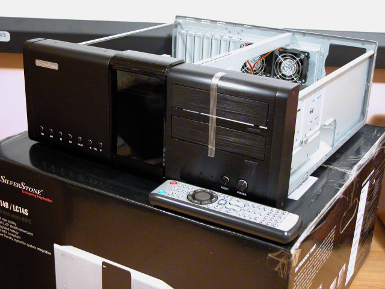](https://www.audioholics.com/images/dscn1426.jpg)

The case comes with one 92mm fan mounted behind the front panel and two 60mm fans mounted at the rear. Although Silverstone rates these fans as 21dBA and 23dBA respectively, I found them too loud for comfort, so I replaced them with SilenX fans rated at 14dBA and 16dBA. I also used siliceous washers on any screws that are connected to any component with moving parts (such as the hard disk and DVD drive) to reduce vibration-induced noise.

[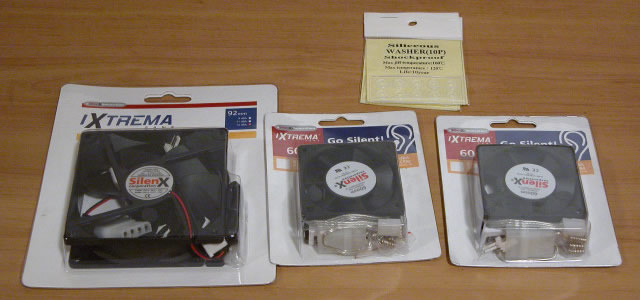](https://www.audioholics.com/images/dscn1440.jpg)

Next thing is to unpack the motherboard. Note the passively cooled NorthBridge chip (via a heatpipe to the ATX rear panel, plus the separate audio riser board (connected via a proprietary slot) to isolate audio signals from the motherboard and improve audio characteristics.

[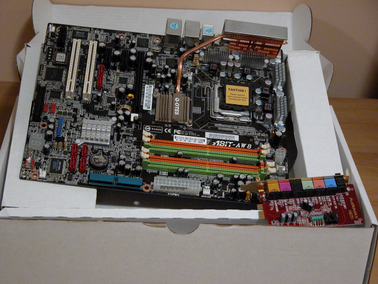](https://www.audioholics.com/images/dscn1427.jpg)

This is the extremely power hungry and hot-running Intel Pentium D 830 dual-core processor and Corsair PC2-5300 memory (rated at DDR2-667 with 5-5-5-15 latency):

[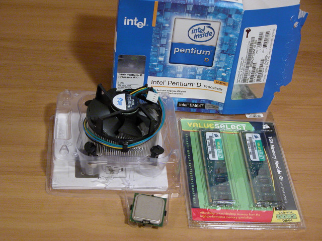](https://www.audioholics.com/images/dscn1422.jpg)

Of course, the standard CPU fan that comes with the Intel CPU is too noisy, so I selected a Zalman CNPS7000B-AlCu cooler with the Z M -CS1 clip support for LGA-775. This is a bit of a compromise as this cooler is barely adequate for the hot-running Intel dual core processor, but the pure copper version is too heavy and I was afraid the larger version (CNPS7700-AlCu) wouldn't fit into the case:

[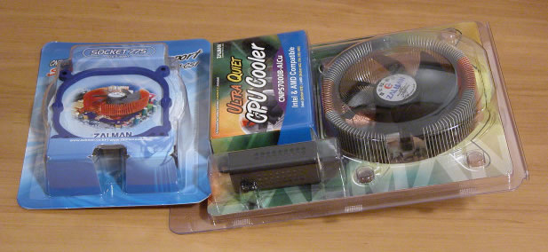](https://www.audioholics.com/images/dscn1420.jpg)

Assembly begins with inserting the CPU into the LGA-775 socket, and then installing the CPU cooler on top of the CPU. Instead of using the Zalman supplied thermal paste, I opted to use Arctic Silver 5 which a very good third party thermal conductor.

[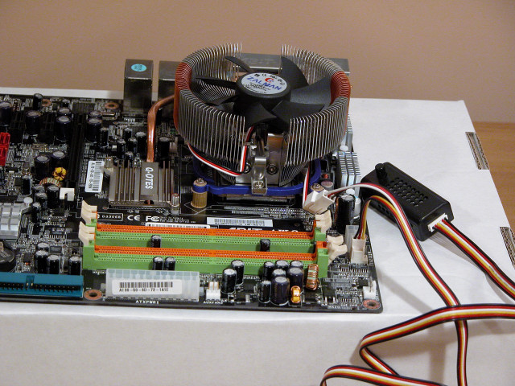](https://www.audioholics.com/images/dscn1429.jpg)

For the power supply, I chose the Antec Phantom 350 which is a fanless power supply (the entire outer casing acts as a giant heak sink). The power cable in front of the picture allows the Silverstone VFD to remain powered in standby mode.

[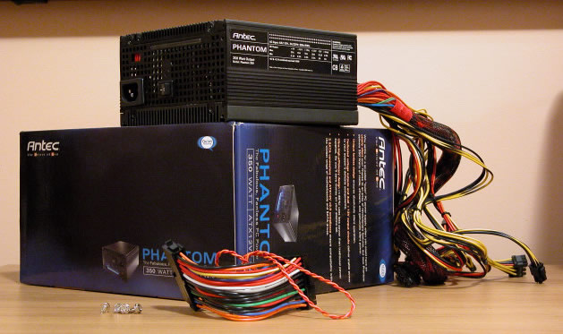](https://www.audioholics.com/images/dscn1418.jpg)

Here is a picture of the motherboard and power supply installed into the case. I adjusted the fan speed so that the CPU temperature will never exceed 60°C even under maximum load. Unfortunately, this means the fan is spinning at around 2500RP M (maximum speed 2700RP M ).

[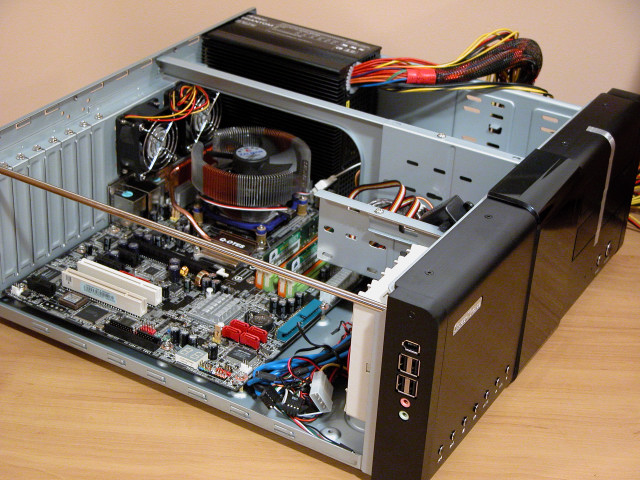](https://www.audioholics.com/images/dscn1430.jpg)

The next step is to insert the video, audio and tuner cards. First of all the passively cooled Gigabyte GV-NX66256DP PCI-Express video adapter:

[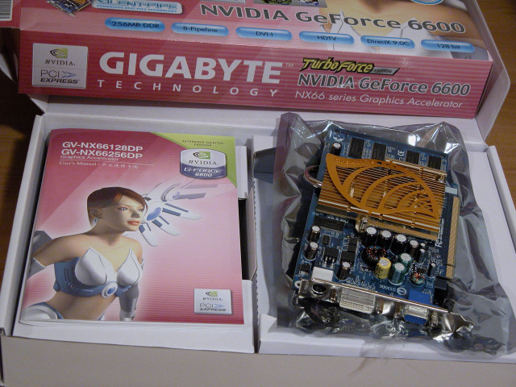](https://www.audioholics.com/images/dscn1423.jpg)

Next is the E- M U 1212m audio card used for high quality stereo recording and playback. Note that the critical analog input and output circuits are contained on a separate daughter card with no electrical connection to the motherboard. This is one of the reasons why the 1212m measures so well on Audio Rightmark (comparable to Lynx and RME cards costing far more).

[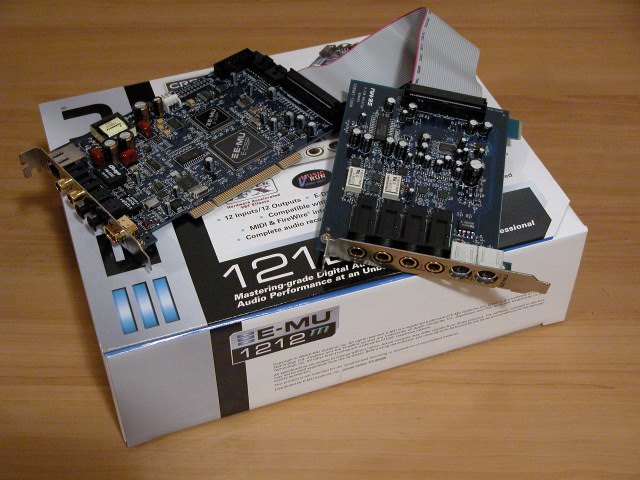](https://www.audioholics.com/images/dscn1442.jpg)

Finally there is a DVICO FusionHDTV DVB-T Plus digital TV tuner and video capture card. Note that although an analog tuner is required for M CE2005 in the US , in Australia it's possible to configure M CE2005 have just a DVB-T digital tuner card with no analog TV capability.

[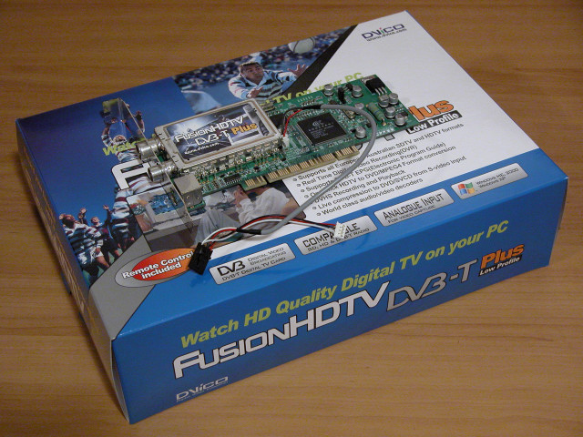](https://www.audioholics.com/images/dscn1441.jpg)

Here's a picture of all the I/O cards installed into the case. As you can see, there's not much room left (one spare PCI-Express 1X slot). If you look at the bottom of the picture you may notice a ferrite ring (supplied by Silverstone) used to contain E M I radiation from the front panel jacks.

Next, we have the hard disk and optical drive. Seagate used to make the quietest drives, but Samsung is now the "silent achiever." The case supports a maximum of four 3.5" hard disks, but in the interest of minimizing noise I'll make do with just one 250GB SATA-II hard disk. Similarly, although the case supports dual optical discs, I only need one. Both drives are mounted in the middle slot, to allow for maximum airflow below and above the components. Note the Zalman CPU fan controller is affixed to the case using the supplied sticky strip. The CPU fan speed is adjusted to keep maximum CPU temperature below 60°C even under stress, resulting in a speed of 2500RP M , or around 25dBA.

[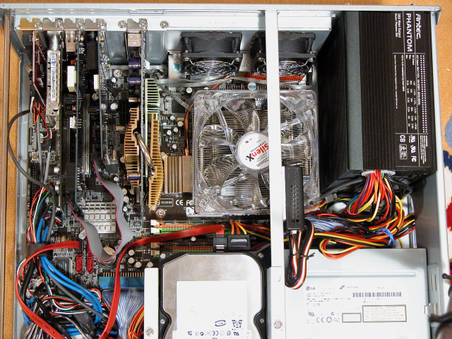](https://www.audioholics.com/images/dscn1464.jpg)

Finally, we line the inside of the case cover with Spire Soundpad acoustic absorber to further deaden noise:

[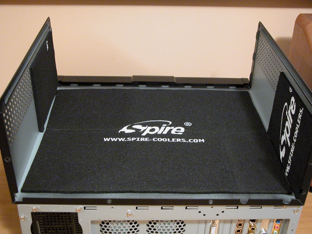](https://www.audioholics.com/images/dscn1436.jpg)

Here is the final home theatre PC, fully assembled and ready to go into the equipment rack.

[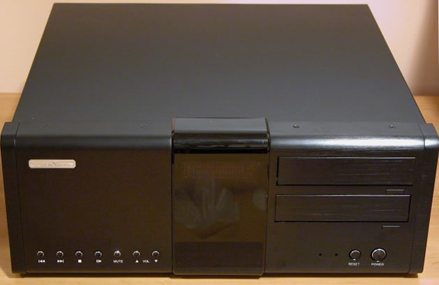](https://www.audioholics.com/images/dscn1437.jpg)

The back of the case certainly looks busy!

[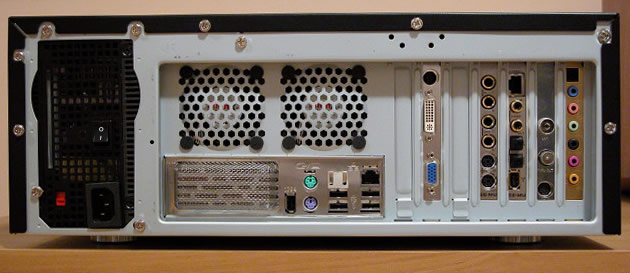](https://www.audioholics.com/images/dscn1453.jpg)

## Addendum: Replacing the CPU cooler

Sometime after building the PC, a friend of mine pointed out to a much more efficient cooler, the Thermalright XP-120 . It's more efficient than the Zalman CNPS-7000B because it uses heat pipes to transfer more heat from the CPU to the fins, and it's extremely light because it is made entirely out of aluminum. Even better, it uses standard 120mm fan for cooling. I bought the XP-120 together with the LGA775 RM retention bracket and a SilenX iXtrema 120mm fan .

Unfortunately, I have to completely disassemble the PC to remove the motherboard to swap coolers. Here's the motherboard with the old cooler removed and replaced the the LGA775RM retention bracket:

[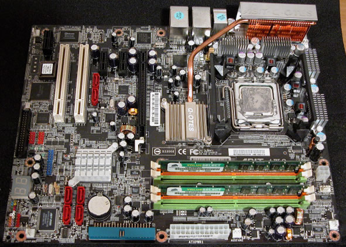](https://www.audioholics.com/images/dscn1456.jpg)

This is the back of the motherboard with the retention bracket:

[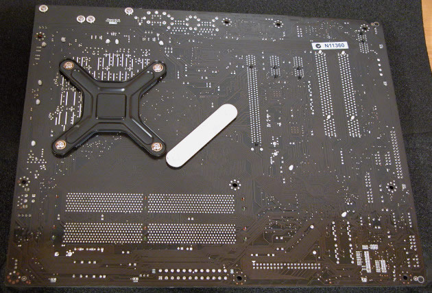](https://www.audioholics.com/images/dscn1457.jpg)

Here's the cooler and fan:

[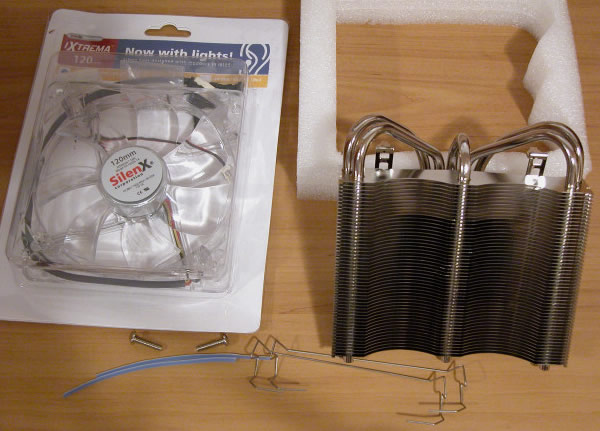](https://www.audioholics.com/images/dscn1458.jpg)

I reinstalled the motherboard back into the case, and installed the cooler and fan on top of it:

[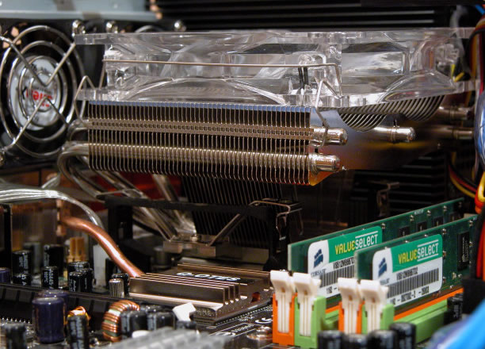](https://www.audioholics.com/images/dscn1461.jpg)

Fairly, soon, everything was back in place and ready to go. I adjusted the fan speed to around 1000RP M , and was pleasantly surprised to discover the noise from the PC had decreased dramatically. In fact, the PC was significantly quieter than the air-conditioning and the projector, and even quieter than my laptop! And it runs a bit cooler too (not that much cooler though, temperatures still crept up to 50°C under load.

_(Reprinted with Permission)_

Visit the other parts to this 4-part series:

Building a WindowsXP Media Center Edition PC: [Part 1](https://www.audioholics.com/diy-audio/building-a-windows-mce-2005-pc-part-1) | Part 2 | [Part 3](https://www.audioholics.com/diy-audio/building-a-windows-mce-2005-pc-part-3) | [Part 4](https://www.audioholics.com/diy-audio/building-a-windows-mce-2005-pc-part-4)
