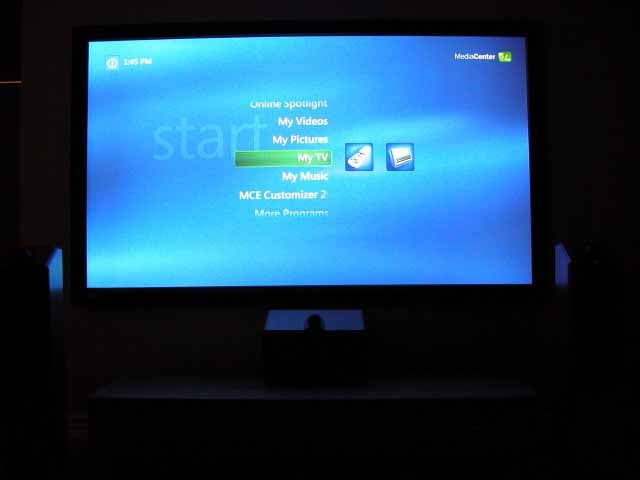

_This article was written by me and **published on Audioholics**, where it remains: **[read it there](https://www.audioholics.com/diy-audio/building-a-windows-mce-2005-pc-part-3)**. Audioholics asked permission to run it. It is republished here for information, as part of the record of what I have written._

This is a set of articles summarising my experience choosing the components and building a a custom-built Home Theatre PC running **Microsoft Windows XP Media Center Edition 2005** (or "MCE2005" for short). Part 1 is an introduction; Part 2 shows a step by step pictorial guide to assembling the hardware; Part 3 (this section) details the software installation steps; and Part 4 contains some objective and subjective impressions of the result.

## **Installing the Software**

The PC now looks very pretty and ready to go, but unfortunately it's not very usable without the right software.

One option is to install everything manually from various CDs and floppy discs. However, if a mistake is made, then the process needs to be started all over again. And believe me, speaking from experience, it is very easy to make mistakes and there are lots of traps for beginners. For example, I discovered it is best not to launch the Media Center application until everything has been installed, all drivers are loaded, and all hotfixes and patches have been applied. In particular, if you launch Media Center without the DVB-T BDA driver properly installed and if the MCE2005 Rollup 1 patch has not been applied, then it will fail to detect that there is a TV Tuner and then later on even after the driver and patch have been applied it will still complain that it can't find a "compatible TV tuner". At this point, it seems a reinstall is the best option.

Also, I run a Windows Active Directory managed network (the Windows 2003 server is in the attic and it acts as a domain controller, DHCP/DNS server, plus a bunch of other things). I would like the MCE2005 PC to participate in the managed domain, so that it gets software like Office 2003 automatically installed and virus patches automatically applied. However, the standard MCE2005 install disc does not contain a Broadcom Gigabit NIC driver, which means when I install MCE2005, I can't join the domain, and by the time I install the Ethernet driver it's too late and MCE2005 does not allow participation into a domain beyond initial installation.

The best solution is to create a customized install DVD that contains all the drivers unique to the machine, plus an unattended installation script so I can just let the machine install the bulk of the operating system without any user intervention. It is possible to create such a disc manually, but the process is quite tedious. However, there is a freeware package called [Nlite](https://www.nliteos.com/) that does it automatically. As a bonus, Nlite can preintegrate Windows XP updates and security patches, however, there is also something called [AutoPatcher](https://www.autopatcher.com/) that will not only install all the relevant hotfixes but also additional components such as .NET Framework, Powertoys and various tidbits like the Microsoft Journal Viewer.

To use Nlite to create a customized install DVD, I use the following procedure:

- Copy all three MCE2005 CDs onto a single directory (I call it "HTPC") - Disc 1 and 2 plus the Customer Diagnostics disc.
- Run Nlite, and, browse to the directory above containing the install files, and select the Integrate Drivers, Unattended Install, and Create Bootable Disc options.
- If you want, you can also preintegrate hotfixes and service packs, but I choose to do all that later using AutoPatcher. I also generally ignore the tweaking settings.
- Integrate all relevant textmode drivers (Intel ICH7R AHCI, and Silicon Image SiI 3132 drivers) plus Intel INF (I use the ZIP file version, and select the 945.inf file in the XP subdirectory), and the Broadcom Ethernet driver.
- If you are adventurous (I was), you can even preintegrate the FusionHDTV and iMON drivers by extracting the relevant files from the install executable.
- However, I would not recommend preintegrating the video display driver, nor the E-MU 1212m driver. The NVidia Forceware driver gets updated frequently, so it's better not to preintegrate, and the E-MU 1212m driver is not digitally signed, which means it's going to be messy (and besides, it didn't work when I tried preintegrating).
- Enter appropriate personal information for the unattended install (including pre-entering the MCE2005 product key).
- Finally, create an ISO file and use your favourite burner program (I used Nero) to burn the image onto a blank DVD. I ended up with a DVD containing about 1.3GB worth of files.

Before installation, I would highly recommend finding out if there is an updated BIOS for your motherboard. In my case, it turned out to be a requirement as the BIOS version (1.0) that came with my motherboard did not recognise the Pentium D 830 processor and behaved strangely until I applied the BIOS update. Note that this is best done via a floppy disc, so you may want to borrow a spare floppy drive and cable from another PC to apply the update.

The install should happen smoothly. Just put in the customised install DVD, and boot up the PC. It should correctly detect the SATA disc using the Intel AHCI driver. I normally create two partitions, a "SYSTEM" partition (Drive C:) around 32GB to contain the operating system and applications, and a "DATA" partition (Drive D:) taking up the rest of the disc for storing media. Install into the SYSTEM partition. Since the disk is configured for unattended installation, just leave the system alone for an hour or so.

In my case, after installation, the PC will automatically join my home domain and my server will then start pushing lots of applications on to it (such as Office 2003 etc.). The end result should be a PC that's pretty much fully installed except for odds and ends.

One really important thing that's missing are post SP2 updates and hotfixes. This is when AutoPatcher comes in handy. Just install AutoPatcher, and then run it by double clicking the icon on the desktop - it will automatically apply all the patches that it knows about, and by the time it finishes (another hour or so) the job is nearly done.

## **Driver Installation**

Next is to install the non-integrated drivers:

- NVidia Forceware graphics driver
- Realtek HD Audio driver
- DVICO FusionHDTV driver and application
- E-MU 1212m driver and PatchMix application
- SoundGraph iMON driver and application
- CD/DVD burning application (eg. Nero)
- NVidia PureVideo decoder

I then installed all the MCE2005 specific updates (which are not included with AutoPatcher) manually. The most important one is the Rollup 1 update because if this is not applied then neither Digital TV nor HD video will work properly. I'm obsessive compulsive, so I end up installing all the optional updates as well (you can search for all of them on microsoft.com by using the right keyword).

## **Configure WindowsXP Media Center Edition & Install Third Party Software**

Now it's the right time to launch Media Center and go through the configuration routine. If everything has gone well, the process should be straightforward and by the end MCE2005 should have correctly detected all your local TV stations.

Finally, it's time to install all the third party applications, such as My Movies, and EPGRunner.

Here's some tips and tricks that I found handy during the installation:

- If your display requires an oddball refresh rate (mine will only work in widescreen native pixel mapping if I use a 56Hz refresh rate), then Media Center may force the refresh rate to a default of 60Hz on starting up. The solution is to run the DirectX diagnostic utility (via System Information) and there is an option under "More Help" that allows you to override the default refresh rate from 60Hz to whatever you like.
- Remember, don't launch Media Center until everything is ready.
- If you like to watch DVDs from multiple regions, make sure your DVD drive is set to RPC1. Sometimes there may be a utility that changes your drive from RPC2 to RPC1 (such as that available for Liteon drives). Otherwise, you may want to reflash the drive with RPC1 firmware (look in [The Firmware Page Portal](https://forum.rpc1.org/portal.php) ). Then install [DVD Region Killer](https://www.digital-digest.com/dvd/downloads/dvdrk.html) (remember to _Enable_ it after installation by right-clicking the system tray icon).
- If you want to configure the PC to go into standby mode, just like typical consumer electronics equipment, there is a lot of "black magic" involved. Try and avoid USB devices as much as possible, enable USB wakeup (jumper or BIOS setting on motherboard), configure the BIOS to use S3 standby rather than S1, and finally configure the power button to put the PC in and out of standby. If it still doesn't work, play with the power management settings for your USB devices, ports and hubs in the Hardware Manager. Finally, try changing some registry settings (search for "USB S3 registry" on the Internet).

## **Remote Control Options**

There are many ways to control your HTPC, and the keyboard and mouse should only be used as a last resort, or for installing/updating software. My favourite is using _Netremote_ (I use the freeware verion 0.996 plus another program called _MCE Controller_ ) on a Windows Mobile 2003 Pocket PC over Wi Fi, but the Microsoft MCE2005 remote control is very easy to "plug and play" if you don't like configuring files.

Here are options I know about:

| **Remote control option** | **Usability** | **Configuration Difficulty** | **Flexibility** |
| :-- | :-- | :-- | :-- |
| **NetRemote+MCE Controller** | Very Good | Difficult (requires custom CCF file) | High |
| **Soundgraph iMON** | Good | Easy | Medium |
| **Microsoft MCE2005 remote control and transceiver** | Good | Easy | None |
| **Girder plus IR receiver and remote control** | Very Good | Difficult | High |
| **Another PC via Remote Desktop Connection** | Not for normal use | Easy | High |
| **Wireless keyboard and mouse** | Not for normal use | Easy | High |
| **Pocket PC running TotalInput as a remote keyboard/mouse** | Not for normal use | Medium | Medium |
| **The DVICO FusionHDTV supplied remote control** | Okay | Medium | Limited |
| **Other commercial software, eg. Niveus** | Good | Medium | Medium |
| **Front panel buttons** | Limited | Easy | None |

In the end, it's really up to your preference. You can set up more than one option, and select an appropriate user interface option depending on circumstance.

Addendum: Update Rollup 2 for Windows XP Media Center Edition 2005

Almost exactly one year after the release of MCE2005, Microsoft has released a comprehensive update rollup package containing the following features:

- Support for the Xbox 360 as a Media Extender
- Supports two ATSC HDTV tuner cards (US only - MCE2005 has always supported multiple DVB-T cards which is used in Australia and Europe )
- Supports DVB-T digital radio (In Sydney, ABC and SBS has two channels each)
- Optimization option to kill and restart MCE2005 processes for stability
- Non linear zoom mode to convert 4x3 video aspect ratio to 16x9
- Improved DVD burning utility

There has been a lot of disappointment for US users that this update does not seem to include many long-anticipated features such as support for cable channels. However, for Australian users there's an additional feature that is not well documented - with Update Rollup 2 MCE2005 will now scan ALL DVB-T channels correctly, including the Digital Forty Four multi-cast. Furthermore, there is now support for AC-3 (Dolby Digital) audio streams.

In addition, there is a further update (KB908250) that fixes problems with Update Rollup 2 specifically for DVB-T users:

- Issues with third party Electronic Program Guides such as IceTV, Bladerunner Pro and EPGRunner.
- Loss of signal when changing DVB-T channels
- Disappearing teletext subtitles after using transport controls (this is not relevant for Australia since MCE2005 still does not support the VBI subtitles used by Australian broadcasters)
- Playback initialization error when resuming as a suspend/hibernate that was initated whilst playing a DVD
- Better interoperability with third party TV software (such as FusionHDTV)
- Support for additional optical drives

I managed to install both updates successfully (although I had to deinstall and reinstall .NET Framework 1.1 SP1 prior to applying Update Rollup 2). I'm currently having some problems scanning TV channels and also displaying Live HDTV - I suspect this is due to a problem with the NVidia PureVideo decoder so I'm anxiously awaiting an update. The channels scan successfully and HDTV is watchable if I switch to the FusionHDTV MPEG decoder.

I also took the opportunity to upgrade drivers to the latest version prior to the update:

- Nvidia video driver to a beta version (81.84) that supports 1080i to 1080p deinterlacing
- Realtek ALC882M to R1.25
- E-MU 1212M driver and PatchMix to 1.81
- FusionHDTV to version 3.11

## **Further Addendum**

Recently nVidia has decided to address the issues with both the PureVideo DVD decoder and Forceware graphics driver working incorrectly with Update Rollup 2. The Update Rollup 2 certified version of the PureVideo DVD decoder is 1.02-177 and the corresponding WHQL certified Forceware driver is 81.85.

I have upgraded the system with the above software versions and can confirm that all channels scan correctly (including the digital radio channels) and I can watch Live TV (including HD channels at 1080i with Dolby Digital 6.1 EX soundtrack) with no problems, **provided I set the PureVideo deinterlacing setting to Auto** . In Smart mode, selecting an HD programme will occasionally display a "Loss of signal" error which is sometimes (but not always) rectified by switching to an SD channel, and then switching back to the HD channel. However, watching 1080i MPEG2-PS files (stored in the My Videos folder) do work even on the Smart setting.

Why not leave the setting on Auto? Well, there is one major advantage of Smart mode - motion adaptive pixel based deinterlacing of 1080i into 1080p - which is supported by the new versions of the decoder and graphics driver. I can vouch from personal experience this makes a huge difference in video quality. Recently, Channel Nine broadcasted the first two Lord of the Rings films (Fellowship of the Ring, and The Two Towers) in HD (1440x1080i with Dolby Digital 6.1 EX soundtrack) and the video quality of deinterlaced 1080p is absolutely stunning - you can see every blade of grass in Hobbiton, and the weave and texture patterns on clothes (did you know for example Bilbo wears a vest with a very intricate design weaved into the fabric?)

Even more recently, NVidia has released an even later version of the PureVideo decoder (the version number is now 1.02-185) and a beta Forceware driver (81.87). I will post an update once I have tried these updated versions on my system.

## **Lights! Camera! Action!**

Here is a picture of the HTPC is use displaying the Media Center main menu via the front projector:

(Reprinted with Permission)

Visit the other parts to this 4-part series:

Building a WindowsXP Media Center Edition PC: [Part 1](https://www.audioholics.com/diy-audio/building-a-windows-mce-2005-pc-part-1) | [Part 2](https://www.audioholics.com/diy-audio/building-a-windows-mce-2005-pc-part-2) | Part 3 | [Part 4](https://www.audioholics.com/diy-audio/building-a-windows-mce-2005-pc-part-4)
