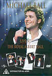

_This review was written by me for **MichaelDVD**, an Australian DVD review site that is no longer online. A capture of the site is held by the Internet Archive: **[browse it there](https://web.archive.org/web/20220217040146/http://www.michaeldvd.com.au/)**. It is reproduced here from my own copy of the site, as part of the record of what I have written._

_1999 · directed by Steve Kemsley._

## The film

**Michael Ashley Ball**was born on June 27 1962 near Stratford-Upon-Avon. Although trained initially as an actor, his singing talent was soon recognised and he began appearing in musicals such as _"Godspell"_and operettas such as _"The Pirates of Penzance."_His big break came when he was cast as "Marius" by **Cameron Mackintosh**in the West End production of the phenomenally successful _"Les Misérables."_ He then starred in a number of Andrew Lloyd Webber musicals including "The Phantom of the Opera" and "Aspects of Love." Michael has since expanded his career through a number (nine on last count) of successful solo albums and even a self titled television series featuring famous popular music artists.

He has won several awards including second place in the 1992 Eurovision Song Contest, 1998 Variety Club of Great Britain Award for Best Recording Artist, and in 1999 was presented with the Theatregoers Club of Great Britain’s award for Most Popular Musical Actor.

His 6th UK tour went on sale at the close of 1998 and sold out within weeks. During April and May on the tour he entertained and delighted 74,527 people at 25 concerts. Not satisfied with such a gruelling tour Michael went on to perform a concert in Amsterdam, two shows at the Liverpool Pops Festival and open-air concerts at Howard Castle, Glamis Castle and Longleat House.

In 1999, Michael did a UK concert tour (his sixth) covering 25 concerts in 21 cities playing to over 75,000 people, culminating in a concert at the Royal Albert Hall (presented on this disc). The concert included the following songs spread over two intervals (called "Acts" in the programme):

| Act I | Act II |
| :-- | :-- |
| 1. Hot Stuff 2. Everybody's Talkin' 3. Love On The Rocks 4. How Can I Be Sure 5. Someone Else's Dream 6. The Way We Were/The Rose 7. Something Inside So Strong 8. Prepare Ye The Way Of The Lord/Gethsemane | 1. Oh! What A Circus 2. My Heart Will Go On 3. Empty Chairs, Empty Tables 4. We Have All The Time In The World/Millennium 5. Let The River Run 6. One Step Out of Time 7. I'll Be There For You - Theme from "Friends" 8. Blues Brothers Medley (Shake Your Tail Feather, Think & Everybody Needs Somebody To Love) 9. Help Yourself 10. Love Changes Everything |

The concert includes a fairly patchy mix of songs closely associated with Michael (including Empty Chairs, Empty Tables from _Les Misérables_ and _Love Changes Everything_from _Aspects of Love_), songs written/adapted specially for him, together with covers of songs made famous by other singers - such as **Barbra Streisand**, **Bette Midler**, **Celine Dion**,**Tom Jones**not to mention the theme song from the _Friends_TV series and a medley of songs from the film _Blues Brothers_.

Michael still looks pretty cute with his dimpled cheeks and looks a little more, shall I say "well-rounded" since his _Les Misérables_ days. His audience seems to be at least 90% female given his penchant for singing easy listening numbers. I think he has a very good singing voice and I admire his professionalism and his stage persona but he's not really my cup of tea.

## The video transfer

All in all, we get a pretty honest and decent full frame transfer. Sharpness, detail and colour saturation are all acceptable (though not reference quality).

The video source is relatively clean and surprising there were few MPEG artefacts given that the DVD producers have chosen to try and fit everything into a single layer (DVD5) disc. I can detect occasional minor ringing and pixelation, but never at an annoying level. Other artefacts detected including shimmering and aliasing every now and then, but once again nothing major.

The only annoying aspect of the transfer is that on my home DVD player the disc does not provide any status information at all during play (such as chapter number, running/total/remaining time) apart from title number although the chapter selection buttons do work. This makes it very hard for me to tell where the concert is up to and how much more material is left at any given point. Status information is provided if I play the disc from a PC with a DVD-ROM drive.

## The audio transfer

There is only one audio track: Dolby Digital 5.1 encoded at 448 Kb/s. Once again, it is a reasonable track but will not win any awards for excellence.

The sound of the audio track seems to be lacking extreme high frequencies or extreme low bass, therefore sounding more like TV broadcast quality rather than CD quality.

The source is obviously a stereo (2 channel) master that has been remixed for 5.1 surround, as I can detect no more than the faintest murmurs coming from the surround speakers. Despite that though, the sound coming from the three front speakers have reasonable depth.

I doubt that the subwoofer would have been actively engaged.

There were no issues with the dialogue or audio synchronisation.

## The extras

The extras are pretty mediocre - the major item being a decent-length featurette.

### Menu

The menus are pretty standard and unexceptional.

### Featurette - _"Backstage With Michael Ball"_ (20:51)

This is a behind the scenes documentary of the UK tour introduced by Michael himself. It covers rehearsals in various locations, ideas for the opening of the concert, a tour through the "tour bus", arriving at the NEC (a concert venue off the M6 if I recall correctly from my UK holiday), and interviews with fans after the concert at the NEC. The documentary is presented in full frame with a Dolby Digital 2.0 audio track that is a bit patchy and uneven in places.

### Biographies - Cast - _Michael Ball_

This consists of 10 stills containing a rather detailed biography of **Michael Ball**.

### Gallery - Photo

This contains a photo gallery of 12 stills taken during and off concert featuring either Michael by himself or with other members of the accompanying band and crew.

## Censorship

As far as we have been able to ascertain, there are no censorship issues with this title.

## Region 4 versus Region 1

This title has yet to be released on R1.

## Summary

**Michael Ball - Live at the Royal Albert Hall**, is a very well put together concert sung by a cute looking guy with a great singing voice - well what more can I say except unfortunately it didn't really click with me. It is presented on a so-so DVD with a slightly above average video transfer and an average audio transfer marred by lack of surround speaker involvement.

| Rating  | Score       |
| :------ | :---------- |
| Plot    | ★★½ 2.5 / 5 |
| Video   | ★★★★ 4 / 5  |
| Audio   | ★★★ 3 / 5   |
| Extras  | ★★ 2 / 5    |
| Overall | ★★★ 3 / 5   |
