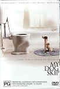

_This review was written by me for **MichaelDVD**, an Australian DVD review site that is no longer online. A capture of the site is held by the Internet Archive: **[browse it there](https://web.archive.org/web/20220217040146/http://www.michaeldvd.com.au/)**. It is reproduced here from my own copy of the site, as part of the record of what I have written._

_2000 · directed by Jay Russell._

## The film

_**My Dog Skip**_is an enthralling film that will please anyone who has fond memories of growing up with a dog, or anyone who enjoys a gentle and laid-back story about a boy growing up and his relationship with his dog. It's about childhood, loyalty and love. By the time I've reached the closing credits, my eyes were streaming with tears of joy. All in all I strongly recommend this film.

Set in Yazoo, Mississippi around the time of World War II, this film is quintessentially American and features scenes that look like they have been lifted out of a painting by **Norman Rockwell**, adventures and escapades that could have been written by **Mark Twain** and an emotional and sentimental musical score (by **William Ross**) with shades of **Aaron Copland**.

Willie Morris (**Frankie Muniz**) is a shy, slightly-built boy who is short for his age. He is just the sort of boy you expect to be the natural target of a school bully - studious, not good at sports, sensitive and caring. And indeed he does get bullied by no less than three kids - Big Boy (**Bradley Coryell**), Henjie (**Daylan Honeycutt**) and Spit (**Cody Linley**) - who I've decided to nickname "Fatty", "Dopey" and "Dirty." His only real friend and hero is the much older Dink Jenkins (**Luke Wilson**), the much admired baseball player who gets enlisted and is shipped to the war zone.

On his ninth birthday, Willie receives a puppy as a birthday present from his mother (**Diane Lane**) - despite the protestations of his father (**Kevin Bacon**) who thinks Willie is far too young to be able to take care of the dog. The rest of the film is about Willie's relationship with the dog (who he calls Skip). Skip not only provides the companionship that Willie needs but helps Willie win the respect of the three bullies, the friendship of Rivers Applewhite (**Caitlin Wachs**) - the "prettiest girl in class" - and ultimately transition from boyhood into manhood with pride and dignity. In between are interwoven more serious themes such as the realities of war and racial segregation.

Throughout the film, we get to hear voice-over narration (**Harry Connick Jr.**) from a much older Willie reminiscing about his childhood.

What I really liked about this film is that it deals with the more serious issues in a very understated way and never over-preaches, which is most unusual for an American film. For example, instead of making a big deal about racism in the South, the film simply shows Willie making friends with a black boy, then Skip wandering through both the white and black sections of the town so that we can see the difference in lifestyle and affluence, two lines at the cinema segregated by race, and finally at the end we see Willie and his friends watching a baseball game featuring black player Waldo Grace (**Jerome Jerald**). That's it - no lectures on why racism is bad, finger pointing or holier-than-thou attitudes. Instead we are gently reminded that even though people may be differentiated by race and economic status - at the end of the day there are more similarities than differences.

_\** My Dog Skip**_ is loosely based on a bestselling autobiographical book of the same name published by **William Weaks Morris** in 1995. The real Willie Morris was born in 1934 in Jackson, Mississippi, but when he was six months old his parents moved to Yazoo City. After studying at institutions such as the University of Texas at Austin and Oxford University (as a Rhodes Scholar no less), he became in 1967 the youngest ever editor-in-chief at _Harper_'s (the oldest magazine in the United States). He returned to Mississippi in 1980 as a writer-in-residence at the University of Mississippi.

He wrote more than a dozen books including two autobiographies and is particularly well known for the books and articles in which he compares his experiences and his long and complex southern heritage to America's own history. A sense of history, place and family are significant themes in much of his writing.

Willie Morris was consulted during the filming of this movie, but died in 2 August 1999, following a heart attack in Jackson, Mississippi. He managed to see the completed film a week after it was finished but prior to its theatrical release.

## The video transfer

This film is presented with a gorgeous video transfer in 1.78:1 with 16x9 enhancement. This is simply the best Warner Home Video transfer I have seen yet - rich, saturated colours plus reference quality sharpness and detail. The film source is flawless, and there are virtually no artefacts to speak of, apart from very minor posterisation in the faces in one or two occasions and very slight ringing during the opening titles. There is no point highlighting any part of the film - every frame is pretty much picture postcard perfect ("Can you say 'Kodak moment'? I _knew_ you could!")

This is a very unusual DVD in that it is a dual sided single-layer disc (DVD-10) featuring a complete copy of the film plus all extras on each side. The only difference between the sides is that they feature different foreign language audio tracks and subtitles.

Contrary to the packaging which states that there are 6 subtitle tracks, there are actually no less than 16 subtitles (spread across both sides). I turned on the "English for the Hearing Impaired" subtitle track and can attest to it's completeness and accuracy.

## The audio transfer

This disc also features no less than 7 audio tracks (English, French, Italian, Spanish and Czech, plus two audio commentaries) spread across both sides of the disc. The English and commentary tracks are common across both sides, whereas the foreign language audio tracks are allocated to one of the sides. The language audio tracks are in Dolby Digital 5.1 (384Kb/s) and the commentary tracks are in Dolby Digital 2.0

(192Kb/s). I listened to the English audio track and the commentary tracks.

I am just as pleased with the quality of the audio track as I am with the video transfer. As this is not an action-oriented film, don't expect any explosions or rumbling bass effects. Instead we get good clear dialogue, a lush musical score and lots of ambience sound effects across the surround speakers (birds twittering, rain falling, etc.)

## The extras

The extras are not as impressive compared to a sardine-packed special edition 2-disc set, but are very satisfying nonetheless. The only things I missed are a featurette or two and something comparing the story agains the real Willie Morris' childhood.

### Menu

The menus are static and pretty basic, but are quite pretty to look at. They are 16x9 enhanced.

### Listing - Cast & Crew

This is just a single still. I was hoping for a little bit more, like maybe biographies or filmographies.

### Audio Commentary - _Jay Russell (Director)_

I enjoyed this very interesting and listenable commentary as much as I enjoyed the film. Director **Jay Russell** has a good sense of humour (he introduces the commentary with a "... and I'll be your tour guide" comment) and a good, measured speaking voice. He provides quite a few insights into the casting, conversations with the late Willie Morris, anecdotes from the shooting of the film, interation between the dog and the other actors and the dog trainer, and many other interesting points - including why the army used puppy dogs with parachutists.

### Audio Commentary - _Frankie Muniz (Actor) & Mathilde de Cagny (Dog Trainer)_

This features the two talking about the casting process, their experiences during the shooting, other cast members, how to become a dog trainer and even the role of the American Humane Association. The two are obviously recorded together in one session, as they respond to each other. However, they are basically just reminiscing about the making of the film and it's not really a running commentary as they do not reference scenes in the film at all.

Interesting, the role of Skip is played by two Jack Russell terriers - **Enzo** and **Moose** (Moose also plays the dog in _Frazier_). I was interested to learn that Enzo and Moose have a pretty stormy and competitive relationship with each other!

They only talk for just under 32 minutes so the rest of the commentary track is basically the film soundtrack.

### Deleted Scenes-_with Director commentary_(4:13)

This is a set of deleted scenes with voice-over director's commentary. I wish the voice-over was only a separate audio track as I would not have minded listening to the original sound tracks for the scenes. All four scenes are presented as a single DVD title with no chapter breaks, in 1.85:1 with no 16x9 enhancement and Dolby Digital 2.0. Interestingly enough, the deleted scenes (including the commentary) are subtitled.

1. _Winston Groom's line_ **Winston Groom** is the author of the book Forrest Gump, and plays a cameo role as Mr. Goodloe. Interestingly enough his dog is called Forrest Gump. This scene restores a one-liner joke made by Winston regarding Skip.
2. _Dog Peeing_ This involves Skip stopping in the middle of a walk to pee.
3. _Jeep to Dink's_ This features two Army officers visiting Dink's parents in a Jeep, causing Willie to fear that something has happened to Dink.
4. _Will Prays_ This features Willie reciting the Lord's Prayer (in record speed!) plus an additional prayer for Dink, who is missing in action.

### Theatrical Trailer (1:34)

This is presented in 1.78:1 aspect ratio with 16x9 enhancement, but only a Dolby Digita 2.0 audio track.

## Censorship

As far as we have been able to ascertain, there are no censorship issues with this title.

## Region 4 versus Region 1

The Region 4 version of this disc misses out on;

- Cast and crew biographies, including a biography of “My Dog Skip” novel author Willie Morris
- Pan and Scan version of the film

The Region 1 version of this disc misses out on;

- Foreign language audio tracks and subtitles<em></em>

The Region 4 version is an easy choice due to PAL over NTSC - the extra language audio tracks and subtitles are a bonus.

## Summary

_**My Dog Skip**_ is a really touching and enjoyable film that I would recommend to anyone, young or old. It is presented on an unusual DVD two complete transfers of the film and extras on a double sided disc (but featuring different foreign language audio tracks and subtitles on each side). The video and audio quality is superb, and is of reference quality. The extras are mainly limited to two audio commentary tracks and some deleted scenes, but are quite satisfactory.

| Rating  | Score       |
| :------ | :---------- |
| Plot    | ★★★★★ 5 / 5 |
| Video   | ★★★★★ 5 / 5 |
| Audio   | ★★★★★ 5 / 5 |
| Extras  | ★★★★ 4 / 5  |
| Overall | ★★★★★ 5 / 5 |
