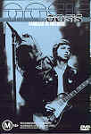

_This review was written by me for **MichaelDVD**, an Australian DVD review site that is no longer online. A capture of the site is held by the Internet Archive: **[browse it there](https://web.archive.org/web/20220217040146/http://www.michaeldvd.com.au/)**. It is reproduced here from my own copy of the site, as part of the record of what I have written._

_2000 · directed by Dick Carruthers._

## The film

_<strong>Oasis-Familiar to Millions</strong>_ captures the first show of **Oasis**' two night stand at Wembley Stadium in London (21 July 2000), which formed part of the band's rather successful 2000 World Tour. All in all Oasis played to 1.2 million people in 23 countries, including 450,000 in the UK and 70,000 each night at the Wembley.

Following on the heels of the **Beatles** and **Rolling Stones**, **Oasis** is a British rock band featuring a few young men (including brothers **Noel** and **Liam Gallagher**) with funny accents, catchy songs, and an appeal that spans their country of origin. Their first album _Definitely Maybe_ was released in 1994 and sold over 4 million copies in the UK but success across the Atlantic puddle had to wait till the second album _(What's The Story) Morning Glory?_ which peaked at #4 on the Billboard charts and had two #1 singles. The band also had at least 15 minutes of fame through the off-stage antics of the brothers, which involved sibling rivalry, feuds with other bands and drug use. The band then went a bit quiet and there were rumours of a break-up, but resurfaced in 1997 with a third album _Be Here Now_. The boys then calmed down a bit, got married and started families and got off the drugs and alcohol. Oasis is still around today (albeit with some changtes in the band line-up), a few years and a few albums later - the latest being _Standing On The Shoulder_ \[sic\] _of Giants_. Oasis has obviously retained a core group of loyal fans - as evidenced not only from their fairly comprehensive official [web site](http://www.oasisinet.com) but from fan sites as well.

The song listing for the concert is:

|  |  |
| :-- | :-- |
| 1. Fuckin' In The Bushes 2. Go Let It Out 3. Who Feels Love? 4. Supersonic 5. Shakermaker 6. Acquiesce 7. Step Out 8. Gas Panic! 9. Roll With It | 1. Stand By Me 2. Wonderwall 3. Cigarettes & Alcohol 4. Don't Look Back In Anger 5. Live Forever 6. Hey Hey, My My 7. Champagne Supernova 8. Rock 'n' Roll Star |

I reviewed this disc straight after _Oasis ... There and Then_, and it's interesting to compare between the two discs not only in terms of the band's performance and transfer quality but also in terms of the sophistication of the DVD production.

_Oasis ... There and Then_ was an early DVD disc with just one title - DVD5, NTSC full-frame formatting, laserdisc quality video with analog video artefacts, a remixed surround audio track, static menus and no extras whatsover. This disc, on the other hand, features an RSDL disc crammed with extras, PAL 1.78:1 with 16x9 enhancement, a true-blue Dolby Digital 5.1 audio track, and animated menus.

The extras are also very sophisticated for a music DVD and makes use of seamless branching (a la "Follow the White Rabbit" in _The Matrix_), multiple viewing angles and DVD-ROM content. I must say I'm impressed - this is the most feature-packed music DVD I've seen yet.

However, despite the 16x9 enhancement, 5.1 audio and innovative extras, I ended up prefering the band's performance in the earlier DVD rather than in this concert. Despite all it's faults, the music in the earlier DVD sounded more exciting and alive - five years later Oasis seems to have lost some of the exuberance and sheer energy of their heyday. As an example, I compared _Acquiese_ and _Champagne Supernova_ (two of my favourite Oasis songs) on both discs - in each instance the version on the earlier disc seems more alive and kicking compared to the more pedestrian interpretation on this disc.

For once, this music DVD fully deserves it's M+ rating - the Gallagher brothers seem to be inordinately fond of issuing four letter expletives in between songs. For those of you dying to know where the infamous scene is featuring an enthusiastic female fan baring her bosom to the band (as well as to the rest of the audience via the big screen) - it occurs at **46:07**-**46:13** (although there is a much earlier glimpse - but only if you have sharp eyes - at **30:40**).

## The video transfer

The transfer is presented in 1.78:1 aspect ratio with 16x9 enhancement.

The transfer is rather problematic as it is riddled with MPEG artefacts including rather pronounced instances of Gibb's effect, pixelation and occasional posterisation. I suspect that it is In general, it suffers from over-compression (due to the DVD authors trying to fit both a Linear PCM as well as a full 5.1 Dolby Digital track onto a 95-minute title together with a whole bunch of extras).

The transfer is also below reference quality in terms of sharpness and detail.

Colour saturation seems okay but somehow I was dissatisfied with the colour reproduction - maybe it's because of a combination of various artefacts including slight colour bleeding and posterization.

This is a single sided dual layered (**RSDL**) disc. The layer change occurs in **56:47** and is about average in terms of disruption - it is definitely noticeable but at least occurs in a reasonably quiet part of the concert in between songs.

## The audio transfer

The concert is accompanied by two audio tracks, Linear PCM stereo encoded at 48 KHz 16 bits (default track), and Dolby Digital 5.0 encoded at the higher bitrate of 448 Kb/s.

The Dolby Digital track is mastered at a relatively high level and features rather aggressive use of all five speakers (with audience noises in particular split across the rear surrounds), but does not contain an LFE (subwoofer) channel. Despite that, however, the music features plenty of bass directed at all speakers.

The best way of describing the overall sound of the Dolby Digital track is thus: Do you own or have you ever owned an AV amplifier/receiver that features a fake surround mode called "Stadium" or "Super Stadium"? Have you ever engaged that effect either intentionally as an experiment or by accident? And did you turn if off pretty soon afterwards because the end result is so over the top? Well, that's exactly how this audio track sounds like ... except you can't turn it off.

The Linear PCM audio track is mastered at a much lower level and sounds pretty underwhelming compared to the Dolby Digital 5.1 track. It is definitely below CD quality - more like FM radio I would say. Unfortunately it is also the default audio track. Honestly, if this is the best they can do I'll rather they skip this format and use the valuable bandwidth for a DTS track or for improving the quality of the video transfer instead.

Although I can't detect any audio synchronization issues the Gallagher brother's accent is pretty much undecipherable by me so I have no idea what they are singing about nor be able to appreciate most of the stage banter (apart from the four letter words which came through loud and clear thank you very much).

## The extras

I must say I am impressed with the quality as well as originality of the additional features present on this disc. This has to be the most extensive set of extras I have yet encountered on a music DVD - about the only feature missing is a commentary track. What's even more impressive is the fact that ALL extras (including the menus) are presented with 16x9 enhancement. This disc fully deserves a rating of five stars for extras.

### Menu

The menus are all 16x9 enhanced and feature extensive animation and sound within the menus and also in between menus.

### Active Subtitle Track-_Blue Tambourine_

This extra is similar to the "Follow The White Rabbit" feature on The Matrix DVD - it enables a subtitle track that will display a blue tambourine on screen at various points during the concert. If you press the "ENTER" key on the DVD player at these points the DVD will seamlessly branch into the appropriate featurette correponding to that point in the concert. Each of the featurettes can also be individually accessed via the menu. Most of the featurettes are on-location footage taken before, during and after the concert by **Grant Gee** (the director of Radiohead's _'Meeting People Is Easy'_ film).

### Multiple Angles-_Cigarettes And Alcohol_ (5:19)

This is a very impressive showcase of the capabilities of the multiple camera angle feature of DVD Video. We are presented with an excerpt from the concert (Cigarettes and Alcohol song) from the perspective of four cameras as well as the edited version as shown in the main feature. At all times, we get to see all five camera angles as tiny pictures-within-picture on the left side of the screen so we can use the angle button on the DVD remote to select the angle that looks the most interesting.

This feature has two audio tracks (Linear PCM and Dolby Digital 2.0) but the Dolby Digital 2.0 track is silent.

### Featurettes-_Visuals_

This is a set of films and graphics shown as background images accompanying various songs in the concert. The audio track accompanying these mini-featurettes are the associated songs encoded in Dolby Digital 2.0

_Go Let It Out_ (4:35) This is mainly a set of vignettes featuring scenes of New York City. Most of the scenes feature an excessive amount of grain, which I presume is intentional _Supersonic_ (4:40) This is a montage of various scenes, with the predominant image being something that looks like a bed of nails. _Rock 'n' Roll Star_ (2:56) This a montage of various shots of the band, interspersed with various album and video covers. _Live Forever_ (4:33) This is kind of cute - it contains the text of various quotes gradually shrinking into a background which then slowly dissolves into a black and white photograph of **John Lennon**.

### Featurette-_The Soundcheck_ (17:32)

This is a first of several featurettes that can be accessed individually as well as part of the _"Blue Tambourine"_ interactive subtitle track. Presented in black and white, this features various footage in and out of Wembley stadium during the soundcheck prior to the concert, including various members of the audience generally acting like the hooligans that they probably are. The transfer for this featurette is riddled with MPEG artefacts including Gibb's effect ringing, posterisation and pixelation. The audio track is excessively loud and sounds distorted in places.

### Featurette-_The Show_ (20:42)

This features even more footage of various members of the audience taken at various points during the actual concert. I liked the guy with the crutches singing along with the band during _Acquiesce_. Most of the shots are in black and white, and occasionally the screen is split into two 16:9 halves. Chapter 3 seems to contain the voice of an unidentified film crew member shouting what appears to be editing instructions. Some of the scenes feature a high degree of video noise which I assume is due to shooting in very low light conditions. The last chapter is some backstage footage of Liam watching his brother during one of the encore pieces.

### Featurette-_They Think It's All Over..._ (4:38)

This features footage of the band leaving the stage at the end of the concert, as well as the audience leaving the stadium. Most of the shots have a high degree of video noise.

### Featurette-_The Chat_ (9:59)

This is a short interview with the band members. I'm glad the Gallagher brothers consistently display a strong sense of humility and and a realistic sense of their importance - NOT!

### Discography

This is a set of sub-menus featuring stills of Oasis albums and singles plus song listings. Each still is accompanied with an audio clip from the album/single.

### DVD-ROM Extras-_Songplayer-Live Forever_

This consists of web page and associated images (with links to a special page on the Oasis website featuring various stills from the concert) and a Windows application called "Songplayer" that provides electronic music tuition on the chords, lyrics and riffs for the song _'Live Forever'_.

## Censorship

As far as we have been able to ascertain, there are no censorship issues with this title.

## Region 4 versus Region 1

According to [Amazon](http://www.amazon.com), the R1 version of the disc has a very similar set of extras but seem to be in (pan & scan?) 1.33:1 aspect ratio as opposed to widescreen (and also missing out on the Linear PCM audio track). If this is true, then it would make R4 the obvious choice.

## Summary

**Familiar to Millions** is a so-so concert from the once-superstar status British rock band **Oasis**. It is presented on a DVD with problematic video and audio transfers, but has a pretty amazing collection of extras, particularly for a music DVD.

| Rating  | Score       |
| :------ | :---------- |
| Plot    | ★★★ 3 / 5   |
| Video   | ★★★ 3 / 5   |
| Audio   | ★★★★ 4 / 5  |
| Extras  | ★★★★★ 5 / 5 |
| Overall | ★★★★ 4 / 5  |
