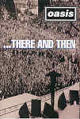

_This review was written by me for **MichaelDVD**, an Australian DVD review site that is no longer online. A capture of the site is held by the Internet Archive: **[browse it there](https://web.archive.org/web/20220217040146/http://www.michaeldvd.com.au/)**. It is reproduced here from my own copy of the site, as part of the record of what I have written._

_1996 · directed by Szaszy, Mark Carruthers, Dick._

## The film

**Oasis ... There and Then** is a collection of excerpts from two concerts (Earls Court, London November 1995 and at Maine Road, Manchester April 1996), interspersed with interview snippets and off-concert footage (fans rushing into the concert venue, Oasis members playing soccer, etc.). I have not listened to Oasis prior to reviewing this DVD, although I have vaguely heard of them before.

Following on the heels of the **Beatles** and **Rolling Stones**, **Oasis** is a British rock band featuring a few young men (including brothers **Noel** and **Liam Gallagher**) with funny accents, catchy songs, and an appeal that spans their country of origin. Their first album _Definitely Maybe_ was released in 1994 and sold over 4 million copies in the UK but success across the Atlantic puddle had to wait till the second album _(What's The Story) Morning Glory?_ which peaked at #4 on the Billboard charts and had two #1 singles. The band also had at least 15 minutes of fame through the off-stage antics of the brothers, which involved sibling rivalry, feuds with other bands and drug use. The band then went a bit quiet and there were rumours of a break-up, but resurfaced in 1997 with a third album _Be Here Now_. The boys then calmed down a bit, got married and started families and got off the drugs and alcohol. Oasis is still around today (albeit with some changtes in the band line-up), a few years and a few albums later - the latest being _Standing On The Shoulder *\[sic\]* of Giants_. Oasis has obviously retained a core group of loyal fans - as evidenced not only from their fairly comprehensive official [web site](http://www.oasisinet.com) but from fan sites as well.

This disc has the following chapters:

|  |  |
| :-- | :-- |
| 1. Program Start 2. Swamp Song 3. Acquiesce 4. Supersonic 5. Hello 6. Some Might Say 7. Roll With It 8. Morning Glory 9. Round Are Way | 1. Cigarettes & Alcohol 2. Champagne Supernova 3. Cast No Shadow 4. Wonderwall 5. The Masterplan 6. Don't Look Back In Anger 7. Live Forever 8. I Am The Walrus 9. Cum On Feel The Noize |

The boys in the band are joined by **Mark Feltham** playing the harmonica and a brass section (mainly trumpets and saxophone) in track 9 (_Round Are Way_). Tracks 12-14 include a string ensemble. _Live Forever_seems to be a tribute to various (dead) icons such as **Martin Luther King** and **John Lennon**, whose images are projected onto the back of the stage. _I Am The Walrus_is a cover of the **Beatles** song and seems to be a tribute to them, including additional musicians acting as a "bootleg Beatles" wearing uniforms similar to that in _St. Peppers_. The band is also accompanied by a brass section and various other instruments including harmonica and violin in this song. Finally, there's a stuck note at the end of track 18 (_Cum On Feel The Noize_) that I found intensely irritating.

To my surprise, I actually enjoyed some of the songs (they are a bit repetitive and monotonous, but curiously catchy). I particularly liked Noel's guitar solo in _Champage Supernova_. Some of the songs are quite exhilirating, notably _Champagne Supernova_,_I Am The Walrus_ and _Cum On Feel The Noize_. It's a pity the band members have no sex appeal whatsover - the Gallagher brothers seem to have personalities like a wet fish (well, that's a bit unfair - I have met some pretty interesting fish) and look really daggy in their grunge outfits.

I'm not sure I like the juxtaposition of various interview snippets between the songs. The snippets are too short to be meaningful and seem rather pointless. I would have preferred them to be included as a separate featurette.

## The video transfer

This full-frame transfer appears to be slightly soft with oversaturated colours as well as some colour smearing - in other words, it's about laserdisc quality. The concert excerpts appear to be thankfully free of film grain or video noise, but the in-between songs interviews and off-stage footage have a more variable quality, including snippets that are extremely grainy but perhaps deliberately so.

There's quite a lot of aliasing present in the transfer, to the point of annoyance. This is particularly noticeable around the microphone, guitar strings and cables. There are also various instances of pixelation, mainly around the drums. I suspect the video transfer has been downconverted from PAL to NTSC (what a shame!).

This is a pretty basic disc - single sided single layered with no subtitles.

## The audio transfer

This disc features two audio tracks, Linear PCM 48/16 2.0 (1536Kb/s) and Dolby Digital 5.1 (448Kb/s). I switched between both tracks at regular intervals - sometimes in between songs and sometimes in the middle of a song. Funnily enough, I actually prefer the Dolby Digital track over the PCM track.

I found the dialogue in between songs to be rather hard to understand (mainly because of the strong accent) and it was also difficult following the lyrics of the songs. A subtitle track would have been most helpful.

The Dolby Digital track is mastered at a relatively loud level (about 3 dB higher than normal) and features rather aggressive use of the surround speakers. For instance, I can clearly hear audience noises on all speakers. I was initially quite impressed but then realised that this is not really a remix but a stereo track that has undergone some artificial surround processing, as some high frequency musical content (notably the cymbals) have also migrated to the surround speakers. The cymbals aren't very natural sounding, either. _I Am The Walrus_(track 17) in particular has most of the high frequency content of the brass instruments and violin migrating to the back surround speakers - very disconcerting.

The PCM audio track in comparison is mastered at a much lower level (at least 6 dB lower than the Dolby Digital track) but sounded terrible when I increased the volume - it seemed to lack dynamics and has rolled off top and bottom ends. It sounded like it was transferred off a film optical track or a bad video tape rather than from a digital source. I would have expected the PCM audio track to be roughly CD quality and I was really disappointed.

## The extras

Extras? What extras?

### Menu

These are pretty ho-hum and static. Curiously, the "Play Feature" menu item is called "Resume."

## Censorship

As far as we have been able to ascertain, there are no censorship issues with this title.

## Region 4 versus Region 1

The disc is encoded to support all regions (1-6) - the locally released version is in fact identical to the version released in North America, down to NTSC formatting and FBI warnings.

## Summary

**Oasis ... There and Then** is a collection of excerpts from two Oasis concerts circa 1995-96. It is presented on a very basic DVD with mediocre video and audio transfers and no extras whatsoever.

I wasn't looking forward to reviewing this disc, but I have learnt to appreciate Oasis. However, I still wouldn't call myself a fan - the music is not really my cup of tea. Then again, a cup of tea is not really my cup of tea either, but that's another story.

| Rating  | Score         |
| :------ | :------------ |
| Plot    | ★★★ 3 / 5     |
| Video   | ★★½ 2.5 / 5   |
| Audio   | ★★★ 3 / 5     |
| Extras  | ★★★★½ 4.5 / 5 |
| Overall | ★★★ 3 / 5     |
