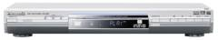
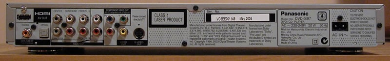
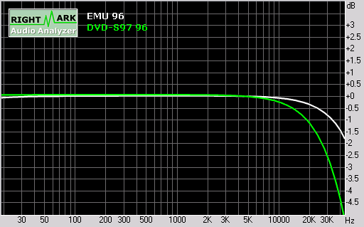
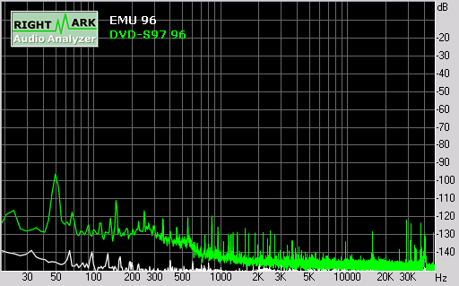
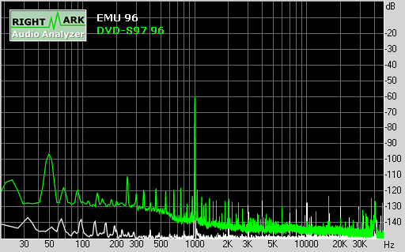
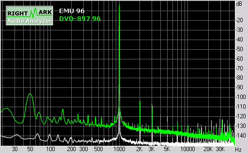
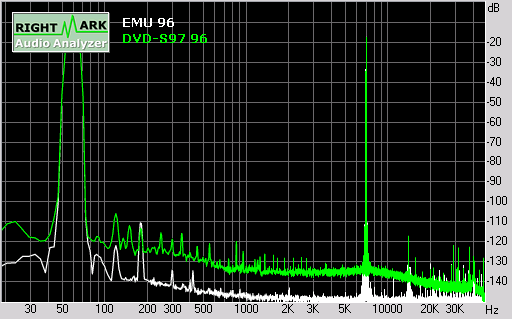
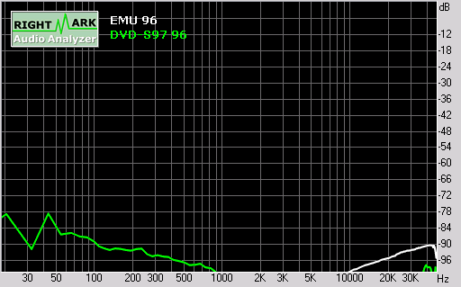
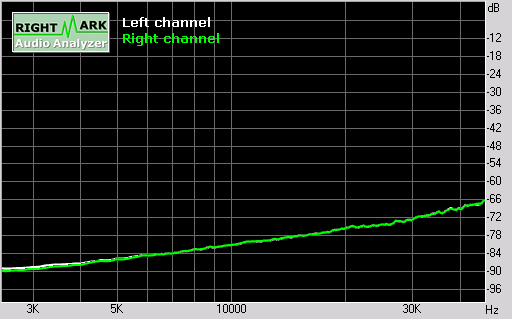

_This article was written by me and **published on Audioholics**, where it remains: **[read it there](https://www.audioholics.com/blu-ray-and-dvd-player-reviews/panasonic-dvd-s97)**. Audioholics asked permission to run it. It is republished here for information, as part of the record of what I have written._

_Two of the measurement charts below, noise level and total harmonic distortion, are no longer served by Audioholics. They have been restored from my own RightMark Audio Analyzer export of the same measurement run._

## DVD-S97 Overview & Build Quality

Panasonic has always made highly regarded DVD-Video players, and the DVD-RP82 was widely regarded by many as one of the best DVD players ever made (so much so that when it was discontinued, these players were selling on E-Bay for higher than the original Manufacturer's Suggested Retail Price!) However, it seems that after the DVD-RP82, Panasonic went down-market and released a set of lackluster models.

Well, this is no longer the case, as the DVD-S97 is a worthy successor to the DVD-RP82. Like the DVD-RP82, it is a progressive scan DVD-Audio/Video player with Faroudja DCDi deinterlacing. However, it improves upon the DVD-RP82 through the addition of quite a few significant features:

- Digital video and high-resolution multi-channel audio output over HDMI 1.1
- Video resolution up-conversion to 720p and 1080i over HDMI
- Improved audio upsampling features
- Support for additional audio and video formats such as JPEG, MPEG4, WMA (on all models - the RP82 only supported WMA on US/Canadian models) in addition to MP3 on multiple media types (DVD-R/RW, DVD-RAM, CD-R/RW plus HighMat discs)
- Support for both PAL and NTSC (the RP82 only supported PAL on non US/Canadian models)
- Support for PAL progressive scan (the RP82 only supported NTSC progressive scan)
- Limited support for HDCD (it will recognize and play HDCD encoded discs, but does not implement Peak Extend which increases dynamic range by an extra 1 bit or 6dB)
- On-board Dolby Digital Pro Logic II decoder (in addition to Dolby Digital, DTS and MPEG Multi-channel)

That is a very impressive list of features (in particular, the DVD-S97 has support for Dolby Pro Logic II, which I have not seen in any other player to date). The only optical disc format that this player will not play is Super Audio CD (which is to be expected since Panasonic is a major supporter of the competing DVD-Audio format).

## **Unpacking & Build Quality**

 The DVD-S97 was shipped to me directly from Panasonic Australia, even though I purchased it from a dealer. Inside the box were the player, a figure 8 Australian 2 prong power cord, remote control and batteries, HDMI cable, and a three core A/V cable (composite video plus analogue 2-ch audio).

The front panel of the unit is much nicer looking than the DVD-RP82, although probably still a bit too cheesy and cheap for my liking. The disc transport is located in the middle on top the front panel display, with transport control (Open/Close, AV Enhancer, Stop, Pause, Play, plus Skip buttons) on the right.

To the left of the transport is the Power/Standby button, the IR sensor and no less than 4 indicator lights (one for standby, and three indicating HDMI status: Video, Audio/Multi-Ch, and 720p/1080i).

The rear of the player features standard connections, including both optical and co-axial digital outs (no Firewire), analogue 2-ch and 5.1-ch outputs, plus composite, S-video, component video, and finally an HDMI connector for digital video and audio (copy protected using HDCP).

****

I ran a 'standby mode' test whereby I shut down the unit with the disc tray open, and the player was clever enough to retract the tray prior to turning 'off.' In addition, pressing 'Play' or the 'Open/Close' buttons will wake up the unit from standby mode (in addition to the power button). As we frequently mention, this is key for programming discrete on/off macros and ensuring you can determine the state of the unit.

## **Internal Components**

 Given the price point of the player, Panasonic has done a good job with the component quality/build and layout. The transport drive is located in the middle, with the power supply circuit board on the right (when the player is viewed with the back facing you). The analogue audio/video output circuit board is on the left, with digital processing circuit board stacked on top.

I was surprised by the high quality components used in the player given the price - Panasonic's positioning in the high volume, low margin end of the consumer electronics market must give them good purchasing power. Their philosophy seems to be to select components that are just one step below flagship, allowing superior (but not 'state of the art') performance for a much lower cost.

Let's start with the power board. Given the cost of the player, I'm surprised that Panasonic has not only opted for a dedicated power board, but has devoted substantial chassis real estate to it. Although not actively promoted as such, it seems that Panasonic has adopted the "virtual battery" design for the power supply regulation used on previous flagship players. The transformer core is not very large, but it appears Panasonic has selected some very frugal components in terms of power requirements so hopefully there should be just enough power to share around.

 

The transport is a pretty standard Panasonic affair, but with the added 'attraction' of a transparent tray. Through clever lighting, the tray actually glows blue when it is opened. Very pretty.

The top side of the digital processing board contains a very large custom IC responsible for the bulk of the player's operation and processing: a Panasonic MN2DS0004AP processor that does MPEG audio and video decoding, plus Dolby Digital, Dolby Pro Logic II, DTS, and MLP audio decoding. No doubt it is also responsible for controlling the user interface and on screen display, plus additional processing functions such as time alignment and bass management.

There is also a Genesis FLI-2310 video processor for deinterlacing and HDMI scaling, plus a BA6679FM transport controller, 4MB flash memory, a Silicon Image SiI 9030CTU PanelLink HDMI transmitter, and finally an Analog Devices ADV7320 216MHz/12-bit 6-channel Video DAC with noise-shaped video. The six channels on the Video DACs allow all analogue video outputs (composite, S-Video and component) to be active simultaneously. The ADV7320 is just one step below the flagship 14-bit ADV7314 but it represents a newer generation with support for CGMS-A copy protection.

On the underside of the board are four sets of Burr Brown PCM1791 DACs (each handling two channels) plus JRC 4580 dual-channel op amps. The PCM1791 is an 'advanced segment' DAC (hybrid ladder/delta sigma) delivering 113dB S/N and 0.001% THD+N. It is capable of generating full scale analogue output voltage, so the JRC 4580 op amps are presumably used as low pass filters for analogue reconstruction. Altogether, the four sets of DACs and op amps provide eight channels out audio, allowing (possibly downmixed) 2-ch and 5.1-ch analogue outputs to be active simultaneously. In terms of quality, the PCM1791 and JRC 4580 combo is not bad, and obviously chosen for cost considerations. The flagship PCM1792 plus NJM5534 combo would have been better, but would have been much more expensive and required more power. In addition there is a BA5838FM DVD/CD controller, and SDR RAM (about 24MB in total across three chips).

Finally, the analogue circuit board underneath the DSP board is fairly large, and contains mainly discrete components. Although both analogue audio and video signals are routed through this board, the spacing between components will help reduce interference and noise. All in all, I would say the player is very well designed, with an obvious focus on cost but also some thought towards quality where possible. This is a design that leverages the economies of scale and the custom IC design capabilities based on Panasonic's status as a high volume major electronics manufacturer, and the player would have been a lot more expensive if it was designed and manufactured by a second tier or boutique vendor, so we are getting great value for money here.

## DVD-S97 Player Setup and Operation

Pressing the **Setup** button on the remote control brings up the menu system for configuring the DVD player. I quite liked the look and feel of the setup menus - there were no obscure and cheesy icons, and the menus were usable even on the small 7" LCD monitor that I use for configuring players.

There are six tabs or setting categories: _Disc, Video, Audio, HDMI, Display_ and _Others_. In addition, there is also a _Quick Setup_ wizard which allows you to set common settings over a set of dialogs. The Quick Setup menu page is activated if you enter _Setup_ when the player is brand new (or after reinitialization to factory settings).

The _<strong>Disc</strong>_tab allows you to set the default language for the audio track, subtitle track, disc menus and parental control rating limit. You can select 'Original' for the default audio track, and 'Automatic' for the subtitle track. If your preferred language is English, French, German, Italian, Spanish, Portugese, Swedish or Dutch, you can directly select it from a list, otherwise, you have to type the four digit code associated with the language.

The _<strong>Video</strong>_tab allows setting of TV aspect ratio, TV Type, Time Delay, Convert from PAL, Still Mode, NTSC Disc Output and Picture/Video Output. The TV Type setting is interesting in that it allows you to specify the type of video display connected to the player (Standard Direct View TV, CRT Projector, LCD TV/Projector, Projection TV, Plasma TV). Some experimentation revealed that this setting subtly alters brightness, contrast and gamma settings for the video output, so I would recommend leaving this at the 'Standard' setting and instead calibrate your video display based on a calibration disc such as Digital Video Essentials or AVIA. The Time Delay setting allows you to adjust for A/V sync (in increments of 20ms from 0-100ms) - a very useful feature if your AV receiver or processor does not have this setting and you experience sync issues.

The _<strong>Audio</strong>_tab governs what sort of formats are allowable on the digital output (PCM 96/192kHz, Dolby Digital, DTS, MPEG) as well as DRC for Dolby Digital. It also allows you to specify whether you want to hear audio whilst in search mode (non 1X playback speed). Interestingly, the player allows output of 192kHz through the digital outputs, which is non-standard (when I enabled it, I received static noise through my Cary Cinema 6 surround processor, even though the Cary also claims to support 192kHz - presumably using an incompatible signaling format).

The 'Speaker' settings allow you to specify speaker presence and size, time alignment, and channel balance. Unfortunately, you have to specify time delay settings in milliseconds rather than distance (therefore it assumes you know the speed of sound and are handy with a calculator 舑 _1ms per foot of delay for those of you who want to ballpark it)._ Also, it assumes the Front Left/Right and Surround Left/Right pairs are equidistant. Furthermore, you cannot adjust the balance between the Front Left/Right speakers, nor can you adjust for time delay for the subwoofer.

The **_HDMI_** tab allows you to set the HDMI RGB range ('Standard' vs 'Enhanced'), HDMI Video Mode (On/Off), and HDMI Audio Mode (On/Off).

The **_Display_** tab allows you to set the language for player menus, On screen messages (On/Off), and background during play (black/grey).

Finally, the **Others** tab allows you to set the brightness of the front panel display, Auto Power Off (On/Off), rerun Quick Setup, and reinitialize the player to factory defaults (very sensible, rather than relying on an arcane set of button presses typical of some players).

## Player Operation

The player has an 'AV Enhancer' feature that basically is a set of memorized user configuration settings for the following:

- **Multi-Remaster -** this upsamples 44.1 and 48 kHz audio to 88.2 or 96 kHz (there are three filter settings). Interestingly, you can adjust the 'remaster level' from -6 to +6 dB
- **Audio Only -** this turns of video and HDMI circuits for cleaner audio playback
- **Picture Mode -** various picture adjustment presets (Normal, Cinema1, Cinema2, Animation, Dynamic, User)
- **Picture Adjustment -** Contrast, Brightness, Sharpness, Color, Gamma settings plus three noise reduction settings (Depth Enhancer, MPEG DNR, 3D-NR)

AV Enhancer can be set to Off, Auto (which presumably is the player's idea of what is appropriate depending on the type of disc inserted), or three user settings (User1, User2, User3). Panasonic suggests that you configure these settings so that User1 is optimized for DVD-Video, User2 for audio, and User3 for other video (i.e. DVD-RAM), but you don't have to follow these guidelines.

Some interesting features of the player include:

- Ability to vary DVD-Video playback speed from 0.6-1.4x normal (useful if you want to finish a DVD a bit sooner) - it resamples the audio to preserve sync, but will convert all audio to 2ch 48kHz and disable upsampling/Dolby Pro Logic II.
- Starting playback from a specific DVD-A 'group' or MP3/WMA/JPEG/MPEG4 folder (useful for 2ch audiophiles wishing to navigate to a specific audio track without requiring a video display)
- Position memory - memorizes where playback position for up to 5 discs so you can return to it when you reinsert the disc later
- Zoom - you can zoom by preconfigured settings (Auto, 4:3 Standard, European Vista, 16:9 Standard, American Vista, Cinemascope 1, Cinemascope 2) or manually (between 1.00-1.60 in 0.01 increments, or 1.60-2.00 in 0.02 increments or 2.00-4.00 in 0.05 increments (MPEG4 only).

There is a 'file explorer' type interface for MP3/WMA/JPEG/MPEG4 type content. Interestingly, the player will recognize CD Text but not DVD Text or jacket pictures. Alas, it only displays the CD Text if you have a video display - it would have been nice to display CD Text on the front panel display as well.

Like other Panasonic players, the DVD-S97 has a fairly extensive set of on-screen status information and menus, all accessible when you press the _Display_ key on the remote. Unfortunately, the front panel display is rather austere and does not even show playback elapsed time. Pressing _Display_ a second time shows a bar graph elapsed play time indicator (allowing you to toggle between elapsed play time and remaining time). Pressing _Display_ a third time will cancel the on screen display.

The on screen menus include:

- **Program/Group/Title** (Current/Total) - in stop mode, you can specify which number to commence playback
- **Chapter/Track/Playlist** (Current/Total) - in play mode, you can specify which number to jump to
- **Time** (Elapsed or Remaining) - leads to a submenu for Time Slip (skip forward or backward by a fixed duration) and Time Search (specify start from specific time) functions
- **Audio** (Current Audio Language, or current bitrate/sampling frequency) - allows you to select audio tracks
- **Still Picture**- allows you to switch still picture
- **Thumbnail**- allows you to switch thumbnail images
- **Subtitle** (Current subtitle track) - allows you to select/enable subtitle tracks
- **Marker** (VR) - allows you to select DVD-VR markers
- **Angle** (current viewing angle) - allows you to change viewing angles
- **Slideshow**- allows you to change slideshow settings

In addition there is an - Additional Settings - menu that items to a submenu including:

- **Play Speed** (varies DVD-Video playback speed from 0.6-1.4x normal)
- **Play Menu** (contains repeat and marker settings)
- **Picture Menu** (Picture Mode and adjustment settings, HDMI output resolution/colour space, progressive scan settings: Auto1/2, Video)
- **Audio Menu** : Dolby Pro Logic II (Off, Movie, Music), Advanced Surround (SP1, SP2, HP1, HP2, Off), Dialogue Enhancer, Multi Remaster (1, 2, 3, Off), Digital Filter (Normal, Slow), Attenuator (On, Off)
- **Display Menu** : Information, Subtitle Position (0 to -60), Subtitle Brightness (Auto, 0 to -7), 4:3 Aspect (Normal, Auto, Shrink, Zoom), Just Fit Zoom, Manual Zoom, Bit Rate Display, GUI See Through, GUI Brightness (-3 to +3), HDMI Status
- **Other Menu** : Sleep (Auto, 30m, 60m, 90m, 120m, Off), AV Enhancer, Setup, Play as DVD-Audio/Video, Play as DVD-VR/HighMAT/Data

I must admit, I was impressed by the configurability of this player. There's no doubt Panasonic has a very powerful DSP which is put to good use, because some of the features (like variable speed playback and onboard audio decoding including Dolby Pro Logic II) require a lot of processing power. This was the first Panasonic player I had encountered with explicit support for handling 0dBFS+ levels (through a digital level attenuator 舑 not the best solution, but far more cost effective than a custom digital filter which Sony employs for their high end players).

## DVD-S97 Remote Control and Benchmark Video Tests

This was much better than the DVD-RP82 remote. The buttons are reasonably well laid out, and provided better tactile feedback when pressed. Although there is no back-lighting, the commonly used controls are different enough that you can just about operate the remote by feel if you memorize the button layout.

In addition to controlling the player, the remote also has a number of basic controls for a TV. Unfortunately, these buttons are not learnable, so if your video display is not amongst the two digit codes preprogrammed into the remote you are out of luck.

I was surprised that Panasonic decided to include dedicated remote buttons for picture adjustment settings (brightness, contrast, sharpness and color) yet there is no _Eject_ button (however, the eject remote control code from older remotes still work). The presence of _AV Enhancer_ , _Multi-Remaster_ and _Audio Only_ buttons will no doubt please audiophiles (in addition, the _Group_ button allows selection of DVD-Audio Groups without requiring a video display), plus all the usual buttons for DVD navigation are present.

## Audioholics/HQV Bench Testing Summary of Test Results

<strong>Perfect Score is 130 DVD-S97 score: 85/130</strong>very respectable and very typical of Faroudja FLI-2310-equipped players. The player performed adequately as a progressive scan player in Auto1 mode, failing only on unusual cadence sequences (although the player will detect 2:2 cadence in Auto2 mode).

Performing measurements and tests on a DVD player using tools at our disposal is somewhat objective, but still results in a certain amount of subjective decision-making in terms of scoring and evaluation. As such, we recommend that these test results be used as a guideline only. For the review of this DVD player, the performance was based on the player in conjunction with the display monitor. We used the Sony VPL-VW11HT projector which was calibrated as close as possible to ISF reference standards using the SMART III calibration software. For the test and evaluation of the DVD-S97 we used selections from AVIA, Digital Video Essentials, the Microsoft WHQL 3.0 DVD Test Annex and the Silicon Optix _HQV Technology Benchmark DVD_ test discs in addition to various test clips from popular movies.

All final test scores were derived using the component video output in progressive scan mode.

| **Test**                        | **Max Points** | **Results*** | **Pass/Fail** |
| :------------------------------ | :------------- | :----------- | :------------ |
| Color Bar                       | 10             | 10           | Pass          |
| Jaggies #1                      | 5              | 5            | Pass          |
| Jaggies #2                      | 5              | 5            | Pass          |
| Flag                            | 10             | 10           | Pass          |
| Detail                          | 10             | 10           | Pass          |
| Noise                           | 10             | 5            | Pass          |
| Motion adaptive Noise Reduction | 10             | 5            | Pass          |
| Film Detail                     | 10             | 10           | Pass          |
| Cadence 2:2 Video               | 5              | 0            | Fail          |
| Cadence 2:2:2:4 DV Cam          | 5              | 0            | Fail          |
| Cadence 2:3:3:2 DV Cam          | 5              | 0            | Fail          |
| Cadence 3:2:3:2:2 Vari-speed    | 5              | 0            | Fail          |
| Cadence 5:5 Animation           | 5              | 0            | Fail          |
| Cadence 6:4 Animation           | 5              | 0            | Fail          |
| Cadence 8:7 animation           | 5              | 0            | Fail          |
| Cadence 24fps film              | 5              | 5            | Pass          |
| Scrolling Horizontal            | 10             | 10           | Pass          |
| Scrolling Rolling               | 10             | 10           | Pass          |
| **Total Points**                | **130**        | **85**       |               |

*All tests were done with the component video output at 480p.

### **Comments on Audioholics DVD Torture Tests**

For the full list of features and testing, please see the new DVD Player Features and Benchmark Comparisons Chart.

The use of the Genesis FLI-2310 video processor with DCDi ensures that the player passed the jaggies and waving flag test, which Silicon Image based players have problems with. The Panasonic was a bit slow at film detection and, although it still rates a pass by HQV standards, it's right on the borderline. In practice, this means that you will encounter combing during bad edits, more so than Silicon Image based players or even HTPCs using the Nvidia 6600/6800/7800 based graphics chipset and the PureVideo decoder.

The FLI-2310, however, is prone to the macro-blocking 'bug', especially noticeable on digital video displays. Word has it that Panasonic has done some tweaking in the firmware to reduce the effect of the bug. In any case, I did not notice any issues with enhancing macro-blocking over the component video output.

In terms of other components of the DVD Torture Tests, the DVD-S97 passed all of them successfully, except for a Y/C delay of around -0.07 in the red channel.

Layer changes were good, with the WHQL 'worst case scenario' layer change coming in around 0.5 second. Boot up time was reasonable, around 6 seconds. After the WHQL disc was inserted, it took around 7 seconds before it brought up the menu, and around 2 seconds to eject the disc from the main menu. Overall, the player feels slightly sluggish with front panel and remote buttons responding with a small but perceptible lag.

## DVD-S97 Audio RightMark Test Results

I tested the player on the 2 channel analogue output, using Audio RightMark 5.5 and an E-MU 1212M as the capture card, at 24 bit resolution and 44.1, 48 and 96 kHz sampling rates.

| **Test**                                       | **44.1 kHz** | **48 kHz**   | **96 kHz**   |
| :--------------------------------------------- | :----------- | :----------- | :----------- |
| Frequency response (from 40 Hz to 15 kHz), dB: | +0.05, -0.43 | +0.07, -0.61 | +0.07, -0.61 |
| Noise level, dB (A):                           | -108.7       | -108.6       | -108.5       |
| Dynamic range, dB (A):                         | 108.0        | 108.0        | 107.7        |
| THD, %:                                        | 0.0010       | 0.0012       | 0.0012       |
| IMD + Noise, %:                                | 0.0039       | 0.0037       | 0.0036       |
| Stereo crosstalk, dB:                          | -105.6       | -107.5       | -102.7       |

As you can see, the player measured very close to published specs, with the dynamic range slightly below the quoted 110dB but THD twice as good as the published spec of 0.002%. The output voltage was very close to the 2Vrms reference. The stereo crosstalk figures were particularly good and reflect care taken in the design of the analogue line output stage.

A comparison of the player outputs with Audio Only switched on and off (measured at 96kHz 24 bits) showed that the audio characteristics improved slightly with Audio Only switched on, but not significantly (so it's pretty safe to leave the video circuits turned on 舑 particularly for DVD-Audio):

| **Test**                                           | **Audio Only Off** | **Audio Only On** |
| :------------------------------------------------- | :----------------- | :---------------- |
| **Frequency response (from 40 Hz to 15 kHz), dB:** | +0.06, -0.57       | +0.06, -0.56      |
| **Noise level, dB (A):**                           | -108.4             | -109.0            |
| **Dynamic range, dB (A):**                         | 108.2              | 108.3             |
| **THD, %:**                                        | 0.0011             | 0.0011            |
| **IMD + Noise, %:**                                | 0.0031             | 0.0031            |
| **Stereo crosstalk, dB:**                          | -103.1             | -104.4            |

The following graphs are all based on measurement of the player playing back test tones at 96kHz 24-bit. In these graphs, the green plot is the player 2ch output, and the white plot is the E-MU 1212M measuring itself in loopback mode.

The frequency response graph indicates the player has a low pass filter that is down -1dB at 20 kHz, but is very flat for low frequencies. This filter is to compensate for ultrasonic noise generated by the DAC:

Looking at the noise level, the DVD-S97 has a noise floor that is mainly concentrated at below 1kHz, with the most significant contributor being residual 50Hz (fundamental plus harmonics) from the power supply. In addition, there are several significant spikes clustered at around 30kHz, plus another set around 1-3kHz:

Finally, switching the player into 'Audio Exclusive' mode (by pressing the 'Audio Ex' button on the front panel) improved the audio characteristics slightly: dynamic range was increased by about 0.1dB, THD and IMD+N improved by 0.0001% Stereo crosstalk also improved by just over 1dB. These improvements are unlikely to be detectable by the human ear.

## DVD-S97 Viewing, Listening Tests and Conclusion

### **0dBFS+ Level Handling**

For an explanation of what 0dBFS+ levels are, please read our article on the topic. As to be expected, the player clips on 0dBFS+ levels, but there is an Attenuator function which reduces output level by around -5.4dB. With this function engaged, the player successfully reproduces 0dBFS+ levels:

| **_Frequency (sine wave)_** | **_Phase_** | **_Analogue peak level (theoretical)_** | **_Attenuator = Off_** | **_Attenuator = On_** |
| :-- | :-- | :-- | :-- | :-- |
| 5,512.5 Hz | 67° | +0.69 dB FS | +0.01 dB FS | +0.63 dB FS |
| 7,350.0 Hz | 90° | +1.25 dB FS | +0.03 dB FS | +1.15 dB FS |
| 11,025.0 Hz | 45° | +3.00 dB FS | +0.05 dB FS | +2.77 dB FS |

I must say it was very thoughtful of Panasonic to include an Attenuator function to cater for 0dBFS+ levels, as many other players simply clip. However, the player will revert to clipping when Multi Remaster is engaged, so I would not recommend engaging the upsampling function on this player.

## Viewing Evaluation

Since I did not have an HDMI-capable display, I only tested the player in 480p/576p via component video output.

As you would expect from a flagship Panasonic player, the video quality is excellent. Images look sharp and detailed (even without noise reduction) but with minimal artifacts such as Gibbs effect ringing (also known as "mosquito noise") or edge enhancement "halos".

The progressive scan implementation, based on a Genesis/Faroudja FLI-2310, would have been considered state of the art a few years ago, but with superior solutions from HQV and even nVidia's PureVideo, the DVD-S97 is no longer the "King of the Hill" that the DVD-RP82 was.

I put the player through the WHQL DVD Test Annex 3.0 torture tests. In NTSC, the player failed all Field dominance sequences, as well as 2-3-3-2 sequences, but passed on judder, motion adaptive and film recognition sequences. Recovery time for bad edits seemed reasonable (within a few frames) but clearly not as good as the best implementations (0-1 frame). Unfortunately, Panasonic has gone backwards in terms of the chroma upsampling error, with flickering evident in the Chroma Fish - Flag Alt sequence.

In PAL, numerous combing artifacts were noticeable in both Film and DV camera sequences. In addition, the player failed the Field 2 Dominant - Flag False sequence but passed Field 1 Dominant (flags true and false) sequences. No chroma upsampling error was evident in PAL mode.

On the plus side, the DVD-S97 had a better (more detailed, less artifacts, smoother pans) MPEG2 decoder than the DVD-RP82, despite the presence of the chroma upsampling error. Comparing the two players side by side, the DVD-S97 consistently delivered a better picture, so those of you that have been reluctant to upgrade can put your fears aside. In particular, detail levels were comparable to my reference player (a custom built PC running Microsoft Windows XP Media Center Edition 2005 with an nVidia 6600 display and PureVideo decoding), with the DVD-RP82 looking slightly softer and less detailed in comparison. Slow pans were extremely smooth, on par with ESS Vibratto-based players and the DVD-RP82 looked juddery by comparison.

## Listening Evaluation

Given the reputation of the DVD-RP82 and also the attraction of an HDMI output, I suspect most prospective purchasers of the DVD-S97 would be primarily interested in the video output. These purchasers would most likely be using the digital audio outputs (HDMI, coaxial or optical), and perhaps may never experience the analogue audio capabilities.

That would be a pity, because this player actually sounds quite decent. I mainly compared the DVD-S97 on a selection of DVD-Audio discs (at various sampling rates: 48, 88.2, 96 and 192 kHz) and CDs against my reference digital playback implementation: a custom built PC with an E-MU 1820M. The CDs and DVD-Audio discs were ripped to the hard disk for playback comparisons, thus yielding an unfair advantage to the E-MU 1820M due to lower jitter (but hey, who said life is fair?) Occasionally, I also compared selected titles with the LP equivalents.

The overall sound quality was clean and dynamic, and perhaps slightly bright sounding. It improved on the DVD-RP82 by delivering a slightly cleaner, yet more detailed sound, whilst retaining the dynamic 舠 punch 舡 of the RP82. For its price, I would say the audio quality was superb.

To evaluate DVD-Audio performance, I used John William's original soundtrack to **_A.I. (Artificial Intelligence)_** (Warner Sunset 9362-48096-9). This is a good evaluation disc as the audio tracks are recorded in 88.2 kHz rather than the usual 96 kHz resolution. In my experience, lesser DVD-Audio players did not seem to handle 88.2 kHz sampling rates very well and, as a result, this disc can sound rather muddy, congested and full of digital "shine". To its credit, the player handled the disc reasonably well, though probably not as well as the E-MU 1820M. The overall sound was just a tad harsh and dark compared to the E-MU.

The "torture track" on this disc is Track 5, which has Lara Fabian singing "For Always". On lesser players, her voice sounds over-sibilant and ethereal, but on the DVD-S97 there seemed to be a nice solidity to her voice with no trace of "glassiness" or other digital artifacts in the presence region. Compared to the E-MU though, the DVD-S97 lacked a sense of "airiness" or spaciousness, particularly in the upper frequencies.

Next stop was the Classic HDAD reissue of another John Williams soundtrack, this time **_Close Encounters of the Third Kind_** (Classic HDAD 2005). The overall sound (from the 192kHz 2ch audio track) is appropriately lush and rich, with an appropriate tinge of menace in the low frequencies. In comparison to the LP (Arista AL 9500, US pressing), it sounded perhaps a touch cleaner from less distortion, but at the same time just slightly less exciting through slightly subdued dynamics. And again, the player perhaps lacks a sense of "air" or spaciousness in the high frequencies.

Turning to yet another disc with a stereo 192kHz audio track, I compared Linda Ronstadt's **_What's New_** (Elektra/Aslylum/Rhino 8122-78341-9) on both the DVD-S97 and the E-MU 1820M against the LP (Asylum 60260-1, US pressing). The results were extremely close, with both the DVD-S97 and the E-MU 1820 rendering the stereo track extremely well with no trace of digital harshness or "glaze", though the DVD-S97 perhaps sounded just a touch "boomy" and more subdued. The LP had a very slight touch of extra "realism" to it, although there was some evidence of boominess and harmonic distortion present as well.

In multi-channel (5.1 96kHz), Linda's voice loses a bit of "body" and "realism" and was perhaps just a touch recessed, and the strings sounded just a bit more "glassy". However, in general, the player was a superb multi-channel performer, with strong dynamics and natural pacing and rhythm on Mike Oldfield's **_Tubular Bells 2003_** (Warner Strategic Marketing R9 60204). In particular, the rotating pan of the various instruments in Track 1 "Part One: Introduction" were handled quite well.

On HDCD encoded discs, the player did a creditable job on discs with no Peak Extend, at least compared to the HDCD decoding on my Cary Cinema 6 processor on a few titles I tried. However, the lack of Peak Extend support (which encodes an extra 6dB of dynamic range) means discs encoded with this feature will sound noticeably compressed (particularly most of the Joni Mitchell HDCD remastered titles).

Turning towards regular CDs, I tried another of my favorite evaluation discs, **_James Newton Howard and Friends_** (Sheffield Lab CD-23), a live direct to two-track digital recording. The slight "darkness" of the DVD-S97 (evident when listening to 88.1 kHz DVD-Audios) were much more evident on the 44.1 kHz sampling rate of CDs - the high notes of the DX-7 synthesizers used extensively on this album sounded scintillating on the E-MU 1820M but somewhat recessed and subdued on the DVD-S97, and the overall delivery sounded somewhat heavy-handed and ponderous. A similar observation can be made on yet another favorite "demo" disc, Mike Oldfield's **_Amarok_** (Virgin CDV 2640, Limited Edition Gold Picture Disc), with the DVD-S97 sounding just a bit muddy compared to the E-MU 1820M.

In conclusion, the DVD-S97 delivered superb audio performance given the price, with no obvious signs of digital artifacts typical with low-end and mid-priced players. However, compared to a higher reference, the player can sound a bit heavy and ponderous and uncertain, with high frequencies perhaps a bit recessed and lacking conviction.

## Conclusion

The DVD-RP82 could justifiably have claimed the title of "world's best DVD-Video player" at one point in time. I'm not so sure about the DVD-S97, even though the video quality is superior to the DVD-RP82. It's just that progressive scan technology has improved a lot in the meantime, and the FLI-2310 implementation is not as impressive as it once was. I find the progressive scan implementation acceptable, but only _just_ , and I kept noticing combing errors during bad edits, even though they lasted for only a few frames, but my eyes are so used to virtually seamless bad edit correction from newer technologies such as nVidia PureVideo.

The audio quality for the price is fantastic, but again if you only want the best of the best, look further (but be prepared to spend a LOT more!)

In the end, given the array of features and configurability available, I would have to strongly recommend this player. If it's not the "best of the best" in terms of audio/video quality, it is at least very close. Given the price of the player, I would say the value for money is unbeatable.

### **Panasonic DVD-S97**

**MSRP: US\$299 (A\$549)** [http:/www.panasonic.com](http://www.panasonic.com/)

## The Score Card

The scoring below is based on each piece of equipment doing the duty it is designed for. The numbers are weighed heavily with respect to the individual cost of each unit, thus giving a rating roughly equal to:

Performance × Price Factor/Value = Rating

_<strong>Audioholics.com note:</strong> The ratings indicated below are based on subjective listening and objective testing of the product in question. The rating scale is based on performance/value ratio. If you notice better performing products in future reviews that have lower numbers in certain areas, be aware that the value factor is most likely the culprit. Other Audioholics reviewers may rate products solely based on performance, and each reviewer has his/her own system for ratings._

### Audioholics Rating Scale

-       — Excellent
-      — Very Good
-     — Good
- — Fair
- — Poor

| Metric                                | Rating |
| :------------------------------------ | :----- |
| Standard Definition Video Performance |        |
| High Definition Audio Performance     |        |
| Analogue Audio Performance            |        |
| Bass Management                       |        |
| Build Quality                         |        |
| Ergonomics & Usability                |        |
| Ease of Setup                         |        |
| Features                              |        |
| Remote Control                        |        |
| **Performance**                       |        |
| **Value**                             |        |

 Panasonic has always made highly regarded DVD-video… [Buy Now](https://audioholics.pricegrabber.com/search_getprod.php?masterid=4941537&search=DVD-S97) Thank you for supporting Audioholics by purchasing from our Affiliates.

Ultra HD Blu-ray and DVD Player Reviews
