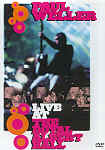

_This review was written by me for **MichaelDVD**, an Australian DVD review site that is no longer online. A capture of the site is held by the Internet Archive: **[browse it there](https://web.archive.org/web/20220217040146/http://www.michaeldvd.com.au/)**. It is reproduced here from my own copy of the site, as part of the record of what I have written._

## The film

I first got introduced to **Paul Weller**(web site [www.paulweller.com](http://www.paulweller.com)) through a band called **The Style Council**in which he was the lead singer and songwriter. The song _"Long Hot Summer"_shot up the charts in the long hot summer of good ol' 1983 and suddenly the band became hot property. I loved the _"Introducing"_album as well as _"Café Bleu"_- the songs seemed quirky yet whimsical and melancholic all at the same time. A few albums later, they outgrew me or I outgrew them (I can't quite decide which) and I relegated them (and Paul) to the "Where are they now?" bin until this DVD came along.

It's nice to know that Paul has basically pursued a solo career in the last 10-15 years or so and has a number of semi-successful albums to his credit. And of course, prior to the Style Council, Paul fronted **The Jam**, which was one of the more influential British punk/mod bands of the early 80s. If the songs on this concert are representative of his solo albums (unfortunately he does not play any Council music on this DVD) then it would seem he has managed to mix his soul influences (evident during The Style Council period) with a harder rock base.

The track listing for this DVD is:

I quite enjoyed the songs on this concert, particularly _Back in the Fire_, _Porcelain Gods_and _Love-less_. It's nice to see **Steve White**from the Style Council days playing the drums along with 3 other band members (**Steve Cradock**, **Chris Holland**and **Edgar Jones**) making it a 5-man band. On most of the tracks, the band is accompanied by a 16-piece string/woodwind ensemble (which Paul calls an "orchestra") conducted by **Robert Kirby**. Fans of Paul Weller, even those who have not followed his career recently, will enjoy this concert.

## The video transfer

The concert is presented in widescreen format and is **16x9 enhanced**. It may have been shot for broadcast on UK digital TV which does support widescreen but not high definition.

In general, I quite like the transfer, as it seems to be reasonably sharp, detailed and with fully saturated colours. Many of the scenes look somewhat over-exposed due to the bright stage lighting resulting in some over-saturation and blooming effects. As is typical for a video source of a concert, shadow detail in poorly-lighted areas (such as the audience shots) is poor to mediocre, but good under the spotlights.

The video transfer rate was consistently high, and touches 10Mbps quite often, therefore it is not surprising that there are few MPEG artefacts to be found, apart from some very slight ringing around the "orchestra". Edge enhancement is evident throughout resulting in some halo effects around Paul but not annoyingly so.

This disc is labelled DVD9 indicating that it is a single sided dual layer disc (**RSDL**). The layer change occurs just before track 11 at **48:28** minutes. On my DVD player, it is mildly annoying as the DVD paused for slightly over 1 second as it searche

## The audio transfer

This DVD has two audio tracks: Dolby Digital 5.0 at 448Kbps, and Linear PCM at 48 kHz/16 bits. I listened to about half the concert on one track and about half on the other, occasionally switching between tracks using the "Audio" button on my DVD player.

The Dolby track is quite engaging with a very expansive and immersive soundstage. All 5 channels are utilised but most of the music is carried by the front left and right speakers, with the centre and rear channels relegated mostly for ambience. This is an excellent arrangement, as it allows most of the music to be produced by the front speakers which are usually the best speced in home theatre setups but at the same time taking advantage of all the other speakers.

Although the rear speakers are mostly used for audience noises and ambience, it was quite an intriguing (not to mention somewhat disconcerting) experience to hear the guitar coming out of the rear left speaker around **5:40**and also in the last track (_Woodcutter's Son_). The audience cheering at the end of track 17 is particularly strong in terms of aggressive utilisation of split surround effects and it does give me the impression of being in a large hall.

The PCM track in comparison has the soundstage collapsing to a more forward focus but is still quite expansive in it's own right. It is mastered at a lower level than the Dolby Digital track (about 5-6 dB lower) which may give the impression that it is inferior to the Dolby Digital track unless the levels are adjusted. However, the PCM track is sonically superior in terms of detail and accuracy. The strings and woodwinds sound very muddy and under-mixed in the Dolby Digital track (in fact, I was on the verge of criticizing the mixer for allowing the band to drown out the weaker sound of the acoustic ensemble). Switching to the PCM track turned out to be a revelation - the strings in particular sound sweeter and clearer and you can hear them in the background even during passages when the band is really loud. The difference in the strings between the two tracks is like hearing synthesized strings versus the real McCoy - it was that dramatic.

The PCM track also has a much tighter and crisper bass. In the end, it was hard for me to decide which track I prefered - I really liked the expansive soundstage of the 5.1 track but at the same time I loved the greater clarity and detail of the PCM track.

I did not detect any audio glitches or synchronisation issues.

## The extras

There are no extras on this disc, but the menus are at least animated and comes with sound (including the scene selection screens). The menus appear to be 16x9 enhanced.

## Region 4 versus Region 1

As far as I know, this disc is not available in Region 1. The R4 DVD is actually coded for Regions 2,3,4,5 and 6, thus it would be fair to assume that the DVD is the same the world over (apart from our poor North American cousins who will miss out).

## Summary

_**Paul Weller: Live at the Royal Albert Hall**_ is an enjoyable concert presented on a DVD with a superior video and audio transfer. The DVD has no extra features whatsoever but does have animated menus.

### [Ratings (out of 5)](../ReviewersGuide/RatingsGuide.html)

© [Chris Tham](mailto:ChrisT@michaeldvd.com.au) (read my [biography](../ReviewerProfiles/ChrisT.asp)) 21 January 2001

| Rating  | Score         |
| :------ | :------------ |
| Plot    | ★★★ 3 / 5     |
| Video   | ★★★★ 4 / 5    |
| Audio   | ★★★★½ 4.5 / 5 |
| Overall | ★★★★ 4 / 5    |
