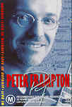

_This review was written by me for **MichaelDVD**, an Australian DVD review site that is no longer online. A capture of the site is held by the Internet Archive: **[browse it there](https://web.archive.org/web/20220217040146/http://www.michaeldvd.com.au/)**. It is reproduced here from my own copy of the site, as part of the record of what I have written._

## The film

I had mixed feelings when I agreed to review this DVD. On one hand, I was not sure I was "qualified" to do a review as (prior to this) I have never even heard of **Peter Frampton**, let alone listened to his music. I know some of you may find that difficult to believe or even imagine. Indeed, when I remarked "Who is Peter Frampton?" at work, I received unkind comments along the lines of "Which rock did you recently crawl out of?" and my retort of "Well, I'm not really into aging 70s rock stars ..." was _not_ appreciated. So, to fans of Peter Frampton eagerly reading this review to find out what the DVD is like, I would like to apologise up front for not meeting up to your expectations. I won't be able to comment on the level of performance or even compare the songs played against previous concerts or studio recordings. And I'll try my best to avoid making comments about aging rock stars!

However, on the other hand, having been disappointed by too many poor quality music DVDs, I was dying to be able to review a well-produced music DVD with, _gasp_, extras!!! Based on an HDTV-quality recording of a concert held on 17 July 1999 at the Pine Knob Music Theatre in Detroit, Michigan, the video transfer promises to be excellent. Similarly, I noticed that **Bob Ludwig** has been credited for the audio mastering. Those of you in the know will recognise Bob as being responsible for the mastering of literally hundreds of succesful albums over the last twenty years. So, in short, watching and listening to this DVD ought to be a real treat, and it is.

For those of you who know as little about Peter Frampton as me, here are some quick details. Born in England, he started his musical career in a band called **The Herd**. He subsequently left and co-founded a band called **Humbie Pie** (sounds like a nice Aussie name for a band doesn't it?) and pursued a solo career when the band broke up. His main claim to fame is ironically a live album called "**Frampton Comes Alive!**" I'm surprised the marketeers didn't capitalise on this and called the DVD "Frampton Comes Alive in Detroit" or something. I think he kind of faded into comfortable obscurity in the late eighties and nineties but he has released the odd album or two and it's nice to see that he still has a large number of fans as evidenced during the concert. The inside cover of the DVD has a really spunky photo of him with long hair and a bare chest that probably dates from the "Frampton Comes Alive!" days, but these days I think he looks more like Andrew Denton's older brother. Look at the photo of him on the cover and I think you'll know what I mean!

The song/track listing for the concert is:

So, did I ended up enjoying the concert? Yes, I did, and I even ended up recognising 1-2 songs (particularly _Baby I Love Your Way_). Peter looks relaxed and confident, there were no obvious fluffs in the band's performance, and all the songs were quite listenable. I really liked the guitar and keyboard solos. The concert was also shot well, no long lingering static shots, although I did find the constant changing of camera angles, panning and zooming to be a bit distracting at times. I wasn't quite sure why the DVD was rated M for Coarse Language but I did catch Peter saying "fking b*d" once.

## The video transfer

This DVD is presented in the HDTV aspect ration of 1.78:1 and is enhanced for 16:9 widescreen displays. It has been transferred ("downconverted") from an HDTV recording.

Given the HDTV source, it comes as no surprise that the video quality is extremely good, worthy of being labelled "reference quality". The picture is extremely sharp and clear, with near perfect colour saturation (taking stage lighting into account), and incredible amounts of shadow detail. I noted that Peter's T shirt never appears as completely black, but with subtle variations consistent with the lighting and the creases in the clothing.

The level of detail is good, but falls short of true HDTV quality (well, obviously). I can see the pattern of the rugs covering part of the the stage floor although the pattern looks a bit blurry. Similarly, I can see individual hairs on faces and arms, but can't quite read the labels on the knobs of electronic musical instruments. Whenever the camera pans across the audience, I can make out individual faces but the faces themselves are slightly blurred.

I hope I am not coming across as being too negative with my comments - the transfer quality is very VERY good, however there are limits to PAL resolution, and I would love to see how this concert would look like on true HDTV resolution. \[Someone I know has watched an HDTV broadcast of a **Barry Manilow** concert and he says not only was he able to make out the brand name of the microphone Barry was using ("Shure") but the model number which is in a much smaller font.\]

A good example illustrating the level of detail on this DVD can be had by examining **Bob Mayo**'s (from certain angles he looks a bit like Al Gore — the poor guy!) shiny watch over the course of the concert. Fairly early on in the concert (7:06) on my set up I can just make out the time on Bob's watch as 9:00pm as his hands fly across the keyboard on the bottom of the screen. Later on, we get another blurry look at his watch showing 9:30pm at 37:37 into the concert. A few minutes later we get a much clearer look and can easily tell the time on his watch as he does a guitar duet with Peter on stage. After that he must have taken the watch off because I noticed it wasn't on his wrist during the keyboard solo in track 12 (_Can't Take That Away_).

Again, given the HDTV source, there are no film artefacts evident (apart from a couple of minor lens focus issues), and virtually no MPEG artifacts. I can see slight ringing ("Gibb's effect") around the "Marshall" logo on the stage speakers and also around the drums but I'm being really picky here and the effect would be unnoticeable to anyone not using a front projection display. Certainly there are no MPEG effects at a level to cause annoyance. The downconversion from 60 Hz HDTV to 50 Hz PAL _may_ have introduced some ghosting, noticeably during fast pans (look at the ghosting of some of the audience's hands in 11:35). However, I cannot confirm that this is a true artefact present on the DVD (as opposed to being introduced by the line doubler/scaler in the projector).

There are no subtitles on the disc. Putting the lyrics to the songs on a subtitle track would have been a nice bonus, but that is a minor quibble.

This is a single-sided dual layer DVD (**RSDL** or "DVD-9"). The layer transition occurs at the end of Chapter 12, 66:20 minutes into the title. It is mildly annoying but probably located at a spot where the pause will do the least damage (just before the sta

## The audio transfer

This DVD comes with three audio tracks, Dolby Digital 5.1 (default), Dolby Digital 2.0 and DTS 5.1. I listened to both the DD 5.1 and DTS 5.1 tracks in their entirety, and to snippets of the DD 2.0 track. The Region 1 version of this DVD has a PCM stereo track in place of the DD 2.0 track. There are no commentary tracks, although I would have liked to be able to listen to Peter describing the history and background of each of the songs and how he felt the performance went.

All three audio tracks have been mastered at levels higher than that of most films, so you may want to keep your volume control handy. On my system, I normally listen to DVDs at a level of -10 to -12 dB and to CDs at -15 dB (0 dB on my system is supposedly set to the "reference level" but I find that to be too loud for most material). For this DVD, I had to set the volume to -18 dB for comfort, and -15 dB if I wanted a more "concert-like" level. The DD 5.1 track is mastered at a slightly higher level than the DTS track, so be prepared to adjust the volume control slightly (no more than 1-2 dB) if you are switching back and forth between the audio tracks for comparative purposes.

\[Incidentally, my DVD player prohibits me from switching between the DD and DTS tracks using the audio track button on the remote control, presumably as a safety measure to prevent the audio decoder from getting confused. If your player also does the same, the way to switch between the tracks is to hit the MENU button, navigate to the Extras menu, select the audio track that you want, and the concert will continue playing from where you left it.\]

I suspect that the higher than normal mastering level is possible because some amount of dynamic range compression has been applied during mixing. This is fairly typical for rock concerts, but kind of bothered me as I am more used to listening to jazz and classical music where such practice would have been frowned upon. It does mean that some of the subtleties of Peter's guitar playing have been evened out, which kind of disappointed me because there were some rather beatiful guitar solos that I would have preferred to hear in their original dynamics.

The surround soundstage for the 5.1 tracks has been arranged so that the music in general is coming from the front speakers, with the rear speakers carrying ambience information and audience noises. This is a fairly realistic arrangement, as it places you in the prime listening position with the stage in front of you and the audience all around you. I prefer to listen to concerts with the music coming from the front, but those of you who prefer a more aggressive surround setting with music coming from all speakers may be a bit disappointed with this DVD.

Fortunately or unfortunately, there doesn't seem to be any sound coming the centre speaker during the entire concert - the so-called "5.1" tracks are really "4.1". This is fortunate if your centre speaker is not as good at reproducing music as your front left/rights. It's unfortunate if your left, centre and right front speakers are identical and widely spaced (so that you are relying on the centre speaker to maintain a uniform soundfield).

Apart from level differences, the DD 5.1 and DTS 5.1 tracks are both extremely good and it would be hard to tell the difference between them. I don't think there are any compelling reasons to prefer one over the other and if I were only able to listen to one of them (ie. if I only had a DD decoder and no DTS) I would not be too concerned. Compared to the DTS track, the DD 5.1 track sounded a bit shriller and not as "solid". I also noticed that the rear speakers seem slightly more pronounced and decorrelated on the DD 5.1 track than on the DTS track. The effect is quite subtle, but with the DTS track I felt like I was part of the audience as I could hear the audience all around me. On the DD track I felt like I was sitting alone in the centre, but to the left and right sides there were two distinct groups of audience sitting some distance from me. My personal preference therefore is for the DTS track as I liked the more "solid" feel of the track and the more enveloping and subtle surround effect.

I also listened briefly to the DD 2.0 track, which is mastered at a lower level compared to the other tracks but still higher than average. Compared to the DTS 5.1 track, this sounds even more insubstantial than the DD 5.1 track. Also, the lack of ambience and surround information in the rear speakers make this track sound almost flat and two dimensional by comparison. Funnily enough, it seemed slightly more bass heavy compared to the DD 5.1 track. I would have liked to listen to the PCM stereo track as I suspect it will sound more dimensional than this track.

As far as I can tell, there are no audio synchronisation issues with this DVD.

## The extras

In general, this DVD has a reasonable number of extras — definitely above average for a music DVD and probably slightly under average for a movie. The only additional extras that I would wish for that is not present would be an audio commentary and subtitling the lyrics to each song.

### Menu

The Menu is 16:9 enhanced and animated (spinning gears with moving thumbnails). It is accompanied by an audio snippet from the concert

### Video Interview with Peter

This is a reasonably extensive interview (26:46 minutes long) and is surprisingly 16:9 enhanced (they must have shot it using a spare HDTV camera). Peter talks about his career, and how he dealt with being famous, amongst other things. He answers questions posed by a hidden interviewer. Based on this interview, I really warmed to him — he comes across as an easy-going, unpretentious and general all-round nice guy. Unfortunately the documentary itself was only shot from the one camera angle, so after a while I lost interest.

### Biography

This is a set of text stills featuring a short biography of Peter Frampton, written from the first person (autobiography) perspective.

### Discography

This is a set of stills featuring the covers of Peter's albums. The quality of the stills do not seem as good as the same set of stills featured at the beginning of the concert.

### Notes

This is just one still showing the contact address for the Peter Frampton "Family of Friends" Fan Club and the URL for the website ([www.frampton.com](http://www.frampton.com)).

## Region 4 versus Region 1

The Region 4 version of this disc misses out on;

- PCM stereo (2.0) audio track

The Region 1 version of this disc misses out on;

- Dolby Digital 2.0 audio track

Both versions are equally good, and the Region 4 version trades off a high quality PCM stereo soundtrack in return for the higher video resolution of PAL. Choose depending on whether you value audio or video quality higher.

## Summary

**Peter Frampton Live in Detroit**, is one of the best rock concerts I have seen presented on an excellent DVD. If you are a fan of Peter Frampton, my advice is to rush out and buy a copy immediately — do not pass Go, do not collect \$200 (but take your wallet or at least a credit card with you!). Even if you are not a fan, or haven't heard of Peter before (like myself), you may want to buy or rent it to experience how music DVDs _should_ be made.

The video quality is superb, and is of reference quality.

The audio quality is superb, and is of reference quality, although it seems to have been derived from a mix with significant dynamic range compression.

The extras are satisfactory. A commentary track by Peter Frampton or putting the song lyrics on a subtitle track would have made the DVD perfect.

### [Ratings (out of 5)](RatingsGuide.html)

© [Chris Tham](mailto:ChrisT@michaeldvd.com.au) (read my [biography](../ReviewerProfiles/ChrisT.asp)) 17 December 2000

| Rating  | Score         |
| :------ | :------------ |
| Plot    | ★★★★★ 5 / 5   |
| Video   | ★★★★½ 4.5 / 5 |
| Audio   | ★★★★ 4 / 5    |
| Extras  | ★★★★ 4 / 5    |
| Overall | ★★★★½ 4.5 / 5 |
