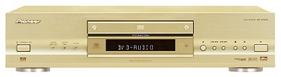
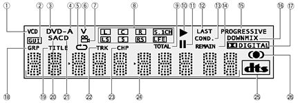
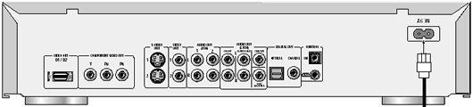
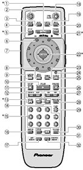

_This review was written with **Tony Rogers** for **MichaelDVD**, an Australian DVD review site that is no longer online. A capture of the site is held by the Internet Archive: **[browse it there](https://web.archive.org/web/20220217040146/http://www.michaeldvd.com.au/)**. It is reproduced here from my own copy of the site, as part of the record of what I have written. The review carries no publication date; the date shown is the timestamp on my own copy of the page._

by **Tony Rogers**, with additional comments from **Chris Tham** (prefaced with a **CT:**)

I've read a number of DVD player reviews that describe the player under test as a "_play everything_" player. I was tempted to do the same here, but I do have a short list of optical media that this player won't play - it doesn't play Photo CDs, or Nuon-enhanced discs, or CD-I, and it won't play a Playstation game (well, it they can play our DVDs...). Heck, it hasn't the faintest idea of what to do with a Windows XP installation CD (suggestions from the Linux crowd about the correct use of an XP CD are **not** required). But this player will play more types of optical media than any other player I know. The fact that it does it with style and panache is a bonus.

A declaration of personal interest is in order - I own two of these players, so read my review in that context. This model was released in Australia in February, and I got one then (a pure R4, because that was all that was available). I bought a second one when there was a delay on availability of a region mod - the second one is a Pioneer "green dot" model, and that's the same kind that we were lent to review.

A while back, we reviewed the [Pioneer DV-533K](http://www.michaeldvd.com.au/HardwareReviews/Pioneer533/Pioneer533.html). That was the first of the x33 models to appear in Australia. Some time later, the 633 and 733 appeared. The feature set gets progressively richer as you go up the range - the 533 is an excellent standard player, the 633 adds progressive video and DVD-Audio, and the 733 is the current top of the line, with numerous extra features (we'll come to those...). All three support:

- DVD-Video (am I allowed to say "duh"?)
- CD Audio
- CD-R
- CD-RW
- Video CD
- Super Video CD

The 633 adds support for DVD-Audio, and progressive video (on NTSC only, as usual). The 733 adds support for SACD. Both the 633 and 733 specifically state support for DVD-R and DVD-RW - that's nice, because although DVD-R is supposed to fairly compatible with most players, explicit support means we can complain if it doesn't work.

The 733, to the best of my knowledge, is the only player (at least in Australia) that supports both DVD-Audio and SACD formats. And that's important. DVD-Audio and SACD are the two big players in town as far as high resolution audio goes. These are the two contenders for replacing CD as your music format of choice. Yup, we have another Betamax versus VHS situation. Sony is pushing SACD, just as they pushed Beta, but with one important difference. This time they have a whole heap of material to publish on their format of choice (they didn't buy those record labels for nothin'). DVD-Audio is backed by most of the rest of the industry, and seems to be popular with artists not affiliated with Sony. My gut feel is that neither format is going away in a hurry, but you'd hate to spend a fortune on a player only to discover that it lost the format battle and you're not going to be able to get new discs. That's why I feel particularly happy to own one of these - means I can buy discs in either format, and play them. It also means I don't have to worry about a favourite artist only being available in a format I can't play.

But the extra formats aren't the only innovations on this player. It also sports the first 12 bit 108MHz video DACs I've seen, as opposed to 10 bit 27MHz on normal players, and 10 bit 54MHz on progressive scan players. It also has some interesting noise reduction processing (which the purist, or DVD reviewer, can disable). It offers some more common features, too, like on-board Dolby Digital and **dts** decoders (it has to have a 6 channel output, anyway, for the DVD-Audio and SACD support, so the decoders are an easy thing to include). It's also the first high-end player I've owned with good support for CDs filled with MP3s.

If you are looking for information about the 733 on overseas web sites you need to know that Pioneer produce this unit under a number of names, with slight variations. In some countries it's the DV-47A Elite (cool name!), other places it's a 747 (a jumbo jet?). Some variations have a SCART output (those models seem to be missing the digital video output). It's interesting to note that the manual (which covers the 733 and 47 Elite) specifically limits DVD-R, DVD-RW, and Super Video CD support to the 733.

**CT:** Hi, the appearance of the first affordable no-compromise (I'll explain what this means later) "universal" disc player from a major manufacturer is a momentous enough occasion that you, the lucky reader, will get the benefit of comments from two reviewers instead of one. All my comments are intended to be read alongside Tony's and complement his views (we don't necessarily agree on all things, but I think our opinions of this player are broadly similar). Tony is so impressed with this player he has been trying to get me to buy one for some time now, and I think roping me in to help to the review may be a subtle ploy to warm my heart towards it. Let's see if it works!

What do I mean by "no compromise"? There has been a few other "universal" players released to date, mostly high-end (read: expensive) limited availability models, but as far as I know these have suffered from one fatal flaw: they have digital-to-analogue (D/A) converters that can only handle PCM, so the DSD bitstream (2.8 MHz/1 bit) from SACD is converted to PCM. This is completely unacceptable to me as this negates any supposed advantages of the DSD format (chiefly increased purity through the avoidance of the decimation stage of A/D conversion plus the avoidance of reconverting back to a 1-bit format which sigma-delta D/A converters do). The closest analogy in DVD-Video would be a player that plays dts audio tracks by first converting it to Dolby Digital (no such player has been released to date). The 733 avoids this by using recently released latest generation D/A converters capable of converting both PCM and DSD and licensing the SACD decoding chipset from Sony.

## What's In The Box

Pioneer have clearly considered what happens when you succumb to the beauty of this unit, buy it, and bring it home. They know that you may need to justify it to your significant other, so they've gone to the trouble of tucking five DVDs into the box with the player so you have something to show immediately (that's very thoughtful). They also include five free DVD rentals, too, for after you've watched the included discs. The included titles depend on when you buy the unit - my first unit included _**Snow White**_ (single disc version), but the review unit had _**Atlantis**_ instead. There's a nice range of titles included, so you're likely to find something you feel like watching.

Also included in the box with the player are the remote (batteries **are** included), basic cables (enough to get connected), a power cord, and a comprehensive instruction manual.

This player is only available in gold (sorry, champagne) in Australia, like the rest of the x33 range. I don't mind that now - I think this player's earned the right to be a bit flashy. I prefer black equipment (my Pioneer 737 is black) in my home theatre, because I run a CRT projector in a darkened room, and some gold units reflect a bit more light than is desirable. This one is nicely matte, so it isn't too bad.

**CT:** I agree with Tony, this is a very pretty looking unit. The design is understated with a quiet elegance and a "high end" feel that lifts it well above the typical look you get with mid-fi electronics. From the outside, the player looks reasonably solid and well built and makes my aging Pioneer DV-626D look cheap and tacky in comparison.

The following "free" discs are included with the review unit: _Atlantis_, _Jungle 2 Jungle_, _Snake Eyes_, _The Three Musketeers_, and _While You Were Sleeping_. To me, this is a good set of titles, and by amazing coincidence or luck are all titles that I would not mind watching, and don't own (reviewers tend to amass a huge collection of DVDs so you can guess how unlikely this is).

Opening the player reveals a fairly clean layout. There are at least four circuit boards connected via ribbon cables: power supply, digital processing, audio/video and SACD decoding. I'm surprised that SACD decoding has been separated onto a board of its own, perhaps the entire board is based on a Sony design. The most prominent chip on the board is a Sony CXD2753R - this is the same chip that Sony uses on its own SACD players.

On the audio/video board I noticed a large Pioneer chip labelled "PM0033A" - this is Pioneer's proprietary progressive scan converter (I'll talk more about my impressions of the effectiveness of the progressive scan implementation later).

The video DAC is an Analog Devices ADV7300AKST 12-bit 108 MHz and the audio DACs consists of three CS4392KEP 24-bit 192 kHz stereo DACs. 55320 op amps are used for the analogue stage. The analogue circuitry is nothing fancy - typical mid-fi components. It would have been nice if Pioneer had used the higher speced CS4397 and better quality op amps and associated discrete components.

Incidentally, the unit reviewed was manufactured in March 2002 and bears the serial number BCMP000177CD. The unit is marked as Region 4 on the back, and the firmware version is "R4 V1.076(16) AV1 6.0/0.3"

## Front Panel

The front panel offers a useful set of controls. There's a power switch (soft - switches the unit to standby) on the far left, and a single row of buttons on the right: an open/close button (unit switches on if in standby and opens tray - handy), forward and reverse scan/skip, stop, pause, and play buttons. This is enough to operate the player when you're using it as an audio player (I've owned CD players with nothing more than these controls). For video, you'll probably want more control, and that's what the remote is for.

Also on the front panel are three indicator lights, showing digital data on/off (lit when off), Legato Pro on/off, and display on/off (lit if the display is off).

The centre of the front panel has the disc tray, with the display immediately under it. The display can be dimmed in steps, should you find it distracting (I don't, but my player sits off to the side, rather than under the screen) - if you turn the display off altogether a separate indicator lights up to let you know that it isn't broken (don't laugh!)

Two criticisms I had of the Pioneer 737 were that its power switch was a hard switch (only way to put unit in standby was via the remote), and it didn't wake up when you pressed the Eject button. I'm pleased to see that both these deficiencies have been fixed in the 733. I'm happy to believe that they were fixed because of my feedback to the local distributor (please don't disillusion me).

**CT:** The front panel has a minimal set of controls, but they are too small for my liking. I would have preferred additional buttons to allow you to do basic navigation (particularly for DVD-Audio discs) without using the remote control - but a lot of people like the minimalist look. Also, I would prefer a headphone output socket for late night listening. But these are minor criticisms and in general the front panel is well designed and functional.

The fluorescent display has the following elements:

As you can see, the player will display what type of disc is currently inserted (1-6), type of audio signal (17,25), what speakers are currently "active" in the audio track (8) plus an indication of whether the video is currently in progressive mode (15). I would have preferred genuine dot matrix for the alphanumeric readout rather than the segment-based characters (24) but this is a very functional and easy to read display. The display is bright and bluish, but some of the segments are red.

## Rear Panel

The back panel has a full complement of sockets. About the only thing missing is a SCART socket (I dislike SCART, so I'm happy it's not there. If you desperately want SCART, I suggest you look into acquiring a European model). Reading from left to right we see:

- a D Video socket - this appears to be an alternative connector standard for component video out - it is not commonly used in Australia - it is not a DVI output socket
- component video sockets - standard RCAs. Both progressive and interlaced component output use the same sockets
- two S-Video sockets - useful if you want to run two monitors, or one direct and one via the HT amp
- two composite video sockets - useful, I suppose, if you want to run a long cable (S-Video and component degrade fairly quickly with cable distance), but I'm not sure why you might want two of these.
- two stereo audio outputs on pairs of RCAs
- a 5.1 output on six RCAs - this is where you get the DVD-Audio and SACD outputs, and where you find the output of the on-board Dolby Digital and **dts** decoders
- an optical digital audio output - standard TOSlink - useful cover built-in
- a coax digital audio output - standard RCA
- two minijacks, marked Control In and Out - these are part of a Pioneer remote control system - useful if you have more Pioneer gear
- AC power in - a socket for a standard power cable (the electric razor kind, not the PC kind) - I like socketed mains cables

The optical socket deserves a small mention for a feature found on only a few pieces of home theatre equipment. Rather than having a small plastic plug protecting the optical output from dust, this socket features a built-in shutter - unplug the cable and it closes. Much better idea - I wish more equipment had this - those little plugs are very easy to lose.

This is a sensible back-panel arrangement - all the video connections on the left (in descending order of quality!), then all the audio connections. Every connection is clearly labelled. All the connectors (except the optical and the minijacks) are gold-plated, which looks pretty - the value of the gold plating in reducing contact resistance is an open debate, but it does resist tarnishing, though.

Oh, I want to mention an undocumented socket, too. On the far left of the back panel there's a small slot in the back panel. It's unlabelled, and you can easily overlook it. It's there to provide access to a socket on the main board inside - the firmware can be updated by plugging something into this socket. Neat.

## Remote Control

I have to admit that I didn't much like this design of remote when I first came across it on the 737. Strangely, I'm much happier with it on the 733, perhaps because the functions of the 733 match the design better, and because the 733 seems to respond more rapidly and positively. Note that this remote is the same as the one for a number of the Pioneer players, so it can be a pain to have more than one player in the room at a time - I leave my 737 switched off (maybe that hard power switch has finally proven useful?) most of the time. Perhaps Pioneer needs to provide support for multiple players? Oh, the remote for my black 737 was black, and this one for the gold 733 is gold-coloured. Other than that, the two are identical.

The backlight (7) is easily operated, but it only illuminates two rows of buttons on the remote, which is far from sufficient. Having used the remote extensively, I can operate it in the dark quite readily - the large dial (22) in the middle, and the sculpted buttons for functions like Chapter Forward/Back (12), make it fairly easy. They've gone to quite a bit of trouble to ensure that the buttons can be told apart by feel.

Most buttons are labelled with legends in English, rather than using cryptic symbols - I've never decoded all of the symbols on a Sony or Loewe remote, for example.

The layout is logical. Power (2) and open/close (18) are right at the top, where you're unlikely to hit them by accident (a huge improvement over my immediate past player, which put Open/Close right next to Enter). The next row has Display (4), Audio (3), Subtitle (19), and Angle (20) buttons - these do related things, and are very handy when reviewing. Next row has Setup (5) (lots more about that later), Menu (1) (nice big button - I like that), and Top Menu (21) (useful on DVD-Audio discs, I've found).

Then comes the big round thing (22). Now this is not quite what you might think. The wheel provides jog control. It operates in two modes, controlled by the Jog button (25). When Jog isn't lit (24), moving the wheel puts the player into a different speed - the player supports a wide range of speeds, ranging from 1/16 normal speed, through to a very high scan speed (looks like about 32x), and it supports the same speeds both backwards and forwards. When Jog is lit, the wheel provides exact frame motion - one click is one frame - this is very cool for a reviewer looking for a film artefact, for example.

In the centre of the wheel is the joystick. This provides up/down/left/right cursor control, and pressing it in is the OK button. I can operate this, but I don't really like it. I can cope with using the joystick in place of arrow keys - that's fine. It's the fact that the only Enter / OK button on the remote is the top of the joystick - to press Enter you must press the joystick into the remote. Most of the time I can do it, but every so often I bump the cursor up or down before hitting Enter - that's really annoying. If there were a separate Enter button instead of (or even in addition to) the joystick I'd be a lot happier.

Below the round thing we find a row of control buttons, then the standard play controls. Play (10) is a nice wide button (that's good), with Stop (11) and Pause (26) on either side. Next row down are two sculpted buttons - the left one is Chapter Skip forward/back (12), while the right one is fast forward/back (27) - these work well. Next row down has frame advance/slow motion (14), but I always use the wheel for this. Below that we get the number pad (15), then a series of function that I never use - you can program the player to play back tracks at random (16), or to loop a section (31) - the usual sort of thing.

The remote works well at a variety of angles.

All up, it's a functional remote. I find it comfortable to hold and operate.

## Manual

The manual is very good indeed. It is 72 pages long, printed clearly on decent quality paper, and it's all English (not 10 pages of English and 60 pages of other languages). It's well-written, uses plenty of well-designed graphics, and actually explains the features so you can use them. Exemplary! It's also small enough that you can hold it in one hand while manipulating the remote in the other - that's a pleasant rarity.

There's a useful table near the end (pages 66 and 67) - a complete list of possible language codes (136 of them!), from Afar to Zulu (I'm not making this up - those are real!) Sorry, no Klingon.

## Set-Up Menu

This machine offers two ways to setup. You can use the Setup Navigator, which leads you by the hand and sets the most important parameters, then sets everything else to sensible defaults. But where's the fun in that? Running through the Setup Menu by yourself is more fun, and there's a heap you can mess about with! If you really mess things up, you can always reset the player (see p65 of the manual), clearing all settings to factory defaults - yup, a player you can re-boot.

The Setup Menu is organised logically enough, with two pages for audio settings, two for video settings, one for language (more than you might expect), and one for general settings. I've always found Pioneer's setup easy to navigate, and this one is no exception.

The first audio page concentrates on conversions. You can set (separately) conversions from Dolby Digital to PCM, **dts** to PCM, and MPEG to PCM - I use the last, because my amplifier doesn't have an MPEG decoder. This page also lets you switch off digital output, and what part of an SACD you want to play.

The second audio page concentrates on settings. There are a number of features you can switch on or off. This is also where you set up the speaker layout (needed for the 5.1 output).

The first video page is the basic setup - 16x9 or 4x3, whether component video is interlaced or progressive, what kind of SVideo is supported (I have no idea what S1 and S2 are, but you can choose), whether frame search is enabled, and whether the screen saver is enabled. The frame search is very cool, and I recommend switching it on (it's off by default).

The second video page is settings. You can set the background colour, the kind of still picture, whether the on-screen display and angle indicators are enabled. And there's one other item, one that looks innocuous, but isn't. This is labelled Video Adjust. It allows you access to several controls over the video output. These are called:

- PureCinema
- YNR (Brightness Noise Reduction)
- CNR (Chroma Noise Reduction)
- MNR (Mosquito Noise Reduction)
- BNR (Block Noise Reduction)
- Sharpness High
- Sharpness Mid
- Detail
- White Level
- Black Level
- Black Setup (0 IRE vs 7.5 IRE)
- Gamma
- Hue
- Chroma Level
- Chroma Delay (allowing for misaligned Y and C signals)
- Memory (which memory to store these settings in)
- Progressive Motion (fast-slow)

That's a lot of control over the behaviour of the player... I liked the fact that you can set levels on these, rather than simple on/off. These are for the people who wants lots of control.

The language settings page is more complex than you might expect. Yes, it lets you set the language of the player's menus (that's what you expected, right?), but there's more. It also lets you control the default languages for audio and subtitles, and whether they are selected automatically (the player can automatically select the French soundtrack, or French subtitles, if you want). You can also select the default language for the DVD (the menus). Lots of control here.

The general page is where you'll find the controls for the setup menu itself (expert versus basic), parental control (does anyone really use this?), and a few sundry functions.

As you may gather, this player offers more than the usual in terms of control over its functioning. I like that.

Don't know what some of these things mean? That's cool - leave them set to defaults - every default is a sensible choice.

## Video Playback

I am very impressed with the quality of the video output. This can probably be (at least in part) attributed to the 12 bit processing. This player's lesser siblings, the 533 and 633, are already known to produce excellent picture quality; this player is better still. The limits to the video quality really lie in the DVD (and your display) when you're using this player. I have compared it with a variety of players, including a very expensive one, and I consider it the best I've seen.

I did all my testing using the component output in interlaced mode. I tested both SVideo and composite briefly (they work), but I'm not sure how much use they'll get - I suspect this player will mostly appeal to people with higher-end equipment, so I suspect the component, and perhaps digital video, outputs will get the most use.

Uniformity is a strength of this player - swathes of a single colour show no variation or chroma noise. Black screens show no low-level noise. If you see noise in the picture, it's been recorded on the DVD.

The player offers the option of 7.5 or 0 IRE black threshold, so you can use the Pluge Test as part of your setup process.

Discs load fairly quickly, which is good. The player determines the disc type rapidly, and displays it. The action it takes next depends on the disc type. For video discs (DVD-Video, Video CD, etc), it starts playing. Interestingly, it does not automatically start playing audio discs - it politely waits for you to press Play - I like that, even though I wasn't expecting it.

This player supports multiple fast forward and rewind speeds. There are two speeds for all manner of CD formats and SACDs; there are three speeds for DVDs (labelled 1, 2, and 3) - they don't specify what these speeds are, but my (highly technical) evaluation is that they are roughly "_good for short distances_", "_good for medium distances_", and "_wow, that's fast_" (perhaps 2x, 8x, and 32x, at a guess).

It supports multiple slow motion speeds, too, but these are specified: 1/16, 1/8, 1/4, and 1/2 normal speed. They are not smoothed, but they are not especially jerky either.

It supports a really neat extra feature - frame by frame (backwards and forwards) via button or jog wheel. The latter is much better, for it allows excellent control. This is a perfect tool for DVD reviewers, because it makes it easy to locate the exact frame containing a particular film artefact, and pausing on that frame to study it. When frame search is enabled, the time display shows frame numbers (but only when paused or using frame by frame motion) - that means you can return the an exact frame if you note down its location (minute, second, frame number). I suspect this feature is disabled by default because it makes Search mode a bit confusing - normally one enters minutes and seconds into Search mode, but this changes to minutes, seconds, and frames when this feature is on. By the way, this also makes it easy to tell if a disc is NTSC or PAL - the frame counter will go from 0 to 29 on NTSC discs, and 0 to 24 on PAL.

Layer changes are difficult to detect on this player (assuming a well-made DVD). I found the only way to detect the layer change reliably was to display the time indicator on screen - the indicator goes off momentarily (less than a second) during the layer change. Subjectively, I'd say this is one of the faster layer changes I've seen.

The review player arrived in a carton marked Region 4, but there was a green dot on the carton (Pioneer are marvellously consistent in this area). I checked the region compliance, and I have to report that it is badly broken. It completely failed to reject Region 1 and 2 discs, and didn't even notice RCE discs - it simply played them. I have yet to find a disc this player will reject, but I only have Regions 0, 1, 2, and 4 on hand (I have a plan in hand to get a Region 3 disc, but I'm not sure about getting discs from regions 5 and 6, let alone 8).

This player can produce progressive scan component video, which is good if your display can handle it. The scaler I'm using does similar things, but it cannot accept a progressive input, so I was unable to test this feature. I used the 737 in progressive mode on my previous projector, and it produced a noticeable improvement in picture quality. I'd expect this unit to do even better. Rumour has it that certain after-market region mods support progressive PAL as well as progressive NTSC - that could be rather nice, if your display will support it. The manual suggests that the 47A Elite already provides progressive PAL.

The player uses the Mitsubishi M65774BF8 MPEG Decoder. This decoder, like most, does have the infamous chroma bug - you can see it if you look really hard at certain scenes (the most infamous is in Chapter 4 of Toy Story). In general viewing you are extremely unlikely to notice it (heck, it took the experts years to discover it!).

**CT:** The video playback quality is gorgeous, and for static images is at least comparable to the Sony DVP-NS905V player I reviewed a few weeks ago. I suspect this is because they both use the same Analog Devices ADV7300A Video DAC, which oversamples the video signal eight times and applies "noise shaping" techniques (pioneered in sigma delta converters for digital audio and only recently introduced into video processing) to shift the quantization noise generated by D/A conversion into frequencies above the sampling rate.

Unfortunately, I was not able to directly compare between the two players, but it seemed to me that this player may even have an edge in terms of picture quality, detail, and colour vibrancy. However, I felt that slow pans were not handled as smoothly as on the DVP-NS905V - they seemed to be slightly jittery though much smoother than my aging Pioneer DV-626D.

The NTSC progressive scan capability of this player (PAL progressive is not supported "out of the box") can be switched on and off using the Setup menu, but only when the disc is stopped and not on the fly, making A/B comparisons difficult. I am disappointed by the quality of the progressive output, since I can detect occasional combing errors - mainly when navigating through menus but even during watching a movie (_Toy Story_). It looks like Pioneer has not improved the progressive scan implementation on this model over the previous generation in terms of correctly handling 2/3 inverse pulldown and differentiating between film and video modes.

I also tried _GalaxyQuest_ (R1 dts) - a known problem disc in terms of incorrect usage of the progressive flag in the animated menus and theatrical trailer - and the player combed however was smart enough not to remain in film/video mode exclusively, however it just wasn't quick enough switching modes. If you have a display capable of line-doubling/deinterlacing or if you have an external line doubler, I would recommend not using the progressive scan output of this player.

Incidentally, the video settings feature of this player allow you to "tweak" settings for progressive scan. I tried changing them, in particular switching between "Auto1" and "Auto2". Different settings will cause some combing artefacts to disappear (only to be reappear elsewhere) and there was no combination that resulted in no combing artefacts.

I noted the following warning in page 48 of the manual and wonder whether it refers to Pioneer acknowledging potential issues with progressive scan and the existence of the chroma bug:

CONSUMERS SHOULD NOTE THAT NOT ALL HIGH DEFINITION TELEVISION SETS ARE FULLY COMPATIBLE WITH THIS PRODUCT AND MAY CAUSE ARTIFACTS TO BE DISPLAYED IN THE PICTURE. IN CASE OF 525 PROGRESSIVE SCAN PICTURE PROBLEMS, IT IS RECOMMENDED THAT THE USER SWITCH THE CONNECTION TO THE “STANDARD DEFINITION” OUTPUT. IF THERE ARE QUESTIONS REGRADING \[sic\] OUR TV SET COMPATIBILITY WITH THIS MODEL 525p DVD PLAYER, PLEASE CONTACT OUR CUSTOMER SERVICE CENTER.

## On Screen Display

When a disc is playing you can press Display to summon the "in-play" display. This shows, at first, the current state of playing, the current title and chapter, elapsed time, time remaining, and total time. These last two are replaced, if you hit Display repeatedly, with time elapsed and total within chapter, then with time remaining and total within chapter, then with a transfer rate bar, and then the display disappears again. I like the idea of displaying all three of elapsed time, time remaining, and total time - handy.

When you press Audio, Subtitle, or Angle, an appropriate on-screen display appears. The displays use full words for the languages they recognise (English, rather than ENG or EN), which is civilised. The audio display also mentions the format (Dolby Digital 2Ch, for example).

When confronted with a CD filled with MP3 files, the Menu button brings up a full-screen MP3 Navigator, which is a rather nicely designed tool to allow you to select the files to be played, and the order in which they should be played. It's nicely put together, and perfectly functional - it's a text-based application, but there's nothing wrong with that.

## Standards Conversions

Although I didn't test it, this player offers the ability to convert NTSC into PAL-60, but no conversion from PAL to NTSC. I would normally expect someone with a player of this calibre to have a display capable of showing both NTSC and PAL, so I don't imagine this feature getting a lot of use.

## CDR & Video CD

This player digested CD-Rs and Video CD (I tested _**Joe vs The Volcano**_ - commercially pressed Video CD bought in Singapore) without breaking stride. The only thing it didn't handle perfectly was a multi-session CD-R - it could only see the first session, but that's not surprising - most players are limited to the first session.

This player is specified as supporting CD-R, CD-RW, DVD-R, and DVD-RW. Rather an improvement from earlier DVD players which weren't specified as supporting CD-R at all, and could be fussy about which colour media they'd accept.

This player supports CD-Audio, CD-Data (MP3), Video CD, Super Video CD, DVD-Video, DVD-Audio, and SACD. It will play most discs containing sound or video.

**CT:** I personally tested the following types of discs and can confirm they play without a hitch:

- Commercially pressed Video CD (_Man With The Golden Gun_, purchased in Hong Kong)
- Video CD created on a CD-R using Nero
- MP3 CD containing over 100 songs (all 128 kb/s) spread across folders
- MP3 CD-R containing over 100 songs in the root directory (all 128 kb/s)
- Multi-session MP3 CD-RW containing over 100 songs in the root directory (only the first session was recognised)

The manual warns that the player only recognises the first 250 MP3 files on a CD-R - this seems generous. It does not seem to recognise ID3 tags but will display the first 8 characters of the file name (minus the .mp3 extension) as the title of the track. The manual also warns (on page 9) that the player may not recognise some variable bit rate (VBR) MP3 files, however it did not have any difficulties playing a selection of VBR files that I threw at it - with compression quality ranging from 1% to 100%. Constant bit rate MP3 files must have a bitrate of 96 kb/s and above, otherwise the player will skip the track and say "Unplayable." The player does not recognise WAV (PCM) or WMA format files.

## Audio Playback

The sound from this player is very good - as you'd hope for a player that is intended for use with high resolution audio. I'm sure you'll find audiophiles who will deride the sound as sterile, or clinical, but I like my sound uncoloured. One thing I must say - I found the sound output very detailed (probably courtesy of the 192kHz audio DACs which are rapidly becoming standard).

You can choose whether to have Dolby Digital and **dts** audio output as digital, converted into PCM, or decoded by the internal decoder. For MPEG you can output it as digital, or convert it to PCM. The internal decoder is excellent (not something I'd expect - internal decoders are usually inferior to the ones in amplifiers) - you could probably use the 5.1 output all the time, rather than using the digital output for Dolby Digital and **dts**.

I noticed, while listening to a DVD-Audio disc, that the silences between songs are utterly silent. I think that's partly courtesy of 24 bit resolution - the silence is 256 times quieter than CD.

**CT:** I must say this is the only aspect of the player where Tony and I don't really agree. I found the sound quality of this player to be variable depending on the format, but generally mediocre and disappointing.

Let's start with the good qualities. I thought the internal Dolby Digital decoding was quite reasonable - better than the mediocre decoding that I experienced on the Sony DVP-NS905V as well as my Pioneer DV-626D but still below par compared to the processing on my Denon AVR-3300 (low level detail tends to be submerged). MP3 playback was fairly decent, sounding fairly close to the CD equivalent.

Super Audio CD performance on a few SACDs that I tried (**Celine Dion** - _All The Way ..._, **James Taylor** - _Hourglass_, **Warren Bernhardt** - _So Real_, **Jerry Goldsmith** - _Film Music_) was reasonable compared to my reference player, the Sony SCD-XA777ES. I would describe the sonic character of the player as "loose and relaxed." The music was pleasant enough to listen to, but lacks punchiness and "slam" in comparison to the XA777ES.

**dts** decoding was a mixed bag - I was very impressed with the **dts** decoding on the soundtrack to the R4 release of _Gladiator_ where it sounded much fuller and dynamic than on the Denon receiver. However, the **dts** decoding on _Atlantis_ ("free" title included with the player) was disappointing and sounded somewhat flat, uninvolving and lacking in low level detail compared to the decoding done by the Denon.

I was also able to test out a DVD-Video disc containing a 96/24 PCM audio track (_Casino Royale_, Classic Records) to compare between 96/24 processing on the player and the Denon receiver - these discs are sometimes called Digital Audio Discs or "DAD"s. The player sounded slightly harsher and less punchy compared to the Denon receiver.

Now for the bad points. I found the CD playback quality to be dull, lifeless, uninvolving, and lacking in "punchiness" and dynamics, even with "Legato Pro" (upsampling), "Hi Bit" (word expansion from 16 to 24 bits) and "CD Digital Direct" setup options turned on.

Unfortunately, DVD Audio playback quality was not significantly better. PaulC dropped by with his Toshiba SD-900E and we all agreed that the 733 sounded somewhat "dull" and "lifeless" compared to the 900E - a common expression being bandied around was "something seemed to be missing" on the disc that we did the comparison with (**Pat Metheny Group** - _Imaginary Day_). I felt even the CD version on the SCD-XA777ES seemed more listenable than the "Advanced Resolution Stereo" track on the DVD-Audio on the 733 - despite the loss of resolution. On the plus side, however, the player will downsample MLP 2.0 tracks to either 48/24 or 44.1/24 on the digital out - at least on the few discs that I tried.

**TR**: Chris's comments made me re-visit the audio performance of the player. I realised, to my chagrin, that I hadn't listened to any CDs on it (the CD-Rs I tried were filled with MP3s, and I don't expect MP3s to sound all that good). So I listened to a CD, then another, and another, comparing the sound with that of a dedicated CD-only player. And I was disappointed. Oh, it sounds perfectly acceptable, but there's some slight degradation to the dynamics - the attack on the opening notes of a string instrument can sound a little blurred, for example. I wonder if there's some noise reduction circuitry at work (and can it be removed?)? I don't like to admit that I'm wrong, but I must - Chris's criticism here is valid.

We've talked about this at some length, and found it interesting that Pioneer have announced a new version of this player in the US which features different audio DACs - perhaps this is an effort to address this problem?

## Disc Compatibility Tests

Apart from the multi-session CD-R I mentioned above, I don't think I've found an unscratched disc that can trip this player up. I've run a heck of a lot of discs through three different 733s (my own two, and the review loaner). It will play some scratched discs without problems, and will try to work its way through even bad scratches. _Specific Tests_

| **Disc** | **What Is Tested** | **Results** |
| :-- | :-- | :-- |
| The Matrix R4 Follow The White Rabbit | Tests active subtitle feature, seamless branching, ability to load hybrid DVD/DVD-ROM and audio sync. | YesYesYesYes |
| Pulp Fiction R4 Audio Sync | Opening scene tests audio sync. | Yes |
| Terminator: SE R4 Menu Load | Tests ability to load complex menu | Yes |
| Independence Day R4 Seamless Branching | Tests ability to handle seamless branching (Chapter 3) | Yes |
| The Patriot R1 RCE | Tests ability to handle RCE protected DVDs in Auto multizone mode (if applicable). | Yes |

The Patriot R1 and Charlies' Angels R1 prove this player treats RCE with the contempt it deserves.

Pulp Fiction shows no sign of audio sync problems.

Terminator SE loads menu with no trouble at all. Load seems faster than on previous player.

Matrix "_follow the white rabbit_" feature works.

Independence Day and Abyss both tested - seamless branching really is seamless on this player (no delay at all).

Unfortunately it respects UOP (User Operations Prohibited). I've checked, and apparently there are no mods that can disable this "feature".

I have been using a 733 since February to do DVD reviews and watch movies, and it has yet to misbehave on any disc. That's quite an extensive trial.

## User Convenience Features

| Screen Saver | Yes |
| :----------- | :-- |
| Zoom         | No  |

This player offers an optional screen saver, consisting of a moving Pioneer logo (not customisable). It works.

There is no Zoom feature on this player.

This player can be asked to remember where you were up to on up to five DVDs (book-marking) - you can reinsert the disc days later (even after playing others) and return to where you left off - a handy feature. It also offers normal Resume functionality. It also offers a thing called Condition Memory, where it remembers settings like language choices and adjustments for up to 15 discs - if you have a problem disc you can ask the player to remember the settings for that disc - that's useful.

## Overall

### The Good Points

- beautiful picture
- progressive video
- you don't have to guess whether DVD-Audio or SACD will win the battle. With this player you can even make up your own mind - buy some of each and conduct your own evaluation.
- first player in Australia offering 12 bit video and 108MHz video DACs
- MP3 Navigator - simplifies navigation and playing of CDs containing lots of MP3s.
- excellent compatibility with burnt discs, both CD and DVD.
- frame number display and search - very handy to a reviewer.
- **CT:** good looking, with an informative fluorescent front panel display
- the remote is not perfect, but at least is usable

### The Bad Points

- this is not a cheap player, but then, it's not a cheap player! OK, joking aside, this player costs rather more than most people are paying for a DVD player today. That's understandable, given the extra functionality it offers, but it will restrict this player to those who really want the features it offers. However, it offers a compelling combination of features - you can pay this much and get a lot less...
- it doesn't offer zoom, but I have to admit that I rarely used the feature when I had it.
- **CT:** chroma upsampling error
- Problematic NTSC progressive scan implementation
- mediocre CD and DVD Audio sound quality

## Features At A Glance

| **Video**                 | Component Output       | Yes | RGB Output     | No  |
| :------------------------ | :--------------------- | :-- | :------------- | :-- |
| **Progressive Scan**      | NTSC                   | Yes | PAL            | No  |
| **Audio**                 | DTS Output             | Yes | MP3 Playback   | Yes |
| **High Resolution Audio** | DVD-Audio              | Yes | Super Audio CD | Yes |
| **CD-R/RW, DVD-R/RW**     | Yes                    |     |                |     |
| **Conversion**            | PAL-60                 |     |                |     |
| **Inbuilt Decoder**       | Dolby Digital, **dts** |     |                |     |

## In Closing

I am really impressed with this player. I've bought a number of players, of a variety of brands, over the years, and I consider this the best. I'm in no hurry to replace it, unless Pioneer bring out a new version with (even) better audio...

**CT:** I have to commend Pioneer for being innovative enough to release the world's first decent universal player. There are a lot of things to like about this player. If you don't mind the chroma upsampling error (some displays, like mine, will effectively mask it in interlaced mode), or the progressive scan implementation (let's face it, to really use it you need a progressive scan capable display and lots of NTSC DVDs, how many of us fall into that category?), and you are happy with the sound quality, then I think this player is well worth considering at its price point.

## [Ratings (out of 5)](http://www.michaeldvd.com.au/HardwareReviews/Ratings.html)

| **Performance**     | ★★★★  |
| :------------------ | :---- |
| **Build Quality**   | ★★★★★ |
| **In Operation**    | ★★★★★ |
| **Compatibility**   | ★★★★★ |
| **Value For Money** | ★★★★  |

## Technical Specifications (Manufacturer Supplied)

| **Product Type:** | DVD, DVD Audio, SACD, and CD player |
| :-- | :-- |
| **Region:** | Zone 4 (Australia/New Zealand & South America) |
| **Signal System:** | PAL / NTSC |
| **Serial Number Of Unit Tested:** | BCMP000177CD (Manufactured March 2002) |
| **MPEG Decoder:** | Mitsubishi M65774BF8 |
| **Audio Frequency Response:** | 4Hz - 44kHz (DVD 96kHz sampling) 4Hz - 88kHz (DVD-Audio 192kHz sampling) |
| **Signal to Noise Ratio:** | 118dB |
| **Dynamic Range:** | 108dB |
| **Total Harmonic Distortion:** | 0.001% |
| **Dimensions:** | 420 (w) x 278 (d) x 97.5 (h) |
| **Weight:** | 4.5kg |
| **Price:** | \$1,999 |
| **Distributor:** | Pioneer Electronics Australia Pty Ltd 178-184 Boundary Road Braeside VIC 3195 |
| **Telephone:** | (03) 9586 6300 |
| **Facsimile:** | (03) 9587 1495 |
| **Email:** | sales@pioneeraus.com.au |
