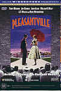

_This review was written by me for **MichaelDVD**, an Australian DVD review site that is no longer online. A capture of the site is held by the Internet Archive: **[browse it there](https://web.archive.org/web/20220217040146/http://www.michaeldvd.com.au/)**. It is reproduced here from my own copy of the site, as part of the record of what I have written._

## The film

Welcome to Pleasantville! It is a (fictional) TV series about life is a small town in America called Pleasantville set in the 1950s. John Howard would love this TV series - every house has a white picket fence, the characters obviously don't know what sex is much less how to do it, and everyone is so white and wholesome.

_**Pleasantville**_ the movie is about two siblings, David (**Tobey Maguire**) and Jennifer (**Reese Witherspoon**). Their mum is going away for the weekend, and each of them have grand plans for what they will do in her absence. David is an avid Pleasantville fan who knows all the episodes and who did what to whom and wants to enter a trivia quiz held as part of a Pleasantville marathon on a cable channel. Jennifer has a hot date and they plan to spend the evening watching the TV. Needless to say, both David and Jennifer soon start arguing over which channel to watch and in the process break the remote control. A mysterious TV repairman (**Don Knotts**) appears without being summoned and replaces the remote control with a funky retro looking one. When they start using it they find themselves magically transported into the universe of the Pleasantville TV series, substituting for two characters in the show who are also siblings: Bud and Mary Sue Parker.

The rest of the movie is about how David and Jennifer deal with their new roles as Bud and Mary Sue in the black-and-white surreal world of Pleasantville. The other characters are curiously naive and innocent and have no knowledge of things that have not been scripted in the series. All roads curve back into the town, books are full of blank pages and their "on-screen" parents, George (**William H. Macy**) and Betty (**Joan Allen**) Parker are cardboard cut-outs of stereotypical perfect American parents. **Jeff Daniels**plays Mr. Bill Johnson, the soda shop owner who really wants to be an artist.

Bud is almost half pleased that he has somehow landed inside his favourite TV series but Jennifer begins rebelling against the sterile niceness. Soon she discovers her rebellion begins to introduce change into Pleasantville and introduce the concept of free will as well as knowledge into the Pleasantville universe. Each change evolves Pleasantville from an artificial fantasy of what life is into something more approximating reality (both the good and bad bits). Each change is signified in the movie by a person or object becoming 'coloured' instead of black-and-white. What causes the colour change varies from person to person - for Betty it is her awakening sexuality, for George it is his love for his wife, for others it may be anger, passion, violence, the acquisition of knowledge or the appreciation of art/literature. Pretty soon we are wondering how this is going to end, and in the meantime the TV repairman is getting annoyed that his favourite TV show is changing before his eyes!

Pleasantville is a gorgeous movie to watch. Even though a lot of special effects have been utilised (all the black and white scenes have been shot in colour, digitised and then processed to remove colour and to enhance brightness/contrast to give the same look as real black and white film), the effects never intrude into the movie. I get so engrossed in the movie that the transition from colour to black and white back to colour seems completely natural, although the first appearance of colour in Pleasantville (the red rose in 35:45) looks really surprising and almost overpowering. My favourite scene is Chapter 26, when Bud and his girlfriend drive to Lover's Lane for the first time. I love the little detail touches in the film, for example colour objects against a background of black and white will also have colour reflections in shiny black and white objects.

I first watched Pleasantville on one of those really tiny LCD screens you get in planes, and I thought that the movie was watchable but a bit trite and contrived. On rewatching it on the big projector screen I have grown to like this movie. Watching it on the big screen makes a huge difference as this is in many respects is a pure cinema movie - the plot would not have made as much a dramatic impact in any other art form (novel, play, opera, whatever). The scenes when the "black and whites" section of the populace start ostracizing the "coloureds" send a powerful message about tolerance without being too preachy.

In short, I like this movie and recommend that you watch it.

## The video transfer

I have a confession to make. I am strongly biased in favour of this disc as I bought a Region Two copy when I was in the U.K. and coincidentally it is the very first DVD that we used to test the video projector that we had recently purchased and installed. I still remember the day - the installers were putting their finishing touches and we finally settled down for a test drive. I inserted the DVD - pressed PLAY and for the next few minutes our jaws dropped to the floor in amazement at the quality of the presentation on the big screen. You can imagine my disappointment when I realised most DVDs do not look as good as this one.

Needless to say when news of the impending R4 DVD release reached me, I begged - nay, demanded - for the chance to review this disc.

The movie is presented in it's original aspect ratio of 1.85:1, with 16x9 enhancement. The video transfer on this disc (downconverted from an HDTV transfer) is exceptional and deserving of being labelled "reference quality". Sharpness is basically perfect with no visible signs of edge enhancement, and the detail is so good you can actually read the pages off the book in 52:45. Shadow detail and colour saturation is likewise perfect. Indeed, I have never seen colour saturation being depicted more accurately on any other DVD - every colour, especially flesh tones, looks absolutely spot on. The reproduction of colour is so accurate that even the slight blue tinge that they deliberately mixed into the black and white components of the moonlight scene by Lover's Lane can be discerned on the projector.

The movie exhibits no visible MPEG artefacts whatsover - an amazing achievement and the first movie other than _A Bug's Life_for which I can say that. The flashes of colour at the beginning of the movie exhibit no posterisation whatsover, likewise there are no signs of ringing of bright objects. The black and white scenes in the movie look perfectly black and white with no colour seepage.

The only negative comment (and it is an exceedingly minor one) is that the film source is obviously very good but not perfect as there are minor film artefacts (mostly dust and scratches) occasionally in the movie. The "scratches" in the excerpt from the TV series from 2.00-2.09 look like fake scratches deliberately introduced into the film, but I am not so sure about the ones that are clearly visible in 4.47. There are no signs of film grain in the transfer

The only subtitle track on this DVD is an English subtitle track, which I did try out. The subtitles are reasonably accurate apart from a few minor words and lines in the dialogue that didn't make it to the subtitles.

This is a single sided dual layer disc (RSDL) and the layer change occurs at 78:06. The layer change occurs at the optimal spot in the movie, during a natural pause in the film in which the entire screen is saturated white, and is completely unnoticeable unless your DVD player provides an indication when a layer change happens. On my DVD player, the layer change took less than half a second, any delays longer than

## The audio transfer

In general, this DVD has a good audio transfer. Bear in mind though that as the movie is dialogue focused, don't expect your amp and speakers to get a good "workout" in this movie.

There are three audio tracks in this DVD: the main one being the English Dolby Digital 5.1 track encoded at the higher bitrate of 448Kb/s. In addition, there is a English Dolby 2.0 audio track encoded at 192Kb/s and an English Audio Commentary Dolby Digital 2.0 track, also at 192Kb/s. I listened to the Dolby Digital 5.1 track and the audio commentary track.

Dialogue quality is really good on this DVD and I can hear and understand every line spoken with no difficulties. There are no audio synchronisation problems with this DVD.

I really liked the original musical score by Randy Newman. It complements the film perfectly, and accentuates key dramatical moments. It doesn't sound derivative or hackneyed.

The surround speakers are mostly used for ambience noises and music. Although the surround speakers are not used as aggressively as in an action movie, I think they are intelligently used. The subtle but very effective use of surround contributes to making me feel I'm part of each scene instead of just watching the movie.

The subwoofer track is hardly used in the movie.

## The extras

In general this DVD has a fair collection of extras. To be honest I would have been quite happy with the quality of extras presented here except now that I know the Region One version has even more I want those as well. All menus are static but 16x9 enhanced.

### Dolby Digital Trailer - Egypt

This is the standard Dolby Digital Egypt Trailer. It seems to be embedded in Title 1 of the DVD as opposed to on a dedicated title accessed through seamless branching.

### Audio Commentary - Gary Ross (Director, Writer & Producer)

This is one of the best commentary tracks I have had the pleasure of hearing. Gary is extremely articulate, and offers pretty much a continuous stream of comments for virtually the entire movie. I find his comments quite insightful in terms of helping me appreciate the plot and context of the movie. Along the way, he also spends time talking about his previous movies _Big_and _Dave_in which he was the screenwriter, his childhood and how they have affected his creativity, and shares some details of how they created the special effects (they basically digitised about 90% of the film so that they can remove the colour digitally for the black and white bits). Most of the insights into the making of the special effects are also revealed in the featurette.

I was particularly grateful to him for explaining two apparent plot inconsistencies in the movie. The description of these plot inconsistencies may act as "spoilers" so I have "hidden" them in case you have not seen the film yet. To read the following text just highlight them using your mouse on the browser:

**Apparent Plot Inconsistency #1:** If Pleasantville is a completely self-enclosed world of it's own, how come the basketball team gets to play with a "visiting" team, since there is no place for the team to have come from?

**Explanation:** The "visiting" team is a permanent fixture of Pleasantville and every day the home and visiting team replays the same game.

**Apparent Plot Inconsistency #2:**If Jennifer (as Mary Sue Parker) decides to go to college in Pleasantville, won't her real life mother, friends, police etc. miss her?

**Explanation:**Pleasantville is shown as half hour episodes once a week on television, so each seven days in Pleasantville corresponds to half an hour in the real world. Even if Mary Sue Parker spends four years in college, it would only correspond to a few days in the real world, which is not long enough for anyone to miss her. Personally, I find this explanation a bit lame, myself, but it's nice of Gary to think of an explanation.

Gary also takes the trouble to point features like when the first appearance of colour occurs in Pleasantville (the red rose in 35:45), the colour reflection of the girl in the red sweater in the glass before we see the girl herself in 53:48, and the changing faces of the Red Indian in the test pattern (we initially see a normal Indian in 14:03, then an angry looking Indian in 61:57 and finally the weeping Indian in 84:41). I also like Gary pointing out the references to other movies such as _Citizen Kane_and _Shawshank Redemption_in the cinematography.

### Featurette - The Art Of Pleasantville

This is quite a long (32.26) documentary on aspects of creating the film, beginning with how they created the "wipe make up on" and "wipe make up off" scenes, and how they had to digitise all the black and white screens but could only have 10% of the movie online for editing at any given time due to the huge amounts of video storage required. It is presented in a non-16x9 enhanced full frame format (extracts from the movie are presented in 16:9 letterbox aspect ratio, non-16x9 enhanced). I quite enjoyed watching this featurette.

### Music Video - Fiona Apple

This is presented in a 16:9 letterbox aspect ratio, non-16x9 enhanced and is 4.27 minutes in length. It features **Fiona Apple**singing _Across the Universe_with a group of people in the background totally smashing and destroying Mr. Bill Johnson's soda shop. The entire video is in black and white apart from the painted window at the beginning which is in colour. A nice touch is that as the painted window shatters the camera pans to a small sliver near the window frame that is in colour against a general background of black and white.

### Theatrical Trailer

I'm used to sloppy transfers of theatrical trailers on DVDs (lots of MPEG artefacts, dirty print, no16x9 enhancement). Surprisingly, not only is this theatrical trailer 16x9-enhanced, but the audio and video transfer is immaculate - I would say on a quality level on par with the transfer of the film itself.

### Biographies-Cast & Crew

This is a set of stills featuring short biographies and filmographies of **Tobey Maguire**, **Jeff Daniels,** **Joan Allen**, **William H. Macy, Reese Witherspoon, J.T. Walsh,**Don Knotts****and **Gary Ross**. Again, surprisingly, the stills contain more detail about each person than those typically found on an average DVD.

## Region 4 versus Region 1

The Region 4 version of this disc misses out on;

- Colour test screens for TV adjustment
- Isolated score with commentary by Randy Newman
- Storyboard content
- DVD-ROM content including screenplay

The Region 1 version of this disc misses out on;

- Nothing of consequence

Based on the fact that extra features are present on the Region 1 version, my preference is for the R1 version of this disc.

In addition, I was able to compare the R4 disc with my personal copy of the Region 2 version. The R2 version seems to contain identical features to the R4 version with the exception of missing the Dolby Digital Egypt trailer. In addition, the R4 menus look nicer (less MPEG artefacts) and are 16x9 enhanced whereas the R2 version menus are not. My slight preference therefore is for the R4 version over R2.

At first I had the impression that the transfer on the R2 version seem to have less film artefacts (mainly dust and scratches) but comparisons of specific scenes never revealed any real differences. Therefore I conclude that both versions are probably sourced from the same transfer. I have to warn though that the R4 version that I reviewed is a "test" disc but my copy of the R2 version is the release pressing.

## Summary

**Pleasantville**, for me, was a pleasant movie presented on a pleasant DVD.

The video quality is superb, and is of reference quality.

The audio quality is superb, and is of reference quality.

The extras are acceptable and probably above average compared to other DVDs, but now that I know that the Region One version has even more, I want those as well.

### [Ratings (out of 5)](RatingsGuide.html)

© [Chris Tham](mailto:ChrisT@michaeldvd.com.au) (read my [biography](../ReviewerProfiles/ChrisT.asp)) 12 January 2001

| Rating  | Score         |
| :------ | :------------ |
| Plot    | ★★★★½ 4.5 / 5 |
| Video   | ★★★★★ 5 / 5   |
| Audio   | ★★★★½ 4.5 / 5 |
| Extras  | ★★★★ 4 / 5    |
| Overall | ★★★★½ 4.5 / 5 |
