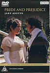

_This review was written by me for **MichaelDVD**, an Australian DVD review site that is no longer online. A capture of the site is held by the Internet Archive: **[browse it there](https://web.archive.org/web/20220217040146/http://www.michaeldvd.com.au/)**. It is reproduced here from my own copy of the site, as part of the record of what I have written._

_1995 · directed by Simon Langton._

## The film

_<strong>Pride and Prejudice</strong>_ is a superb and lavish six-episode mini-series adaptation of one of the most beloved novels (by **Jane Austen**) in English literature. Produced by the BBC as a "period drama" (in association with the A&E Network in the US), it was very popular amongst many viewers throughout the world and enjoyed a high degree of critical acclaim. Although it was nominated for several Emmy and BAFTA TV awards, it only managed to win two (a BAFTA Best Actress for **Jennifer Ehle** and an Emmy for Costume Design). _Pride and Prejudice_ was part of a plethora of film and TV adaptations of Austen works that surfaced in 1995-96, including _Sense and Sensibility_, _Persuasion_ and _Emma_ (_Clueless_ was a thinly disguised modernised version of _Emma_).

_Pride and Prejudice_ was first shown on Australian television on 2 March 1996. Although the US NTSC version (which is actually multi-region coded) of the DVD has been available since 1998, and the Region 2 DVD set has been out since late 2000, Region 4 fans of this mini-series have had to wait till May 2001 for the 2-disc DVD set. So, is the wait worthwhile?

**Jane Austen** was born 16 December 1775 at Steventon, Hampshire, England (near Basingstoke). She was the seventh child (out of eight) and the second daughter (out of two), of the **Rev. George Austen**, 1731-1805 (the local rector, or Church of England clergyman), and his wife **Cassandra**, 1739-1827 (née Leigh). She started writing at an early age (from about 1787 onwards) and early versions of the novels eventually published as _Sense and Sensibility_, _Pride and Prejudice_ and _Northanger Abbey_ were all begun and worked on from 1795 to 1799. Jane Austen published four of her six novels in her lifetime, and the two others were published together soon after her death in 1817. She died on Friday, 18 July 1817, aged 41 (probably from Addison's disease) and was buried in Winchester Cathedral. Many have speculated to what extent Jane's private life mirrored that of her famous heroines, but in the end neither she nor her sister **Cassandra** ever married.

Structured into six episodes of just under an hour each, the story of _Pride and Prejudice_ revolves around the Bennet family and in particular Elizabeth Bennet (**Jennifer Ehle**), a witty and captivating twenty-year old woman known as "Lizzie" to her family and friends. Besides Lizzie, Mr. (**Benjamin Whitrow**) and Mrs. (**Alison Steadman**) Bennet has four other daughters, all of a marriagable age:

- Jane (**Susannah Harker**) who is the prettiest and eldest,
- Mary (**Lucy Briers**) the pious and studious one,
- Kitty (**Polly Maberly**) and
- Lydia (**Julia Sawalha**).

As Mr. Bennet has no male heirs, his estate would pass on to his neplew Mr. Collins (**David Bamber**) upon his death, therefore Mrs. Bennet is determined to marry her daughters as soon as possible to handsome and rich eligible young men. However, both Jane and Elizabeth swore that they will only marry for love.

In the meantime, two extremely attractive and eligible young men have recently arrived in town - Mr. Bingley (**Crispin Bonham-Carter**) and Mr. Darcy (**Colin Firth**). Mr. Bingley is well regarded by all and soon becomes infatuated with the pretty Jane, but Mr. Darcy and Elizabeth did not quite hit off as well on first impressions. The younger sisters seem obsessed with the uniformed officers of the militia stationed nearby and Mr. Collins decide he wants to go wife-hunting! What follows is a very well structured romantic comedy about first impressions, vanity, truth and falsehoods, re-evaluations, love and, of course, unyielding pride and blinding prejudice.

You can find the annotated and hyperlinked web-based text of the novel [here](http://www.pemberley.com/janeinfo/pridprej.html). The screenplay (by **Andrew Davies**) follows the original novel reasonably closely (especially the dialogue), and the following [fan site](http://members.nbci.com/pemberley/) has a very good synopsis of the six episodes in the mini-series, but in the meantime this is my super-condensed abbreviation of the six episodes:

1. Bingley, Darcy and co. arrive and meet the Bennet sisters. Darcy and Lizzie did not like each other at first sight.
2. Mr. Collins arrives in search of a wife. His initial choice did not quite respond as he expected.
3. Jane's romantic hopes are seemingly dashed, as are Mr. Darcy's.
4. My favourite episode, this features Elizabeth visiting Pemberly with her uncle and aunt, where she gets to see a very wet Mr. Darcy.
5. Lizzie's youngest sister Lydia ("Lord I'm so hungry!" and "Lord I'm so fagged!" - which I initially interpreted as "Lord I'm so FAT!") causes a lot of commotion and distress.
6. Will Jane and Lizzie find the love and happiness that they have been seeking? Let me just say we are presented with a very typical Austenian ending - a double wedding.

## The video transfer

Given that this mini-series should be regarded as one of BBC's Crown jewels (personally, I'm still waiting for _Brideshead Revisited_ to come to DVD) I would have thought they would have spared no expense in ensuring that we get the best possible transfer quality. Alas, this is not so, and I am rather disappointed and I think the many fans of this production really deserve better.

Surprisingly (given that this is a TV production), we do get a widescreen 16x9 enhanced transfer. So, are we seeing more of the picture than was originally broadcast on TV, or are we seeing a version with the tops and bottom cropped off? I'm not sure - some of scenes where the tops of the characters' heads have been cropped off would indicate that we are watching a cropped off version, and yet the exterior scenes of Rosings (**29:20**-**29:36**) seem perfectly framed for 1.78:1. At least one fan site seems to indicate that we do get to see detail on the sides not present in the VHS version. I suspect the original aspect ratio may well have been 1.66:1 (excerpts from mini-series presented in the accompanying "Making of" featurette seems to be consistently presented in 1.66:1, and there is a part in the featurette where we get to see scenes in the film being edited on a monitor - **22:06**-**22:13** and **22:23**-**22.37** - these seem to be presented in what looks like 1.66:1) which is then cropped off for the DVD but broadcasted on the TV centre-cut.

Unfortunately the transfer is somewhat soft and lacking in detail. The opening titles in particular, where the film pans slowly over embroidery, lace and satin seem curiously defocused and I would have expected a better quality transfer to really highlight the detail in the lace.

I am really disappointed by the colour of the transfer, which is consistently undersaturated, possibly because the colour in the film print from which the transfer has been sourced from has faded over the years. The film source could obviouly do with some restoration and colour correction. What is really galling is that the accompanying featurette (derived from a video master obviously) contains excerpts from the mini series with much better colour saturation.

MPEG artefacts are thankfully minor, mainly limited to some ringing around the titles during the opening sequences. The film source exhibits fairly noticeable levels of grain throughout.

The episodes feature one subtitle track - English for the Hard of Hearing. I turned this on briefly, and during passages where I couldn't quite hear what the characters were saying, and I found it quite helpful.

This is a two disc set containing two single-sided dual layer discs (**RSDL**). In both discs, the layer change occurs just before the last chapter of the second title - **36:25** on disc 1 and **42:05** on disc 2 - and in both cases the change results in a noticeable slight pause. In both cases, and especially on Disc 2 where there is an additional featurette encoded as Title 5, I would have thought it infinitely preferable to do the layer change between titles.

## The audio transfer

There is only one audio track present, Dolby Digital 2.0 encoded at 224 Kb/s. The quality of the transfer is pretty average, containing neither any bad spots nor any outstanding elements. At least it's nice and clean and sounds reasonably well-balanced.

I found the dialogue to be generally okay, although occasionally the characters speak a little bit too fast which tend to muddy their lines. There are no issues with audio synchronisation, and the background music matches the mood of the storyline perfectly.

## The extras

Given that this is a six-episode mini-series spanning over five hours on two discs, I suppose it would have been a bit too much to also expect a lot of extras, but I think they could have done a lot more if they tried just a little bit harder - cast and crew interviews for example, a commentary or two, cast and crew biographies, even say the text of the novel as a DVD-ROM supplement. All in all, I am less than impressed.

I have to make a comment about the DVD packaging - the copy I received was packaged using two C-Button Version 1 cases glued together, accompanied by a slick that seems to be formatted for a normal sized case. I'm presuming either the slick or the case will be replaced to match each other by the time the DVD set hits the retail shelves.

### Menu

This is 16x9 enhanced but pretty basic. The main menu has the famous theme song of the mini-series (performed by **Melvyn Tan** on the fortepiano) playing in the background, and the scene selection menus surprisingly feature scene animations (and quite well done too).

### Featurette-Making Of (26:36)

This all-too-short featurette is divided into several sections (the script, the producer, the design, the casting, the choreographer and the editing) and features excerpts from the mini-series intermingled with interviews with cast and crew members, including the following:

- **Sue Birtwistle** (producer)
- **Andrew Davies** (screenwriter)
- **Gerry Scott** (production designer)
- **Dinah Collin** (costume designer)
- **Simon Langton** (director)
- **David Bamber** ("Mr. Collins")
- **Alison Steadman** ("Mrs. Bennet")
- **Jane Gibson** (choreographer)

The featurette is presented in full frame, apart from scene excerpts which appear to be in 1.66:1 aspect ratio.

I was disappointed to find out the **Colin Firth** did NOT actually jump into the lake at "Pemberly" (in reality Lyme Park) - but then I don't think I'll like to try out those murky waters either!

## Censorship

The version originally broadcasted on US TV deleted some scenes in order to accomodate for commercials. Thankfully, this version (as far as I know) features all those scenes intact within the episodes.

## Region 4 versus Region 1

The Region 4 version of this disc misses out on;

- 1.33:1 aspect ratio version

The Region 1 version of this disc misses out on;

- 1.78:1 aspect ratio version with 16x9 enhancement
- "Making of" featurette
- 16x9 enhanced menu with audio and scene animation

Looks like the clear winner is R4, as I've heard bad reports about the R1 transfer. However, the Region 4 version of this DVD appears to be missing character biographies and profiles supposedly present on the Region 2 version.

## Summary

**Pride and Prejudice**, is a superb adaptation of one of the most beloved novels in the English literature into a six-episode TV mini-series. Unfortunately, it is presented on a two-disc DVD set with a video transfer that it does not deserve and an audio transfer that is nothing spectacular. There is only one extra to speak of - a "Making Of" featurette.

| Rating  | Score        |
| :------ | :----------- |
| Plot    | ★★★★★ 5 / 5  |
| Video   | ★★½ 2.5 / 5  |
| Audio   | ★★★½ 3.5 / 5 |
| Extras  | ★★½ 2.5 / 5  |
| Overall | ★★★ 3 / 5    |
