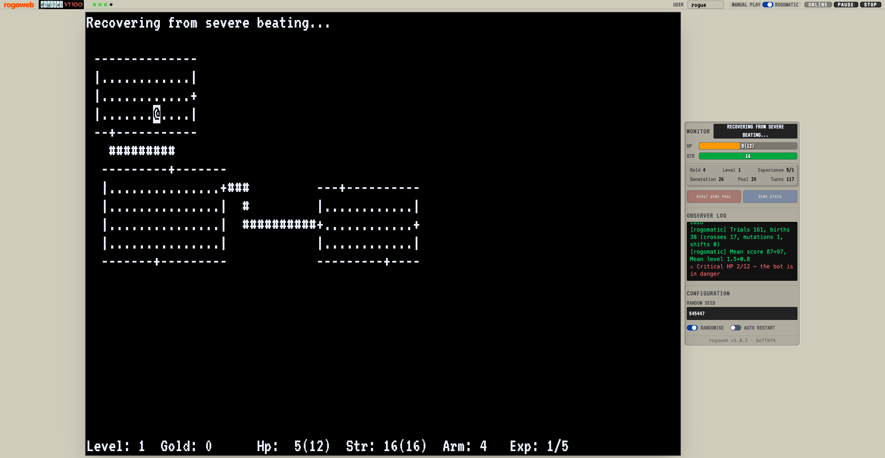

I am proud to showcase my latest AI vibe coding project: a port of the classic Unix game
Rogue, and its automated player Rog-O-Matic, to the browser as a modern web application.

## Rogue parties

As a bit of context, when I was about halfway through uni the game Rogue was introduced on our
university minicomputer. It instantly became a hit amongst the students, and the university had
to ban it from being played during the day, so we students would gather after hours and have
"Rogue parties". To be honest, I was never really that good at the game compared to others, but
I was part of the scene.

If you have not met it, Rogue is the 1980 dungeon crawler by Michael Toy, Glenn Wichman and Ken
Arnold, and it is the game that gave the whole roguelike genre its name. You wander a dungeon
drawn in text characters, and everything is generated fresh each time, so nobody can memorise
their way to victory.

Then Rog-O-Matic was introduced, which is one of the earliest examples of AI actually working. It
was an expert system that could train itself to play Rogue well, built at Carnegie Mellon in
1981 by Michael Mauldin and his colleagues, and it was startlingly good. Their
[1983 paper](https://kilthub.cmu.edu/articles/journal_contribution/Rog-O-Matic_a_belligerent_expert_system/6609137/1) reports that over three weeks it scored a higher median than any of the
fifteen best human players at Carnegie Mellon and the University of Texas at Austin.

Naturally, we all started using it. Eventually Rog-O-Matic took up so much CPU time that it was
banned from the university computers too. We students wished we had personal Unix computers, so
that we could play Rogue and Rog-O-Matic all day long.

## Not a reimplementation

So, as a trip down memory lane, I have recreated the experience of running Rogue and Rog-O-Matic,
in the browser.

I want to be clear about what this is, because
[rebuilding every HP calculator](/spotlite/article/hellocalc/) was the exact opposite. Hello Calc is a
reimplementation, with every function rewritten from scratch. This is not. This is the original
source code, ported to run in WebAssembly as browser workers, with shared array buffers acting as
the interprocess communication between the workers.

That last part is the whole problem in a sentence. On Unix, `rogue` and `rogomatic` ran as two
separate processes, with `rogomatic` launching `rogue` and talking to it through the standard input
and output pipes. A browser has none of that machinery. There are no processes, no `fork`, and
no pipes.

The answer was to compile both C codebases to WebAssembly with Emscripten, give them a port of
curses to talk to, and then replace the Unix pipe with a ring buffer living in a
`SharedArrayBuffer`, which is simply a fixed block of memory that two background workers can
read and write in turn. The game runs in one worker, the bot runs in the other, and they talk to
each other exactly as they did in 1981, without either of them realising anything has changed.

The stats are handled the same way. Rather than scraping the terminal for the numbers, which is
slow and error-prone, the C code writes its internal state straight into a corner of that shared
memory, and the dashboard reads it from there.

## How it was built

The whole thing was coded using AI in about five days. I have written about the method at
length in [chapter three of my book](https://christham.net/aidou/software.html), but the short
version is that I described what I wanted rather than how to do it.

My intent was almost as short as the title of this article: port `rogue` and `rogomatic` to run in
the browser. I added a constraint, that the original C code should keep working unchanged in
spirit, and a check, that the bot could still run a game through to completion. The architecture
you have just read about was the agent's answer, not mine. I would never have thought of it.

It was not all smooth. Using shared array buffers brought a great many race conditions, where
one process sat waiting for the other and the game simply hung. Debugging those took real time
and real expertise. I could guide the agent on some occasions, but in a good many cases it
solved the problem itself once I asked it to go looking for race conditions. Along the way it
also fixed bugs in the original source, which have been sitting there since the eighties.

The one place I overrode the agent's taste was the look. I coached it towards a VT100 terminal
with proper DEC styling, because that is what these games ought to look like, and that is the
only part of the design I shaped rather than delegated.

## Teaching the bot to be better

Once the port worked, I got greedy and asked the agent to improve the bot itself.

Rog-O-Matic learns. It keeps a genetic pool of strategy weights and a long-term memory of how
dangerous each monster has proven to be, and it evolves both across games, saving the results in
your browser. A fresh install therefore plays rather badly and gets better the more it plays.

To hand new players a bot that is already competent, the agent built an offline pretrainer and
spread it across every CPU core, running separate populations that evolve in isolation and then
merge under a rule that never allows a regression. That came out roughly ten times faster. It
also went back into the 1981 C and repaired a raft of latent bugs and badly tuned heuristics,
the most useful being a per-monster danger table, so that the bot stops cheerfully
under-rating a dragon.

Because Rogue is a game of chance, none of these changes could be judged on a single run. Each
one had to be validated on win rate and average depth across a batch of games, which meant the
agent had to play the game many times over to prove its own work. There is something rather
pleasing about an AI grinding through hundreds of games to check whether it has improved a
different AI from 1981.

## Have a go

The app is live, and the source is on
[GitHub](https://github.com/ChristineTham/rogoweb) if you would like to see how it fits
together.

Just press the START button and enjoy the good old days.

[Play it here.](https://christham.net/rogoweb/)

## Sources

- [rogoweb](https://github.com/ChristineTham/rogoweb), the source, which carries the merged
  Rogue 5.4 and Rog-O-Matic XIV codebases and the notes on the port.
- Michael Mauldin, Guy Jacobson, Andrew Appel and Leonard Hamey,
  [Rog-O-Matic: A Belligerent Expert System](https://kilthub.cmu.edu/articles/journal_contribution/Rog-O-Matic_a_belligerent_expert_system/6609137/1), Carnegie Mellon University
  technical report CMU-CS-83-144, 1983.
- [Rogue](<https://en.wikipedia.org/wiki/Rogue_(video_game)>), Wikipedia, for the game's origins and its authors.
- [Chapter 3 of AI-dō](https://christham.net/aidou/software.html), which describes how the
  port was built and what went wrong along the way.
