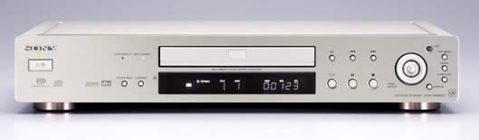
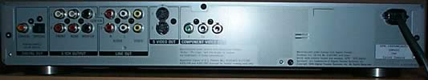
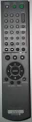

_This review was written by me for **MichaelDVD**, an Australian DVD review site that is no longer online. A capture of the site is held by the Internet Archive: **[browse it there](https://web.archive.org/web/20220217040146/http://www.michaeldvd.com.au/)**. It is reproduced here from my own copy of the site, as part of the record of what I have written._

Sony's strategy with DVD players lately tends to focus on good quality mass market players offering a generous selection of features ("hopefully something for everybody" seems to be Sony's motto) and the ability to play as many different formats as possible, including DVD, DVD-R/RW, DVD+R/RW, Video CD, CD, and CD-R/RW. The Sony DVP-NS905V plays all these disc formats, as well as the Super Audio CD (SACD) format that Sony and Philips are promoting as the high resolution successor to the CD. The player will also play MP3 CD-ROMs as well as contain on-board Dolby Digital, MPEG and dts decoders.

Indeed, the only major format the player will not handle is the competing DVD-Audio format that Sony would like to pretend doesn't exist. Am I the only one who thinks the DVD-Audio vs SACD format war is reminiscent of VHS vs Beta?

Also missing out are niche formats such as HDCD, Super Video CD and DivX:-) encoded CD-ROMs, but then not many other manufacturers support them either.

The DVP-NS905V as a replacement for the DVP-NS900V but with better video playback quality (due to the use of higher speced 12 bit 108 MHz Video DACs), plus enhanced support for additional disc formats. Like the NS900V, the Australian version of NS905V also misses on progressive scan. Surprisingly, Sony has lowered the suggested retail price to A\$1199 (the previous model was selling for A\$2299).

So - a theoretically higher-speced player with support for more formats at nearly half the price! What's missing? Not much, as far as I can tell.

## What's In The Box

I received a pre-production review unit that was shipped on an unlabelled box containing the player, plus remote control and an AV cable but no manuals or other documentation.

The review unit comes in a silver colour, to match the silver colour of Sony's TV sets and cabinets.

One of the first things I did when I received the player was to open it to find out what's inside. I found it relatively easy to disassemble the player using a single Philips head screwdriver. The top cover slides off after removing about five screws, and the inside of the player is quite logically laid out and relatively uncluttered. Sony has followed good design practice by separating out the power supply, transport, audio and digital circuits onto separate boards linked via ribbon cables. The transport itself is raised and screwed directly onto the bottom chassis. The audio board is raised to about mid height and is joined to the output sockets (so presumably video signals are also routed into the audio board).

Overall I would rate the quality of construction as acceptable, but nothing fancy. The transport looks a bit plasticy and cheap, but the circuit boards are fairly solid and well laid out. All components are surface mounted.

The audio board contains a set of 15532 op amps (one per channel) and associated discrete capacitors and resistors. These are reasonably well-spaced and there is definitely the potential for those who wish to "tweak" the player to replace the capacitors/resistors with higher quality components (provided of course they have the necessary tools to remove and insert surface-mounted components).

The digital processing board handles both audio and video. Apart from a number of memory chips (including a 16 Mb Flash memory that probably holds the firmware) I spotted an Analog Devices ADV7300A - this provides six "12bit 108MHz Noise Shaped Video DAC" (as proclaimed on the front panel) channels. I suspect the player only uses three channels (for component interlaced video output), and the other three channels are reserved for progressive scan output which is not available in the Australian model.

A Fairchild/Fujitsu MB91307 32-bit processor probably controls the player "smarts" as well as audio decoding (Dolby Digital and dts). A Sony CXD-2753 chip does the Super Audio CD decoding. Finally a trio of three Sony proprietary chips (CXD-1935, CXD-1938 and CXD-9703) performs various functions including (presumably) MPEG decoding and audio D/A conversion.

## Front Panel

The Sony DVP-NS905V, being the successor to the NS900V, has an overall "look" that is similar to the previous generation except it is not as tall. Think of it as a flattened NS900V plus a slightly different set of buttons. The front panel consists of (from left to right):

- A soft click-actuated Power Off/On toggle
- Two indicator lights, "Super Audio CD" (which glows amber) and "Multi-Channel" (which glows blue)
- "Picture Mode" and "Surround" buttons
- The disc tray, with the fluorescent display beneath
- Disc Navigation Buttons (Eject, Chapter Previous/Next, Play, Pause, Stop)
- A four way joystick plus "Enter" button surrounded by a Jog Dial
- Four buttons - "Jog" (which has an embedded amber indicator when pushed), "Top Menu", "Menu", "Return", and "Display"

I quite like the front panel and find it very usable - Sony seems to have taken some care in choosing a set of buttons that would allow the player to be operated without a remote control but without over-crowding the panel with too many buttons. Also, all the buttons provide a tactile "click" when pressed, although they don't respond as quickly as I would have liked and occasionally miss on a quick press. Unfortunately, Sony has opted not to include a headphone socket or volume control (present in the previous generation NS900V).

When the unit is powered off, it can be woken up by pressing the Eject and Play buttons on the front panel as well as the Power button.

The flourescent display is a very bright blue (but this can be turned down through the on screen menu). It provides the following status indications (from left to right):

- DVD/CD/VCD
- Play/Pause
- Progressive/Multi/Repeat
- Dolby Digital/dts/MP3
- Repeat/1/Shuffle/PGM/A-B
- Group/Title/Track/Chapter/Index/Angle/Hour/Min/Sec
- NTSC
- 12 character alpha-numeric display (this is cleverly designed to look like a dot matrix readout but is actually a set of 16 segment character positions)

The flourescent display was quite nice to look at, and easy to read even from across the room. It would be even nicer if it provided an indication of which channels are present in the currently playing audio track.

## Rear Panel

From left to right, we have:

- optical and coaxial digital outputs.
- 5.1 channel analogue outputs (RCA)
- Two two-channel analogue outputs (RCA).
- Two composite video outputs.
- Two S-Video outputs.
- One set of Component Video outputs (RCA). This player does not output RGB video.
- A wired-in power cable.

What is missing is a SCART type connector output or RGB, which is not surprising since Sony TVs do not accept SCART nor RGB.

## Remote Control

The previous generation NS900V featured a fancy remote control with an LCD panel, but for this model Sony has opted for a more traditional remote control (code-named RMT-D143E) which is long, rectangular and full of tiny little buttons that you can't distinguish in a dark room.

At the top of the remote control are the Power button and the Eject button in the top row, easily distinguishable from one another by the differences in their size, elevation and colour. Between them is a Power On/Off switch for a television (looking somewhat like a cross between the other two).

Below these three buttons, offset by a small amount of empty space, is a numeric keypad as well as a collection of buttons relating to various functions of the DVD player and a television. The television buttons, on the right column, include Volume Up/Down (labelled VOL) and TV/Video. Supposedly the television buttons supports multiple brands but I did not verify this.

The other buttons are labelled Clear, Time/Text, Disc Skip (I'm not sure why this is included since the player does not support multiple discs), Audio, Subtitle, Angle, Picture Mode, Next/Previous Chapters, Repeat, Sur, Fast Forward/Rewind (also labelled Scan/Slow), Search Mode, Replay). These buttons are much too small, closely spaced and similar to one other for my liking.

Beneath these buttons are the Play, Pause, and Stop buttons. At the bottom of the remote control are the navigation controls, with the four arrow keys in a circular arrangement surrounding a large Enter button. Additional buttons below the rosette are Display, Top Menu, Menu and Return.

This is a usable, but not exciting, remote control with too many small buttons. When powered off, the unit can be woken up by pressing the Play button as well as the Power button but not by the Open/Close button.

## Manual

A manual was not shipped with the review unit.

## Set-Up Menu

The set-up menu is accessed by pressing the Display button and navigating to the last icon/menu item. There are three options: Quick, Custom and Reset. The last one resets the player settings to factory defaults.

The Quick option sets the following options by asking a few questions:

- On Screen Display Language (default: English)
- TV Type (default: 16:9)
- Audio output type (Default: line outpur L/R)
- Dolby Digital conversion (Default: D-PCM)
- DTS conversion (Default: D-PCM)
- Speaker Setup (Front/Center/Rear/Subwoofer)

The Custom option allows you to set all options through a series of sub menus. All in all, the set-up options are quite extensive and the built-in multi-channel decoder supports features similar to that of most A/V processors, including bass management, time delay to compensate for speaker distance (in metres), channel level and balance, and test tone generation. About the only thing missing in terms of bass management is the ability to change the cross-over frequency.

The player can also be configured to remember where you are up to in a particular disc (up to the last 40 discs), as well as auto-play and selection of audio track. Interesting audio options include a "CD Direct" mode (I am not sure what this means), selection of audio filter (between Sharp and Slow), and whether or not to permit output of 96 kHz/24 bit PCM audio tracks to digital out.

## Video Playback

Before I start, I would like to point out that the NS905V has a number of video adjustment settings. A "Picture Control" facility allows you to cycle across pre-defined brightness/contrast/gamma settings. In my experience, these settings tend to do more harm than good if you have a high quality and accurate video display. I would recommend that you set Picture Control to either Standard or Memory and calibrate your display using a test disc such as Video Essentials (using either the adjustment settings in the player or your display). However, the different settings might come in useful when playing a DVD with a poor video transfer to enhance contrast. A number of video enhancement functions are also available, including Block Noise Reduction and something called "Digital Video Enhancer." Again, I would recommend setting these to "Off" if you want to see the DVD transfer exactly as it is encoded on the disc, although they may occasionally be useful for DVDs with very poor transfers.

There is a school of thought that says there are not a lot of differences in video playback quality across DVD players and the major areas of differentiation lie in the feature set. No doubt these are probably the same people who say all CD players sound alike.

In any case a comparison between the video quality of this player compared to my "reference" player (a Pioneer DVD-626D) yielded some starting differences that was immediately noticeable. Even though the 626D was praised in its day for superior picture quality, technology has definitely improved in the last 2-3 years resulting in an even better picture.

I calibrated the player by adjusting the display settings of my Sony VPL-VW11HT LCD projector (and leaving the Picture Mode of the DVD player on "Standard") using the [Video Essentials](http://www.videoessentials.com/dvd.htm) test disc (NTSC). It was clear from viewing the [Snell & Willcox Test Chart](http://www.snellwilcox.com/internet/reference/testchart.html) (Video Essentials Title 15 Chapter 12) that the DVD player is capable of extracting maximum horizontal and vertical resolution from the DVD format. I did not notice any video artefacts or abnormality viewing this test pattern (apart from the usual moire effects and slight colouration in the moving zone plate).

The video playback quality of the NS905V can only be described as "stunning." Even after calibration, colours seem a touch more vibrant and better defined on the NS905V in comparison to the 626D, which I suspect is due to better linearity in the higher-speced video DACs.

The NS905V produces a very smooth and highly detailed picture, which made the 626D looks soft in comparison. As an example, I can clearly distinguish whether the background objects in _Frank Herbert's Dune_mini-series are real vs part of the back-drop painting.

Slow camera pans are handled very smoothly on the NS905V - as an example I played the first few minutes of **Andrea Bocelli**'s _Cieli Di Toscana_ (where we get to see the shops and alleys of the West End district of London panning across the screen from the perspective of the side window of a moving car). This is a real torture test for an MPEG decoder, as the entire scene is a relatively fast pan from right to left. On the 626D the scene appears really jerky and sometimes I can see individual frames. On the NS905V I get a much smoother (though not completely smooth) and more detailed set of frames.

I suspect the smoothness in pans is the result of a faster MPEG decoder, and the increase in detail and resolution is probably due to the ADV7300A, which oversamples the video signal eight times and applies "noise shaping" techniques (pioneered in sigma delta converters for digital audio and only recently introduced into video processing) to shift the quantization noise generated by D/A conversion into frequencies above the sampling rate. Incidentally, this same component is also used in the Pioneer DV-733A universal player which has also been praised for it's video quality.

The review unit appears to be multi-region enabled, and I had no difficulty playing a number of Region 1, 2 and 4 discs. Even discs that do not play properly on the 626D (including _When Harry Met Sally_and the layer change of several discs including _Fried Green Tomatoes_) play perfectly fine on the NS905V. I am not sure whether retail units will be multi-region enabled out of the box.

I tried my best to determine if the NS905V suffers from the dreaded ["chroma upsampling error"](http://www.hometheaterhifi.com/volume_8_2/dvd-benchmark-special-report-chroma-bug-4-2001.html) so common on many DVD players, especially since this "bug" is present in previous generation Sony players, including the 9000ES and the NS900V. The results were inconclusive, but hopeful. I did not notice any streaks in either the red button or the ZORG sign whilst watching the Region 1 Superbit version of _The Fifth Element_, but I thought I saw slight jaggies around the edge of Clark Kent's red shirt in _Superman_. In any case, even if the player has the error, it has it in such a mild form that I don't think it will be an issue for most prospective buyers.

The fast forward/fast reverse buttons are somewhat confusing in that pressing the button once will give you a "2X" speed but pressing the button again will progressively give you faster speeds but these are labelled "1", "2" etc. You will exit fast forward/rewind operation by pressing "Play." Unfortunately, it is difficult to find this button on the remote in the dark so more often than not I hit the wrong button. Pressing the forward/rewind buttons when the player is paused will activate several speeds of slow scans. Once I got used to it, the buttons are surprisingly effective in cueing up to the right spot.

Layer changes are rather jarring on this player and it obviously does not do any memory buffering of the DVD playback unlike recent Denon models.

## On Screen Display

The on-screen menu is accessed while the DVD playing by pressing the "Display" button on either the front panel or remote control. It features a number of icons on the left side of the display corresponding to the following functions:

- **Title** (current/total) - pressing Enter enables title selection
- **Chapter** (current/total) - pressing Enter enables chapter selection
- **Time/Text** (cycle between time elapsed in title/chapter, time remaining in title/chapter using the Time/Text button) - pressing Enter enables jumping into a specific point in time
- **Audio** (shows details of audio track and encoding scheme including active channels) - pressing Enter enables audio track selection
- **Angle** (current/total) - pressing Enter enables Angle selection
- **Surround** - pressing Enter enables selection between Off, TVS Dynamic, TVS Wide, TVS Night, TVS Standard
- **Advanced** - pressing Enter enables selection between Off, Bit Rate, Layer
- **Parental Control** - pressing Enter enables setting of parental control access level, on/off and password
- **Setup** - pressing Enter enables selection of Quick, Custom, Reset

If the Display key is pressed a second time, a different on screen menu features:

- **Title** (selection)
- **Audio** - not usable
- **Time/Text** - not usable
- **Program** (Off/Set/On)
- **Shuffle** (Off/Title/Chapter)
- **Repeat** (Off/Disc/Title/Chapter)
- **A-B Repeat** (Set/Off)
- **BNR** (Off/1/2/3)
- **Custom Picture Mode** (Standard/Dynamic 1/Dynamic 2/Cinema 1/Cinema 2/Memory)
- **Digital Video Enhancer** (Off/1/2/3/Soft)
- **Picture Navigation** (Title Viewer/Chapter Viewer/Strobe Playback/Angle Viewer)

The on-screen menu is different for other formats (eg. VCD, CD, SACD). For example, the SACD on-screen menu allows Track selection, Index selection, Multi/2ch, Time/Text, Program, Shuffle, Repeat, A-B Repeat, Parental Control and Setup.

This player supports DVD-Text, CD-Text, SACD-Text for suitably authored discs and also displays the Joliet long file name for MP3 tracks if you press the Time/Text button. The player will also display jacket pictures if the DVD disc has them.

Overall I would have to say the on-screen menu is one of the most comprehensive I have ever seen.

## Standards Conversions

The player does not convert between PAL and NTSC video formats but can output both.

The player can be set to convert from Dolby Digital/dts/MPEG to PCM on the digital out connections.

## CDR & Video CD

The previous generation NS900V player was known to be somewhat iffy on CD-R and CD-RW discs. I am pleased to announce that the NS905V has no problems playing a selection of CD-R and CD-RW discs that I inserted into it, including gold and blue/green discs recorded at 8X speed.

The player also had no problems playing Video CDs, including commercially pressed ones as well as those that have been burned from a CD recorder.

The player didn't have any problems playing back MP3 CD-Rs, including multi-session discs and discs with over 100 songs either in the root directory or in total across directories. It does not recognise ID3 tags but displays the (Joliet) long file name as the title of each track. It recognises constant bit rate MP3 files (as long as the bitrate is over 96 kb/s, anything less and the player displays a "Data Error") as well as variable bit rate MP3s (with "quality" set anywhere between 1-100%). Each directory is classified as a separate "title" and you can select using title/track buttons. The player does not recognise WAV (PCM) or WMA format files.

## Audio Playback

Sony DVD and SACD players are notorious for sounding less than perfect out of the box, and requiring a long burn-in period before the sound quality reaches an optimum level. I did not know whether the review unit has been extensively played, so to be safe I had it continuously playing alternating between a CD and an SACD disc for 3-4 days prior to listening to it.

So, how does the NS905V fare as an audio player? I was able to compare the audio quality of the internal Dolby Digital and dts decoder against the processor built into the Denon AVR-3300 receiver, as well as the CD and SACD playback against Sony's top-of-the-line audio only CD/SACD player - the SCD-XA777ES.

I did not notice any audio problems on the player playing a variety of MP3, CD, Video CD, SACD and DVD audio formats on both the analog and digital outputs. No stuttering or dropouts were evident. I did notice however, that the digital output has a tendency to turn itself off if not used. Switching to the digital signal after leaving the AVR-3300 on "5.1 analog external in" for an extended period of time will require a few seconds for the digital signal to lock in instead of instantaneous on the Pioneer 626D.

I also did not notice any subjective audio synchronization issues with the player on the Wedding Singer R4 (second remastered edition) during Steve Buscemi's speech in the opening wedding reception scene (4:07-5:14). On the Matrix R1 I can detect a slight mis-sync during the scene where Keanu Reeves gets scolded by his boss for being late to work.

Dolby Digital 5.1 decoding on the player can only be described as mediocre, and definitely inferior to the Dolby Digital decoding on the Denon AVR-3300 - sounding rather insubstantial, bass light and lacking in low level details. DTS decoding on the other hand sounds fabulous and comparable to the AVR-3300.

With regards to CD and SACD playback, I did not expect the NS905V to win against the XA777ES, which after all is in a different class altogether in terms of cost, components and build quality. However, I was pleasantly surprised that it fared reasonably well. The overall sonic signature between the two players are similar in that both provide a lush and euphonic sound without sacrificing accuracy or detail.

Playing one of my favourite CDs, **Michael Brecker**'s _Nearness of You_, the major difference between the two players was in low level detail and ambience recovery, and accuracy reproducing extreme high frequencies. The steel brushes against the cymbals on the first track (_Chan's Song_) sound realistic on the XA777ES, but sounded rather digital on the NS905V. Notes decay naturally into the ambience on the XA-777ES, but sounded a bit pinched on the NS905V. Bass also appears to be more solid and better defined on the XA777ES. However, imaging seemed to me to be even more precise on the NS905V over the XA777ES.

On SACDs the NS905V really shines and the gap between the two players narrowed considerably. Indeed, it would almost be worth it buying this player purely for the SACD playback capability alone. On **Manfredo Fest**'s _Just Jobim_, the music literally leaps out of the speakers onto a virtual stage. **James Taylor**'s _Hourglass_in multi-channel sounded fabulous. In comparison, the XA777ES still wins - but only marginally - sounding slightly more open and "relaxed" compared to the NS905V which sounded slightly "brittle." Incidentally, I noticed a bug in the player's display of SACD Text on Hourglass - whenever I press the Time/Text button I keep getting the title of the disc ("HOURGLASS") rather than the title of the currently playing song.

However, the NS905V is not as flexible as the XA777ES when it comes to selecting between different audio tracks on hybrid SACD discs. A hybrid disc can contain up to three versions of the album: a CD-quality PCM layer that is playable on normal CD players, a stereo high resolution DSD version and a multi-channel DSD version (both on a second layer). The XA777ES allows you to choose which version you want to listen to, although it will not allow you to switch audio tracks on the fly for A-B comparisons (changing versions require the player to be stopped and requires re-reading the table of contents). The NS905V seems to always favour the DSD layer in a hybrid disc, and I could not find a way of selecting the "Redbook" or CD-quality layer.

In addition, choosing between the multi-channel and stereo versions on the DSD layer can only be done using the Display menu, which requires access to a video display. This is an embarassing oversight on Sony's part, given that one of the supposedly big selling points of SACD over DVD-Audio was supposedly the more "audiophile-friendly" user interface of players and the avoidance of the need for a video display to access features on the disc. Granted that most users will not want to switch between multi-channel and stereo often, I would have liked Sony to allow this to be more easily done - perhaps using the "Audio" button on the remote control.

Interestingly, although the player is not billed as being capable of playing HDCD discs, it performed quite well on the few HDCD discs that I threw at it, including **Roxy Music**, and **Joni Mitchell**'s _Both Sides Now_. On both discs, the sound was more solid and less "feathery" on the NS905V in comparison to the XA777ES.

## Disc Compatibility Tests

I tested the player against a number of discs to highlight potential problems: _Specific Tests_

| **Disc** | **What Is Tested** | **Results** |
| :-- | :-- | :-- |
| The Matrix R4 Follow The White Rabbit | Tests active subtitle feature, seamless branching, ability to load hybrid DVD/DVD-ROM and audio sync. | YesYesYesNo |
| Wedding Singer Remaster 2 R4 Audio Sync | Opening scene tests audio sync. | Yes |
| Terminator: SE R4 Menu Load | Tests ability to load complex menu | Yes |
| Independence Day R4 Seamless Branching | Tests ability to handle seamless branching (Chapter 3) | Yes |
| Patriot R1 RCE | Tests ability to handle RCE protected DVDs in Auto multizone mode (if applicable). | Not tested |

## User Convenience Features

| Screen Saver | Yes |
| :----------- | :-- |
| Zoom         | No  |

## Overall

### The Good Points

- superb video quality, particularly in detail and slow pans
- superb audio quality, particularly for dts and SACD
- plays lots of different disc formats
- extensive set-up and playback options, including bass management

### The Bad Points

- no progressive scan
- cluttered remote, non responsive keys
- mediocre Dolby Digital decoding
- not able to switch between multi-channel and stereo on SACD discs without using a video display, or select CD layer of hybrid SACD discs

## Features At A Glance

| **Video** | Component Output | Yes | RGB Output | No |
| :-- | :-- | :-- | :-- | :-- |
| **Audio** | DTS Output | Yes | MP3 Playback | Yes |
| **Plays CDRs** | Yes |  |  |  |
| **Conversion** | Dolby Digital to PCM, dts to PCM, MPEG to PCM |  |  |  |
| **Inbuilt Decoder** | Dolby Digital, dts, MPEG, Super Audio CD (multi-channel) |  |  |  |

## In Closing

In summary, I would rate the NS905V video performance as the best I have ever seen for an interlaced DVD player, and the audio performance as superb (apart from Dolby Digital decoding) at its price point, achieving much of the highly acclaimed sonic quality of the much more expensive XA777ES (and even beating it on some aspects such as imaging and playing HDCDs). To be honest, even if Sony had priced this player at the same price as it's predecessor, I would have strongly recommended this player to those who want a "do it all" player. At a lower price of \$1199, I would say rush out and get this - you will not be disappointed!

## [Ratings (out of 5)](Ratings.html)

| **Performance**     | ★★★★  |
| :------------------ | :---- |
| **Build Quality**   | ★★★★  |
| **In Operation**    | ★★★★  |
| **Compatibility**   | ★★★★  |
| **Value For Money** | ★★★★★ |

## Technical Specifications (Manufacturer Supplied)

| **Product Type:** | DVD-Video, Video CD, Audio CD, MP3 CD and Super Audio CD player |
| :-- | :-- |
| **Region:** | Multi-region enabled |
| **Signal System:** | PAL / NTSC |
| **Serial Number Of Unit Tested:** | DPX-1655SM (AU2) |
| **MPEG Decoder:** | Sony proprietary chipset |
| **Audio Frequency Response:** | TBD |
| **Signal to Noise Ratio:** | TBD |
| **Dynamic Range:** | TBD |
| **Total Harmonic Distortion:** | TBD |
| **Dimensions:** | 430 mm (w) x 243 mm (d) x 76 mm (h) |
| **Weight:** | TBD |
| **Price:** | \$1199 |
| **Distributor:** | Sony Consumer Products Australia 33-39 Talavera Road North Ryde NSW 2113 |
| **Telephone:** | (02) 9887-6666 |
| **Facsimile:** |  |
| **Email:** | http://www.sony.com.au/feedback.asp |
