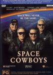

_This review was written by me for **MichaelDVD**, an Australian DVD review site that is no longer online. A capture of the site is held by the Internet Archive: **[browse it there](https://web.archive.org/web/20220217040146/http://www.michaeldvd.com.au/)**. It is reproduced here from my own copy of the site, as part of the record of what I have written._

_2000._

## The film

I can just imagine what the selling pitch of _**Space Cowboys**_would be like ...

_\[Scene: at two deck chairs next to a pool in a plush Beverly Hills Hotel ...\]_

_"I have this great idea for a new movie. It's a new space flick with a twist, combining elements from_The Right Stuff<em>, </em>Armageddon<em>, </em>Deep Impact _and_Apollo 13<em>. Add in a bit of conspiracy a la </em>L.A. Confidential<em>, throw in a few references to the Cold War, and package it with a few allusions to Western movies. We can even have a outer space version of a ride into the sunset."</em>

_"I'm not sure about this. Hasn't this sort of thing been done to death? What's the twist?"_

_"We use big name aging Hollywood stars to play the role of the astronauts."_

_"You mean it's going to be like_Cocoon<em>?"</em>

_"Kind of. It's also going to be a buddy movie, and two of the characters will have a love/hate relationship, like in_Grumpy Old Men<em>."</em>

_"Gee, I don't know about this ..."_

_"Just think about it. Getting people like **Clint Eastwood**and **James Garner**to play it won't cost as much as using **Keanu**, **Tom**or **Brad**. With the money we save we can throw in **James Cromwell**, **Donald Sutherland**, and **Tommy Lee Jones**, promote the "star studded" cast list, and the public will lap it up."_

_"Sounds good. Give Clint a ring, will you?"_

In 1958, four Air Force officers - Frank Corvin (**Clint Eastwood**), Bill Hawkins (**Tommy Lee Jones**), Tank Sullivan (**James Garner**), and Jerry O'Neill (**Donald Sutherland**) - were part of a team called Daedalus chartered with investigating the possibilities of outer space exploration. Their daredevil (dare I say "cowboy"?) attitudes and their disregard for personal safety in their desire to push the test planes past design limits have led to the destruction of several prototype planes, much to the displeasure of their commanding officer Bob Gerson (**James Cromwell**). In a fit of spite, he replaces the four would be astronauts with a monkey called Mary Ann and cancels the Air Force project to be replaced by a civilian administration called NASA.

Fast forward forty years later. Our four buddies have long since retired from the Air Force and pursuing wildly improbable careers (including Baptist minister, roller coaster designer and daredevil crop duster).

The guidance system on an old Russian "communications" sattelite called Ikon has failed and it's orbit is rapidly decaying. General Vostow (**Rade Serbedzija**) have enlisted NASA to help repair the sattelite before it burns up in Earth atmosphere and Bob Gerson has been assigned as the project leader. Because the satellite control systems are so antiquated and obsolete, none of the MIT graduates at NASA can figure out how the guidance system works (despite having access to the schematics - and before all you electrical engineers start snorting, I think this is pretty unlikely and difficult to believe too). Bob realised that the design of the guidance system seems to resemble (read: copied from) the system used for Skylab, which was designed by none other than Frank.

Sara Holland (**Marcia Gay Harden**) and Ethan Glance (**Loren Dean**) approaches Frank for help. Despite his animosity against Bob for destroying his chances for going into outer space forty years ago, he reluctantly agrees - with one condition. NASA must send him, and the original Daedalus team, as the astronauts in the space shuttle mission to repair Ikon. Reluctantly Bob agrees, but secretly plans to replace them with the backup crew and failing them in their physical check-ups. We also begin to suspect that Ikon is not quite what it seems, and there is some secret shared between Bob and General Vostow regarding the satellite.

The rest of the story is about the four old buddies stumbling through their physical check-ups and astronaut training, much to the amusement, consdescension and scorn of the much younger NASA team. In the process, they teach a thing or too to their younger colleagues and slowly gains their respect. Needless to say, despite all obstables, our cowboys do end up in space where the stakes of the mission become far higher as the true nature of Ikon is revealed.

If you can accept the far fetched nature of the plot that stretches the boundaries of credibility, not mention numerous logic and scientific goofs, then this is an enjoyable and feel good movie featuring some actors that we've known and loved for many years. I am not going to reveal the ending, which is fairly predictable. Let's just say that enjoying it requires not only suspension of disbelief, but a full cessation of all higher level brain functions.

## The video transfer

This is a pretty decent looking 2.35:1 transfer with 16x9 enhancement. The opening scenes (including studio logos) are in mock black and white for artistic reasons, but appear to be tinged blue (perhaps intentionally?). The rest of the film is in colour, and the colour saturation levels are more than satisfactory.

It's quite a sharp transfer, and I was surprised to be able to read most of the letters in the eye chart around **40:44** and **40:49** quite easily (apart from the bottom row) and even verify that the characters were reading the eye chart correctly. For the record, "Hawk" (Tommy Lee Jones) did give a 100% correct reading, right down to the "M.A.D.E. I.N. U.S.A." bit :-) but, perhaps deliberately, Clint Eastwood fluffed his reading (He said "E.F.L.E.P.T.P.L.E.P.F.L.**F**.L.E." whereas the last "**F**" should have been an "E". If this was in the script, then technically Frank has substantially less than 20/20 vision to have fluffed up that early.

This transfer has excellent black levels and owners of LCD projectors are going to love it. The space scenes all feature nicely deep and satisfying blacks.

The only MPEG artefact that I can notice is Gibb's effect ringing permeating through quite a lot of scenes, but fortunately never to the point of annoyance. This is only noticeable if you have a large display and I think most people probably won't be bothered with it. There are occasional shimmering present at various points in the transfer, noticeably in the name of the building around **32:37**-**32:39** and in the city skyline backdrop in the Jay Leno show around **63:30**-**63:39**. Curiously, there is a moire pattern around the arm lifting from the space shuttle around **80:09**-**80:14**.

There is an English for the Hard of Hearing subtitle track but I did not engage it.

This is a single sided dual layered disc (RSDL). The layer change occurs in the middle of a chapter at **67:58** rather than just between chapters. The screen freezes on Frank's face just after he's re

## The audio transfer

There is only one audio track, English Dolby Digital 5.1 encoded at 384 Kb/s. In general, I am pretty impressed with the audio track.

Dialogue is pretty clear and easy to understand, apart from some of **Tommy Lee Jones**' lines near the beginning of the film where he is trying to shout above the drone of the experimental plane. There are no audio synchronisation issues with the transfer.

Someone should tell the sound editor that "in space no one can hear you scream ..." because there is no atmosphere to carry sound waves. The last third of the film is so full of "sound effects" during the space scenes I couldn't help but be annoyed. I mean, haven't these people watched _2001 A Space Odyssey_? That's the way to portray space scenes. Silent. Eerie.

The music features a lot of excerpts from various songs, including one written specially written for the film by NSYNC. The theme played over the end credits is so sickeningly American that I had to stop myself from throwing up.

The surround channel usage is excellent, with numerous examples of panning across front and rear speakers, and use of split surround effects.

Likewise, there is extensive use of the LFE ("0.1") track for various effects. The audio track is not afraid of sending out deep bass to the all five main channels in addition to the LFE track. This is a good demonstration disc to illustrate why it is useful to have full range speakers on all channels. A good example is the space shuttle launch scene around **75:56**-**76:10**.

## The extras

This disc features a reasonable collection of extras - mainly featurettes, but rather substantial ones (totalling nearly an hour) rather than 5 minute glorified trailers. There are no deleted scenes, or audio commentaries.

### Main Menu Introduction

This is a short video sequence of a space shuttle launching from it's pad.

### Main Menu Audio & Animation

Only the main menu comes with animation and audio (Dolby Digital 2.0), the sub menus are static. All menus are 16x9 enhanced.

### Dolby Digital Trailer-_Canyon_

This is the standard Canyon trailer featuring a rather loud audio track.

### Filmographies-Cast & Crew

This is a list of film highlights (represented as a submenu linking to a set of stills) for the following cast:

- **Clint Eastwood**(Frank Corvin)
- **Tommy Lee Jones**(Hawk Hawkins)
- **James Garner** (Tank Sullivan)
- **Donald Sutherland** (Jerry O'Neill)
- **James Cromwell** (Bob Gerson)
- **Loren Dean** (Ethan Glance)
- **William Devane** (Eugene Davis)
- **Marcia Gay Harden** (Sara Holland)
- **Rade Serbedzja** (General Vostov)
- **Courtney B. Vance** (Roger Hines)

In addition, there is an additional still (when you select "Continue") that provides credits for screenplay, producer and director, but sadly these do not link to any additional information.

### Featurette-_Up Close With The Editor_ (7:05)

This is an interview with the Editor, **Joel Cox**, spliced with excerpts from the film. The featurette is presented in 1.33:1 (with film excerpts presented in pan and scan) and Dolby Digital 2.0. I found this pretty boring, except for the revelation that some space scenes were entirely constructed using CGI and the actors faces were "pasted in" to the picture.

### Featurette-_Tonight On Leno_ (11:39)

This is an extended version of the **Jay Leno** segment shown in the film, and almost qualifies as a deleted scene. The scenes (featuring **Jay Leno** doing a stand up routine on old astronauts in space, followed by a mock interview with Clinet, Tommy Lee, Donald and James in character) are presented in 2.35:1 but with no 16x9 enhancement. These scenes are spliced with a short interview with Jay Leno, presented in full frame (1.33:1). The scenes appear to be framed for 2.35:1 rather than 1.33:1 which leads me to suspect they were filmed for the film rather than as a "real" TV program.

The audio track for this feature appears to be slightly missynchronised, and the video transfer is a bit soft.

### Featurette-_The Effects_ (7:11)

This is an interview with Visual Effects Supervisor **Michael Owens**from ILM and Global Effects expert **Chris Gilman**. This is presented in 1.33:1 with excerpts from the film presented in pan and scan. The soundtrack is in Dolby Digital 2.0.

There are some video glitches around **3:59**, **4:27** and **4:30**.

### Featurette-_Back At The Ranch - A Look Behind The Scenes_ (28:12)

This is a fairly substantial behind the scenes and making of documentary featuring interviews with **Clint Eastwood**, **Tommy Lee Jones**, **James Garner**, **Donald Sutherland**as well as director of photography **Jack Green**, Production Designer **Henry Bumstead**, NASA scientific consultants **Kathryn Clark**(Chief Scientist), **Brian Welch**(Director of Media Services), **Gregory Johnson**(Astronaut), and writers **Ken Kaufman**and **Howard Klausner**. The featurette is presented in 1.33:1 with excerpts from the film presented in pan and scan. The soundtrack is in Dolby Digital 2.0.

### Theatrical Trailer

This is presented in 2.35:1 with 16x9 enhancement and Dolby Digital 2.0 with Pro Logic surround encoding. The quality of the video and audio transfer is comparable to that of the main feature.

### DVD-ROM Extras-_Web Links_

This disc, upon insertion into a computer with a DVD-ROM drive, prompts you to install the PCFriendly software. After that, you get a main menu, but as far as I can tell, all the menu items (eg. Space Station, Mission Control, and Theatrical Web site) are simply links to web pages on the Internet. All in all, pretty disappointing.

## Censorship

As far as we are aware, there are no censorship issues with this DVD.

## Region 4 versus Region 1

The Region 4 version misses out on:

- French audio track and subtitles
- Higher bitrate Dolby Digital audio track (448 Kb/s)

The Region 1 version misses out on:

- Nothing

Apart from the higher bitrate Dolby Digital audio track, I don't think the additional extras on Region 1 are all that compelling, so I would rate both as being roughly equal.

## Summary

_**Space Cowboys**_is an enjoyable romp, even if it does take a few liberties with the plot and scientific accuracy. I am still waiting for a decent space exploration movie (as opposed to science fiction) featuring some strong female characters, and unfortunately **Marcia Gay Harden** plays no more than a token role. The film is presented on a DVD with above average video and audio transfers, plus a strong collection of supplemental featurettes.

### [Ratings (out of 5)](RatingsGuide.html)

© [Tham, Christine](mailto:ChrisT@michaeldvd.com.au) (read my [biography](../ReviewerProfiles/ChrisT.asp)) Tuesday June 19 2001

| Rating  | Score         |
| :------ | :------------ |
| Plot    | ★★★½ 3.5 / 5  |
| Video   | ★★★★½ 4.5 / 5 |
| Audio   | ★★★★ 4 / 5    |
| Extras  | ★★★★ 4 / 5    |
| Overall | ★★★★ 4 / 5    |
