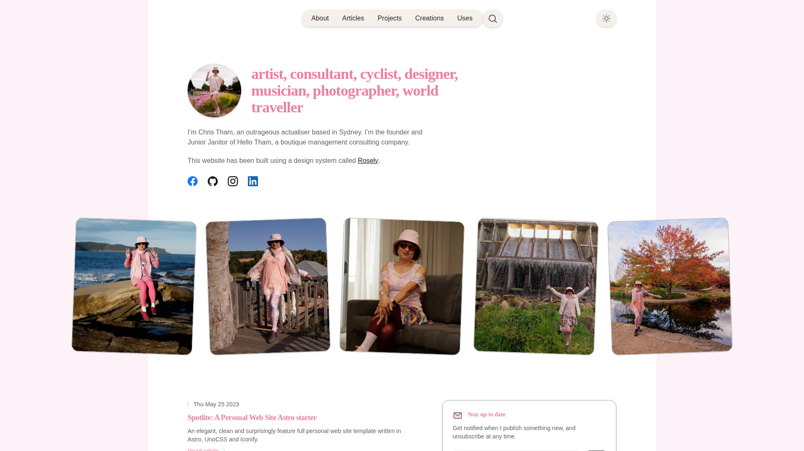

Don't you think all CVs kind of look the same these days? They tend to be boring PDF documents
that all say the same things. Employers find it hard to distinguish between candidates for
a position - everyone seems to have the same experience and skills. Job seekers often find
their submitted job applications are rejected by an AI well before a human gets to see them.

Here is a way to reinvent what a CV is: as a full function website. It can even export the
contents as an ATS compliant PDF file, to include in job applications. But hopefully a
human may be interested enough to browse through it first.

This site is called [Spotlite](https://github.com/hellotham/spotlite), a template I first
hand-coded over a weekend in 2023, when it was nothing more ambitious than a simple personal
website. During 2026 I rebuilt it with the help of two AI platforms, and somewhere along the
way it turned into something more useful: a modern CV template, with my own CV sitting inside
it as the worked example.

Everything you can see here is the demo, and all of it, from the work history to the charts to
the PDFs you can download, comes from one small folder of Markdown files.

## Write it once

The idea at the heart of Spotlite is a simple one.

Most of us keep our CV in one place and our online profile in another, and the two of them
quietly drift apart. You update one and forget the other, and six months later they are telling
slightly different stories about your own career, with no obvious way of knowing which one to
believe.

Spotlite closes that gap by letting each job live in a single Markdown file. From that one file
the template builds your work history page, your career timeline, the word cloud, the search
index and both PDF versions of your CV, so when you change a date it changes everywhere at
once. Nothing is left to drift, because there is only ever one copy of anything.

## A CV that lays itself out

Run a single command and Spotlite hands you two documents: a one-page CV for the recruiters who
have thirty seconds to spare, and a full CV with your complete history for the ones who would
like the detail.

The one-pager is the feature I am fondest of, because it measures itself as it renders, and if
your content will not quite fit on a single page it gently scales the type down until it does.
If it would have to shrink so far that the result became hard to read, it stops and tells you,
rather than handing you something you would be embarrassed to send. No more sitting up at
midnight nudging Word margins by a millimetre at a time.

Both documents are single column with selectable text, which matters more than it sounds. It
means the automated systems that companies use to scan CVs can actually read them. And since
they are generated from the same files as the website, they cannot help but agree with it.

## Charts that feel alive

A CV is really a story about a person, so Spotlite tries to tell it visually as well:

- A career timeline that draws itself from your work history.
- A skills chart where your strengths drift about like molecules, each one clickable if you
  would like the detail behind it.
- A word cloud built from the tags on your roles, where a skill that turns up in six
  different jobs floats larger than one that appears in a single job, so you can see at a
  glance where a career actually concentrated. It drifts along gently, rather like a badge
  wall that has come to life.

The motion is well mannered, too. Every animation pauses when it scrolls out of view, offers a
pause button, and switches itself off altogether for anyone who prefers reduced motion.

## Beautiful in the details

The whole template shares one design system, called Rosely, built around a warm, low-contrast
palette that works just as happily in light mode as in dark. And I do mean the whole template,
because the code samples, the diagrams and even the mathematical equations are all themed to
match, in both modes.

A few of the details go further than I have seen elsewhere. The syntax highlighting colours are
checked by an automated test, which fails the build if any one of them drops below the contrast
the accessibility guidelines ask for. The pages score 100 for accessibility in Lighthouse, and
I checked that in dark mode as well as light, having learnt the hard way how easy it is to test
only one.

There is full-site search as well, along with photo galleries with a lightbox, smooth page
transitions, social sharing cards and an RSS feed. Diagrams work straight out of the box, and
so do maths equations, rendered at build time with nothing fetched from a CDN.

## Fast, tested, free

Spotlite runs on Astro 7 and its new Rust-based Markdown engine, so builds are quick and the
pages it produces are static and fast. A suite of 119 tests keeps everything honest, and a
GitHub Actions workflow comes included, so pushing to your repository is all it takes to deploy
the site.

It is open source under the MIT licence, which means you are free to fork it, clear out my
content and make it entirely your own.

## Make it yours in an afternoon

I have tried to keep the number of things you need to touch fairly small:

- One Markdown file for each job or qualification, in the work and education folders.
- One file, `cv.json`, holding your name, headline, key achievements and contact details.
- One file, `superpowers.json`, for your skills.
- Your own photos and social links.

That really is most of it. The template looks after the rest, and my own files are all sitting
there as worked examples, in case you would rather begin by editing something than by staring
at an empty page.

## What I learnt building it with AI

Two AI platforms did the heavy lifting during the 2026 rebuild. Google Antigravity laid the
foundations, giving me the design system, the test suite, the content collections and the first
of the charts. Claude Code picked things up from there and turned it into the CV machine I have
been describing, reviewing the whole codebase along the way and quietly fixing bugs I had been
shipping for months without noticing.

What I took away from it all was happier than I had expected. AI turns out to be remarkably
good at improving something that already exists, and my hand-built little site came back better
than I could have made it on my own. The most useful question I learnt to ask was "did you
actually check that?", which has a lovely way of turning a confident answer into a verified
one. And it pays to write things down for your AI much as you would for a new colleague.
Spotlite now carries a file of hard-won notes, and every session that reads it starts off a
little wiser than the last.

The result is a template I am genuinely proud of, finished better and faster than I could have
managed alone.

So if your CV and your website have stopped agreeing with each other, please do
[help yourself](https://github.com/hellotham/spotlite).
