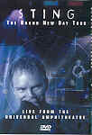

_This review was written by me for **MichaelDVD**, an Australian DVD review site that is no longer online. A capture of the site is held by the Internet Archive: **[browse it there](https://web.archive.org/web/20220217040146/http://www.michaeldvd.com.au/)**. It is reproduced here from my own copy of the site, as part of the record of what I have written._

## The film

_**Sting - Brand New Day LIVE from the Universal Amphitheatre**_is concert featuring **Sting**supported by a five-piece band and three backup singers. In addition, **Stevie Wonder**does a surprise harmonica solo in _Brand New Day_as well as a duet with **Cheb Mami**singing Arabic accompanied by **Abdel Nasser Haoua**playing the Darabukka (think of a Middle Eastern version of the congo drum and you'll be close) in _Desert Rose_.

Sting was born **Gordon Matthew Sumner**in Wallsend, England in 1951. He got his nickname whilst he was in the band **Phoenix Jazzmen**because the trombone player **Gordon Solomon**remarked that he looked like a bee. He plays guitar, bass guitar, mandolin, piano, harmonica, saxophone, and pan flute but prefers bass guitar. Most people remember Sting as the lead singer in **Police**and as a solo artist, but prior to joining the Police he has worked in various jobs including as a ditch digger and a school teacher. Prior to joining the Police, Sting was in various jazz bands.

Sting performs a mixture of old and new songs in this concert. The track listing for this DVD is:

I've listened to Sting ever since the **Police**days but more so when he went solo. The _Dream of the Blue Turtles_is a brilliant first solo album, and _Bring on the Night_a superb live double album. Both these albums featured first class jazz musicians such as **Branford Marsalis**, **Kenny Kirkland**, **Darryl Jones**- musicians who have played with the likes of **Miles Davis**and **Dizzie Gillespie**. Unfortunately, none of these musicians are with Sting in this concert, and their absence was sorely felt by me.

In their place is a relatively young group of musicians. **Chris Botti**is not bad on the trumpet, but hasn't really had the experience to be able to define his own style instead of trying to emulate the great Miles. Similarly, **Jason Robello**looks and plays so young it's painful to even compare him to the late Kenny that he replaced. The surprise of the night was **Manu Katche**who played a mean set of drums as well as doing a French rap number in _Perfect Love ... Gone Wrong_.

My favourite songs are the slower and more introspective numbers, such as _Ghost Story_and _Moon Over Bourbon Street_, but Sting generally acquits himself creditably in this concert. The encore pieces are _Message In A Bottle_and _Fragile_which are a lot more "unplugged" and "acoustic" than the concert set. Overall I enjoyed the concert, but I couldn't help thinking: Bring Back _Bring on the Night_!

Incidentally, the official Sting web site ([sting.compaq.com](http://sting.compaq.com)) seems extremely boring. I found the [Stingchronicity](http://www.stingchronicity.co.uk/) and [Sting Etc.](http://stingetc.com) sites to be more interesting.

## The video transfer

The concert is presented in a full frame aspect ratio on a single sided DVD.

In general, the transfer seems reasonably clean, with good sharpness, detail and colour saturation. Shadow detail is probably about typical for a video source.

However, there seems to be persistent signs of shimmering thoughout the concert, especially of smaller, blurrier figures. The effect looks very similar to the "combing" effect you see when a video de-interlacing circuit combines the wrong half-frames. I initially thought that the video-deinterlacing circuit in my projector must be going bonkers, then I noticed the shimmering only occurs for smaller figures, never when the camera is doing close-ups. My suspicion therefore is that the shimmering is present on the video transfer itself, and may be the result of scan conversions done prior to mastering (such as NTSC to PAL conversion). Incidentally, Bill Hunt in the [Digital Bits](http://www.thedigitalbits.com) did not mention shimmering in his review, so my guess is the shimmering is a result of NTSC to PAL conversion.

Other than the shimmering which I found quite annoying, the

## The audio transfer

This DVD has two audio tracks: Dolby Digital 5.1 at 448Kbps, and Dolby Digital 2.0 at 448Kbps. I listened to the Dolby Digital 5.1 soundtrack in its entirety, and in addition briefly listened to the Dolby Digital 2.0 track.

The Dolby track is quite engaging with a very expansive and immersive soundstage. All 6 channels (including the sub-woofer) are effectively utilised but more of the music is carried by the front left and right speakers, with the centre and rear channels mainly used to expand the soundstage. This is an excellent arrangement, as it allows most of the music to be produced by the front speakers which are usually the best speced in home theatre setups but at the same time taking advantage of all the other speakers.

The subwoofer is reasonably actively used during the entire concert to reproduce the low level musical information. If anything, I probably find the concert too "bassy" for my tastes but bass-lovers would probably rejoice.

The matering level is about 3 dB higher than average. The mix suddenly becomes even louder during Desert Rose and I had to turn down the volume control by about 1-2 dB because I didn't want to annoy the neighbours.

In comparison, the Dolby Digital 2.0 track also sounds good but with a collapsed soundstage, but as usual seems to be mastered at a lower level.

I did not detect any audio glitches or synchronisation issues. There are no subtitle tracks on this DVD.

## The extras

Given that most music DVDs don't come with any extras, the presence of an "backstage interview" featurette I suppose is a small plus, but even then they could have included at least some cast and crew biography stills or something.

### Menu

The menus are reasonably pleasing and seems to be relatively free of MPEG artefacts, unlike some DVDs I've seen. They are in full frame format and are animated. Surprisingly the chapter/song selection menus do not feature animated postcards of the chapters but then I suppose the concert footage would be very similar across songs.

### Featurette - "Backstage Footage"

This is a brief (**15:15** minutes) tour of the backstage shot just before the concert and features mini-interviews with the cast and crew. I found this mildly entertaining, but unfortunately the video and audio transfer is rather poor.

The video transfer suffers from pixelation as a result of high MPEG compression. The footage seems to have been taken using a portable camcorder rather than professional equipment. As the lighting conditions are sub-optimal, the scenes tend to look very yellowish with muted colours.

The audio transfer sounds very monophonic and low-fidelity and in addition I can detect minor audio synchonization errors in certain shots.

### Credits

This is a set of stills crediting the production team behind the DVD mastering.

## Region 4 versus Region 1

This DVD is the same the world over. This particular DVD is in the PAL format and comes with a "Made in the EU" label.

## Summary

_**Sting - Brand New Day LIVE**_ is a reasonably enjoyable concert. Although the audio transfer is excellent, the video transfer unfortunately has numerous artefacts (mainly shimmering) that appear to be interent in the video material itself. The only significant extra is a backstage tour/interview featurette.

### [Ratings (out of 5)](../ReviewersGuide/RatingsGuide.html)

© [Chris Tham](mailto:ChrisT@michaeldvd.com.au) (read my [biography](../ReviewerProfiles/ChrisT.asp)) 27 January 2001

| Rating  | Score        |
| :------ | :----------- |
| Plot    | ★★★½ 3.5 / 5 |
| Video   | ★★★ 3 / 5    |
| Audio   | ★★★★ 4 / 5   |
| Extras  | ★½ 1.5 / 5   |
| Overall | ★★★½ 3.5 / 5 |
