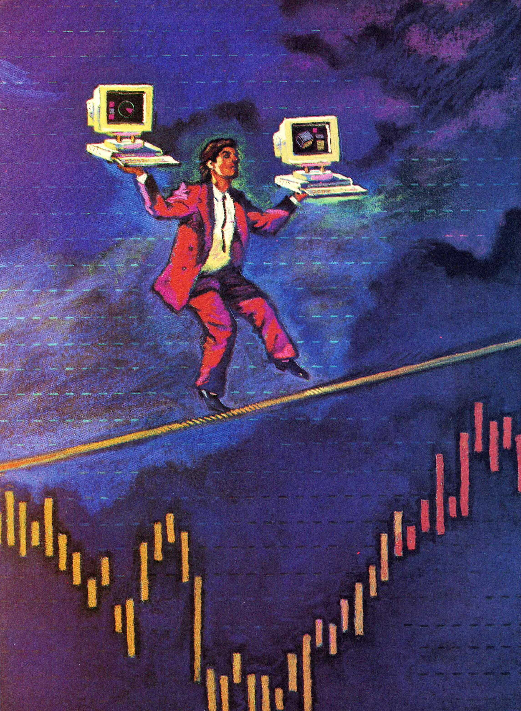

_This is a reproduction of an article from SunTech Journal, Volume 3, Number 1, Winter 1990, pages 46 to 52, published by Sun Microsystems, Inc. It was written with Tim Posney while I was at [Optech International](/spotlite/work/optech/). I have transcribed it from a scan of the issue: the wording is unchanged apart from two typesetting slips in the original, the figures are the printed ones, and the illustration is by Paul Wolf._

_This is what SunTech's readers saw. The longer version we submitted, with two sections the magazine dropped and the figures as we drew them, is [here](/spotlite/article/optech-1990/)._

_Making risk management less of a balancing act._

The treasuries of large financial institutions such as banks need to constantly control the risks associated with trading. Effective risk management depends on accurate and timely information from all dealing desks.

Various methods are available for minimizing, or hedging, financial risks, depending on the type and nature of the asset or commodity being traded. This article discusses the issues and methods of managing risks associated with trading options and provides an overview of the family of Optech Option Trading Systems.

## What Are Options?

An option is a contract that gives a buyer the right, but not the obligation, to buy or sell a fixed amount of an asset at an agreed price (commonly called the _exercise_ or _strike_ price) for a defined period of time. This approach contrasts to other financial contracts, in which a buyer is obligated to meet the terms of the contract. A _call_ option is an option to buy, and a _put_ option is an option to sell. An asset is anything that is commonly traded, such as currency, fixed-interest securities, company stocks, physical commodities, or even other options. The option writer, or seller, charges a small amount, called the option premium, for the option. The buyer can abandon the option, that is, do nothing, losing only the premium. Alternatively, the buyer can exercise the option and enter into an agreement to buy or sell the asset at the agreed price.

Consider an exporter who will receive A\$100,000 for goods in three months. The current exchange rate is 0.80 USD/AUD, which means the exporter expects to receive US\$80,000. If, after three months, the exchange rate falls to 0.75, the exporter stands to lose US\$5000. By purchasing an option to sell A\$100,000 for US\$80,000, he can choose to exercise the option and still receive US\$80,000 minus the option premium. If, however, the exchange rate is 0.85, the exporter can abandon the option and make a profit of US\$5000 minus the option premium. The expected payoff is given in the graph below.

_Figure 1. Example payoff diagram._

An option can be purchased as a form of insurance policy, protecting the purchaser from adverse price movements (see Figure 1 for an example). By buying an option, the buyer can lose, at most, the option premium from an adverse movement. But the purchaser can benefit from advantageous movements by abandoning the option.

Option purchases are also useful for contingent cash-flow situations. In the example in Figure 1, the exporter can buy the option before the sale of goods is finalized and still be protected from adverse price movements. An option purchase is attractive to buyers with poor credit ratings because they do not require prior credit approval for the underlying transaction, merely the ability to pay the premium. Finally, options are attractive as speculative instruments when the price of an asset is expected to move in a specific direction. Options have limited risk and are not generally subject to margin calls.

## Risks and Options

The option writer gains, at most, the option premium from a sale but risks unlimited loss, being exposed to the full extent of price movements in the underlying instruments. Large-scale option writing by traders in bank treasuries can create a position with unacceptable risk unless methods are used to contain or minimize the risk due to the exposure. The method of accomplishing this is to hedge the portfolio through trades that solely minimize risks.

Ad hoc or manual hedging methods typically involve the use of spreads (the simultaneous purchase and sale of similar options) or straddles, which involve the purchase of equal numbers of both call and put options of the same type.

Spreads seek to use an option purchase to reduce the risk of the option sale and vice versa. Straddles allow an option writer to be protected from market movement in either direction. The effective use of ad hoc strategies such as these requires careful judgment by the hedge trader, which can be obtained only from experience. The use of spreads and straddles also results in a reduction in profit from the option sale.

Modern computerized hedging techniques involve the quantitative evaluation of risks, based on mathematical models of option pricing, together with continuous dynamic trading based on monitoring of positions and a means of mathematically determining hedging trades.

## Risk Immunization

Hedging relies on developing accurate mathematical models for the fair price of option premiums and hedging instruments. A hedging instrument is a financial contract used to hedge the sale of an option, which can be as simple as buying or selling a portion of the underlying asset. The fair price of a financial instrument is the expected value of the instrument if current market conditions prevail.

Depending on certain assumptions about distribution of asset-price movements, the fair price of an option premium is determined by five main factors:

- The current asset price.
- The strike price of the option.
- The time to maturity of the option.
- The interest rate for holding the underlying asset.
- The volatility of the asset price, an indication of the variation of asset price with time.

These are the only quantifiable influences on the premium. The fair price is a function of these factors. In practice, nonquantifiable factors, such as market expectations, can also affect the premium. The writer is exposed to the risk of changing market conditions, that is, to the risk of any of the above factors changing from the time the option is sold to the time it is exercised. From the pricing model, the partial derivative of the fair price with respect to any one of these factors can be derived, giving a measure of the risk due to a change in that factor.

Risk immunization consists of constructing a series of hedging trades such that the sum of the risk measures for the hedging trades are equal to and opposite from the risk measures of the option. If the option and the set of hedging trades are traded as a group, the resultant portfolio will not be affected by market movement.

Risk immunization occurs only for limited periods. Large or sudden market movements will cause the portfolio to lose immunization and must be rebalanced; rebalancing involves constructing new hedging trades. Risk management also entails performing sensitivity analyses of how a portfolio will respond to changes in market conditions, and simulations of predicted or historical market movement give an indication of the effectiveness of rebalancing.

## The Optech Option Trading Systems

Option Technology is developing options-trading systems with advanced risk-analysis and control facilities. The primary objective is to design a risk-management system that is directly linked to trading-floor activities. To achieve this goal, Option Technology has identified the following properties as requirements in a trading or risk-management system:

- Continuous monitoring of market activity via a digital interface to market-data services.
- Online, realtime capture of a trade.
- Fast, accurate pricing of trades.
- Accurate, timely risk analysis and reporting.
- Effective security system.
- Advanced error detection, logging, recovery.
- Fault-tolerant operation.

In order to fulfill the above requirements, Option Technology has decided on a portable fault-tolerant distributed approach. The systems are written entirely in the C and C++ languages. The software currently runs on Sun workstations under SunOS 4.0.3 but is designed to work in a heterogeneous NFS (Network File System) environment. Distributed processing is achieved because activity is spread among machines in the network. Replication of critical processes across the network offers fault-tolerant operation. All database transactions go through a machine running the Sybase SQL database server. Normal file access is provided by networked fileservers.

Two kinds of user interfaces are available. Front-office trading and risk analysis are performed on bitmapped workstations running the X11 window system. Back-office trade modification, confirmation, reporting, and maintenance are accessed from a screen-oriented interface from inexpensive character terminals connected to a networked minicomputer or fileserver.

Optech trading systems feature:

- Open architecture, modular design. The system is designed as a collection of building blocks or software modules that are joined into applications. Module interfaces are flexible enough that modules can be replaced or extended without affecting other modules in the system.
- Reliability and integrity. In order to ensure database consistency, the system rolls back all failed transactions. It logs all transactions to provide a complete audit trail. It applies automatic data-consistency checks as a guard against data corruption/<wbr>inconsistency/<wbr>tampering. The system can automatically detect hardware/software failures in the network and compensate/readjust.
- Interfaces to data feeds such as Reuters. These interfaces allow continuous monitoring of market activity and movement. Sophisticated data filters avoid use of anomalous data. Users can manually override data.
- Online trading with deal-capture and back-office support for trade confirmation and accounting/auditing.
- Realtime risk and sensitivity analysis. This analysis automatically revalues portfolios and recomputes risk measures as the market changes. As an aid to risk immunization, users receive suggestions for rebalancing trades.
- Fast simulation of random, predicted, or historical market movements.
- Extensive reporting and auditing facilities.
- Interfaces to external systems, such as mainframe accounting systems.

## System Architecture

Optech option systems are distributed across a network, and hence each system does not consist of one monolithic executable but a group of related applications that work closely together in an integrated environment. Each application is designed to work by itself or in conjunction with other applications in the system, no matter where they are located on the network. Interapplication communication is performed by the TCP/IP socket mechanism via the X11 window system for point-to-point communication and through the Sybase SQL DataServer or remote procedure calls for broadcast communication.

The following applications have been developed for the Optech system:

- Pricing and Trading Screen (PTS). This screen gives traders a window in which they can do online trading. A trader can perform operations on the PTS such as entering option details and accessing live market data and using it to price options. Traders can view the risk measures associated with a portfolio and the effect a new trade will have on the risk measures. The system can suggest hedging trades for new option trades. The PTS is built from advanced screen-design tools and is customized for the kind of options being traded. Figure 2 shows how trading activity is centered on the PTS. Figure 3 gives examples of trading screens currently under development.
- Greek Letters Module (GLM). The GLM is a daemon that continuously revalues and recalculates the risk measures of all portfolios in the Portfolio Database in response to changing market data. The GLM is a transparently distributed application. Multiple instances of the GLM can start across machines in a network and behave as one application. The GLM is also fault-tolerant: Different instances can be started and stopped at any time.
- Sensitivity Analysis Module (SAM). This module allows users to determine exactly how the value of a particular portfolio and associated risk measures will change should the market move in a particular way. Users can enter sensitivity-analysis parameters and then view the results as a graph on-screen or as a report on the printer. Users can alter up to two market parameters independently, viewing the effects on portfolio value and risk measures.
- Simulator (SIM). This application analyses the effects of rebalancing on portfolio value and risk measures when random or historical market movements are applied. Simulation results are effective for analyzing the effectiveness of different hedging techniques. The user interface allows simulation results to be printed as a report or displayed on-screen as a graph.
- The Clipboard (CLB). The Clipboard passes data between parts of the trading system and stores data for later retrieval. Different types of data can be passed not only from one instance of an application to another on one machine but also across machines of different architectures within the network. The Clipboard window shows current Clipboard entries and allows users to extract or post entries.
- The Communications Module (COM). This application retrieves relevant market/economic data from information providers such as Reuters or Micrognosis. It interfaces to a digital information channel, such as a Reuters RDCDF unit, and automatically updates the market-information database. Page-translation algorithms convert text screens into relevant data according to predefined formats. Screen pages are archived for future analysis and simulation purposes. Sophisticated error detection and recovery from hardware failure are available.
- Report Daemon (RPD). This daemon handles generating and printing scheduled reports on an automatic or semiautomatic basis.
- Back-Office Support. The Back Office application has a character-oriented interface to back-office staff, allowing the performance of day-to-day system operations.

_Figure 3a. Foreign-exchange options-trading system._

_Figure 3b. Caps, floors, and collars trading system._

_Figure 3c. OTC bond-option trading system._

## The Optech Libraries and Modules

All Optech applications are written using the various modules in the Optech system. Each module handles one aspect of the system, and the source code for every module is encapsulated in an object-code library that Optech applications link with.

- Pricing module
- Transaction Processor module
- Market Event Calendar library
- Time Series Database library
- Live Data Repository library
- Security Access Control module
- Clipboard library
- Report library

## Conclusion

Graphical user interfaces and networked-workstation technology are gaining rapid acceptance within the finance industry as tools for management of trading-floor activities. The volume and rate of trading and the complexity of risk management demand fast response to market changes. In a rapidly expanding market, a distributed approach provides the extensibility that is required. Although designing a distributed system imposes substantial software-engineering challenges, it also offers many benefits, including concurrency and fault-tolerance. The resulting implementation can be made efficient, despite the networking overhead, through careful division of labor throughout the network.

The Optech FX (Foreign Exchange) options-trading system is currently undergoing alpha testing, and the development of an interest-rate system is already underway. The system currently consists of more than 250,000 lines of source code and takes up in excess of 5 megabytes of storage. Stripped executables range from a few hundred kilobytes to more than 1 megabyte in size depending on the complexity of the application. A port of the system to the IBM RT workstation under the AIX operating system is nearing completion, and a port to DECstations running the VMS operating system will soon commence.

## Acknowledgments

A system as large or as complex as a trading system cannot be developed by one or two persons, and space precludes us from listing all the members of the development team. We would like to mention Andrew Carroll, Garry De Jager, and Michelle Rembel for their invaluable contributions to the project. We would also like to thank John Cornwall, Ralph McKay, Robert Lee-Johnson, and Jenny Spence for their help in preparing this article.

## References

- J.O. Grabbe, _International Financial Markets_, Elsevier Science Publishing Co., Inc., NY (1986).
- J.C. Cox and M. Rubinstein, _Options Markets_, Prentice-Hall, Inc., Englewood Cliffs, NJ (1985).
- P. Ritchken, _Options: Theory, Strategy, and Applications_, Scott, Foresman & Co., Glenview, IL (1987).
- J.R. White and J.A. Kaehler, "How to Hedge Option Positions," Software Options, Inc. (1984).
- R. McKay, "New Generation Treasury Technologies: The Fundamental Characteristics," paper presented at the Sun Microsystems Banking Conference, London, October 4, 1989.
