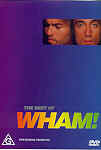

_This review was written by me for **MichaelDVD**, an Australian DVD review site that is no longer online. A capture of the site is held by the Internet Archive: **[browse it there](https://web.archive.org/web/20220217040146/http://www.michaeldvd.com.au/)**. It is reproduced here from my own copy of the site, as part of the record of what I have written._

_1997 · directed by ?._

## The film

Ahh - the follies of youth! I can still remember the heady years of the Eighties, watching _"Wake Me Up Before You Go-Go"_ on _CountDown_ and wondering where I can find a "Choose Life" T-Shirt, thinking to myself how wonderfully handsome **George Michael** is, and playing _"Careless" Whispers"_ over and over again whilst clutching the album cover and sighing deeply every so often.

**Wham!** is a two-man pop group formed in 1982. It consists of **Georgios Kyriacos Panayiotou** a.k.a. **George Michael** (born in London in 1963) as the lead singer and vocals and **Andrew Ridgeley** (born in Windlesham in 1963) as the guitarist. The songs _Wake Me Up Before You Go-Go"_ and _"Careless" Whispers"_ topped the charts around the world and made Wham! a household word (even in China, where they toured in 1985). After a few more hits, the two split in 1986. George went on to pursue a moderately successful solo career and Andrew joined the "Where Are They Now?" category of once-famous pop stars.

Watching this collection of music videos nearly twenty years later, I can't believe how come I didn't spot ... well ... how _feminine_ Andrew and George looked. I mean, from certain angles Andrew can almost pass for **Celine Dion**'s sister, and as for George's immaculately coiffed hairdo and dancing style ... these guys look more like teenage girls trying to look butch than the street smart boys that they are attempting to present as. To be fair however, the early eighties was a period where many male pop stars experimented with gender bending (remember **Boy George**, **Marilyn**, whatshisname from **Dead or Alive** and the lead singer from the **Human League**?).

I am bitterly disappointed that this collection does not include my personal favourite: _Careless Whispers_. There are some who claim that it is really a George Michael song and not a Wham! song. I seem to recall someone suing George Michael for copyright infringement relating to that song - maybe that's why it's not included here. Whatever the reason, I would have really liked to see the music video again after all these years.

This disc contains the following songs/music videos:

|  |  |
| :-- | :-- |
| 1. WHAM Rap! 2. Club Tropicana 3. Wake Me Up Before You Go-Go 4. Last Christmas 5. The Edge Of Heaven | 1. Where Did Your Heart Go? 2. I'm Your Man 3. Everything She Wants 4. Freedom |

All in all, we only get around 45 minutes of songs on this collection - hardly enough to even fill a CD.

## The video transfer

As this disc contains a collection of concatenated music videos, I'll provide separate comments for each video. Some videos are in full-frame, others are in 1.85:1 letterboxed. Obviously, there is no 16x9 enhancement on any of the videos.

For once, we actually get song lyrics in the subtitle tracks (English and French)! I turned on English subtitling, and was rewarded by being able to sing along with the duo. The lyrics are pretty accurate, except for the very occasional minor mistake.

| **Title** | **Aspect Ratio** | **Comments** |
| :-- | :-- | :-- |
| WHAM Rap! (Enjoy What You Do) | 1.33:1 | This, being the oldest music video in the collection, really shows its age. The film source has a number of marks, and exhibits quite a lot of grain. Black levels are rather poor. The transfer is quite soft, but thankfully is free of artefacts. |
| Club Tropicana | 1.85:1 | In contrast, this features a really good transfer, showing good sharpness, detail and colour saturation. The film source is in much better quality than the previous music video. |
| Wake Me Up Before You Go-Go | 1.33:1 | This transfer is a little bit soft, but otherwise looks pretty much like how I remembered it in 1983. |
| Last Christmas | 1.85:1 | This is an even softer transfer, but maybe deliberately so, since I remembered it was pretty soft even when it first appeared on TV. |
| The Edge of Heaven | 1.85:1 | This is shot in black and white, and features bried excerpts from their previous music videos (including _Careless Whispers_!). The transfer looks pretty sharp with moderate contrast. |
| Where Did Your Heart Go? | 1.85:1 | This is another black and white video. The film seems to have slightly more grain than the previous video clip. |
| I'm Your Man | 1.33:1 | Yet another black and white production. In common with the trend started by **Michael Jackson**'s _Thriller_ music video, this one features a bit of a mini-plot prior to the beginning of the song. |
| Everything She Wants | 1.33:1 | Another black and white one (did they run out of money to buy colour film, I wonder?). This appears to be presented in 4:3 aspect ratio, but letter-boxed and mail-slotted so that a black frame surrounds the video clip. This is the one where Andrew sports a "Celine Dion" lookalike hairdo. It appears to be edited from a concert performance. |
| Freedom | 1.66:1 | This is in colour, but features a rather soft and slightly desaturated transfer, probably because it was shot from a portable video camera on location in China. It starts off with a mini-featurette on the band's experiences touring China. |

## The audio transfer

There are two audio tracks on this disc: English Dolby Digital 5.1 (448 Kb/s) and English Dolby Digital 2.0 (256 Kb/s). I listened to both audio tracks.

The Dolby Digital track is rather loud and appears to have been aggressively remixed into 5.1 surround. It is quite listenable but features a lot of high-frequency sibilance that may be an artefact of Dolby Digital encoding.

The Dolby Stereo track is mastered at an extremely low level and seems to have rolled out bass and treble. I would classify it's quality as being not much better than AM radio. I would have far preferred a PCM audio track, and let's face it - if the main feature is only 45 minutes long we should have been able to go the whole hog and offer PCM as well as DTS!

## The extras

This disc is pretty light on in terms of extras. I would have thought they'll be lots of publicity material that must be locked away in some Wham! archive (in terms of interviews, promotional material etc.) that can allow someone to compile a very interesting bag of extras to accompany the music videos. I suppose the song lyrics in subtitle tracks may possibly qualify as an extra since so few music DVDs has this as a feature.

### Menu

Ho hum. Static. Boring.

### Discography

This consists of four stills showing the album covers and listing the song titles of the four Wham! albums ever produced (two of which appear to be compilation albums!).

## Region 4 versus Region 1

This disc is coded for all regions, so I would hazard a guess that it is the same the world over apart from PAL/NTSC formatting.

## Summary

**The Best of Wham!** takes me on a trip down memory lane. Pity _Careless Whispers_ wasn't included. I suppose the video and audio transfers are about as good as they will ever be given the film sources, but the minimalist DVD could do with some nice extras.

| Rating  | Score       |
| :------ | :---------- |
| Plot    | ★★★ 3 / 5   |
| Video   | ★★★ 3 / 5   |
| Audio   | ★★★ 3 / 5   |
| Extras  | ½ 0.5 / 5   |
| Overall | ★★½ 2.5 / 5 |
