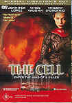

_This review was written by me for **MichaelDVD**, an Australian DVD review site that is no longer online. A capture of the site is held by the Internet Archive: **[browse it there](https://web.archive.org/web/20220217040146/http://www.michaeldvd.com.au/)**. It is reproduced here from my own copy of the site, as part of the record of what I have written._

_2000 · directed by Tarsem Singh._

## The film

Ever since I heard about _<strong>The Cell</strong>_, I have been eagerly awaiting to see what it is like. I heard it had some pretty surreal scenes but not much of a plot. That turned out to be a pretty accurate summary of the film.

There is really not much of a plot - this film is supported and survives mainly on the basis of the spectacular (and on occasion quite disturbing) visual effects, costumes and scenes depicting the imagery inside a schizophrenic human mind. Indeed, what little there is in the plot is highly derivative and reminiscent of other films. The quote on the front cover of the DVD package says _"The Matrix meets Silence of The Lambs"_. Well, those are not just the two films that the plot has referenced or borrowed from - certain scenes reminded me strongly of _2001: A Space Odyssey_, _Twin Peaks_, _The Thirteenth Floor_, _Coma_ and number of other films.

Catherine Deane (**Jennifer Lopez**) is working in an institute ("Campbell Center") which has pioneered a radical approach to psychotherapy. Researchers Dr. Miriam Kent (**Marianne Jean-Baptiste**) and Dr. Henry West (**Dylan Baker**) have developed a method of connecting two people such that one person can literally enter the mind of another and experience it as a self-contained world (kind of like a Vulcan mind meld I suppose but using fancy technology). Catherine has been chosen as a psychotherapist who is particularly gifted in using this technique to "reach" autistic / comatose / schizophrenic patients.

In the meantime, FBI agents Peter Novak (**Vince Vaughn**) and Gordon Ramsey (**Jake Weber**) are trying to discover the identity and whereabouts of serial killer Carl Stargher (**Vincent D'Onofrio**). He abducts young pretty women one at a time and keeps them in a room in a secret location. After about 40 hours the room slowly fills with water until they are slowly drowned. Unfortunately, by the time the FBI finds Carl, he has fallen into an irreversible coma so they don't know where the secret location is (containing his latest victim). Now, Catherine must race against time to explore the twisted mind of the killer to get the information she needs, but if she "forgets" that what she sees is not real she may get trapped in the prison of her mind and even be killed.

The opening scene, featuring Catherine in the mind of a young child has some superb panoramic desert scenes reminiscent of _Lawrence of Arabia_. The scenes featuring Carl and what he does to his victims are pretty gruesome - yuck yuck and yuck! The hunt and capture of Carl are fairly ho-hum and the film didn't really start capturing my interest until the infamous "mind of a killer" scenes starting on Chapter 12. Even then, the film seem to have some slow moments that do not "gel" with the rest of the film and the plot and storyline don't "hang together" perfectly.

Overall I would say the film is watchable, even if only for the psychedelic scenes, but I am not sure it will be something I will watch over and over again. One piece of advice to director **Tarsem Singh**: it's all very well to have great visuals, but visuals should and MUST play second fiddle to the storyline. A film with a great storyline and poor visuals can still be a great film, but a film with great visuals but a poor storyline is just eye candy.

## The video transfer

The film is presented in it's original aspect ratio of 2.35:1 (letterboxed with 16x9 enhancement). In general, the transfer quality is good but falls one or two notches below reference quality in terms of sharpness and colour saturation. There is a lot to like about the transfer, but there's also a few minor problems. I guess I am mildly disappointed because I have very high expectations of New Line transfers. If this had not been a New Line film I probably would have been reasonably happy with the transfer.

The opening sequence, featuring Catherine in Edward's desert world, seem to exhibit a moderate amount of chroma separation, particularly noticeable in Catherine's white outfit - the right edge is reddish and the left edge is bluish. I suspect this artefact is actually present in the film source and may be a result of special effects processing, since the opening titles (also white) do not exhibit any chroma separation.

The film source is relatively clean, but exhibits minor amounts of grain, particularly in the opening sequence showing the sand dune and the sky. The grain is also particularly noticeable (and objectionable) around **73:12-73:14**.

The end titles exhibit minor jerkiness in the characters as they scroll upward, leading me to suspect that the video transfer may have been upconverted from NTSC to PAL. The video transfer also exhibits minor MPEG artefacts such as Gibb's effect and posterization.

The disc only has one subtitle track, English for the Hard of Hearing. I turned this track on for part of the film. It seemed reasonably accurate but is not very good at providing descriptions of non-verbal auditory cues in the soundtrack so if I was really hard of hearing I would definitely miss some of the subtler aspects of the soundtrack.

This is a single sided dual layer disc (**RSDL**). The layer change occurs in **91:23** in between scenes but is still somewhat noticeable due to the split second freeze in the video and break in the audio.

## The audio transfer

There are no less than four audio tracks on this disc (all in English): Dolby Digital 5.1 (448Kb/s), Dolby Digital 2.0

(192Kb/s), audio commentary Dolby Digital 2.0 (192Kb/s) and isolated music score Dolby Digital 5.1 (448Kb/s). I listened mainly to the English Dolby Digital 5.1 track.

Although there are no fundamental issues with the audio track, it is mastered at a relatively low level (about 4 dB lower than "normal"). Dialogue quality was okay - there were a few lines which were harder to understand because of they were spoken rather fast or too softly. I did not detect any audio synchronisation issues.

The audio track features quite aggressive usage of the surround speakers but interestingly is not really as bass-heavy as one might expect so the sub-woofer would have been only occasionally utilised. The surround speakers are used for ambience, sound effects and also music. Despite the hype, this is not really an "explosion and effects" kind of film from an audio perspective and is actually quite dialogue focussed. The music score is vaguely Middle Eastern/Indian influenced married to the standard "epic film" lushness.

## The extras

This disc has an excellent collection of extras, although the video transfer for some of the items could be improved. There seems to be a concerted effort to present as much material in 16x9 enhancement mode as possible (which I think is a very worthy goal), even (I suspect) to the extent of cropping a 4:3 featurette into 16:9 (which is not so great).

### Menu

The menus feature rather extensive animation and sound, including an introduction, and animated scene selection. They are 16x9 enhanced.

### Dolby Digital Trailer-Canyon

Somehow, this trailer fits with the overall look and feel of the film. It is presented in 2.35:1 aspect ratio with 16x9 enhancement.

### Audio Commentary-_Tarsem Singh (Director)_

This is **Tarsem Singh**'s first feature film (his previous experience has been in directing commercials and music videos). He is obviously super-enthusiastic and happily rattles on various aspects of his experiences directing the film, the choices he had to make and various influences and constraints - the studios, test screenings, actors etc. He speaks quite fast, so you would need to pay attention to catch everything - particularly if you are not used to his accent.

### Isolated Musical Score

This track contains just the music portion of the soundtrack, encoded in Dolby Digital 5.1 at 448 Kb/s. I listened to the first ten minutes of this track and it is basically as advertised. Not being terribly interested in the musical score, I did not listen further.

### Deleted Scenes-_8 +/- Director's Commentary_

The DVD release features 8 deleted scenes (7 with the option to turn director's commentary on or off). The deleted scenes are presented in 2.35:1 letterboxed with no 16x9 enhancement but with frame counters/timers on the bottom, "Property of New Line Cinema" on top and "Jesse Flores" around centre left (who _is_ Jesse Flores?). The quality of the video transfer for the scenes is rather poor, with lots of MPEG artefacts such as Gibb's Effect marring the scenes. The audio transfer is likewise tinny sounding in Dolby Digital 2.0 I would rate the quality of the transfers as not much better than VHS quality.

1. Trapped in the cell (1:00) This features the girl in the water tank: she tries to eat, she counts to thirty, and screams when the water doesn't shut off when she reaches thirty (this sceen was, in part, in a version of the trailer)
2. Despair in the cell (0:40) This features the girl in the water tank again, but she beats on the glass in the dark, screaming randomly.
3. Extended raid (3:26) A modified version of the initial strike on Carl's house, involving a single FBI agent running across the street, over the fence, and onto Carl's lawn; he sees Carl, unconsious on the floor in his kitchen, via mirror (followed immediately by the initial infiltration)
4. Early exit (1:52) A previously unseen session with the child in the desert; the session is interuppted by outside influence, and we see a man place the fabric over Lopez's eyes as she passes out (immediately before the scene where the institute director says 'We have a situation'). This scene ties in with the ending, and I wished they had left it in.
5. Novak and Ramsey (1:30) A scene where, shortly after arriving at the institute, Peter and his partner talk by a statue (completely improvised, according to the director's commentary)
6. Stargher's room (3:24) This is an alternate ending, where the film ends without the final scene featuring Edward in Catherine's mind, and the camera does an incredibly long and slow pan across the ceiling of Carl's room after the long shot of the schoolyard. The end credits are then supposed to be superimposed on top of this.
7. Extended confrontation with Carl (4:15) An extended and modified version of the conversation between Lopez and D'Onofrio at the bathtub (where Carl is taking apart his first victim)
8. Extended police briefing (2:48) This scene is an extended version of the scene where Novak and Ramsey brief the policemen hunting for Carl. This deleted scene does not provide the option for director's commentary.

### Featurette-_Style As Substance: Reflections On Tarsem_ (11:50)

This is a short documentary featuring interviews with various members of the cast and crew where they are all singing praises about the creative genius of the director (bit indulgent, I thought). The interviews are intermingled with excerpts from the film. Interestingly enough, it is presented in 1.78:1 with 16x9 enhancement but I suspect the original source may have been in full frame as the tops and bottoms of some the faces during the interviews are cropped off.

Cast and crew featured in this documentary include (in order of appearance):

- Tarsem Singh (Director)
- Jennifer Lopez (as Catherine Deane)
- Michelle Burke (Make-up Supervisor)
- Paul Laufer (Director of Photography)
- Kevin Tod Haug (Visual Effects Supervisor)
- Richard "Dr." Baily (Digital Animator)
- Marianne Jean-Baptiste (as Dr. Miriam Kent)
- April Napier (Costume Designer)
- Vincent D'Onofrio (as Carl Stargher)
- Vince Vaughn (as FBI Agent Peter Novak)
- Jake Weber (as FBI Agent Gordon Ramsey)
- Dylan Baker (as Dr. Henry West)
- Mark Protosevich (Writer)
- Howard Shore (Composer)
- Eiko Ishioka (Specialty Costume Designer)
- Tom Fadden (Production Designer)

### Featurette-_Visual Effects Vignettes_

This features six 'making-of' mini-featurettes (featurettas?) of various scenes in the film with multiple camera angles. This is a really cool and novel way of presenting the material and I hope other people will start copying the concept. Basically, each featurette has three camera angle.

Angle 1 features an interview with Kevin Tod Haug and/or Richard Baily, plus we get "picture-in-picture" views of angles 2 and 3. Angle 2 features either excerpts from the film or shots describing how they constructed the scene. Angle 3 features the storyboards behind the scene.

The idea is that you would normally watch Angle 1 unless you see something interesting in angles 2 and 3 and then you can switch to it if you want. Amazingly, all the mini-featurettes here are presented in 1.78:1 with 16x9 enhancement. The video quality for the interviews are a bit soft, though and angle 2 is about VHS quality. Angle 3 is not too bad, though.

- The Hoist (3:10)
- First entry (5:36)
- Second entry (6:12)
- Novak's entry (3:44) - also includes the original outlines notes for the sequence (set of stills)
- Catherine's world (3:15)
- Edward's world (1:53) - this one is missing angle 3

### Theatrical Trailer-_2_

Both trailers are presented in 1.85:1 aspect ratio with 16x9 enhancement. The video and audio transfers are excellent (in fact, reference quality) and the audio track is Dolby Digital 5.1 (mastered at a much higher level than that for the film itself):

- Theatrical trailer (2:18)
- International teaser (1:25)

### Filmographies-Cast & Crew

This is a set of stills featuring the filmographies of various cast & crew:

- Jennifer Lopez (as Catherine Deane)
- Vince Vaughn (as FBI Agent Peter Novak)
- Vincent D'Onofrio (as Carl Stargher)
- Marianne Jean-Baptiste (as Dr. Miriam Kent)
- Jake Weber (as FBI Agent Gordon Ramsey)
- Dylan Baker (as Dr. Henry West)
- Tarsem Singh (Director)
- Mark Protosevich (Writer)
- Howard Shore (Composer)
- Kevin Tod Haug (Visual Effects Supervisor)
- Michelle Burke (Makeup Designer)
- April Napier (Costume Designer)
- Eiko Ishioka (Specialty Costume Designer)
- Tom Fadden (Production Designer)

### Interactivities-_Empathy Test_, _Brain Map_

The empathy test is pretty cute. It's a set of menu screens featuring multiple choice questions. Once you've finished answering all the questions, it gives you the test results. I managed to get an "ok but needs improvement" rating :-(

The brain map is a set of stills providing information on the brain and various areas of the brain. For each area of the brain it provides information on location, function and dysfunction.

## Censorship

As far as we have been able to ascertain, there are no censorship issues with this title. The version shown on this disc is the European (and presumably also Australian) theatrical release which includes the scene where Carl Stargher hangs on his piercings, masturbating over the dead body of a woman. This scene was not included in the US theatrical release.

## Region 4 versus Region 1

The Region 4 version of this disc misses out on;

- Second Audio Commentary with production team
- DVD-ROM extras

The Region 1 version of this disc misses out on;

- Nothing of consequence<em></em>

Hello, Village Roadshow, are you listening? I am getting pretty sick and tired of the R4 versions of New Line films missing out on the second audio commentary present on the equivalent R1 New Line Platinum series discs. It seems to be a worrying trend - _Pleasantville_, _Frequency_ and now _The Cell_. I know that the R1 discs are sardine packed with extras so it's difficult to try and fit everything in as well as a PAL transfer, but given the recent trend of 2-disc sets why can't we get all the extras on a second disc plus a great transfer and commentaries on the first? Given that the video and audio transfers of the R4 version fall short of reference quality, I am now incredibly tempted (but for the shocking AUD/USD exchange rate) to order the R1 version to see what it's like.

## Summary

**The Cell**, is a superb (and somewhat disturbing) visual feast, but unfortunately is let down by a disappointing and insubstantial plot.

It is presented on a fully featured DVD with excellent video and audio transfers.

The extra collections are very generous and well put together (in particular the use of multiple camera angles for "making of" featurettes is a good innovation) but are missing the second audio commentary and DVD-ROM extras present on the R1 New Line Platinum Series edition.

| Rating  | Score         |
| :------ | :------------ |
| Plot    | ★★½ 2.5 / 5   |
| Video   | ★★★★ 4 / 5    |
| Audio   | ★★★½ 3.5 / 5  |
| Extras  | ★★★★½ 4.5 / 5 |
| Overall | ★★★½ 3.5 / 5  |
