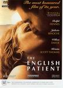

_This review was written by me for **MichaelDVD**, an Australian DVD review site that is no longer online. A capture of the site is held by the Internet Archive: **[browse it there](https://web.archive.org/web/20220217040146/http://www.michaeldvd.com.au/)**. It is reproduced here from my own copy of the site, as part of the record of what I have written._

_1996 · directed by Anthony Minghella._

## The film

_**The English Patient**_won numerous awards when it was released in 1996 - nine Oscars (including Best Picture, Best Director, Best Supporting Actress, Best Cinematography, Best Music and Best Sound), two Golden Globes (Best Film and Best Original Score), six BAFTA awards (including Best Film, Best Screenplay, Best Cinematography, Best Editing and Best Supporting Actress). Although it has been available as a Region 1 DVD since 1998, Region 4 fans of this film have had to wait till now. So, is the wait worthwhile and is the film still worth watching five years later?

Well, all I can say after watching it is that I don't think you will be disappointed, either in the quality of the firm nor the quality of the transfer on DVD. The film is as moving and as powerful as I recalled it, and the screenplay by **Anthony Minghella**is a masterpiece in its poetic imagery, subtlely, scintillating wit and cohesiveness - the last trait all the more surprising given the rather disjointed nature of the novel (by **Michael Ondaatje**) from which it is based. Anthony reduces the multiple storylines of the novel into two intertwining and connected stories - each one of which would have been worthy of a great film in its own right.

The first story is set in the 1930s just prior to World War II, and it is about a grand and ultimately destructive adulterous love affair between Count Almásy (**Ralph Fiennes**) - a Hungarian pilot engaged in mapping the Sahara Desert as part of a Royal Geographic Society expedition - and Katharine Clifton (**Kristin Scott Thomas**) - the wife of another member of the expedition. The first half of the film is the delicious build up to the affair, and the latter half of the film explores the dramatic consequences of the affair. **Colin Firth** ("Mr. Darcy" of the BBC mini-series of _Pride and Prejudice_) plays a cameo role as Katharine's husband Geoffrey.

The second story is a more gentle one, set in the 1940s in the final days of World War II, about a shell shocked and heart broken Canadian nurse called Hana (**Juliette Binoche**) caring for an "English" patient who has been burnt horribly in a fiery plane crash after being shot down. The patient has been badly disfigured and is in constant pain. He can't or won't remember his past, even his name. Realising that he has not long to live, Hana decides to devote her attention to making his last days as comfortable as possible in a crumbling Italian villa. Soon she is joined by various "guests" - a strange man called Caravaggio (**Willem Dafoe**) who is determined to uncover the patient's past, and two bomb disposal officers Kip (**Naveen Andrews**) and Hardy (**Kevin Whately**).

The first story is mainly told as a series of flashbacks from the wandering thoughts of the dying patient, and we gradually realise the two stories are connected. By the end of the film, we learn not only the identity of the English patient but a number of other dramatic revelations as well.

## The video transfer

Region 4 fans who have waited a long time for this title to appear on DVD will not be disappointed by the video transfer quality. Although this is not a perfect transfer, it is more than acceptable and will satisfy all but the perfectionist.

The film is presented in it's original aspect ratio of 1.85:1 with 16x9 enhancement. The quality of the transfer is evident right from the start, where there is a lot of subtlety and detail in the canvas or parchment or whatever it is that the brushstrokes of swimming figures are being applied to.

The film source is close to perfect, apart from very minor white marks in few frames. There is the slightest hint of grain in various shots but never at a level where it starts being highlighted by the MPEG encoder. Speaking of MPEG, there are minor instances of MPEG artefacts present in the transfer, notably the Gibb's effect ringing around the opening titles and minor instances of posterization (particularly when the two planes are flying across a valley in **22:56**-**23:03** - look at the shadows in the valley).

The sharpness and detail in this transfer is evident from any closeup of the Herodotus book (the first of which is in the beginning of Chapter 6 at **26:21**-**26:26**) - I can almost read the pages of the book despite it being printed in a rather small font, or at the very least be able to make out some of the words. I was slightly disappointed by the black levels in various scenes and the colour at times can appear very slightly off but I'm just being mean spirited and picky - in truth I think most people would say there is nothing wrong with the transfer at all.

The video transfer is superior to the Region 1 release of this title, which was actually quite good for it's time (it was released in 1998). The Region 1 release suffers from a film source that has slightly more grain, which is occasionally noticeable in the dark areas and shadows of the transfer. The Region 1 release is not 16x9 enhanced, and the corresponding lack of vertical resolution (compounded by the NTSC format) results in a noticeable loss of detail.

There is only one subtitle track - English for the Hard of Hearing. I must say I am very impressed by the quality of this track, not only is every line of dialogue faithfully transcribed (including the lyrics to songs) but the track provides very detailed descriptions of non-dialogue elements of the audio (eg. "Ethereal Music Playing", "Orchestral Music swells"). The subtitle contains far more detail in terms of descriptions of auditory cues in comparison with the corresponding subtitle track on the Region 1 disc.

This is a single sided dual layered disc (**RSDL**). The layer change occurs rather late at at the transition from Chapter 18 to 19 (**92:44**). This is very well

## The audio transfer

There is only one audio track associated with the main feature, Dolby Digital 5.1 encoded at 448 Kb/s, but I am extremely impressed with it. In fact, I would rate this track to be of reference quality.

The audio track really should be used as a case study to future film makers on how to use all six speakers in a 5.1 track properly to really involve the audience into the film, and a brilliant exception to the tendency for dramas to be dialogue driven and centre focused. The tinkling of the bells just prior to the opening credits are spread across the 5 speakers creating an enveloping effect, and at all times sound effects are correctly positioned across the soundfield exactly where you would expect them to be.

Combined with a hauntingly beautiful original music score by Gabriel Yared that truly heightens the emotional quality of critical scenes, the resultant soundtrack is fully immersive and enveloping at all times.

The audio track is mastered at a very high level (with Dialogue Normalisation set to +4 dB) - at my normal DVD volume level the track was deafeningly loud (the amplifier was threatening to clip during the explosions around **7:12**-**7:37**) - I had to turn the volume down around 8 dB before the volume level was acceptable. People who like listening to soundtracks at very loud levels (and I know there are quite a few of you out there) will probably be grinning right now. For the rest of us, turning down the volume before playing the DVD might be advisable - don't let the rather soft opening title sequence fool you.

The audio track should also please people who spent a lot of money on a subwoofer and would like to see it utilised. The deep drone of the bi-plane during **2:56**-**4:00** and also **20:30**-**21:15** (and also later on in the soundtrack whenever there is a plane) has a low frequency component so powerful you will be able to feel it in your chest. The LFE (".1") track is quite actively utilised at various strategic points in the film.

Needless to say, dialogue synchronisation is not an issue on this disc. All in all I would rate the audio track two thumbs up!

## The extras

One advantage of the deferred release of this title into Region 4 (apart from the fact that we get a better transfer) is the addition of features. In comparison with the bare bones Region 1, we do get some extras, however they are fairly limited and not very compelling. It is a real pity that we don't get the extras featured on the Criterion laserdisc, such as the audio commentary by director **Anthony Minghella**, producer **Saul Zaentz**and author **Michael Ondaatje**, the 24-minute making-of featurette, and a collection of deleted scenes with video commentary by director **Anthony Minghella**.

### Main Menu Audio & Animation

The menus are 16x9 enhanced and feature a desert theme. The main menu is animated and includes audio, sub menus are static but may include audio.

### Dolby Digital Trailer - _Egypt_

Somehow, the look of this trailer kind of fits the movie, although this is not one of my favourite Dolby Digital trailers.

### Featurette - Behind The Scenes (6:53)

This is an extremely short promotional featurette featuring brief excerpts from the film, voice-over narration, together with mini-interviews with:

- **Saul Zaentz** (producer)
- **Ralph Fiennes** ("Count Almásy")
- **Anthony Minghella** (director, screenwriter)
- **Willem Dafoe** ("Caravaggio")
- **Juliette Binoche** ("Hana")

The featurette is presented in full frame, with fim excerpts presented in pan-and-scan. The transfer quality is a touch soft, but adequate.

### Theatrical Trailer (2:25)

Rather disappointingly, this is presented in 1.33:1 (pan&scan?) and Dolby Digital 2.0. Again, the transfer is a bit on the soft side.

### Trailers - _The Talented Mr. Ripley_(2.00), _Chocolat_(2.13)

_Talented Mr. Ripley_is presented in 1.85:1 with 16x9 enhancement, and Dolby Digital 2.0. _Chocolat_is presented in 1.33:1 and Dolby Digital 2.0.

### Biographies-Cast & Crew

There are series of stills presented a rather detailed set of cast & crew profiles with associated filmographies.

## Censorship

As far as we are aware, there are no censorship issues with this DVD.

## Region 4 versus Region 1

The Region 4 version misses out on:

- Spanish subtitles
- 2 stills containing recommendations for other DVD titles

The Region 1 version misses out on:

- **16x9 enhancement**
- Featurette
- Trailers

Looks like the clear winner is Region 4.

## Summary

The English Patient is a deeply moving and powerful drama that won numerous awards when it was first released. It is presented on a DVD with a superb video transfer and a reference quality audio transfer. The extras, though not that compelling, are most welcome given that the Region 1 version is a bare-bones disc.

### [Ratings (out of 5)](RatingsGuide.html)

© [Tham, Christine](mailto:ChrisT@michaeldvd.com.au) (read my [biography](../ReviewerProfiles/ChrisT.asp)) 27 May 2001

| Rating  | Score       |
| :------ | :---------- |
| Plot    | ★★★★★ 5 / 5 |
| Video   | ★★★★ 4 / 5  |
| Audio   | ★★★★★ 5 / 5 |
| Extras  | ★½ 1.5 / 5  |
| Overall | ★★★★★ 5 / 5 |
