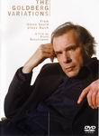

_This review was written by me for **MichaelDVD**, an Australian DVD review site that is no longer online. A capture of the site is held by the Internet Archive: **[browse it there](https://web.archive.org/web/20220217040146/http://www.michaeldvd.com.au/)**. It is reproduced here from my own copy of the site, as part of the record of what I have written._

_1981._

## The film

In 1955, a young and relatively unknown Canadian pianist called **Glenn Gould**released his debut album: a mono recording of **Johann Sebastian Bach**'s **\_Goldberg Variations _**played on the piano. It shook the classical music world like a storm, and Glenn became a celebrity, both famous and infamous, overnight. For many many years, the album never left the best-selling classical charts.

To understand the significance of that 1955 recording, some context is necessary. When the recording was released (and indeed, even today), it was decidedly unfashionable to play the _Goldberg Variations_on a piano, as the harpsichord was very much the instrument of choice for performing Bach's rather Byzantine set of variations of a rather simple aria. In fact, the Goldberg Variations were first published in 1742 with the following (translated) title: 'Keyboard-practice, consisting of an Aria with different variations for the harpsichord with two manuals. Prepared for the enjoyment of music-lovers by Johann Sebastian Bach, Polish royal and Saxon electoral court-composer, director and choir-master in Leipzig.' Certainly if you actually try playing the Goldberg Variations on a piano you will soon realise that having two keyboards is a distinct advantage - otherwise your hands will soon run into or cross one another.

Also, **Rosalyn Tureck**'s recording was widely considered to be the definitive interpretation of the work, and many musicians were loathe to record it for fear of unfavourable comparisons with Tureck. So, releasing a debut album by an obscure artist playing the Goldberg Variations on a piano was an act of bravery and defiance (and dare I also say arrogance) on the part of both Gould and the recording studio (Columbia, later to become CBS Masterworks, and much later Sony Classical).

And what a performance it turned out to be! Gould decided to break all the rules through a very unorthodox interpretation - playing some variations normally played at a fast tempo at a very slow pace, and rushing through some variations normally played at a sedate tempo with breathtaking speed. All who listened to the recording were stunned by the incredible technical virtuosity of the performance - every note was precisely articulated, with crystal-clear phrasing. The fast passages tended to leave some gasping for breath - it seemed almost impossible that human fingers could play so fast without fluffing the notes or slurring the phrases.

Some critics even began openly questioning whether Glenn faked the performance, particularly after it was revealed that it was not recorded over one session but was spliced together from several takes. It was not until he started giving concert performances of the work that people gradually believed that his talent was real. Many would flock to his concerts just to see how he physically could do it. I remember a friend playing me a recording of Gould playing the _Goldberg Variations_taken from a CBC live radio broadcast of a concert - my jaw dropped when Gould started playing some of the fast passages even faster than on the 1955 recording! No wonder that Gould developed a phobia against playing concerts later in his career (he felt that the audience were like vultures waiting for him to make a mistake) and the stress made him abandon the concert hall (his last concert performance was in 1964) to devote himself solely to making recordings.

More than 25 years later, Glenn Gould returned to Columbia's 30th Street studio (where the 1955 album was recorded) to re-record the Goldberg Variations using modern studio technology (the 1981 recording was one of the first classical recordings done digitally). In many ways this re-recording marks the completion of a circle in Glenn's life and career more than Glenn himself perhaps realised - he died of a stroke within months after releasing the 1981 recording. Although it was not his final recording (if memory serves me correctly, the last recording issued before he died was a piano performance of some Richard Strauss pieces, plus a double album of Haydn sonatas was released posthumously), symbolically it feels like a farewell to a illustrious and often notorious career, and to an enigmatic and eccentric musical genius.

This film by **Bruno Monsaingeon**, intended to be broadcast on TV, is a short documentary of and interview with Glenn Gould, followed by a complete performance of Glenn playing the _Goldberg Variations_, made at the same time as the re-recording. Bruno Monsaingeon is a Paris-based concert violinist who has directed a number of musical documentaries featuring some of the greatest musicians of our time: **Nadia Boulanger**, **Yehudi Menuhin**, **Murray Perahia**, **Michael Tilson Thomas**, **Zoltan Kocsis**, **Friederich Gulda**, amongst many others.

This film complements the 1981 album quite well, although the performance captured on the film is slightly different from that released on the album. It is part of a series called _"Glenn Gould Plays Bach"_ and other titles (yet to be released on DVD) include _A Question of Instrument_and _An Art of the Fugue_.

Glenn Gould's many eccentricities are evident in this film - his insistence on playing using a rickety old chair (originally from his parent's home) and using one particular Steinway piano (which accompanied him during concerts), his tendency to vocalise and mumble and even conduct during the performance, even his views on various aspects of the performance (rumour has it that he scripted every single word and line of Bruno's voiceovers). Not so obvious are the fact that he has been a virtual hermit and recluse for the last ten to fifteen years of his life, his habit of taking a formidable cocktail of drugs - both prescriptive and over-the-counter - because he was a hypochondriac, and his tendency to warm his hands in hot water prior to a performance and to wear fingerless gloves.

So, how does this performance compare to the original 1955 recording? I found it fascinating for both its similarities and yet striking differences. He has pretty much kept to his unorthodox tempi, and the technically flawless execution is still there, as well as the exhilirating fast passages. Every note is so flawlessly and precisely articulated that I suspect it is at exactly the level of loudness and duration that Glenn wanted. Indeed, the technical perfection is unnerving at times - it's almost as if the performance was computer-generated rather than played by a real human. (By the way, Glenn was fascinated by the use of synthesizers on **Wendy Carlos**' _Switched On Bach_ album and I have no doubt that if he was still alive today Glenn would be dabbling with MIDI and sequencers).

However, there is no doubt that this is a more reflective and measured performance - taking into account the experiences gained over the intervening years by an artist who has recorded a rather bizarre and outlandish repertoire of works as well as the more standard Bach, Mozart and Beethoven. I very much feel that it trades off youthful exuberance for a more mature and introspective interpretation. Here is a man who no longer feels he needs to prove his skills to the world but still has something new to say to a work that has launched his career. Never has a motley and diverse collection of variations sounded so much like the pieces of a grand unifying design and framework.

## The video transfer

Given that this film was originally intended for broadcast TV and is now 20 years old, I would not have expected a reference quality transfer and I did not get it. Thank goodness the print is relatively clean. The film is presented in the original intended aspect ratio of 1.33:1 (full frame).

The transfer appears rather soft and lacking in detail, with muted colours and black levels tending ever-so-slightly to grey. The opening montage featuring the camera panning over a set of black and white photos of a young Glenn Gould accompanied by voiceover from Bruno seems to be rather sepia-toned, but perhaps that is intentional. However, the rest of the film, which is shot in colour, still appears to err towards the brown and yellow a bit too much for my liking.

I suspect the video was sourced from a composite telecine transfer originally intended for laserdisc or VHS, as the transfer shows various film to video artefacts including dot crawl (particularly noticeable during the opening display of the Sony Classical logo), colour smearing/bleeding, and chroma separation. Another tell tale sign that the transfer was originally intended for laserdisc/VHS is the aggressive use of edge enhancement, resulting in halos around many objects. Fortunately, as noted earlier, the film source is relatively clean and free of grain.

Surprisingly, this disc does not come with any subtitle tracks but does have French and German menus in addition to

## The audio transfer

There are two audio tracks on this disc: Linear PCM at 48 kHz/16 bits, and Dolby Digital 2.0 at 448 Kb/s. I listened to the PCM track in its entirely and played the Dolby Digital track briefly.

There's not much to choose between the two tracks, and both are substantially inferior in quality compared to the pristinely clear CD recording (which I have used as an audio test or demonstration disc for many years when evaluating hi-fi equipment). Compared to the CD recording, the audio tracks for this disc sounds more "bloomy" due to over-emphasised mid-range and seem to lack the nuances and detail of the CD. However, there are no audio clicks or dropouts which is good. There are also no audio synchronization issues.

The Dolby Digital track sounds slightly louder than the PCM track (Dialog Normalization is set to +4 dB). Obviously, as both tracks are in stereo, my surround speakers and subwoofer had a well-deserved rest.

## The extras

Sony Classical has seen fit to release what must be the Crown Jewel in their archive of Glenn Gould videos with an interesting collection of extras, however most of these are textual rather than video or audio based.

### Biography-Glenn Gould

This is a set of 12 stills providing a brief, rather well-written but sterile summary of Glenn Gould's life and career.

### Discography

There are no less than 17 stills listing all of Glenn Gould's recordings featuring the works of Johann Sebastian Bach. Clicking through these was rather tedious - it would have been nice if they had provided album covers as well. The catalogue numbers provided in this discography corresponds to Sony Classical's re-releases of all of Glenn Gould's recordings in the 1980s, not the original catalogue numbers.

### Gallery-Photo-_Glenn Gould_

This is not much of a gallery - containing only three photos.

### Featurette-_Glenn Gould explains his use of the Piano for Bach_ (2:00)

This is an extremely short segment of **Glenn Gould**being interviewed by **Bruno Monsaingeon**. I would have liked to see the entire interview and not just the segment.

### Web Links (DVD-ROM only)

This runs a Flash program that links you to the Sony Classical web page on Bach - pretty boring. They could at least have provided a link to various Glenn Gould web sites (official and unofficial).

### Notes-_1981 Original LP Notes, 1981 Original Video Notes, 1955 Original LP Notes_

This is a set of stills containing the original liner notes for both 1955 and 1981 recordings, plus the video notes accompanying the release of this film on VHS.

### Gallery-Photo-_Glenn Gould At The Studio_

This features four photos taken during the 1955 and 1981 recording sessions.

### Biography-_About Bruno Monsaingeon_

This is a single still giving a short background to the director of the film.

### Notes-_About The Recording Venue_

This is a set of stills providing some historical background to the 30th Street Studio (sadly no longer there).

### Notes-_About J.S. Bach; Biography/Family Tree_

This is a set of stills giving a concise biography of **Johann Sebastian Bach** including a diagram of his family tree (starting from his parents and ending with his children).

## Censorship

As far as we are aware, there are no censorship issues with this DVD.

## Region 4 versus Region 1

The Region 4 version misses out on

- French and German Dolby Digital 2.0 audio tracks
- sound clips in the discography

The Region 1 version misses out on

- nothing

I would say both versions are substantially the same, apart from PAL/NTSC formatting.

## Summary

Glenn Gould playing **The Goldberg Variations** is a striking interpretation of a familiar Bach keyboard work. It is presented on a DVD with a so-so video and audio transfers, but does have an interesting collection of extras. I don't care, though. As far as I am concerned, this is a must own disc - even if it is VHS quality. Come to think of it, I do own the VHS version.

### [Ratings (out of 5)](RatingsGuide.html)

© [Tham, Christine](mailto:ChrisT@michaeldvd.com.au) (read my [biography](../ReviewerProfiles/ChrisT.asp)) Monday, 18 June 2001

| Rating  | Score        |
| :------ | :----------- |
| Plot    | ★★★★★ 5 / 5  |
| Video   | ★★★½ 3.5 / 5 |
| Audio   | ★★★ 3 / 5    |
| Extras  | ★★★★ 4 / 5   |
| Overall | ★★★★ 4 / 5   |
