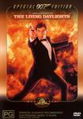

_This review was written by me for **MichaelDVD**, an Australian DVD review site that is no longer online. A capture of the site is held by the Internet Archive: **[browse it there](https://web.archive.org/web/20220217040146/http://www.michaeldvd.com.au/)**. It is reproduced here from my own copy of the site, as part of the record of what I have written._

_1987._

## The video transfer

Optional General Comments

Aspect Ratio/16x9 Status

Sharpness/Shadow Detail/Grain/Low Level Noise

## The audio transfer

Optional General Comments

Audio Tracks

Dialogue/Audio Sync

Music

Surround Channel Usage

Subwoofer

## The extras

### Booklet

### Main Menu Introduction

### Main Menu Audio & Animation

### Featurette

### Featurette

### Audio Commentary

### Music Video

### Featurette

### Deleted Scenes

### Trailer

## Censorship

As far as we are aware, there are no censorship issues with this DVD.

## Region 4 versus Region 1

R4 vs R1 Comparison Here

## Summary

Summary Here

### [Ratings (out of 5)](RatingsGuide.html)

© [Tham, Christine](mailto:ChrisT@michaeldvd.com.au) (read my [biography](../ReviewerProfiles/ChrisT.asp)) Saturday, June 16, 2001

| Rating  | Score        |
| :------ | :----------- |
| Plot    | ★★★ 3 / 5    |
| Video   | ★★★½ 3.5 / 5 |
| Audio   | ★★★½ 3.5 / 5 |
| Extras  | ★★★★★ 5 / 5  |
| Overall | ★★★½ 3.5 / 5 |
