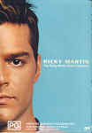

_This review was written by me for **MichaelDVD**, an Australian DVD review site that is no longer online. A capture of the site is held by the Internet Archive: **[browse it there](https://web.archive.org/web/20220217040146/http://www.michaeldvd.com.au/)**. It is reproduced here from my own copy of the site, as part of the record of what I have written._

_1999 · directed by Various._

## The film

I must admit, I wasn't exactly looking forward to reviewing this disc. I have not heard a lot of **Ricky Martin**'s songs, but what I heard sounded somewhat monotonous and repetitive. And I knew this was merely a collection of music videos, so there's really not a lot to look forward to.

However, after watching the music videos, I have learnt to appreciate Ricky just a little bit more. Well, for one thing, he is devastatingly spunky and handsome, even to my jaded eyes. Secondly, the selection of songs here does exhibit some emotional/melodic range. And thirdly, I think he sings a lot better in Spanish than he does in English. We are treated to both English and Spanish versions of two songs (_Livin' La Vida Loca_ and _She's All I Ever Had_), and in both cases I found the Spanish versions to be far superior to the English ones.

Born in Puerto Rico, Ricky Martin shot into worldwide fame when his song _La Copa de la Vida_ (The Cup of Life) was selected as the official song of the World Cup France '98. His performance of the same song in the 41st annual Grammy Awards was so electrifying that it quickly captured fans from around the world. In that same night, his song _Vuelve_ won the Grammy for Best Latin Pop Performance.

Released in 1999, _Ricky Martin_, Ricky's English language debut album, debuted at #1 on the Billboard 200 album chart and subsequently became the #1 album in ten international markets including the United States, Canada, Australia, Japan, Spain, Norway, Finland, New Zealand, and the pan-European Music Media chart. This collection of music videos feature selected songs from that album, including _Livin' La Vida Loca_ which became the #1 single in five international markets including the United States, the United Kingdom, Canada, New Zealand, and Ireland.

This disc contains the following music videos:

|  |  |
| :-- | :-- |
| 1. _Livin' La Vida Loca_ (English) 2. _She's All I Ever Had_ (English) 3. _La Bomba_ (Spanish) 4. _Perdido Sin Tí_ (Spanish) 5. _Livin' La Vida Loca_ (Spanish) | 1. _Vuelve_ (Spanish) 2. _María_ (Spanglish) 3. _Bella (She's All I Ever Had)_ (Spanish) 4. _The Cup Of Life_ (Live Grammy Performance) (The Official Song of The World Cup, France '98) |

I quite enjoyed watching the music videos. They are quite stylish and somewhat reminiscent of various films I like, including _What Dreams May Come_ and _Wings of Desire_.

## The video transfer

As this disc contains a collection of concatenated music videos, I'll provide separate comments for each video. Some videos are in full-frame, others are in 1.66:1 letterboxed. Obviously, there is no 16x9 enhancement on any of the videos.

| **Title** | **Aspect Ratio** | **Comments** |
| :-- | :-- | :-- |
| _Livin' La Vida Loca_ (English) | 1.33:1 | This is quite sharp and colourful. No artefacts detected, but the source shows minor amounts of grain. |
| _She's All I Ever Had_ | 1.66:1 | I quite like the video transfer for this, even though the colours are a bit unnatural. The effect is somewhat like a pastel version of the film _"What Dreams May Come."_ There is some shimmering in the window blinds. |
| _La Bomba_ (Spanish) | 1.33:1 | This transfer features rather vibrant colours, but the source shows a moderate amount of grain. |
| _Perdido Sin Tí_ | 1.33:1 | This is in black and white, and occasionally exhibits minor chroma smearing. There is also minor posterisation of the skin tone around faces. |
| _Livin' La Vida Loca_ (Spanish) | 1.33:1 | The transfer is substantially the same as the English version. |
| _Vuelve_ (Spanish) | 1.33:1 | The transfer for this appears a little soft, but it could also be due to the use of a soft lens. There is some shimmering evident in **23:42-23:47** and some evidence of halo'ing. |
| _María_ (Spanglish) | 1.66:1 | This appears to be shot in a mixture of B&W and colour, but the black and white scenes show some vestiges of colour, notably blue and green. The colour scenes have slightly below average colour saturation. I'm not sure whether these "colour artefacts" and saturation are intentional. Again, the transfer is somewhat soft, with grain noticeable in some scenes. |
| _Bella (She's All I Ever Had)_ (Spanish) | 1.66:1 | The transfer is substantially the same as the English version. |
| _The Cup Of Life_ (Live Grammy Performance) (The Official Song of The World Cup, France '98 | 1.33:1 | This has desaturated colours, and also minor ringing and shimmering. It looks like it was probably upconverted from NTSC to PAL. The black levels in this transfer are also rather poor. |

## The audio transfer

Contrary to the menu and the packaging, this disc contains a stereo PCM audio track (48 kHz/16 bits) instead of a Dolby Stereo track, in addition to a Dolby Digital 5.1 track at 448 Kb/s. The default track is the PCM track. I listened to both tracks.

The PCM track seems to be mastered at an extremely low level (I had to turn the volume control all the way to -3 dB - the highest I have ever turned it to ever for any audio source). It doesn't seem too bad once the volume is turned up, but seems somewhat lacking in extreme high frequency content.

In contrast, the Dolby Digital track is extremely loud (Dialog Normalization has been set to an offset of +4 dB). It appears as if the original stereo material has been put through some sort of surround processor, creating the usual over-blown and unrealistic surround ambience. Whether as a result of the surround processing or the encoding into Dolby Digital, this audio track seems to have a lot of sibilance in the high frequencies that becomes somewhat annoying to listen to after a while.

## The extras

This disc contains fairly minimalist extras.

### Menu

The menus are pretty basic and static.

### Biography

This consists of a set of 10 stills contain text of various font sizes and colours accompanied by photo cut-outs of Ricky. The text reads like it may have been lifted from the liner notes accompanying the "Ricky Martin" album, since it references songs that are not on this disc.

### Featurette-_Behind The Scenes_ (15:55)

This is a short documentary featuring Ricky Martin talking about his background, and his self-titled English album, interspersed with various excerpts from his music videos. I was surprised by how conversant he was in English as I had the impression he was a poor English speaker.

## Region 4 versus Region 1

The Region 4 version of this disc misses out on;

- English and Spanish subtitles

The Region 1 version of this disc misses out on;

- Nothing<em></em>

Other than the missing subtitle tracks in R4, the two versions appear to be the same (both versions are coded for all regions).

## Summary

**The Ricky Martin Video Collection** is surprisingly better than I thought it was going to be, and no doubt will please his fans. It is presented on a DVD with an above average audio and video transfer, and comes with pretty minimalist extras (biographical stills and featurette).

| Rating  | Score        |
| :------ | :----------- |
| Plot    | ★★½ 2.5 / 5  |
| Video   | ★★★½ 3.5 / 5 |
| Audio   | ★★★ 3 / 5    |
| Extras  | ★★ 2 / 5     |
| Overall | ★★½ 2.5 / 5  |
