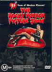

_This review was written by me for **MichaelDVD**, an Australian DVD review site that is no longer online. A capture of the site is held by the Internet Archive: **[browse it there](https://web.archive.org/web/20220217040146/http://www.michaeldvd.com.au/)**. It is reproduced here from my own copy of the site, as part of the record of what I have written._

## The film

_**The Rocky Horror Picture Show**_ is probably _THE_ ultimate cult movie. Based on a musical (_The Rocky Horror Show_), it was made into a movie that premiered in London on 14 August 1975 (and in the US around a month later). It was not an initial box office success, but over the years attracted a core group of fans who would watch the movie over and over again.

What turned the movie from simply another quirky film with an unusually loyal set of devotees to a true cult phenomeneon can be summed up in two words: **audience participation**. Some fans started attending the movie dressed up as their favourite characters, and others started the trend of responding to lines in the dialogue by "calling back" lines that either provide a commentary on the dialogue, or are funny one-liners in their own right, or take the plot to a completely new direction. Some theatres started running midnight sessions catering for audience participation screenings and pretty soon the phenomeneon replicated around the world and developed into the full blown audience participation ritual that we know and love today.

My own induction into this whole Rocky Horror thing is probably at the _Valhalla_ cinema in Glebe, Sydney (there's also one or at least was one in Richmond, Melbourne I believe) in the late 80s (I think the theatre started out as an independent but has subsequently been bought by Hoyts). I was a Rocky Horror virgin back then (well, I've watched Rocky Horror on TV but that doesn't count - in fact, watching Rocky at home is crudely termed as "masturbation") and the whole concept of dressing up, callbacks and props (rice, newspaper, water gun, toast etc.) was completely new to me. Needless to say I completely and utterly enjoyed it and have been a big fan ever since.

For the very few (and unfortunate, I have to add) of you who have never watched the movie before and do not know the plot, here is a brief synopis: Brad (**Barry Bostwick**) and Janet (**Susan Sarandon**), has just attended a wedding and is driving to see their former tutor and friend Dr. Everett Scott (**Jonathan Adams**). On the way, their car developed a flat tire. Seeking help, they ventured into a dark, mysterious castle belonging to Dr. Frank-N-Furter (**Tim Curry**) and his servants Riff Raff (**Richard O'Brien**) and Magenta (**Patricia Quinn**) together with groupie Columbia (**Little Nell**) and a whole bunch of party-goers. There they find out that the inhabitants of the castle are actually from the planet Transsexual in the galaxy Transylvania and the experience changes their lives forever. The film also stars **Peter Hinwood** as Rocky Horror (a creation of Dr. Frank-N-Furter), **Meatloaf** as Eddie (Dr. Scott's nephew) and **Charles Gray** as the Criminologist who provides the background and commentary to the movie.

This DVD is a special edition release to celebrate the 25th anniversary of the movie and features a brand new THX-certified 16x9 enhanced transfer in the original 1.66:1 aspect ratio and a newly remixed English 5.1 surround audio track. It also features a very generous collection of extras, including all the extras from previous video special editions and the laser disc special edition.

_"So, come up to the lab, and see what's on the slab. I see you shiver with antici- ..."_

## The video transfer

I have only one word to describe the video transfer of the film: _stunning_. There's no question that the boys and girls at Fox can produce superlative DVD transfers when they really feel like it (for example, the Bond films) and for this film no expenses seems to have been spared in ensuring we get the finest possible transfer.

The transfer itself is THX-certified and is presented in the original aspect ratio of 1.66:1. On a 16x9 display you may see black bars on the left and right sides of the display. The film was shot in 1.66:1 but was intended to be presented in the 1.85:1 aspect ratio (you can clearly see this in the opening tiles which leave generous space on the top and bottom). Curiously, on my DVD player and projector, the opening titles is presented in 1.66:1 (I can see some cropping of the "lips") but the rest of the movie seems to be in shown in 16x9 aspect ratio as I cannot detect any black bars whatsoever. I don't know whether the DVD player or the scaler in the projector is zooming or cropping the image, but the end result is that I saw the movie in 1.78:1. Playing the film using WinDVD on a PC with a DVD-ROM player does reveal the black bars on either side of the screen in windowed mode.

The transfer is taken from a nearly flawless print (I can detect film marks and scratches only very occasionally) which I suspect has been digitally cleaned. The print is so good that it compares very favourably with the latest releases. Grain is virtually nonexistent (apart from the stills of the cast in the closing titles). The corresponding DVD transfer is basically flawless and is of reference quality.

The colour in particularly is extremely striking with vivid, fully saturated colours seen throughout the entire movie, apart from slight solarisation during the wedding scene. Sharpness is excellent, and obviously there has been some edge enhancement done on the transfer. The results are quite pleasing, apart from very slight halo'ing during the wedding scene. Detail and shadow detail are generally very good but not quite perfect, probably as a result from the digital restoration work done on the print.

I could not detect MPEG artefacts present in the transfer apart from slight posterisation of the car lights in **11:34**. There is very slight telecine wobble at the beginning of the film but I'm just nitpicking

The film comes with several foreign language subtitle tracks and a "participation prompter" track, but these are selectable only via the menu system and not from the subtitle selection button on the DVD player.

This is a single sided dual layer disc (**RSDL**, also known as DVD 9). The layer change occurs at **47:20** just after a closeup of television static and the screen pauses for the layer change when Janet is reclining in her bed prior to Dr. Frank-N-Furter a

## The audio transfer

The film has one main audio track in English, presented in Dolby Digital 5.1 at a bitrate of 384 Kbps, and two other tracks (audience participation and commentary) which are presented in Dolby Digital Surround at a bit rate of 96 Kbps. I listened to all three tracks in their entirety.

The original soundtrack is in mono, and subsequent video rereleases have featured a remixed stereo soundtrack (combining both the original mono track with the stereo music from the original soundtrack album). General consensus amongst fans is that the mono soundtrack is superior to the stereo soundtrack in terms of cohesiveness and detail. Fortunately, it appears that this 5.1 surround track has been remixed from scratch and does seem to combine the best elements of both the mono and stereo soundtracks so the fans have been mollified. So it would be fair to say the mix present on this DVD should be regarded as _the_ new definitive mix for this film.

The sound quality is surprisingly good considering the age of the film. The 5.1 surround mix is rather aggressive in using the rear channels. However, compared to a reference quality mix, the audio track lacks the subtle 3D ambience that immerses you into the film. It fundamentally still sounds like a mono soundtrack that just happened to have various elements panned across to 5 channels. The film doesn't have a lot of low frequency information, so I would be surprised if the subwoofer is utilised at all.

I didn't have any problems with the dialogue (except in the audience participation track as detailed later in this review). There were no audio synchonisation issues except for occasional slight missyncs in various songs (but these could just as easily be miming errors).

The songs in the film sound quite vibrant, full and expansive. Unlike Spinal Tap, where the songs sound so much more dynamic and expansive compared to the rest of the movie, the songs in this film fitted better within the context of the movie.

## The extras

This two-disc DVD comes with an extremely generous collection of extras, ranging from alternate versions, soundtracks (including a commentary track) and endings through to deleted scenes, outtakes and featurettes. Even the DVD packaging is unusual.

Much as I would like to give a five star rating to the collection of extras, I have to bring attention to the sloppy/inflexible menu navigation, the confusing mix of both 16x9 enhanced and non-enhanced content (resulting in at least one feature that will not display correctly on displays that do not automatically switch in and out of 16x9 enhanced mode) and the omission of critical extras from the Region One version including the original mono soundtrack, the US version of the film and DVD-ROM extras.

### Menu Animation & Audio

The menus feature extensive audio and animation effects, and are 16x9 enhanced (for both discs). I really liked the nice pair of stockinged legs with red high heels prancing all over the screen - they are very shapely, but leaves me with a sneaky suspicion that they are male legs rather than female legs (although I should be the last person to make a bitchy comment like that - my own pair of chunky stumps are no match for these).

I have two gripes about the menus and the navigation. Firstly is the disablement of the audio track selection and subtitle selection buttons on the DVD player, so there is no way to switch between audio tracks or to select subtitle tracks outside of the menus. This wouldn't be so bad except for the second gripe, which is that there seems to be no way of combining the selection of various special features on the first disc. Ie., I can't seem to turn on the Multi-View experience, the participation prompter and the audience participation track _AT THE SAME TIME_, even though these utilise completely different DVD features (and therefore in theory can be enabled independently of each other) - namely, seamless branching, audio track selection and subtitle selection.

### Audio Commentary - _Richard O'Brien (Writer) & Patricia Quinn (Actor)_

This is a fairly entertaining and informative commentary. Richard and Patricia were extremely chatty and talked about all sorts of things, including the real story behind why Richard got to sing Science Fiction at the beginning of the movie instead of Patricia, various anecdotes about the cast and crew, and pointing out various goofs and mistakes in the movie along the way. Parts of the commentary was similar to the audio commentary for _Spinal Tap_ - Richard and Patricia kept noting which member of the cast and crew have since died.

### Seamless Branching - _Multi-View Theatrical Experience_

With this option enabled, you get to view the movie spliced with additional scenes showing examples of audience participation at critical points during the movie, such as the throwing of rice at the wedding, the squirting of water pistols and using newspapers as an umbrella during Brad and Janet's approach to the Rocky Castle etc. This is done by the DVD player combining multiple titles on the DVD using a technique called "seamless branching".

Unfortunately in this case, the "branching" is anything but "seamless".

Firstly, all the audience participation scenes are presented in full frame and are non-16x9 enhanced, as opposed to the 1.66:1 16x9 enhanced presentation of the film. On displays that cannot detect and switch automatically in and out of 16x9 enhancement mode (this includes any display connected via component video connections such as my setup) this means that you either need to manually change aspect ratios everytime the DVD branches or be forced to view either the film or the audience participation scenes in the wrong aspect ratio. On my setup, everyone in the audience participation scenes look fat and squished as I had set it to 16x9 mode. Playing the DVD with this feature turned on in a DVD-ROM player on my PC using WinDVD will cause WinDVD to automatically switch between aspect ratios - which is still somewhat disconcerting but at least correct behaviour.

Secondly, the audience participation scenes seem to be spliced from at least two separate theatres and audiences so the experience itself is not "seamless".

Thirdly, more often that not the DVD has to change layers switching between the film presentation and audience participation scenes, resulting in a slight pause whenever this happens.

The audience participation scenes exhibit low fidelity audio and video transfers in comparison to the film. In particular, shadow detail is quite poor (then again, it would be hard to derive good shadow detail shooting inside a darkened cinema theatre!) and the scenes are quite blurry at times with decreased detail and colour accuracy. The sound quality is also rather patchy and tinny in nature, with varying volume levels.

### Alternate Subtitles - _Participation Prompter_

This is a special subtitle track that lets you know when to use the props listed in the booklet. You know, comments like "Throw Your RICE!", "Put Your NEWSPAPER On Your Head!" and "Turn On Your LIGHTS!". It is very infrequently used, and I wished the subtitle track could have been more extensive, perhaps by including some of the more commonly uttered audience participation lines.

### Alternate Audio - _Audience Participation Track_

This is an alternate audio track, presented in Dolby Digital Surround 2.0 (96 Kbps) featuring the movie soundtrack augmented by a recording of actual audience responses during a screening of the film in a theatre. I really looked forward to listening to this, but was disappointed. The track is very muddy and tinny. The audience call-backs were barely intelligible and it was a real strain to figure out what they were saying most of the time. All I could hear was lots of people shouting at the top of their voices and I can barely pick out words let alone sentences. Some of the more successful audience participation screenings that I have attended had individuals shouting the callbacks and generally the audience was quieter except for the stock lines that everyone knows. I wished they had picked an audience like that rather than the one in this track where everyone is shouting at once. Clearly, the Dolby Digital audio track is extremely bit starved and I wish they had allocated more bandwidth to this track (192 Kbps or even 256 Kbps) which may improve the intelligibility of the dialogue.

A voice over at the beginning of the movie informs us that "If you are listening to the UK version ..." but of course the Region 4 version of the disc does not allow us to select between the US and UK versions so this disclaimer could have been edited to remove the reference to the different versions.

### Seamless Branching - (Hidden) Alternate Version

In Richard O'Brien's original script it was indicated that the beginning of the film was to be shot in black and white. With an affectionate nod to "_The Wizard of Oz_," the film was to then transition to colour as Brad and Janet enter the world of the Transylvanians. This was ultimately decided against for a variety of reasons, but this alternate version is a reconstruction of how that version of Rocky Horror that never was might have looked like.

This hidden version is access quite easily on a PC with a DVD-ROM drive by navigating your mouse to the bottom left of the screen until a highlighted pair of lips appear. On a home DVD player, the easiest way to get to those lips is by navigating the menu selection to the "Special Features" menu item and then pressing the LEFT key which will then highlight the menu.

If all this sounds too complicated to you, the easiest way to access the hidden alternate version is to simply use the title selection feature of your DVD player to select Title 2. Incidentally, Title 1 is the normal version and Title 3 is the multi-view theatrical experience version.

### Deleted Scenes - _"Once In A While"_ (3:10)

This features a rather wistful romantic ballad (with a slight country and western feel about it) sung by Brad after having sex with Frank-N-Furter. The first part of the song is accompanied by flashbacks of Brad and Janet together. It is presented in a non-16x9 enhanced letterboxed aspect ratio.

### Outtakes

This consists of two alternate takes of the Time Warp sequence, five alternate takes of Brad and Janet undressed, two alternate takes of Janet's seduction, and two alternate takes of the floor show preparations. The menu misspells "preparations" as "prepartions".

The alternate takes consist of unedited camera footage of different "takes" as seen from the perspective of various camera positions. They are accompanied by the original sound captured during the shooting. All outtakes are presented in a non-16x9 enhanced letterboxed aspect ratio.

I particularly liked Susan Sarandon making a face just after the camera started rolling in alternate take No. 2 of Brad and Janet being undressed.

### Featurette - _Rocky on VH1 (Excerpts - Behind-The-Music/Where Are They Now_)

This consists of interviews with various people, including **Richard O'Brien**, **Susan Sarandon**, **Barry Bostwick**, **Patricia Quinn** and **Meatloaf Aday**. The absence of **Tim Curry** here was rather conspicuous. All interviews were done in full-frame 4:3 aspect ratio.

I was amused by **Richard O'Brien**'s references to the transvestitic elements of Fredericks of Hollywood advertising in film magazines of the period (Fredericks of Hollywood sells rather outlandish lingerie and Richard hypothesised that a large part of the postal sales are probably to cross-dressers). That would explain why when I visited a Fredericks of Hollywood store in Dayton, Ohio many years ago most of the "customers" browsing the merchandise were male.

I also liked **Richard O'Brien** doing impromptu renditions of _Time Warp_, _Eddie_, _Over at the Frankenstein Place_ and _Superheroes_ accompanied by his guitar whilst taking us on a tour around the "Rocky Castle" (Oakley Court) - which now looks like it's been converted to a boutique hotel/B&B. Incidentally, there is an audio glitch in **3:11** of this segment.

In most of the interviews, the interviewees were obviously responding to questions from a non-visible interviewer and I wished they had retained the interview questions instead of just stitching the replies.

### Music Video - _Hot Patootie_ (4:59)

This is a presentation of the _Hot Patootie_ scene from the film in pan-and-scan 4:3 aspect ratio, together with pop-up text boxes providing a commentary on the making of the scene, background information on **Meatloaf** and other anecdotal information. The information provided was quite interesting, but is similar to that provided in **Meatloaf**'s interview above. After a while, I found the "pop" sound everytime a text box appears on the screen to be intensely annoying.

### Alternate Credit Ending (3:47)

This is the US version ending (minus _Superheroes_) segueing into the full version of the Time Warp over the closing titles. It is presented in a non-16x9 enhanced letterboxed aspect ratio.

### Featurette - _Rocky Horror Double Feature Video Show_ (36:26)

This is a retrospective documentary featuring interviews with writer/actor **Richard O'Brien**, director **Jim Sharman**, producer **Lou Adler**, **Patricia Quinn**, **Little Nell**, **Meatloaf**, **Tim Curry**, **Susan Sarandon**, **Barry Bostwick**, **Sal Piro** (fan club president), and various other crew members that was created for the 20th anniversary video rerelease. It is presented in a full frame non-16x9 enhanced aspect ratio.

### Theatrical Trailers - _2_

These both feature a set of lips (with accompanying female voice) providing voice-over spliced with various scenes from the film. Both trailers are presented in a 4:3 aspect ratio. The second trailer (**3:01**) is significantly longer than the first (**0:32**).

### Karaoke - _Toucha Toucha Touch Me_ (2:33)_, Sweet Transvestite_ (3:28)

These show the relevant segments of the movie (in a non-16x9 enhanced letterboxed aspect ratio) presented minus Janet (Susan)'s and Frank-N-Furter (Tim)'s singing respectively, so you can do the singing yourself if you are so inclined. The lyrics to the songs are superimposed directly on the video transfer itself (unfortunately in the print area, not in the black bar).

### Featurette - _Misprint Ending_ (1:46)

During _**Rocky Horror**_'s initial theatrical run, certain prints were mistakenly struck with picture from _Superheroes_ but audio from the the Criminologist. This is a reconstruction of how that "misprint" appeared. It is presented in a non-16x9 enhanced letterboxed aspect ratio.

### Photo Gallery

This is a set of stills of photos of the cast and crew taken during the shooting of the film, as well as miscellaneous Rocky Horror related album covers. The stills are presented in 16x9 enhanced mode, but curiously do not fill the screen, leaving a dark border around each still.

### DVD Packaging and Booklet

Normally I don't bother commenting on the DVD packaging and accompanying booklet but the packaging kind of impressed me - full colour cardboard foldout with Digipack-like clear plastic holders for the two discs. The colour pictures on the discs matches the cardboard perfectly. However, I wonder how robust the packaging will be with repeated handling - mine already shows some creasing as a result of being sent over the mail (even though MichaelD took extra care wrapping it with bubble wrap). Incidentally, there is a minor mistake in the packaging - the screendumps of the menus on the back cover seem to be taken from the Region 1 version of Disc One rather than our version.

The booklet itself has an "Audience Participation Prop List", cast and crew biographies and chapter list.

## Region 4 versus Region 1

The Region 4 version of this disc misses out on;

- _US Version of the movie._ This is 2 minutes shorter because it omits _Superheroes_.
- _Original mono soundtrack_ The omission of this from Region 4 is an unforgiveable sin as many fans prefer this as the "canonical" version of the soundtrack.
- _"Superheroes" deleted scene_ In Region 4 we only get the UK version which includes this scene so technically this is no longer a deleted scene.
- _DVD-ROM extras_ including Participation 101, trivia game, Story Lab, video jukebox, screensaver and more.

The Region 1 version of this disc misses out on;

- Nothing of consequence (additional foreign language subtitles)

It would have been nice to have included the US version of the movie on the Region 4 disc, but I don't think it's a big deal since it doesn't contain any additional scenes but is missing one scene. Omitting the mono soundtrack was a different matter as it would have been nice to be able to hear how it originally sounded when first released. The missing DVD-ROM extras sounds nice but not overly compelling. I am not sure why these extras were omitted since Disc One only has 5-6 Gb of files which is significantly below the maximum capacity of an RSDL disc (just under 9 Gb).

On balance it's hard to choose between the two versions - the additional extras versus the higher resolution of PAL over NTSC. My inclination would be to go for the Region 1 version because of the extras but I know some who will not agree because of PAL's higher resolution and lack of 3:2 pulldown artefacts.

## Summary

**The Rocky Horror Picture Show** provides a superb transfer of an excellent and well-loved movie together with a generous collection of extras together in an innovative package.

The video quality is superb, and is of reference quality.

The audio transfer tries to make a silk purse out of a sow's ear, and is impressive but flawed compared to reference quality transfers.

The extras are very generous, but are ultimately flawed due to factors such as poor menu navigation, improper mixing of 16x9 enhanced and non-enhanced content, and omission of critical extras present on the Region One version.

Oh, and did I forget something? Oh yes, I did too!

_"... pation."_

### [Ratings (out of 5)](../ReviewersGuide/RatingsGuide.html)

© [Chris Tham](mailto:ChrisT@michaeldvd.com.au) (read my [biography](../ReviewerProfiles/ChrisT.asp)) 11 February 2001

| Rating  | Score         |
| :------ | :------------ |
| Plot    | ★★★★★ 5 / 5   |
| Video   | ★★★★½ 4.5 / 5 |
| Audio   | ★★½ 2.5 / 5   |
| Extras  | ★★★★ 4 / 5    |
| Overall | ★★★★½ 4.5 / 5 |
