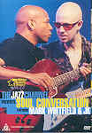

_This review was written by me for **MichaelDVD**, an Australian DVD review site that is no longer online. A capture of the site is held by the Internet Archive: **[browse it there](https://web.archive.org/web/20220217040146/http://www.michaeldvd.com.au/)**. It is reproduced here from my own copy of the site, as part of the record of what I have written._

_2000 · directed by Waymer Johnson._

## The film

_**The Jazz Channel Presents: Soul Conversation**_is another in a series of TV specials featuring concerts by black musicians produced by **BET on Jazz**.

Soul Conversation is a collaboration between two jazz guitarists: **Mark Whifield** and **JK**. Mark released his first album when he was 23, after studying at the Berklee College of Music in Boston. JK is the son of French mime **Claude Kipnis**. He moved to New York at the age of 11 from Paris. Initially self-taught, he also studied jazz for a while at the University of Miami and was a session player for a number of years. The result of the partnership: electro retro funk grooves to acoustic ballads, with some progressive R&B and smooth jazz thrown in.

In this concert, Mark and JK are backed by four other musicians. All the songs played in the concert are instrumental jazz performances - there are no vocals. The track listing for this DVD is:

|  |  |
| :-- | :-- |
| 1. Whatever It Takes 2. Hand To Mouth 3. Talk To Me 4. Reflections Of You | 1. Miami Sunset 2. On The Edge 3. In The Backseat |

I was really hoping to enjoy this disc, as this is the first "Jazz Channel Presents" disc that seem to feature music that I would regard as jazz, ie. full of improvisations and riffs. Mark and JK are obviously good guitarists, but the music is just a trifle predictable for me (I can tell when a riff is coming and also in which direction it is likely to go) and almost descends into the sort of muzak inhabited by the likes of **Acoustic Alchemy**(if you haven't not heard of Acoustic Alchemy, let me give you a hint: airlines love to schedule their songs as part of "in flight entertainment"). Is it my imagination, or is the audience in the BET Studio a little bit more sparse compared to the other discs in the series?

My favourite track of the lot is _Reflections of You_, a moderately listenable ballad. _Miami Sunset_ features a pretty groovy electric piano solo and _On The Edge_has a good saxophone solo. In fact, Mark and JK looks like they might be in danger of being overshadowed by their backing musicians! The last track _In The Backseat_has a bit of a blues feel about it. All in all, it's a pretty short concert - just barely over an hour.

The publicity machines will no doubt try and convince you that **Soul Conversation**are guitar legends in the making. Trust me, not only are the conversations between Mark and JK pretty patchy, but the the music can be pretty soulless at times. The end titles are superimposed towards the end of the last track, but in this case I don't care.

## The video transfer

Given that this originated as a TV special, the transfer is presented in a full frame aspect ratio.

In general, the transfer seems reasonably clean, with sharpness, detail and shadow detail about typical for a video source. Colour saturation was good, but I thought a bit over-saturated at times. There are occasional aliasing and shimmering and moire patterns particularly around the guitar strings of Mark's acoustic guitar. I suspect that this transfer has been upconverted from NTSC to PAL upconversion. Fortunately the video source appears fairly clean and the transfer is devoid of MPEG artefacts.

Surprisingly, this DVD actually comes with several subtitle tracks. I turned on the Italian subtitle track just for fun, and was rewarded with: nothing. Well, what did I expect? All the performances are instrumental, and Mark and JK don't even utter a single squeak during the whole concert, so there was nothing to translate!

## The audio transfer

This DVD has three audio tracks: Dolby Digital 5.1 at 448Kbps, DTS 5.1 (unknown bitrate) and Dolby Digital 2.0 at 224Kbps. I listened mostly to the DTS 5.1 soundtrack in its entirety, but switched briefly to the Dolby Digital 5.1 and 2.0 tracks.

The DTS track is actually more like a 4.0 track since the centre channel was not engaged during the entire concert. The soundstage is very front-focused, with the rear surround speakers mainly carrying ambience information. The original audio source must have been in stereo and then remixed into 5.1. In cases like this, I would have preferred it if they just gave us the original stereo track as a PCM audio track for maximum quality.

The Dolby Digital track also sounded very good, but was mastered at a much higher level (the Dialog Normalization parameter has been set to +4 dB). It seemed a little bit "harder edged" than the DTS track, but suits the type of music nicely. In fact I think I may even prefer the Dolby Digital 5.1 track over the DTS track (I think I'm already starting to hear cries of "Heresy!" from home theatre enthusiasts!) The Dolby Digital 2.0 track, in comparison to the 5.1 tracks has a rather flat sound, a collapsed soundstage, and has been mastered at a much lower level.

I did not detect any audio glitches or synchronisation issues.

## The extras

The extras here are pretty minimal, limited to an interview featurette and a biographical still.

### Menu

The menus are reasonably pleasing and seems to be relatively free of MPEG artefacts, unlike some DVDs I've seen. They are in full frame format and are static.

### Biography - Mark Whitfield

This is a single still providing a brief biography of Mark.

### Featurette - "Meet the Artist" (17:20)

This is a brief interview with **Mark Whitfield** and **JK**. Only one of them talks at any given time, in a small "window" over a background consisting of excerpts from the concert footage. Mark talks about the genesis of Soul Conversation and the concept of it being a dialogue between two guitarists of different styles. JK talks about how he met Mark and started collaborating with him. Both of them also sing the praises of each other, and reveal early influences and heroes.

This featurette has three audio tracks but they all appear to be identical (Dolby Digital 2.0). Surprisingly, the featurette comes with a number of foreign language subtitle tracks. Given that there are quite lengthly periods in which no one talks (and the little "window" disappears), I suspect this is a short 5-10 minute interview that has been stretched through the incorporation of excerpts from the concert performance.

## Censorship

As far as we have been able to ascertain, there are no censorship issues with this title.

## Region 4 versus Region 1

There appears to be no significant differences between the R1 and R4 versions of this disc.

## Summary

_\**The Jazz Channel Presents: Soul Conversation featuring Mark Whitfield and JK **_ is a listenable if somewhat predictable instrumental jazz concert featuring two guitarists. It is presented on a DVD with an above average video and audio transfer. The extras are nothing special, but welcomed anyway.

| Rating  | Score        |
| :------ | :----------- |
| Plot    | ★★½ 2.5 / 5  |
| Video   | ★★★½ 3.5 / 5 |
| Audio   | ★★★★ 4 / 5   |
| Extras  | ★★½ 2.5 / 5  |
| Overall | ★★★ 3 / 5    |
