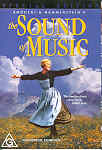

_This review was written by me for **MichaelDVD**, an Australian DVD review site that is no longer online. A capture of the site is held by the Internet Archive: **[browse it there](https://web.archive.org/web/20220217040146/http://www.michaeldvd.com.au/)**. It is reproduced here from my own copy of the site, as part of the record of what I have written._

_1965 · directed by Robert Wise._

## The film

_**The Sound of Music**_ is definitely one of my favourite things - a film that I can watch over and over again (certain scenes never fail to bring tears to my face - it's become a conditioned reflex). Judging by the success of the recent Australian revival of the stage musical version, and the even more recent _[Sing-a-Long-a-Sound-of-Music](http://www.singalongaworldwide.com)_ show (which shameless borrows the concept of audience participation from the _Rocky Horror Picture Show_) I am not alone in my adulation of this timeless classic.

The film is based on a Broadway stage musical, which in turn is based on two German films, which are in turn based on the true story of **Maria von Trapp**, as documented in her book _The Story of the Trapp Family Singers_. The film had its world premiere on March 2, 1965 before an ecstatic audience at the Rivoli Theater in New York and the rest is as they say ... history.

_The Sound Of Music_was nominated for ten Academy Awards and won five of them, including Best Film, Best Director and Best Music, and Best Sound. It won a number of other awards including two Golden Globes. In 1989, the film was voted the all-time favorite motion picture from The People's Choice Awards.

In order not to slow down the review process, I've abridged and adapted the "official" synopsis of the story from the Fox [web page](http://www.foxhome.com/soundofmusic):

Maria (**Julie Andrews**) is a postulant in a Salzburg Abbey with a restless, passionate spirit and a love of music, much to the consternation of the more conservative nuns in the abbey. The Mother Abbess (**Peggy Wood**), believing that Maria's buoyant personality may be incompatible with monastic life, wisely sends her away to discover her true calling. Maria is to be the governess for the von Trapp family — a brood of seven children helmed by Captain von Trapp (**Christopher Plummer**), a widowed naval officer who educates his children with military discipline. Ignoring the Captain's prescriptions for stern child-raising, Maria wins the children over with her natural warmth and kindness.

In the meantime, the Captain has been considering remarrying - to Baroness Schraeder (**Eleanor Parker**), a glittering Viennese socialite. Together with talent scout and music agent Max Detweiler (**Richard Haydn**), the Baroness makes a visit to the von Trapp family home. When Captain is finally charmed by Maria's contagious personality and realises how she has brought music and happiness back to their lives a tension develops between the Baroness and Maria.

Who will the Captain marry? Will Max ever convince the Captain to allow the children and Maria to perform in the upcoming Salzburg Music Festival? How will the Captain, a fiercely patriotric Austrian, be impacted by the impending Anschluss and Nazi occupation of Austria? If you do not know the answers to these questions, then you are one of very few people in the world who have not watched this film and I urge you to give it a go.

Of course, _The Sound of Music_is much more than the story of a postulant and a retired sea captain with seven children - this film features a wondrous and beloved collection of songs that most people are familiar with.

My favourite scene is just after the Captain has a big fight with Maria. He then walks back to the house, but is intrigued by the sound of the children singing to the Baroness and Max. The sight of him being moved and joining into the singing always bring tears to eyes everytime I watch this film.

## The video transfer

I've seen this film so many times in pan-and-scan on TV that it is a real pleasure to watch it in it's original widescreen aspect ratio of 2.20:1 at home. This film is so carefully framed to be presented in widescreen (many scenes feature characters spread across the entire frame) that it is a delight to see it the way it was intended. The transfer is presented with 16x9 enhancement.

Although the original print of the film has badly deteriorated over the years and some restoration (particularly colour correction) has been done, the transfer on this disc is bitterly disappointing.

When the Region 1 "Five Star Collection" version was released last August, I eagerly bought a copy and was disappointed along with many Region 1 afficionados by the excessive amount of edge enhancement that has been applied and the overall poor quality of the transfer. I am truly sorry to report that the Region 4 version does not show any improvement. In fact, edge enhancement is even more pronounced in this disc. In the opening scene where Maria sings in the midst of an Austrian mountainside scenery, she looks like she is not only blessed by the sound of music but by her very own personal force field that Darth Vader would probably kill for!

Despite the aggressive use of edge enhancement, I would rate the sharpness and detail of this transfer as slightly above average. I quite like the detail of the wallpaper in Chapter Mother Abbess' room in the Abbey (**14:17**-**17:25**) and the in the wall decorations in the ballroom (**23:15**-**23:28**). The black levels and low level detail however are rather mediocre, particularly during the scenes where the von Trapp family is hiding in the Abbey.

[www.dvdreview.com](http://www.dvdreview.com) has a behind-the-scenes [report](http://www.dvdreview.com/html/sound_of_music_special.shtml) on the DVD production. In this it was revealed that extensive frame-by-frame colour correction was done during the telecine process, as the colour in the original film reels has faded over the years. Whilst I do appreciate the improved colour accuracy and the good levels of colour saturation shown on this DVD, I couldn't help but be annoyed by the flickering caused by rapid changes in brightness and colour saturation across the frames during the opening titles sequence (**5:17**-**7:03**).

The film source is relatively clean but unfortunately exhibits a very high amount of grain - particularly during the opening sequence and during the _Ent'Acte_. The level of grain improves later on in the film but never quite disappears. One particularly annoying film to video artefact mentioned in several Region 1 reviews is also present in this transfer - the "glowing" and smearing of the whites of Maria's and the Mother Abbess' habits in Chapter 37-39 (**107:45**-**112:49**)

The film includes over ten subtitle tracks including English. I turned on the English subtitle track whilst listening to the director's commentary and it seems to be an English for Hearing Impaired track as it documents non-verbal auditory events as well as names the character speaking a particular line in ambiguous situations.

As this is a single sided dual layered disc, the **RSDL** layer change occurs at **98:31**just prior to Chapter 35 (_Entr'Acte_). From a timing perspective, this is the perfect spot for the layer change.

## The audio transfer

This film was originally released with an magnetic six channel soundtrack, but the positioning of the channels are not quite what you might expect. Five channels are spread across the front (left, centre, right and two more in between) and only one channel is allocated for the surround. The DVD menu and packaging proclaims the audio transfer as "Dolby Digital 4.1" but in reality it's just a stock standard Dolby Digital 5.1 audio track encoded at 384 Kb/s - the extra channels between the left, centre and right channels have been merged into the front three Dolby channels, the original rear surround channel is duplicated across both Dolby surround channels, and some additional bass enhancement (particularly during the thunderstorm scene) have been mixed into the Dolby "0.1" channel.

In general the sound quality reflects the age of the film, with some roll-off of both high and low frequencies and a general lack of "sparkle." However, it is much better sounding in comparison to the Region 1 soundtrack - which sounds extremely tinny and unappealing to my ears.

In any musical like this, it is important that every single line of dialogue is clearly enunciated and that the song lyrics are easy to pick up. The film is superb in this respect (no wonder it won an Academy Award for Best Sound!) and the audio transfer does not disappoint. I also did not have any issues with audio synchronisation.

One unusual point to note about the dialogue is that it is positioned where the characters appear to be on screen, as opposed to more modern films in which the dialogue is normally directed to the centre speaker at all times (regardless of where the characters are actually positioned on screen). Director **Robert Wise**obviously has the speaker arrangement in mind when he made the film because he often frames the characters fairly close to where the five front speakers would be positioned.

If you have a very large screen TV or a front projector and your front speakers roughly align with the dimensions of the screen you are in luck, just sit back and enjoy watching the movie. If you have a smaller screen display and your front speakers are placed well beyond the screen dimensions, don't be surprised if you start hearing a character's voice coming from beyond the confines of the screen - a very disconcerting effect when I was watching the film on our 21" TV.

Possibly because there wouldn't have been too many theatres in 1965 equipped with surround speakers, the (monaural) surround channel is not heavily utilised - mainly for musical ambience particular in the choral sections of the musical score but occasionally for the orchestral background music as well. All sound effects and dialogue have been directed to the front speakers. I was initially rather disappointed but decided that hey - I'm not watching an action movie here.

Since the film soundtrack is not exactly a bass heavy the subwoofer is only used sporadically but to good effect, particularly during the thunderstorm in Chapters 16-17 and for the low organ notes during the wedding.

I noticed some slight crackling in the speakers during the hymn around **7:52**.

## The extras

This is a Special Edition two-disc set featuring a large collection of extras, mainly taken from the laserdisc version of the film. It includes almost all of the extras contained in the Region 1 "Five Star Collection" released last year, apart from the extensive gallery of stills and storyboards and DVD-ROM content.

### Menu

The menus are rather pleasing and are 16x9 enhanced, but are not animated (though accompanied by audio). In contrast, the Region 1 version features menu animation (but the menu animation is not extensive so we are not missing out on much).

### Booklet

This is an eight page full colour booklet featuring a brief article on the transition of the story from the real life experiences of **Maria Augusta Kutschera**(who later married **Captain Georg von Trapp**) to the Broadway musical to the film (from genesis to premiere to subsequent acclaim), together with colour pictures of various scenes in the film. It is identical to the Region 1 DVD booklet, but seems to be better put together (the page layout looks better and the colours seem slightly brighter). The last two pages of the booklet lists the chapter titles of the film, but omits the chapter titles of the _"From Fact to Phenomeneon"_ documentary (because the Region 4 DVD does not break the featurette into chapters).

### Audio Commentary-_Robert Wise (Director)_

This is not only a retrospective director's commentary but also an isolated music score featuring the lush orchestral arrangements serving as background music and also accompanying the many songs.

During the songs, we get to hear the accompanying orchestra minus the singing voices. It's a great disc to use in karaoke sessions for anyone wanting to sing along to the film, especially if you turn on the subtitles which include lyrics to the songs. I'm surprised the producers of the DVD did not promote this feature more (and in particular have a "Karaoke" menu screen that indexes into each song).

In between the songs, Robert Wise provides a very listenable commentary on the casting process, insights into and various anecdotes from the shooting of the film. The commentary is so well presented and delivered that I'm tempted to suspect that it was scripted, or at least well edited.

### Featurette-_Original 1965 Documentary:Salzberg Sight and Sound_ (13:49)

This is a on location "making of" documentary combined with a brief tour of Salzberg made during the shooting of the film, as told from the perspective of **Charmain Carr**(Liesl von Trapp) as a "tourist" visiting the city. I found it quite charming (and I really liked Charmain's hot pink dress!). It is introduced by a much older Charmain.

The documentary shows it's age, with numerous scratches and film marks present in the film source, and some evidence of deteriorating colour. The transfer quality is approximately laserdisc quality (main artefact noticeable is colour smearing) and judging from the shimmering may also have been upconverted from NTSC to PAL. It is presented in full frame.

### Featurette-_The Sound Of Music: From Fact To Phenomenon_ (87:58)

This is a very extensive restrospective documentary on the film (originally produced by **Michael Matessino** for the laserdisc edition - you can read his production diary [here](http://www.sharplinearts.com/diary/diary.html)), and is longer in length than some feature films! Unfortunately (unlike in the Region 1 version), it is not subdivided into chapters - so if you want to stop it in the middle it might take you a while to get back to the same spot next time!

It starts off with a brief biography of **Maria Augusta Kutschera** and **Captain Georg von Trapp**. It shows closeups of black and white photographs of the real von Trapps interspersed with excerpts from the film. Comparisons between the real life events and the events depicted in the film are made. The story then progresses into the von Trapps' arrival into America and the publishing of the book, excerpts from the German film _Die Trapp Familie_, and the making of the Broadway stage musical, and finally the making of the film and it's success. The documentary ends with the von Trapp family today being interviewed in their hotel/residence in Stowe, Vermont.

The documentary includes various interviews with some of the von Trapp children (who are now quite mature!) and grandchildren - including **Rosemarie Trapp**, **Eleonore von Trapp-Campbell**, **Elisabeth von Trapp-Hall**, **Francoise von Trapp-Gibson**, **George von Trapp**and **Johannes von Trapp**. It also includes interviews with **Theodore Chapin**, **James Hammerstein**, **Richard Zanuck** (studio executive), **Ernest Lehman**(screenwriter), **Saul Chaplin**(associate producer), **Robert Wise**(director), **Julie Andrews**(Maria), **Christopher Plummer**(Captain), **Charmain Carr**(Liesl), **Nicholas Hammond**(Friedrich), **Dee Dee Wood**(choreographer), **Irwin Kostal**(additional music and conductor), **Anna Lee**(Sister Margaretha), **Portia Nelson**(Sister Berthe), **Marni Nixon**(Sister Sophia), **Maurice Zuberano**(production illustrator), **Betty Levin-Chaplin**(script supervisor), and **William Reynolds**(film editor).

The featurette comes with Dutch, French, Italian and Spanish subtitles. The transfer is presented in full frame. It is a bit soft and grainy in places, but is otherwise quite acceptable. Unfortunately the transfer has a glitch (omission of the opening and closing titles which are present in the Region 1 version of the featurette) so where the closing credits normally appear we just get music playing over a background picture.

### Trailer-_6_

This features the following six trailers:

- Teaser Preview, December 1964 (1:31 minutes, 2.0:1)
- General Release Preview, February 1965 (4:02 minutes, 2.0:1)
- Academy Awards Preview, April 1966 (4:25 minutes, 1.85:1)
- First Anniversary Preview, May 1966 (1:01 minutes, 1.85:1)
- Reissue Preview, December 1972 (4:12 minutes, 1.85:1)
- Reissue Preview, December 1972, with alternate track minus narration (4:12 minutes, 1.85:1)

The transfer quality of the trailers are laserdisc quality (slightly soft with some colour smearing and shimmering), and show signs of colour deterioration. I can also detect occasional ringing, especially around titles. Judging by the occasional shimmering and horizontal dot crawl, I suspect these trailers have been upconverted from NTSC to PAL. None of the trailers are 16x9 enhanced.

### TV Spots-_2_

This features the following two TV spots:

- 60 sec. Reissue TV Spot, March 1973 (0:54 minutes, 1.85:1)
- 30 sec. Reissue TV Spot, March 1973 (0:33 minutes, 1.66:1)

The transfer quality of the these are similar to that of the trailers and are not 16x9 enhanced.

### Radio Spots-_4_

This features the following radio commercials, played against a background still from the film:

- 60 second "Reserve Seat Engagement" Radio Commercial (0:55)
- 60 second "1973 Reissue" Radio Commercial (0:58)
- 30 second "Reserve Seat Engagement" Radio Commercial (0:27)
- 30 second "1973 Reissue" Radio Commercial (0:30)

### Audio-Only Track-_1973 Reissue Interview-Julie Andrews & Robert Wise_ (7:28)

This features a **Steve Gray**interviewing **Julie Andrews**and **Robert Wise**. Julie talks about how she was casted, provides a brief synopsis of the film, and talks about her memories of the shooting of the film. Robert talks about the success of the film and his experiences casting and directing it.

### Audio-Only Track-_On Location Interviews; J Andrews_ (11:22)_,C Plummer_ (5:02)_,P Wood_ (6:20)

These are a series of audio only interviews made with three of the principal cast members during the shooting of the film. Of the three, **Julie Andrew**'s is the most detailed as she talks about how she was selected to play the role and provides a brief synopsis of the film. **Christopher Plummer**'s is rather brief and seemed more to be about his aspirations to become a film producer rather than his role in the film. **Peggy Wood**'s is short but delightful and charming reflecting her rather engaging personality.

### Audio-Only Track-_A Telegram from Daniel Truhitte_ (12:32)

This is a retrospective audio only interview featuring **Daniel Truhitte**, who played Rolfe (Liesl's boyfriend who later on became a Nazi). He talked about how the casting process and how he was selected, as well as his memories of the film shooting and his relationship with the other cast members such as Julie and the children.

### Audio-Only Track-_Ernest Lehman: Master Storyteller_ (33:30)

This is an audio only documentary featuring **Ernest Lehman**reminiscing about his part in the making of the film, together with a restropective voice-over that fills in the gap between his commentary. I quite liked this one, as I didn't realise how significant his involvement was even to the extent of influencing the choice of director and the casting. It also provides a historical insight in the resurrection of Twentieth Century Fox as a major studio from the brink of oblivion.

Ernest talks about his experiences in collaborating with **Richard Zanuck**to bring to film to production, trying to persuade **William Wyler**to direct the film (he initially accepted but later then decided to direct another film) and eventually managed to get **Robert Wise**.

## Censorship

As far as we have been able to ascertain, there are no censorship issues with this title. Why would anyone want to censor this film?

## Region 4 versus Region 1

The Region 4 version of this disc misses out on;

- Menu animation
- THX trailer and certification
- English and French Dolby Surround audio tracks, Spanish subtitles
- DVD-ROM content (on both discs)
- Gallery, including storyboards, sketches and production stills

The Region 1 version of this disc misses out on;

- Additional foreign language subtitles<em></em>

I'm not sure why the Region 4 version misses out on THX certification - I can be really cynical and make a comment about the relevance of THX certification (since in my experience THX certification doesn't generally correlate with better transfers) but I think I'll quit while I'm ahead.

The major extras missing on R4 are the stills gallery which contain some quite interesting information and pictures (although the quality of the stills are rather poor on the R1 version) and DVD-ROM content. The R4 version does have a better audio transfer so all in all I would say the two versions are roughly comparable.

## Summary

**\_The Sound of Music _**is one of my favourite films. It is presented on a Special Edition two-disc set crammed with extras, but unfortunately has a rather disappointing video transfer and an above average audio transfer.

I really hope that one of these days Fox or someone else will take the opportunity to redo the transfer for this well-loved classic and give it a video and audio transfer quality that it so richly deserves.

| Rating  | Score        |
| :------ | :----------- |
| Plot    | ★★★★★ 5 / 5  |
| Video   | ★★½ 2.5 / 5  |
| Audio   | ★★★½ 3.5 / 5 |
| Extras  | ★★★★★ 5 / 5  |
| Overall | ★★★½ 3.5 / 5 |
