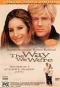

_This review was written by me for **MichaelDVD**, an Australian DVD review site that is no longer online. A capture of the site is held by the Internet Archive: **[browse it there](https://web.archive.org/web/20220217040146/http://www.michaeldvd.com.au/)**. It is reproduced here from my own copy of the site, as part of the record of what I have written._

_1973 · directed by Sydney Pollack._

## The film

They just don't make movies like _**The Way We Were**_ anymore - a sentimental, some would say even corny, love story along the lines of _Love Story_. Have you ever noticed that these days filmmakers seldom make pure romantic dramas without at least combining it with either action or comedy? It's almost as they are afraid of being labelled "soppy".

Well, this film at least is not afraid of being labelled soppy, or sentimental, or corny. It has a strangely appealing (to me, at least) melancholic feel about it that you only find in movies made in the seventies - the sort of melancholy I sometimes experience sitting say in a porch or a balcony watching the rain and I can almost hear the violins surging in the background playing _Memories_ ...

Katie Morosky (**Barbra Streisand**) is a Jewish girl who is a passionate fighter for political causes. At the beginning of the film we see her entering a nightclub after a hectic day at work where she meets a uniformed Hubbell Gardner (**Robert Redford**) who is so exhausted that he's sleeping whilst sitting upright on a bar stool. The film then takes us to a very extended flashback into their college years and it turns out they met each other in college.

At that time Katie was a outspoken campus eccentric who is the President of the Young Communist League and fighting against the fascist rule of Spain. She seems to be working in at least three part time jobs in between being a political activist to try and make ends meet. She is strangely attracted to and repulsed by her emotional, social as well as intellectual opposite - White Anglo Saxon Prostestant (WASP) Hubbell Gardiner. Hubbell likewise seemed to be intrigued by her political convictions, her passion and her daring to be different.

We then return back to the "present" of the nightclub. Katie takes the very sleepy Hubbell back to her place and gradually an unlikely love relationship develops between the two characters. The rest of the film is about them struggling to maintain their relationship in spite of their differences and ultimately neither of them are really willing or able to change their character for the other. The film covers a fairly lengthy and eventful set of years, ranging from pre-World War II to the McCarthy era of anti-Communist paranoia of the fifties and it's impact on Hollywood - and finally to the "present" day (presumably the seventies).

How will it end? Well, if you have never watched the film before I won't spoil the ending for you. Movie buffs may be interested in spotting a very young **Lois Chiles** (_Moonraker_ and _Death on the Nile_) as Carol Ann and **James Woods** (_Against All Odds_, _Any Given Sunday_) as Frankie McVeigh.

## The video transfer

For a film that's old enough to be your teenage daughter entering uni (it is coming up to 18 years old) this widescreen 2.35:1 transfer (with 16x9 enhancement) comes off surprising well.

The film source is relatively clean, apart from various small marks here and there. Fortunately for a film of its age, grain is not really an issue.

Sharpness and detail is consistently good, but the colour is just a little bit off (though this not really the fault of the transfer but more the film stock used during the period). Black levels for the transfer are quite good and demonstrate that some care has been taken during the telecine transfer.

The only artefacts I can detect are occasional shimmering and aliasing, plus slight posterization in the faces every now and then.

The film seems to have a very comprehensive list of subtitles. Even the audio commentary is subtitled into three languages (unfortunately, not including English). I turned on the English subtitles. Apart from the occasional mistake every now and then, it is reasonably faithful to the audio track but does not contain any cues for the hearing impaired.

## The audio transfer

There are no less than six audio tracks on this disc (seven if you count the audio commentary track) in three languages (English, French, German). We get both the original mono soundtrack (Dolby Digital 2.0 encoded at 192 Kb/s) as well as a remixed version in Dolby Digital 5.1 (448 Kb/s) for each of the three languages. I listened to the English Dolby Digital 5.1 track.

In general, I am quite impressed by the soundtrack given the age of the film and the fact that it was originally released in mono. Dialogue sounded clear and natural sounding (apart from very occasional scenes where the characters are whispering but even then you can catch what they are saying if you listen intently enough). There are no audio synchronisation issues.

Some have criticised the music soundtrack of this film as being overly repetitious - basically we get to hear the theme song ("Memories") played with just about every saccharine sweet and sentimental variation that you imagine. If you didn't particularly care for the tune to begin with I think you will be pretty sick of it well before the end. Personally, I quite like the song, and I think it fits the film very well and I didn't mind it at all. Right at the end we get the full orchestral treatment with the theme song swelling to fill the loudspeakers accompanying Katie and Hubbell hugging each other and the effect is calculated to bring tears to your eyes and make you reach for the hankie. Well, it worked in my case. The music also sounded pretty full bodied and rich which is again somewhat surprising given the age of the film.

The original soundtrack is in mono and has been remixed into Dolby Digital 5.1. Needless to say, dialogue is still very much centred in front and the other speakers are mainly used for the music and very occasional ambience noises. The rear surrounds and subwoofer are hardly used but again that's not surprising.

## The extras

This disc is billed as a "Collector's Edition" and comes with a reasonable set of extras, including a lengthy restrospective documentary and a director's commentary track. The menus are pretty uninspiring (no 16x9 enhancement) and seem to feature a lot of grain.

### Theatrical Trailer (2:25)

This main message promoted in this trailer seems to be that we will finally get to see Robert Redford and Barbra Streisand together in a romantic drama, which I suppose is a pretty powerful marketing message. It is presented in 1.85:1 letterboxed with no 16x9 enhancement. The transfer is softer that that of the film, but is still quite acceptable. The soundtrack is in Dolby Digital 2.0. The trailer comes with French, German, and Dutch subtitles.

### Featurette - _"The Way We Were - Looking Back"_ (61:36)

This is a fairly lengthly restrospective documentary (though not quite the 70 minutes as claimed on the packaging) featuring excerpts from the film (presented at 2.35:1 letterboxed with no 16x9 enhancement) together with interviews (presented in full frame) with:

- **Barbra Streisand** ("Katie")
- **Arthur Laurents** (screenwriter)
- **Sydney Pollack** (director)
- **Ray Stark** (producer)
- **Marvin Hamlisch** (music composer)
- **Alan** and **Marilyn Bergman** (lyricists)

What I really liked about this documentary is that it shows quite a lot of deleted scenes, some of which are quite intriguing. I would have liked to be able to individually select each deleted scene from the menu, not to mention being able to watch a version of the film with some of the more critical deleted scenes added back in, but I respect director Sydney Pollack's final decision to omit these scenes. Notably absent from this documentary is **Robert Redford**.

The documentary comes with French, German, and Dutch subtitles. Despite the length of the documentary, there are surprisingly few MPEG artefacts - which is a good sign as it means the DVD authors have not overly-compressed the documentary.

### Audio Commentary

This is one of the few commentaries that I have listened to (featuring director **Sydney Pollack**) that is not just about how the film was made and anecdotes about the cast and crew, but an actual commentary on the film itself - Sydney talks about some of the scenes and explains the motivation of the characters and what they were thinking. I found the commentary fascinating to listen to, although some might object to being "spoon fed" the interpretation of the film.

### Biographies-Cast & Crew

This features stills highlighting the talent profiles and filmographies of:

- **Sydney Pollack** (director and producer)
- **Barbra Streisand** ("Katie")
- **Robert Redford** ("Hubbell")

## Censorship

As far as we are aware, there are no censorship issues with this DVD.

## Region 4 versus Region 1

The Region 4 version misses out on:

- bonus trailers for _“The Prince Of Tides,” “The Mirror Has Two Faces”_ and _“For Pete’s Sake.”_
- some foreign language subtitles

The Region 1 version misses out on:

- Additional foreign language audio tracks and subtitles.

All in all, I would rate both versions as essentially the same, apart from PAL vs NTSC formatting.

## Summary

I can't say I'm too displeased with _**The Way We Were**_ - one of the classic romance films of all time presented on a DVD with the usual high standards of audio and video quality we've come to expect from Columbia Tristar, plus a reasonable collection of extras.

### [Ratings (out of 5)](RatingsGuide.html)

© [Tham, Christine](mailto:ChrisT@michaeldvd.com.au) (read my [biography](../ReviewerProfiles/ChrisT.asp)) 10 May 2001

| Rating  | Score        |
| :------ | :----------- |
| Plot    | ★★★★ 4 / 5   |
| Video   | ★★★½ 3.5 / 5 |
| Audio   | ★★★ 3 / 5    |
| Extras  | ★★★½ 3.5 / 5 |
| Overall | ★★★½ 3.5 / 5 |
