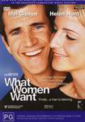

_This review was written by me for **MichaelDVD**, an Australian DVD review site that is no longer online. A capture of the site is held by the Internet Archive: **[browse it there](https://web.archive.org/web/20220217040146/http://www.michaeldvd.com.au/)**. It is reproduced here from my own copy of the site, as part of the record of what I have written._

_2000._

## The film

Successful advertising hot shot Nick Marshall (**Mel Gibson**) has a (supposedly) rare talent: he knows _**What Women Want**_. No, this is not because he is gay, although from the lines this character utters later on in the film I'm having my doubts. Actually, he's a bit of an obnoxious ladies' man who thinks he is God's gift to women (well, quite a lot of women do think that **Mel Gibson**is a gift from God but that is another story). His mum worked as a Las Vegas showgirl, and he was brought up surrounded up beautiful females who mollycoddled him. As a result, he expects females to fawn all over him, but deep inside he's just your average man's man: insensitive, uncaring and cruel if you believe the film's scriptwriter.

He thinks he is in line for promotion to Creative Director, but at the last moment his boss Dan Wanamaker (**Alan Alda**) decides to hire a woman instead: the interestingly named Darcy McGuire (**Helen Hunt**). The rationale is that women are now the big spenders and more and more advertising is targetting women, so Dan is afraid his firm will be left in the cold unless he gets a Creative Director who understands how women think.

Does Nick get mad? No, but he plans to get even, by sabotaging Darcy. As he ponders on how to do this, he attends Darcy's inaugural staff meeting where she hands everyone a box full of women's products and urges everyone to start thinking like a woman - in order to come up with ideas on how to market the products.

At home in his elegant and sumptious apartment (Clue #1 of why I suspect Nick is not quite the man's man he's supposed to be - if he really was, his apartment would probably be a mess), he decides the only way he can figure out how to market the products is to try them on - literally. So, after a glass of wine and some dancing (Clue #2: dancing?), he starts applying the lipstick, nail polish, hair removal wax bra and pantyhose (Clue #3: huh? Then again, maybe he's watched the _Footy Show_too many times) when he is surprised by his teenage daughter Alexandra Marshall (**Ashley Johnson**) and her boyfriend Cameron in a hilarious scene. After that, he continues except a slapstick accident involving electrocution with a hairdryer in a bath tub enables him to be able to hear what women think.

At first he is really perturbed by this, but a session with a psychologist (played brilliantly by **Bette Midler**in a cameo role) convinces him that he can use this new talent to his advantage. He promptly starts to sabotage Darcy by stealing all her ideas as she is thinking them, and also to woo frustrated-aspiring-actress-working-as-a-waittress Lola (**Marisa Tomei**). However, just when his Machiavellian scheme is starting to work, he discovers he is starting to fall in love with Darcy and he also realises Darcy is besotted with him.

I think Mel and Helen are perfectly casted in their roles, and I'm not sure any other male actor would have carried off the role of Nick as successfully.

Somehow, it reminded me of another movie about an obnoxious advertising man learning to see things from a female perspective: _Switch_(starring **Jimmy Smits**and **Ellen Barker**).

What perturbs me is the rather callous treatment that Lola gets from Nick, which goes totally against the flow of the plot - which is about how Nick starts becoming more sensitive to women as he listens in to them. I think she deserves better, and I feel really sorry for her.

I noticed a number of minor plot inconsistencies in the film (in addition to the various goofs listed on IMDB).

For example, early on in the film Nick talks about moving up to the "44th" floor once he is promoted to Creative Director. Yet, later on in the movie, we find that the new Creative Director Darcy is working on the same floor as Nick. So, Darcy doesn't get to work on the 44th floor (because she is a woman?) or is Nick already working on the 44th floor and he's too dumb to realise this?

Also, around 30 minutes into the film, Nick gets to hear a female poodle "think" to her owner "Please, monsieur, I need to poop" but in a deleted scene (featured in the trailer) he meets an ethnic woman in the park and she is thnking in a foreign language. So, he can understand dog thinking but not ethnic women?

Despite all that, I quite enjoyed this film - it's more a comedy than a romance, but well worth watching anyway. Somehow, it reminded me of another movie about an obnoxious advertising man learning to see things from a female perspective: _Switch_(starring **Jimmy Smits**and **Ellen Barker**). I'm not sure that a man watching this film will really gain any real insights into the female psyche, but hey we in the Sisterhood do guard the details of our secret women's business quite closely!

## The video transfer

For a film as recent and as hyped up as this, I would have expected a flawless film source and video transfer. Unfortunately, this 1.85:1 16x9 enhanced transfer is plagued by rather bad instances of grain and occasional posterization. For example, there is grain present around **72:58**, **95:17** and around **110**-**111** minutes into the film, and there is a bit of posterization around Mel Gibson's skin from **3:46**-**4:05**.

Sharpness and shadow detail are pretty good, as you would expect from a recent film, and colour saturation are fairly good, though the colour balance looks slightly forced and unnatural at times.

There is one subtitle track: English for the Hearing Impaired. I turned it on briefly, and it seems reasonably accurate and detailed, transcribing auditory cues and even lyrics of songs in addition to dialogue.

This is a single sided dual layered disc (RSDL) and the layer change occurs at **72:50** between Chapters 14 an

## The audio transfer

There are two audio tracks on this disc, both in English - one in Dolby Digital 5.1 at 448 Kb/s, and another in Dolby Digital 2.0 at 224 Kb/s. There is also an English audio commentary track in Dolby Digital 2.0 at 224 Kb/s. I listened to the Dolby Digital 5.1 audio track, as well as the audio commentary track.

In general, I quite like this audio track - dialogue sounds clear and natural at all times, and the music nicely blends with and supports the dialogue. I did not encounter any dialogue synchronization issues.

The music is a mixture of original material by **Alan Silvestri**and a medley of **Frank Sinatra**and **Cole Porter**songs that reminded me of another romantic comedy, _Sleepless in Seattle_.

This is a mainly dialogue driven film, so the rear surround channels and the subwoofer are sparingly used. The scene where Mel Gibson encounters a whole bunch of female joggers thinking at **31:05**-**31:12** is one of the few places where the rear surrounds are used to provide an enveloping effect, and ambient noises like rain are also channeled occasionally to the rear speakers. The subwoofer was rarely engaged, apart from during thunderstorm scenes such as around **40:25** and also **99:00**-**99:20**.

## The extras

This disc comes with a rather generous collection of extras, including a Showtime featurette not present on the R1 version.

### Main Menu Audio & Animation

The menus are all 16x9 enhanced, and the main menu animation features voiceovers of women thinking. The main menu and special features menus are animated and include audio, the other menus are static but include audio.

### Dolby Digital Trailer-_Rain_

This has always been my favourite DD trailer. Subtler than some of the others, and some nice panning effects.

### Audio Commentary-_Nancy Meyers (Dir) & Jon Huttman (Prod Designer)_

This is a rather patchy commentary, with sporadic contributions from both **Nancy Meyers**and **Jon Huttman**. Nancy talks about various aspects of the film, including casting, Mel anecdotes, Helen's clothes, how certain scenes were constructed (champagne cork), as well as actual commentary on the scenes. Jon concentrates more on pointing out details of the sets, such as Nick's apartment, the advertising agency and the coffee shop, which I admit are pretty impressive in terms of detail. Nancy mentions quite a few deleted scenes that I wish they could have included as extras.

Most of the commentary is provided by Nancy, with Jon's contributions limited to a few scenes here and there, but even then there are long periods where all we hear is the audio track of the film. Nancy and Jon obviously recorded the commentary track together whilst watching the film, as they respond both to each other and to events on the film. I think the periods of silence are due to both of them engrossed in watching the film!

### Theatrical Trailer (2:14)

This is in 1.85:1 with 16x9 enhancement with Dolby Digital 2.0. The video transfer is slightly softer and even more grainer compared to the main feature. Interestingly, the trailer seem to feature some scenes not present in the film itself, and some of the lines are altered, such as the word "penis" is changed to "crotch," "poo poo" instead of "poop", etc.

### Featurette-_Showtime Interviews With Andrew Warne_ (4:14)

This is an interesting Australian sourced extra - a featurette originally shown on Foxtel's Showtime channel. It features **Andrew Warne**at the Hollywood premiere of the film. It is presented in 1.33:1 with excerpts from the film in 1.85:1 letterboxed. Andrew interviews **Lorette Devine**('Flo'), **Mel Gibson**('Nick Marshall'), **Helen Hunt**('Darcy McGuire'), and **Nancy Meyers**(director). The excerpts seem to have been mainly taken from the trailer as they feature the same alteration of lines and deleted scenes as the trailer.

### Teaser Trailer (2:02)

This is in 1.85:1 with 16x9 enhancement with Dolby Digital 2.0. The quality of the video transfer is similar to that of the theatrical trailer.

### Featurette-Making Of (16:07)

This is a standard promotional featurette (presented in 1.33:1 and Dolby Digital 2.0) featuring behind the scenes shots, excerpts from the film (in 1.85:1 letterboxed), and interviews with **Mel Gibson**, **Alan Alda**, **Nancy Meyers**, **Marisa Tomei**, **Mark Feuerstein**, **Helen Hunt**, and **Ashley Johnson**. **Nancy Meyers**looks and even talks like an upcoming **Nora Ephron**.

### Featurette-_A Look Inside_ (11:40)

This is another promotional featurette (presented in 1.33:1 and Dolby Digital 2.0) featuring behind the scenes shots, excerpts from the film (in 1.85:1 letterboxed), and interviews with **Nancy Meyers**, Mel Gibson, Helen Hunt, Marisa Tomei, Ashley Johnson,

### Biographies-Cast & Crew

This features rather detailed biographies and filmographies of:

- **Mel Gibson**('Nick Marshall')
- **Helen Hunt**('Ashley Johnson')
- **Alan Alda**('Dan Wanamaker')
- **Marisa Tomei**('Lola')
- **Mark Feuerstein**('Morgan')
- **Lauren Holly**('Gigi')
- **Delta Burke**('Eve')
- **Valerie Perrine**('Margo')
- **Nancy Meyers** (director)

The biographies are presented in a set of 16x9 enhanced stills.

## Censorship

As far as we are aware, there are no censorship issues with this DVD.

## Region 4 versus Region 1

The Region 4 version misses out on:

- French Dolby Digital 2.0 audio track

The Region 1 version misses out on:

- Featurette-_Showtime Interviews With Andrew Warne_
- Cast and Crew Biographies

For once, we seem to get more extras than R1, so I will unequivocally declare the Region 4 version to be the disc of choice.

## Summary

_**What Women Want**_is a fairly predictable but quite funny and watchable romantic comedy. It is presented on a disc with a slightly problematic video transfer but fairly decent audio transfer, and a very pleasing collection of extras. We even get an Australian sourced extra not present on the Region 1 disc.

### [Ratings (out of 5)](RatingsGuide.html)

© [Tham, Christine](mailto:ChrisT@michaeldvd.com.au) (read my [biography](../ReviewerProfiles/ChrisT.asp)) Sunday, July 01, 2001

| Rating  | Score         |
| :------ | :------------ |
| Plot    | ★★★½ 3.5 / 5  |
| Video   | ★★★½ 3.5 / 5  |
| Audio   | ★★★★ 4 / 5    |
| Extras  | ★★★★½ 4.5 / 5 |
| Overall | ★★★★ 4 / 5    |
