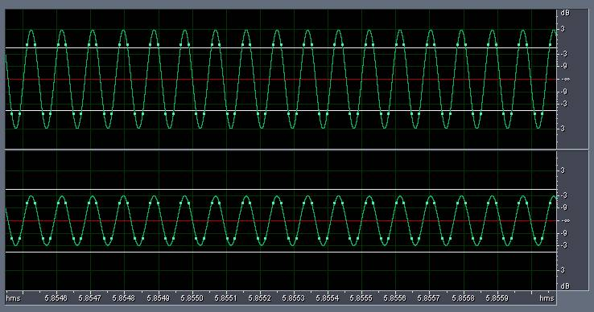
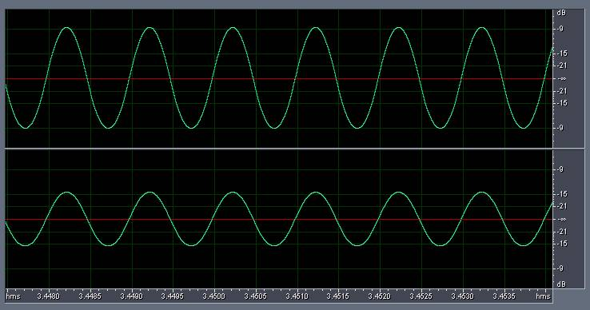
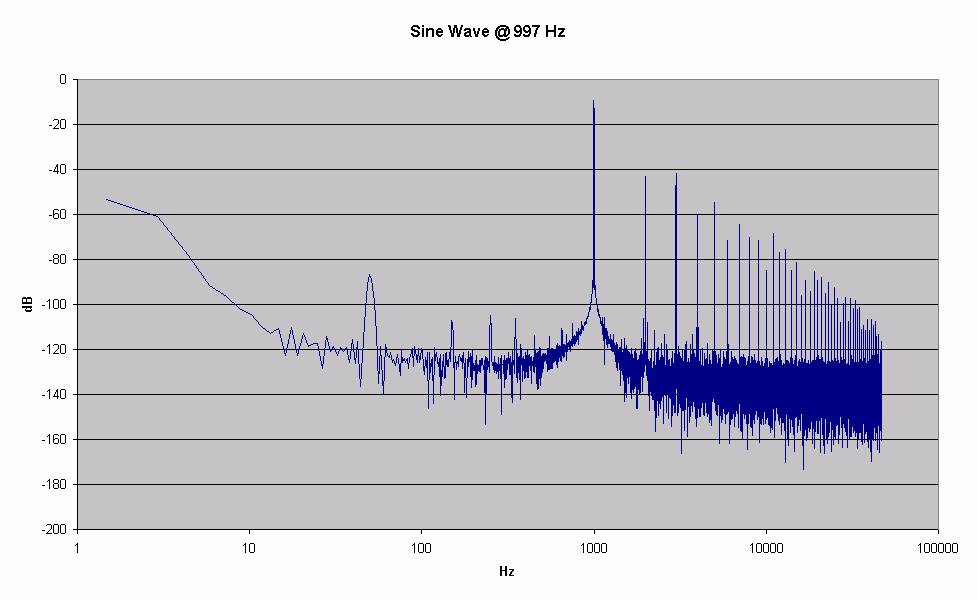
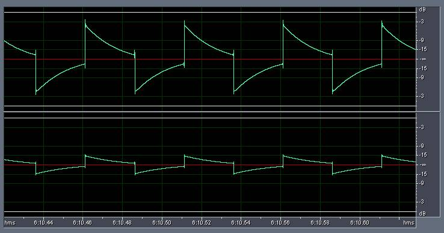
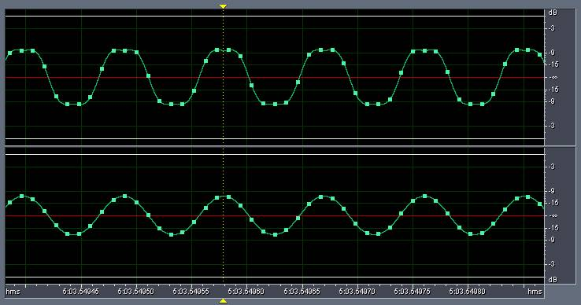
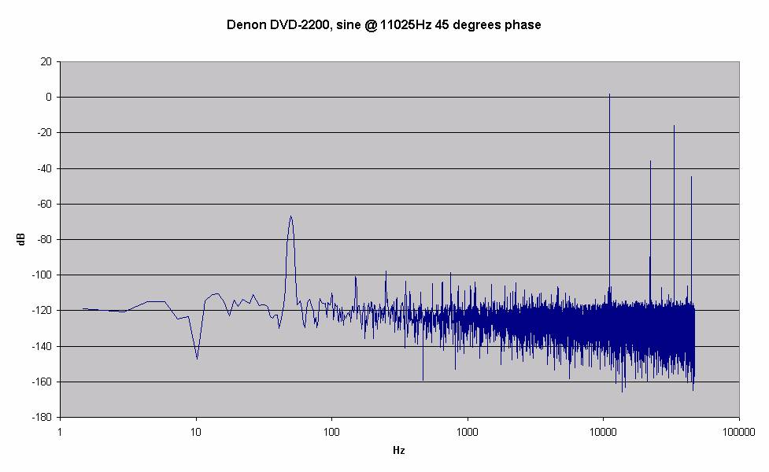
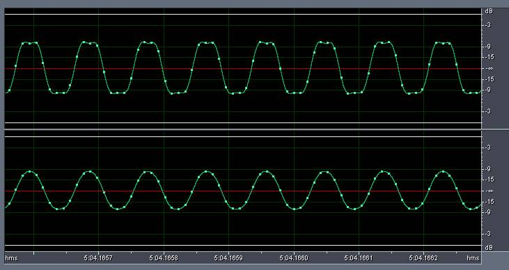
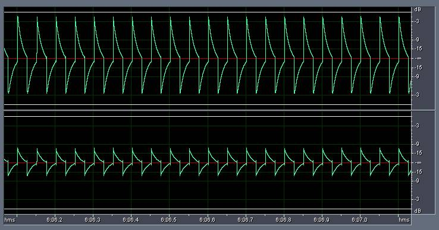
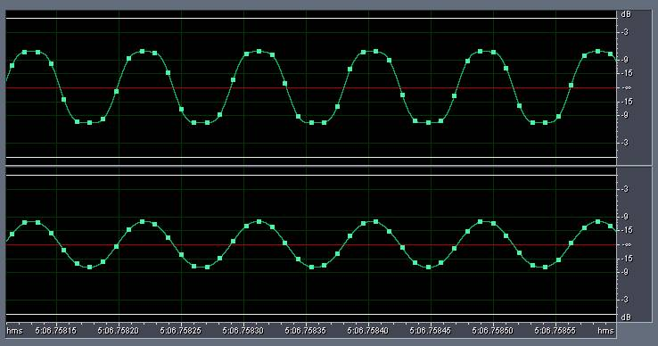
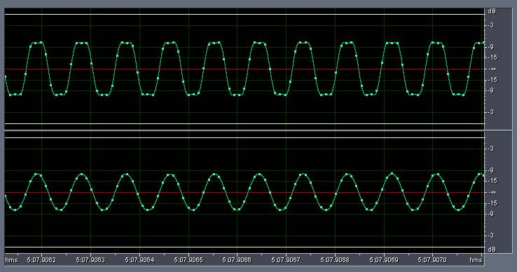

_This article was published on my own website at `users.bigpond.net.au/christie/`, which no longer exists. A capture of the original is held by the Internet Archive: **[read it there](https://web.archive.org/web/20040704113717/http://www.users.bigpond.net.au/christie/0dBFS/index.html)**. It is reproduced here from my own copy of the site, as part of the record of what I have written. Audioholics later ran a substantially expanded rewrite of this work, which is also reproduced here: **[Issues with 0dBFS+ Levels on Digital Audio Playback Systems](/spotlite/article/zero-dbfs-levels/)**._

A few weeks ago, Dan Banquer of [R.E. Designs](http://www.redesignsaudio.com) forwarded me a very interesting AES paper entitled ["0dBFS+ Levels in Digital Mastering"](http://www.tcelectronic.com/media/Level_paper_AES109.pdf) by S�ren H. Nielsen and Thomas Lund of [T.C. Electronic A/S](http://www.tcelectronic.com/).

Essentially, this paper explains why playing back a digital recording (by "reconstructing" the Nyquist band-limited analog waveform through a digital-to-analog converter and applying an appropriate reconstruction filter) will result in peaks that are higher in amplitude than the highest digital sample captured on the recording.

To put it in simpler terms, if you record a waveform (any waveform will do, including a sine wave) such that the highest peaks of the waveform (eg. corresponding to the peaks of the sine wave) are captured at the maximum value permissible by the digital recorder (called "0dB FS" where "FS" stands for "full scale"), then the resultant recording, when played back, may result in an analog waveform _exceeding_0dB FS.

For example, in a 16-bit recording, the maximum/minimum permissible sample values are 32,767 and and -32,768 respectively - corresponding to 0dB FS. If you record a sine wave such that the peaks of the sine wave are captured at 32,767 and and -32,768, then when playing back that sine wave may result in peaks that are higher than 0dB FS. If your playback equipment cannot handle signals above 0dB FS, you will get clipping distortion.

"What the ...?" I hear you say. "How is that possible?"

It has all to do with inter-sample peaks. If you record a sine wave at frequencies near integer fractions of _fs_ (where _fs_ = "sampling frequency"), such as _fs_/4 and _fs_/2, then (depending on the phase of the sine wave with respect to the sampling times), the digital samples may never actually capture the true peak of the analog waveform. Hence, when this recording is reconstructed back into analog, it will result in analog peaks higher than the highest digital sample captured. The resultant analog waveform is said to have "0dbFS+" levels - or levels higher than 0db FS.

Here is an example: a 11,025Hz sine wave (_fs_/2) sampled at 44.1kHz/16-bits, with a phase of 45� with respect to the sampling boundaries. The left channel is recorded at 0dB FS, and the right channel is at -6dB FS. As you can see, the reconstructed analog waveform will actually peak at +3dB FS:

So you can imagine, if this waveform is played back on a CD player, the analog circuit in the CD player better be able to handle a signal at +3dB FS!

The authors of the paper then conducted measurements of several CD players using test signals specifically designed to illustrate 0dbFS+ levels, and concluded that none of the players sampled were able to deal with 0dbFS+ levels without distortion.

## Yes, but what does it mean for me?

I was intrigued to find out how my system would handle 0dBFS+ levels, particularly my various players and the D/A conversion built in my amplifier.

I reconstructed the test signals mentioned in the paper, and burnt a music CD containing those test signals. I then played that CD on my system in various ways, and recorded the results using the Audiotrak Prodigy 7.1 soundcard in my HTPC at 96kHz/24-bits. I then analyzed the recorded signals for any signs of distortion.

I created the following sine waves as per the paper entirely in the digital domain as 30 second wave files at 44.1kHz/16 bits (_fs_):

- Sine wave @ 997Hz 0� phase (reference for distortion tests)
- Sine wave @ 5,512.5Hz 90� phase (_fs_/8)
- Sine wave @ 5,512.5Hz 67� phase (_fs_/8)
- Sine wave @ 7,350Hz 90� phase (_fs_/4)
- Sine wave @ 7,350Hz 60� phase (_fs_/4)
- Sine wave @ 11,025Hz 90� phase (_fs_/2)
- Sine wave @ 11,025Hz 45� phase (_fs_/2)

All signals were recorded at 0dB FS on the left channel, and -6dB FS on the right channel.

The following test signals should result in 0dbFS+ levels:

| _Frequency (sine wave)_ | _Phase_ | _Analog_<em> peak level (theoretical) </em> |
| :---------------------- | :------ | :------------------------------------------ |
| 5,512.5 Hz              | 67�     | +0.69 dB FS                                 |
| 7,350.0 Hz              | 90�     | +1.25 dB FS                                 |
| 11,025.0 Hz             | 45�     | +3.00 dB FS                                 |

I also generated the following square waves, also entirely in the digital domain as 30 second wave files at 44.1kHz/16 bits (_fs_):

- Square wave @ 20Hz
- Square wave @ 50Hz
- Sine wave @ 5,512.5Hz (_fs_/8)
- Sine wave @ 7,350Hz (_fs_/4)
- Sine wave @ 7,350Hz (_fs_/4)
- Sine wave @ 11,025Hz (_fs_/2)

The square waves were recorded at 0dB FS on the left channel, and -12dB FS on the right channel.

The only test signal mentioned in the article that I was not able to generate is the pseudo-random sequence consisting only of +1 and -1 values repeating every 32767 samples.

I played back the CD in the following players/configurations (all via the analog pre-amp section of my Denon AVC-A1SE+ amplifier):

- Sony SCD-XA777ES, analog outputs
- Denon DVD-2200, analog outputs
- Denon DVD-2200, digital outputs via the D/A stage of the Denon AVC-A1SE+ (in AL24+ mode)
- Panasonic DVD-RP82, analog outputs, no upsampling
- Panasonic DVD-RP82, analog outputs, upsampling algorithm 1 (Remaster 1)

## Sony SCD-XA777ES

This is how the Sony managed to reproduce the reference signal (Sine wave @ 997 Hz 0� phase):

Interestingly, I observed harmonics at 2, 3, 4, ... times the fundamental frequency (click on graph to see it at full resolution of 977x600):

The hump around 50Hz is probably from the power supply (Australia domestic power runs at 240V 50Hz). The first harmonic (at 2x fundamental frequency of 997Hz) is around -33dB below the fundamental. Still fairly significant distortion, I thought. I'm not sure whether this is inherent in the player, in the pre-amp, or in the soundcard.

The Sony player did really well, and was able to reproduce 0dBFS+ levels at fairly close to theoretical levels with no signs of clipping:

| _Frequency (sine wave)_ | _Phase_ | _Analog_<em> peak level (theoretical) </em> | _Observed level_ | _Relative level_ |
| :-- | :-- | :-- | :-- | :-- |
| 997.0 Hz | 0� | 0.00 dB FS | -8.6 dB FS | 0.0 dB FS |
| 5,512.5 Hz | 67� | +0.69 dB FS | -8.0 dB FS | +0.6 dB FS |
| 7,350.0 Hz | 90� | +1.25 dB FS | -7.4 dB FS | +1.2 dB FS |
| 11,025.0 Hz | 45� | +3.00 dB FS | -5.8 dB FS | +2.8 dB FS |

For example, here is the waveform for the Sine wave @ 11,025 Hz 45� phase:

As you can see, no signs of clipping at all.

The player did not do too well reproducing the Square wave at 20 Hz:

The waveform on the left channel ranges from -3.3 to -18.9dB and in theory it should be at a constant -8.6dB. The waveform on the right channel ranges from -15-30 dB (in theory should be -14.2dB). But wait till you see how well the other components reproduce this waveform! (hint: this is the best result I encountered in my experiments)

## Denon DVD-2200, analog outputs

Unfortunately, the Denon DVD-2200 did not do as well and definitely clipped on 0dBFS+ levels. As you can see from the following graph, the DVD-2200 really has no headroom at all above 0dB FS and is clipping the signal (Sine wave @ 11,025 Hz 45� phase):

The resultant signal creates harmonics well into the audible range (measured at the yellow dotted line):

## Denon DVD-2200, digital output to AVC-A1SE+

The AVC-A1SE+ did not handle 0dBFS+ levels either, and also clipped (Sine wave @ 11,025 Hz 45� phase):

Incidentally, it has the worst square wave reproduction I have seen:

Incidentally, the AVC-A1SE+ uses the same DACs (Texas Instruments/Burr Brown PCM1738) as the Sony SCD-XA777ES, so it just goes to show the ability to handle 0dBFS+ levels depends on the surrounding design and is not inherent in the DAC.

## Panasonic DVD-RP82, analog outputs, no upsampling

The Panasonic didn't do too badly, and was able to reproduce 0dBFS+ levels up to +1.1 dB FS:

| _Frequency (sine wave)_ | _Phase_ | _Analog_<em> peak level (theoretical) </em> | _Observed level_ | _Relative level_ |
| :-- | :-- | :-- | :-- | :-- |
| 997.0 Hz | 0� | 0.00 dB FS | -7.5 dB FS | 0.0 dB FS |
| 5,512.5 Hz | 67� | +0.69 dB FS | -6.9 dB FS | +0.6 dB FS |
| 7,350.0 Hz | 90� | +1.25 dB FS | -6.6 dB FS | +1.1 dB FS |
| 11,025.0 Hz | 45� | +3.00 dB FS | -6.6 dB FS | +1.1 dB FS |

At levels higher than +1.1dB FS, the player started clipping, as can be seen for the waveform of the Sine wave @ 11,025 Hz 45� phase:

## Panasonic DVD-RP82, analog outputs, upsampling using Remaster 1 algorithm

The Panasonic behaved far worse when the internal upsampling algorithm is engaged (I tried Remaster 1, but the other two algorithms were just as bad). The internal upsampler converts 44.1/16 to 88.2/24. It was only able to handle up to +0.1 to +0.3 dB FS:

| _Frequency (sine wave)_ | _Phase_ | _Analog_<em> peak level (theoretical) </em> | _Observed level_ | _Relative level_ |
| :-- | :-- | :-- | :-- | :-- |
| 997.0 Hz | 0� | 0.00 dB FS | -7.5 dB FS | 0.0 dB FS |
| 5,512.5 Hz | 67� | +0.69 dB FS | -7.4 dB FS | +0.1 dB FS |
| 7,350.0 Hz | 90� | +1.25 dB FS | -7.4 dB FS | +0.1 dB FS |
| 11,025.0 Hz | 45� | +3.00 dB FS | -7.2 dB FS | +0.3 dB FS |

Here's how the player handled the waveform of the Sine wave @ 11,025 Hz 45� phase:

## Audiotrak Prodigy 7.1, analog loopback

How can I not resist testing the soundcard itself? I recorded the soundcard playing the test signals via it's own DACs, and used a loopback cable to send the output back to the input and recorded that (unfortunately only at 44.1kHz/24-bits as the soundcard does not support different sampling rates for input vs output).

As you can see, the soundcard behaved really well, and was able to handle 0dBFS+ levels without clipping:

| _Frequency (sine wave)_ | _Phase_ | _Analog_<em> peak level (theoretical) </em> | _Observed level_ | _Relative level_ |
| :-- | :-- | :-- | :-- | :-- |
| 997.0 Hz | 0� | 0.00 dB FS | -9.3 dB FS | 0.0 dB FS |
| 5,512.5 Hz | 67� | +0.69 dB FS | -8.7 dB FS | +0.6 dB FS |
| 7,350.0 Hz | 90� | +1.25 dB FS | -8.0 dB FS | +1.3 dB FS |
| 11,025.0 Hz | 45� | +3.00 dB FS | -6.7 dB FS | +2.6 dB FS |

In fact, I discovered the reason the soundcard was able to handle 0dBFS+ is because it has a built in headroom for mixing purposes - in other words, the volume levels can really go up to 11! (12, actually, but who's complaining)

## Conclusion

It looks like the majority of my system components are not able to handle 0dBFS+ levels very well. But it's also interesting that some audio components, notably my Sony SCD-XA777ES, is able to handle 0dBFS+ levels without clipping. So it looks like some manufacturers of consumer audio equipment have read the paper and are designing to accommodate 0dBFS+ levels.
