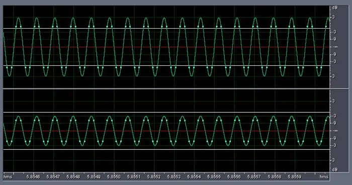
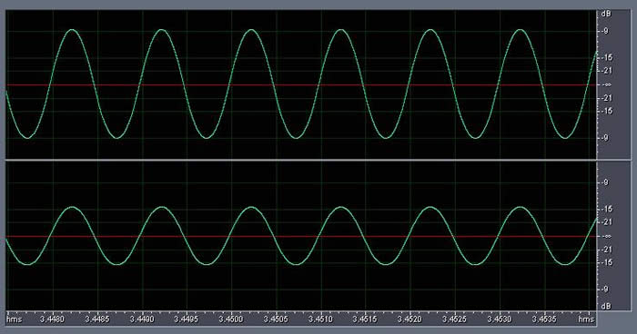
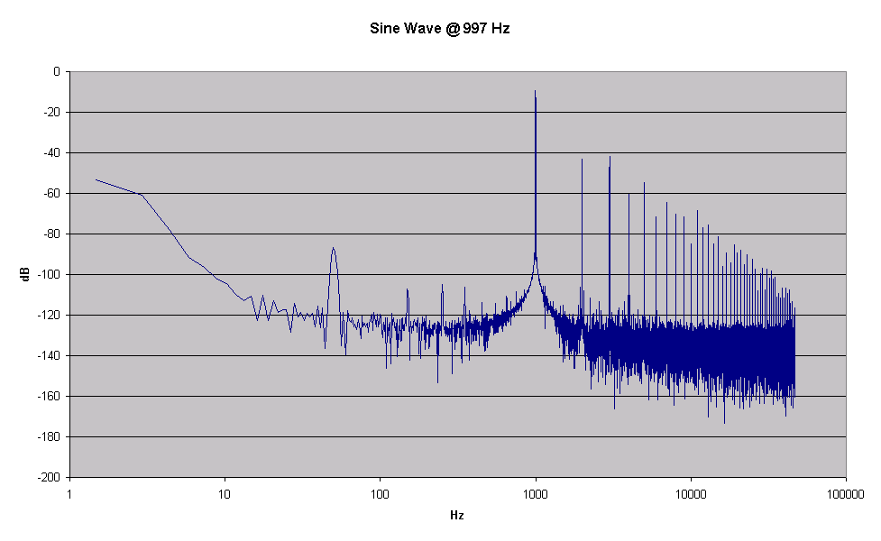
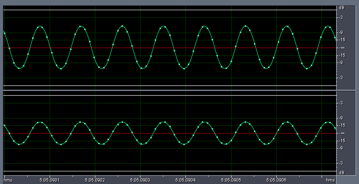
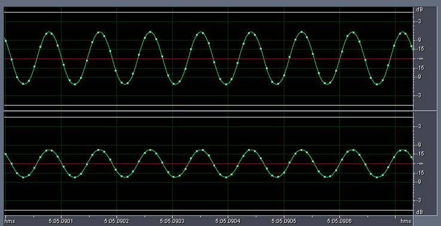

_This article was written by me and **published on Audioholics**, where it remains: **[read it there](https://www.audioholics.com/audio-technologies/issues-with-0dbfs-levels-on-digital-audio-playback-systems)**. It had already appeared elsewhere before Audioholics asked permission to run it. It is republished here for information, as part of the record of what I have written._

_This is the expanded version Audioholics ran. The shorter original, published on my own site a few months earlier, is also reproduced here: **[Experiments with 0dBFS+ levels on various players](/spotlite/article/zero-dbfs-experiments/)**._

A few weeks ago, Dan Banquer of R.E. Designs forwarded me a very interesting AES paper entitled ["0dBFS+ Levels in Digital Mastering"](https://www.tcelectronic.com/media/Level_paper_AES109.pdf) by Soren H. Nielsen and Thomas Lund of T.C. Electronic A/S.

Essentially, this paper explains why playing back a digital recording (by "reconstructing" the Nyquist bandwidth-limited analog waveform through a digital-to-analog converter and applying an appropriate reconstruction filter) will result in peaks that are higher in amplitude than the highest digital sample captured on the recording.

To put it in simpler terms, when you make a digital recording, an _analog waveform_ (represented by an electrical signal with a continuously varying voltage) is sampled at regular intervals and converted to a set of numbers. Each number, or _digital sample_ , correspond the voltage of the electrical signal at a specific point in time. These numbers are stored in binary form with a specific word size (typically 16-24 bits). The minimum and maximum numbers that can be stored depends on the word size, and corresponds to the voltage range of the electrical signal. For example, the maximum digital sample in a 16-bit recording is 32,767 and this is also referred to as 0dBFS (0dB "full scale").

When this recording is played back, a digital to analog converter converts these binary values back to a set of voltages, and a reconstruction filter is applied to convert these voltages back into a continuous signal. It is possible for the reconstructed analog waveform to have voltages that are higher than the highest digital sample recorded. So, if the highest digital sample captured happens to correspond exactly to 0dBFS, the recording, when played back, may result in an analog waveform _exceeding_ 0dBFS. The subsequent analog stage of the playback chain may not be capable of handling a signal greater than 0dBFS (also known as "0DBFS+"), resulting in clipping distortion.

"What the ...?" I hear you say. "How is that possible?"

It has all to do with inter-sample peaks. If you record a sine wave at frequencies near integer fractions of _fs_ (where _fs_ = "sampling frequency"), such as _fs_ /4 and _fs_ /2, then (depending on the phase of the sine wave with respect to the sampling times), the digital samples may never actually capture the true peak of the analog waveform. Hence, when this recording is reconstructed back into analog, it will result in analog peaks higher than the highest digital sample captured.

A "raw" recording - captured directly from an analog to digital converter (ADC) with no subsequent digital signal processing, should NEVER contain 0dBFS+ levels. This is because the original analog waveform should always be below 0dBFS, provided the recording gain is set correctly. However, subsequent processing of this recording may create 0dBFS+ inter-sample peaks. For example, "normalization" is a common technique - this multiplies every digital sample by a constant value so that the highest digital sample captured _becomes_ 0dBFS. This will cause any inter-sample peaks that exceed the highest digital sample captured to exceed 0dBFS.

Read "[The Case for NOT Going Above 0dBFS in Digital Playback Systems](https://www.audioholics.com/audio-technologies/the-case-for-not-going-above-0-dbfs-for-digital-playback-systems)" for more information on this topic.

Here is an example: a 0dBFS 11,025Hz sine wave ( _fs_ /2) is "digitally synthesized" at 44.1kHz/16-bits, with a phase of 45° with respect to the sampling boundaries. The highest digital samples are captured at -3dBFS (because the 0dBFS peaks of the sine waves are always in between samples). If the digital samples are "normalized" (by multiplying each sample by 3dB) then the highest digital samples are now at 0dBFS, but when played back will result in a reconstructed sine wave with peaks at +3dBFS.

This is illustrated by the following diagram. The left channel has been normalized so that the highest digital samples are at 0dBFS, and the right channel is -6dB lower in level for comparison purposes. As you can see, the reconstructed analog waveform will actually peak at +3dB FS on the left channel and -3dBFS on the right channel (in between the digital samples, represented by tiny green squares):

So you can imagine, if this waveform is played back on a CD player, the analog circuit in the CD player better be able to handle a signal at +3dBFS!

The authors of the AES paper (Søren H. Nielsen and Thomas Lund) then conducted measurements of several CD players using test signals specifically designed to illustrate 0dbFS+ levels, and concluded that **NONE** of the players sampled were able to deal with 0dbFS+ levels without distortion.

## **Yes, but what does it mean for me?**

I was intrigued to find out how my system would handle 0dBFS+ levels, particularly my various players and the D/A conversion built in my amplifier.

I reconstructed the test signals mentioned in the paper, and burnt a music CD containing those test signals. I then played that CD on my system in various ways, and recorded the results using the Audiotrak Prodigy 7.1 soundcard in my HTPC at 96kHz/24-bits. I then analyzed the recorded signals for any signs of distortion.

I created the following sine waves as per the paper entirely in the digital domain as 30 second wave files at 44.1kHz/16 bits ( _fs_ ):

- Sine wave @ 997Hz 0° phase (reference for distortion tests)
- Sine wave @ 5,512.5Hz 90° phase ( _fs_ /8)
- Sine wave @ 5,512.5Hz 67° phase ( _fs_ /8)
- Sine wave @ 7,350Hz 90° phase ( _fs_ /4)
- Sine wave @ 7,350Hz 60° phase ( _fs_ /4)
- Sine wave @ 11,025Hz 90° phase ( _fs_ /2)
- Sine wave @ 11,025Hz 45° phase ( _fs_ /2)

All signals were normalized to 0dB FS on the left channel, and -6dB FS on the right channel.

The following test signals should result in 0dbFS+ levels:

| **_Frequency (sine wave)_** | **_Phase_** | **_Analog peak level (theoretical)_** |
| :-------------------------- | :---------- | :------------------------------------ |
| 5,512.5 Hz                  | 67°         | +0.69 dB FS                           |
| 7,350.0 Hz                  | 90°         | +1.25 dB FS                           |
| 11,025.0 Hz                 | 45°         | +3.00 dB FS                           |

I also generated the following sine waves, also entirely in the digital domain as 30 second wave files at 44.1kHz/16 bits ( _fs_ ):

- Sine wave @ 5,512.5Hz ( _fs_ /8)
- Sine wave @ 7,350Hz ( _fs_ /4)
- Sine wave @ 7,350Hz ( _fs_ /4)
- Sine wave @ 11,025Hz ( _fs_ /2)

The only test signal mentioned in the article that I was not able to generate is the pseudo-random sequence consisting only of +1 and -1 values repeating every 32767 samples.

I played back the CD in the following players/configurations (all via the analog pre-amp section of my Denon AVC-A1SE+ amplifier - this is so that we are measuring the "system"'s response to 0dBFS+ levels and not just the players' ability to reproduce them):

- Sony SCD-XA777ES, analog outputs
- Denon DVD-2200, analog outputs
- Denon DVD-2200, digital outputs via the D/A stage of the Denon AVC-A1SE+ (in AL24+ mode)
- Panasonic DVD-RP82, analog outputs, no upsampling
- Panasonic DVD-RP82, analog outputs, upsampling algorithm 1 (Remaster 1)

**Editorial Note** Please note the purpose of these tests is NOT to critique the design or performance of any of these players, nor to single out any particular manufacturer for deficiencies in their designs. It is to illustrate that the hardware is in fact designed to meet the maximum limits of Redbook (0dBFS levels) and what happens to the majority of consumer digital playback systems when they are operated beyond specification. Unfortunately a bulk of today's mainstream / pop music recordings exceed specification limits because recording levels were set too high during the mastering process.

## Issues with 0dBFS+ Levels on Digital Playback p2

### **Sony SCD-XA777ES**

This is how the Sony managed to reproduce the reference signal (Sine wave @ 997 Hz 0° phase):

Note that the peaks of the waveform for the left channel is just above -9dBFS. The peaks for the source waveform is at 0dBFS exactly, I deliberately captured the output of the Sony player with a conservative recording gain (giving nearly 9dB of headroom) to avoid any possibility of 0dBFS+ levels clipping the soundcard.

For reference, this is the frequency analysis of a representative point in the above waveform:

As you can see, the original 997Hz pure sine wave is reproduced fairly well, with harmonic distortion artefacts (corresponding to 2X, 3X, 4X, 5X and also 1/3 X, 1/4 X etc.) well below 60dB in comparison to the fundamental frequency. The peak at 50Hz is residual noise from the power supply (240V 50Hz in Australia).

The Sony player did really well, and was able to reproduce 0dBFS+ levels at fairly close to theoretical levels with no signs of clipping:

| **_Frequency (sine wave)_** | **_Phase_** | **_Analog peak level (theoretical)_** | **_Observed level_** | **_Relative level_** |
| :-- | :-- | :-- | :-- | :-- |
| 997.0 Hz | 0° | 0.00 dB FS | -8.6 dB FS | 0.0 dB FS |
| 5,512.5 Hz | 67° | +0.69 dB FS | -8.0 dB FS | +0.6 dB FS |
| 7,350.0 Hz | 90° | +1.25 dB FS | -7.4 dB FS | +1.2 dB FS |
| 11,025.0 Hz | 45° | +3.00 dB FS | -5.8 dB FS | +2.8 dB FS |

For example, here is the waveform for the Sine wave @ 11,025 Hz 45° phase:

As you can see, no signs of clipping at all (the soundcard captured the +3dBFS peaks at around -6dBFS given the 9dB headroom allowed by the recording gain as explained earlier).

The frequency analysis shows that the player reproduces 0dBFS+ levels with no significant increase in distortion.

**Denon DVD-2200, analog outputs**

Unfortunately, the Denon DVD-2200 did not do as well and definitely clipped on 0dBFS+ levels. As you can see from the following graph, the DVD-2200 really has no headroom at all above 0dB FS and is clipping the signal (Sine wave @ 11,025 Hz 45° phase):

### **Denon DVD-2200, digital output to AVC-A1SE+ (or AVR-5803)**

The AVC-A1SE+ did not handle 0dBFS+ levels either, and also clipped (Sine wave @ 11,025 Hz 45° phase).

Incidentally, the AVC-A1SE+ uses the same DACs (Texas Instruments/Burr Brown PCM1738) as the Sony SCD-XA777ES, so it just goes to show the ability to handle 0dBFS+ levels depends on the surrounding design and is not inherent in the DAC.

## Issues with 0dBFS+ Levels On Digital Playback p3

### **Panasonic DVD-RP82, analog outputs, no upsampling**

The Panasonic didn't do too badly, and was able to reproduce 0dBFS+ levels up to +1.1 dB FS:

| **_Frequency (sine wave)_** | **_Phase_** | **_Analog peak level (theoretical)_** | **_Observed level_** | **_Relative level_** |
| :-- | :-- | :-- | :-- | :-- |
| 997.0 Hz | 0° | 0.00 dB FS | -7.5 dB FS | 0.0 dB FS |
| 5,512.5 Hz | 67° | +0.69 dB FS | -6.9 dB FS | +0.6 dB FS |
| 7,350.0 Hz | 90° | +1.25 dB FS | -6.6 dB FS | +1.1 dB FS |
| 11,025.0 Hz | 45° | +3.00 dB FS | -6.6 dB FS | +1.1 dB FS |

At levels higher than +1.1dB FS, the player started clipping, as can be seen for the waveform of the Sine wave @ 11,025 Hz 45° phase:

### **Panasonic DVD-RP82, analog outputs, upsampling using Remaster 1 algorithm**

The Panasonic behaved far worse when the internal upsampling algorithm is engaged (I tried Remaster 1, but the other two algorithms were just as bad). The internal upsampler converts 44.1/16 to 88.2/24. It was only able to handle up to +0.1 to +0.3 dB FS:

| **_Frequency (sine wave)_** | **_Phase_** | **_Analog peak level (theoretical)_** | **_Observed level_** | **_Relative level_** |
| :-- | :-- | :-- | :-- | :-- |
| 997.0 Hz | 0° | 0.00 dB FS | -7.5 dB FS | 0.0 dB FS |
| 5,512.5 Hz | 67° | +0.69 dB FS | -7.4 dB FS | +0.1 dB FS |
| 7,350.0 Hz | 90° | +1.25 dB FS | -7.4 dB FS | +0.1 dB FS |
| 11,025.0 Hz | 45° | +3.00 dB FS | -7.2 dB FS | +0.3 dB FS |

Here's how the player handled the waveform of the Sine wave @ 11,025 Hz 45° phase:

## Issues with 0dBFS+ Levels On Digital Playback p4

### **Audiotrak Prodigy 7.1, analog loopback**

How can I not resist testing the soundcard itself? I recorded the soundcard playing the test signals via it's own DACs, and used a loopback cable to send the output back to the input and recorded that (unfortunately only at 44.1kHz/24-bits as the soundcard does not support different sampling rates for input vs output).

As you can see, the soundcard behaved really well, and was able to handle 0dBFS+ levels without clipping:

| **_Frequency (sine wave)_** | **_Phase_** | **_Analog peak level (theoretical)_** | **_Observed level_** | **_Relative level_** |
| :-- | :-- | :-- | :-- | :-- |
| 997.0 Hz | 0° | 0.00 dB FS | -9.3 dB FS | 0.0 dB FS |
| 5,512.5 Hz | 67° | +0.69 dB FS | -8.7 dB FS | +0.6 dB FS |
| 7,350.0 Hz | 90° | +1.25 dB FS | -8.0 dB FS | +1.3 dB FS |
| 11,025.0 Hz | 45° | +3.00 dB FS | -6.7 dB FS | +2.6 dB FS |

In fact, I discovered the reason the soundcard was able to handle 0dBFS+ is because it has a built in headroom for mixing purposes - in other words, the volume levels can really go up to 11! (12, actually, but who's complaining)

### **Conclusion - A Consumer's Perspective on 0dBFS+**

I discovered some interesting "facts" about 0dBFS+ whilst writing this article:

- 0dBFS+ levels cannot be generated by recording from an analog source. No matter how high the recording gain level is set at, the digital recording will never contain 0dBFS+ levels. Of course, if the recording gain is set too high, digital "clipping" will occur, but this is not the same thing as 0dBFS+ levels.
- 0dBFS+ levels can be created through subsequent manipulation or processing of a digital recording. For example, if a digital recording is "amplified" (by multiplying each digital sample by a constant amount) it may then subsequently lead to 0dBFS+ levels.
- Therefore, 0dBFS+ levels are technically "illegal" states and represent anomalies or artifacts created by processing signals in the digital domain.
- If a player does not handle 0dBFS+ levels it is NOT strictly speaking the fault of the player. There is no "requirement" in the CD specification for players to be able to handle 0dBFS+ levels and arguably the ability to handle 0dBFS+ levels are a violation of specifications.

So, if 0dBFS+ levels are "illegal" then why should we worry about them? If they represent "mastering errors" then recording engineers shouldn't be creating or releasing titles containing 0dBFS+ levels. Why should manufacturers create workarounds for problems caused in the recording studio?

If only everything was so simple!

First of all, it is not that easy for recording engineers to detect when they have exceeded 0dBFS.

See for example the following link: ( [http://www.smr-home-theatre.org/surround2001/technology/page_03.shtml](https://www.smr-home-theatre.org/surround2001/technology/page_03.shtml) )

for the sort of tools and capabilities that need to be deployed in the recording studio to detect 0dBFS+ levels.

Secondly, many consumers now have access to audio editing and processing tools and therefore it is all too easy for consumers to generate 0dBFS+ levels through a common practice known as "normalization". There is very little awareness or visibility of 0dBFS+ amongst consumers, and the makers of audio tools for consumers are not doing a good job at educating their customers about the dangers of 0dBFS+.

**Here are some examples, from help files and user manuals of various tools that I have access to:**

**n-Track Studio** user manual, page 29: _"Normalization is the process of amplifying an audio signal so that its maximum amplitude matches the level specified. Normalization can be useful when preparing a wave file for burning onto a CD. Setting the maximum level of all CD tracks to 0 dB assures that no clipping occurs and that the playback level of all tracks is similar"_

**(So, normalizing everything to 0dB is a good idea then, and I should do it as often as possible? No mention here that it may cause 0dBFS+ levels)**

**Sony Sound Forge 7.0** user manual, page 160: _"As a rule, normalizing using Peak levels to 0dB is acceptable …"_

**(So, as a rule, it is a Good Thing, no?)**

I could go on, but you get the idea. The closest I have seen to an actual warning is the following, taken from the **Cool Edit Pro 2.1** (now **Adobe Audition** ) help file: _"If you're planning to put normalized audio on CD, you might want to normalize the waveforms to no more than 96% as some audio compact disc players have problems accurately reproducing bits that have been processed to 100% (maximum) amplitude."_ This is good, but it does not explain why players will have problems, and may lead me to erroneously conclude that these problems are the fault of the players rather than a problem with normalizing.

Speaking purely as a consumer, the fact of life is, regardless of whose "fault" it is, recordings with 0dBFS+ levels already exist today (or easily created by unsuspecting consumers). I have detected the presence of 0dBFS+ levels in a small but significant portion of my personal CD collection. Sure, I can rant and complain about the incompetence of the recording engineers that created these "faulty" and "illegal" recordings, but that's not going to change the fact that I already own these discs, which I don't intend to sell, and I have no way of forcing the studios to remaster these recordings and re-release them. Well, I could initiate a class action suit, but I suspect that would benefit lawyers more than consumers …

I was surprised to discover in the course of my testing that some manufacturers are aware of the 0dBFS+ issue and have designed players capable of reproducing 0dBFS+ levels without distortion (or at least no more distortion than below 0dBFS levels). The Sony SCD-XA777ES is clearly one such player, and the Panasonic DVD-RP82 has partial support for handling 0dBFS+ levels. Others are either unaware of the issue or is unwilling to make the compromises necessary in order to handle 0dBFS+.

Of course, a player 0dBFS+ levels can create problems further down the chain, as 0dBFS+ levels can overload the preamp stage or compromise the preamp design (It requires a preamp stage that can handle up to 4Vrms instead or 2V).

I would like to salute those manufacturers who have taken the trouble to provide players that handle 0dBFS+. It gives me, as a consumer, the chance to experience "faulty" recordings without the distortion that I would otherwise be forced to hear, provided I am very careful about the choice of equipment I use to play back these recordings.

**Many thanks to [Christine Tham](mailto:chris@audioholics.com) for this exclusive article.**

**Visit her very informative website at:**[**http://users.bigpond.net.au/christie/**](https://users.bigpond.net.au/christie/)
