Everyone has superpowers, skills or attributes that they possess that sets them apart from other people.

My top 3 superpowers are:

- **The ability to connect and empathise with people, and to be influential** - one colleague has even referred to me as an "evangelist." In my role as a strategist, I have the ability to relate to people and their motivations and concerns, and influence a better outcome for them and the organisation. I have led teams, coached and mentored individuals, guided and delivered organisational strategies that have made a difference. I use my skills each week in my consulting career, and also when teaching undergraduates and masters students at Torrens University.

- **The ability to think differently, and solve problems creatively** - at the heart of innovation is the need to look at things and situations from a different angle, to provide fresh and unique perspectives and to challenge herd thinking. My career has been full of forged paths, I established one of the earliest successful enterprise architecture practice in a large Australian organisation (MLC) and wrote my own job description, and created norms and roles which are now prevalent in the industry. I was an early pioneer in enabling citizen data scientists, and I deployed an LLM (GPT2) in 2018 to classify support calls into categories.

- **The ability to be passionate, and be able to dive deeply and learn quickly on many topics** - I am intensely curious about many topics (including the nature and concept of how we perceive reality). I love researching, learning and absorbing everything I can about topics that interest me, ranging from philosophy, Buddhism, music, photography, investment theory, developing websites and apps, and leveraging artificial intelligence to deliver outcomes. Often my passions can be useful to organisations and other people. For example, I have participated and led many Proof of Concepts to explore new technologies and help realise benefits. I am able to pick up new skills quickly and use them to provide outcomes.

## My personality

### Myer Briggs: ENFP

I am a classic Myer-Briggs ENFP. According to [the Myer-Briggs Foundation](https://www.myersbriggs.org/my-mbti-personality-type/the-16-mbti-personality-types/):

> Warmly enthusiastic and imaginative. See life as full of possibilities. Make connections between events and information very quickly, and confidently proceed based on the patterns they see. Want a lot of affirmation from others, and readily give appreciation and support. Spontaneous and flexible, often rely on their ability to improvise and their verbal fluency.

### 16personalities: ENFP-A (Campaigner)

According to [16personalities](https://www.16personalities.com/profiles/enfp-a/f/itgr7mr60):

> As an ENFP (Campaigner), you are a vibrant force of enthusiasm, creativity, and idealism. Your mind is a constant whirlwind of ideas and possibilities, each more exciting than the last. You approach life with an infectious energy that draws others to you, your charisma and genuine interest in people making you a natural connector and inspirational force.
>
> Your curiosity knows no bounds, and you have an insatiable appetite for new experiences and perspectives. This openness, combined with your vivid imagination, allows you to see potential and opportunity where others might not. You’re not just a dreamer, though – you’re a dreamer with a mission, driven by a deep-seated desire to make the world a better place.

```mermaid
---
displayMode: compact
---
gantt
    title Campaigner (ENFP-A)
    dateFormat  X
    axisFormat %s

    "-100" :vert, -100, -100
    "0"    :vert, 0, 0
    "100"  :vert, 100, 100

    section Energy
    Introverted (I) :done, -23, 0
    Extroverted (E) :active, 0, 77

    section Mind
    Observant (S)   :done, -5, 0
    Intuition (N)   :active, 0, 95

    section Nature
    Feeling (F)     :active, -57, 0
    Thinking (T)    :done, 0 , 43

    section Tactics
    Prospecting (P) :active, -58, 0
    Judging (J)     :done, 0, 42

    section Identity
    Turbulent (T)   :done, -14, 0
    Assertive (A)   :active, 0, 86
```

## Self evaluation against SFIA9:
